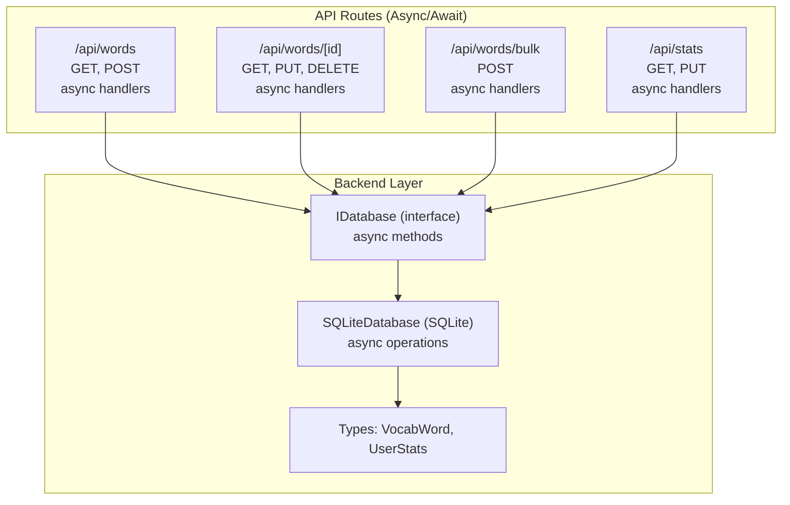
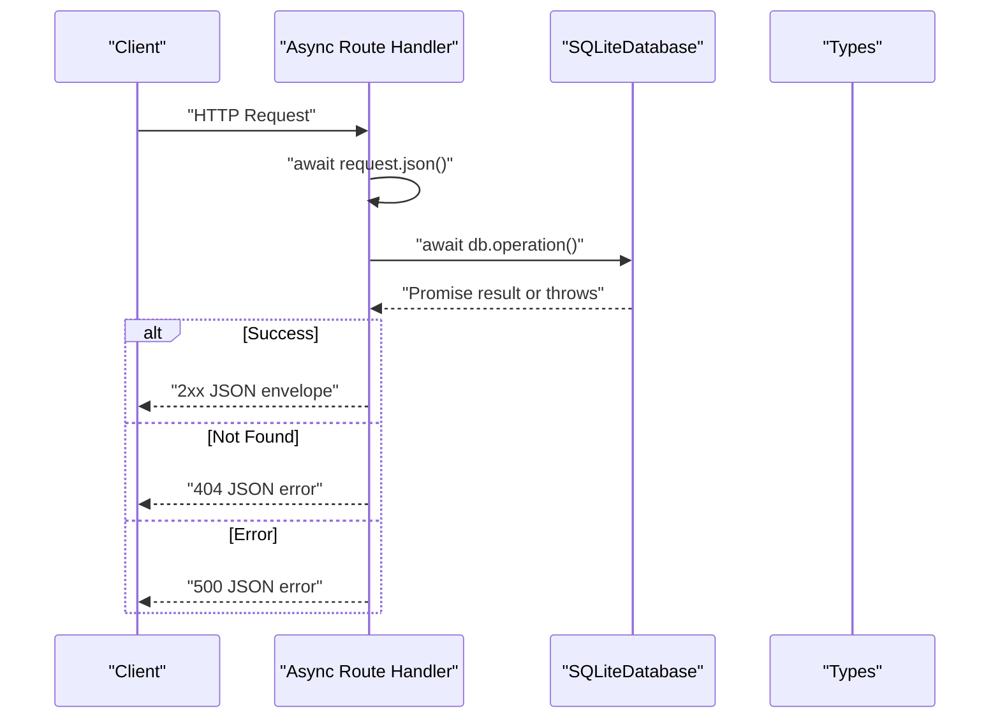
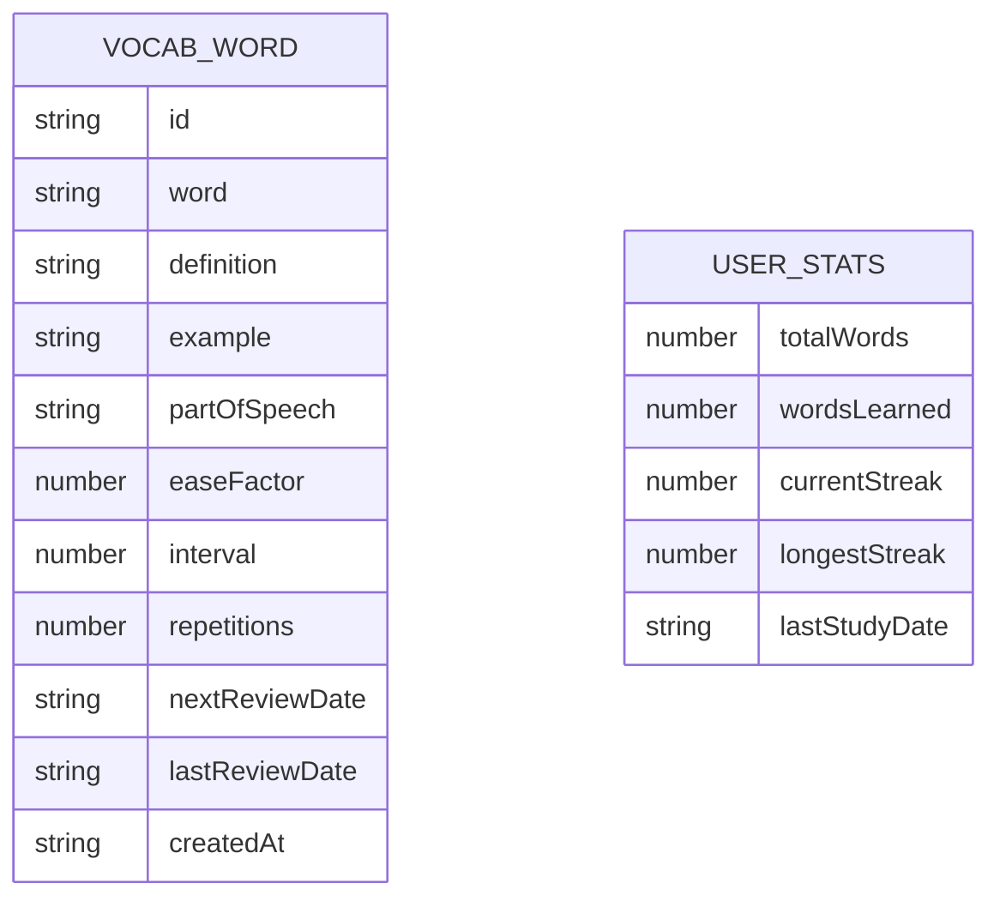
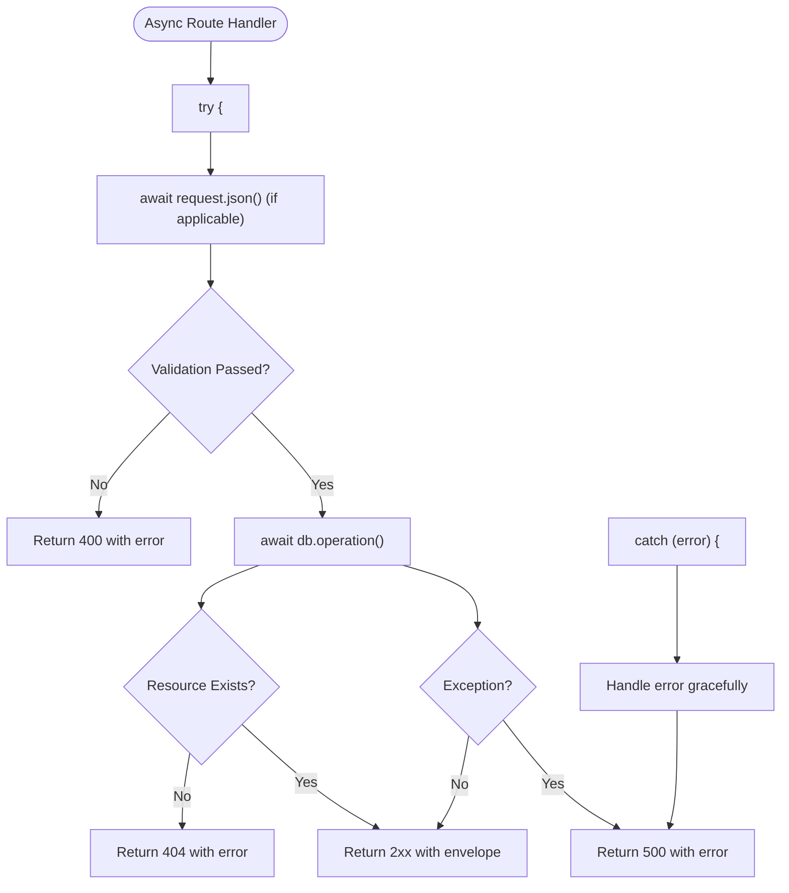
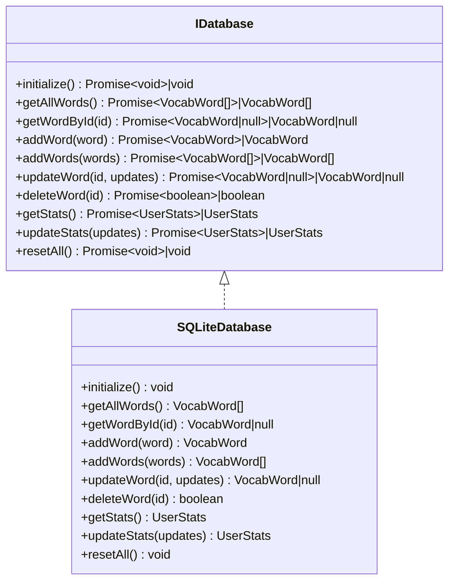
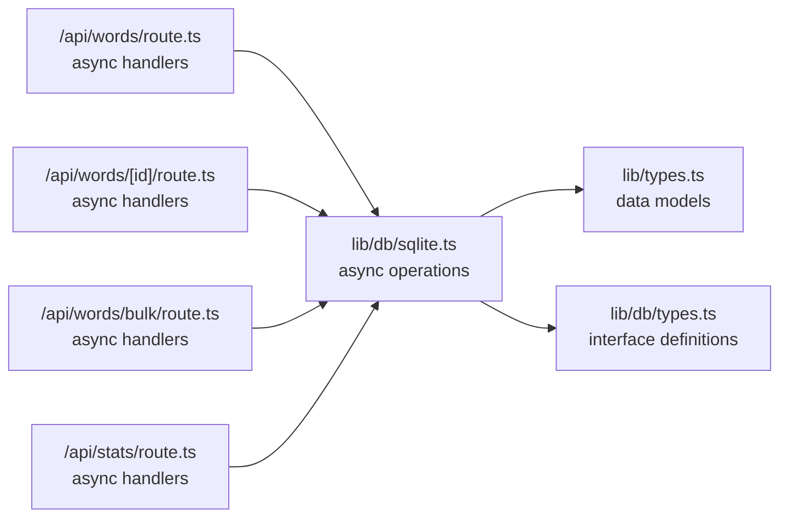

# API Reference

<cite>
**Referenced Files in This Document**
- [app/api/words/route.ts](file://app/api/words/route.ts)
- [app/api/words/[id]/route.ts](file://app/api/words/[id]/route.ts)
- [app/api/words/bulk/route.ts](file://app/api/words/bulk/route.ts)
- [app/api/stats/route.ts](file://app/api/stats/route.ts)
- [lib/db/sqlite.ts](file://lib/db/sqlite.ts)
- [lib/db/types.ts](file://lib/db/types.ts)
- [lib/types.ts](file://lib/types.ts)
</cite>

## Update Summary
**Changes Made**
- Updated all API endpoint documentation to reflect async/await modernization
- Enhanced error handling documentation with try/catch patterns
- Added comprehensive async/await flow diagrams
- Updated code examples to show modern async patterns
- Improved error handling coverage for all endpoints

## Table of Contents
1. [Introduction](#introduction)
2. [Project Structure](#project-structure)
3. [Core Components](#core-components)
4. [Architecture Overview](#architecture-overview)
5. [Detailed Component Analysis](#detailed-component-analysis)
6. [Async/Await Modernization](#async-await-modernization)
7. [Dependency Analysis](#dependency-analysis)
8. [Performance Considerations](#performance-considerations)
9. [Troubleshooting Guide](#troubleshooting-guide)
10. [Conclusion](#conclusion)
11. [Appendices](#appendices)

## Introduction
This document provides a comprehensive API reference for VocabMaster's RESTful endpoints. It covers all HTTP methods, URL patterns, request/response schemas, error handling, and operational guidance for vocabulary management and statistics APIs. The endpoints have been modernized to use async/await patterns throughout, providing improved error handling and maintainability. It also includes client implementation guidelines, examples, and notes on validation, pagination, and rate limiting.

## Project Structure
The API surface is implemented using Next.js App Router routes under app/api. Each endpoint exposes a standard CRUD interface for vocabulary words and a statistics interface. Data persistence is handled by a database abstraction layer backed by SQLite with modern async/await patterns.

**Diagram sources**
- [app/api/words/route.ts](file://app/api/words/route.ts#L1-L28)
- [app/api/words/[id]/route.ts](file://app/api/words/[id]/route.ts#L1-L55)
- [app/api/words/bulk/route.ts](file://app/api/words/bulk/route.ts#L1-L19)
- [app/api/stats/route.ts](file://app/api/stats/route.ts#L1-L26)
- [lib/db/types.ts](file://lib/db/types.ts#L12-L34)
- [lib/db/sqlite.ts](file://lib/db/sqlite.ts#L28-L297)
- [lib/types.ts](file://lib/types.ts#L1-L105)

**Section sources**
- [app/api/words/route.ts](file://app/api/words/route.ts#L1-L28)
- [app/api/words/[id]/route.ts](file://app/api/words/[id]/route.ts#L1-L55)
- [app/api/words/bulk/route.ts](file://app/api/words/bulk/route.ts#L1-L19)
- [app/api/stats/route.ts](file://app/api/stats/route.ts#L1-L26)
- [lib/db/types.ts](file://lib/db/types.ts#L1-L35)
- [lib/db/sqlite.ts](file://lib/db/sqlite.ts#L28-L297)
- [lib/types.ts](file://lib/types.ts#L1-L105)

## Core Components
- **Vocabulary Management Endpoints**
  - List and create vocabulary words with async/await patterns
  - Retrieve, update, and delete individual words with robust error handling
  - Bulk import multiple words with transaction support
- **Statistics Endpoints**
  - Retrieve user statistics with async operations
  - Update statistics with partial updates
- **Modern Async/Await Architecture**
  - All endpoints use consistent async/await patterns
  - Comprehensive error handling with try/catch blocks
  - Database operations are properly awaited

Authentication and rate limiting are not enforced by the API handlers in this codebase. Pagination is not implemented.

**Section sources**
- [app/api/words/route.ts](file://app/api/words/route.ts#L1-L28)
- [app/api/words/[id]/route.ts](file://app/api/words/[id]/route.ts#L1-L55)
- [app/api/words/bulk/route.ts](file://app/api/words/bulk/route.ts#L1-L19)
- [app/api/stats/route.ts](file://app/api/stats/route.ts#L1-L26)

## Architecture Overview
The API routes delegate to a database abstraction layer using modern async/await patterns. The SQLite implementation manages schema initialization, seeding, and CRUD operations with proper error handling. Responses are JSON envelopes containing either a resource or a top-level error field.

**Diagram sources**
- [app/api/words/route.ts](file://app/api/words/route.ts#L5-L27)
- [app/api/words/[id]/route.ts](file://app/api/words/[id]/route.ts#L5-L54)
- [app/api/words/bulk/route.ts](file://app/api/words/bulk/route.ts#L5-L18)
- [app/api/stats/route.ts](file://app/api/stats/route.ts#L5-L25)
- [lib/db/sqlite.ts](file://lib/db/sqlite.ts#L28-L297)
- [lib/types.ts](file://lib/types.ts#L1-L105)

## Detailed Component Analysis

### Vocabulary Endpoints

#### List Words
- **Method**: GET
- **URL**: /api/words
- **Purpose**: Retrieve all vocabulary words
- **Response envelope**:
  - Success: `{ words: VocabWord[] }`
  - Error: `{ error: string }`
- **Status Codes**:
  - 200 OK
  - 500 Internal Server Error

**Updated** Now uses async/await pattern with proper error handling

**Section sources**
- [app/api/words/route.ts](file://app/api/words/route.ts#L4-L14)
- [lib/db/sqlite.ts](file://lib/db/sqlite.ts#L130-L133)

#### Create Word (Single)
- **Method**: POST
- **URL**: /api/words
- **Request Body**: VocabWord
- **Response envelope**:
  - Success: `{ word: VocabWord }` (201 Created)
  - Error: `{ error: string }` (400/500)
- **Status Codes**:
  - 201 Created
  - 400 Bad Request (validation errors from underlying logic)
  - 500 Internal Server Error

**Updated** Uses async/await with comprehensive error handling

**Section sources**
- [app/api/words/route.ts](file://app/api/words/route.ts#L16-L27)
- [lib/db/sqlite.ts](file://lib/db/sqlite.ts#L140-L159)

#### Retrieve Word by ID
- **Method**: GET
- **URL**: /api/words/[id]
- **Path Params**: id (string)
- **Response envelope**:
  - Success: `{ word: VocabWord }`
  - Error: `{ error: string }` (404 if not found, 500 on server error)
- **Status Codes**:
  - 200 OK
  - 404 Not Found
  - 500 Internal Server Error

**Updated** Implements async/await with explicit 404 handling

**Section sources**
- [app/api/words/[id]/route.ts](file://app/api/words/[id]/route.ts#L4-L19)
- [lib/db/sqlite.ts](file://lib/db/sqlite.ts#L135-L138)

#### Update Word by ID
- **Method**: PUT
- **URL**: /api/words/[id]
- **Path Params**: id (string)
- **Request Body**: Partial<VocabWord>
- **Response envelope**:
  - Success: `{ word: VocabWord }`
  - Error: `{ error: string }` (404 if not found, 500 on server error)
- **Status Codes**:
  - 200 OK
  - 404 Not Found
  - 500 Internal Server Error

**Updated** Uses async/await with proper resource existence checking

**Section sources**
- [app/api/words/[id]/route.ts](file://app/api/words/[id]/route.ts#L21-L37)
- [lib/db/sqlite.ts](file://lib/db/sqlite.ts#L190-L222)

#### Delete Word by ID
- **Method**: DELETE
- **URL**: /api/words/[id]
- **Path Params**: id (string)
- **Response envelope**:
  - Success: `{ success: true }`
  - Error: `{ error: string }` (404 if not found, 500 on server error)
- **Status Codes**:
  - 200 OK
  - 404 Not Found
  - 500 Internal Server Error

**Updated** Implements async/await with explicit deletion result handling

**Section sources**
- [app/api/words/[id]/route.ts](file://app/api/words/[id]/route.ts#L39-L54)
- [lib/db/sqlite.ts](file://lib/db/sqlite.ts#L224-L228)

#### Bulk Import Words
- **Method**: POST
- **URL**: /api/words/bulk
- **Request Body**: `{ words: VocabWord[] }`
- **Validation**:
  - Requires a non-empty array; otherwise returns 400
- **Response envelope**:
  - Success: `{ words: VocabWord[], count: number }` (201 Created)
  - Error: `{ error: string }` (400/500)
- **Status Codes**:
  - 201 Created
  - 400 Bad Request
  - 500 Internal Server Error

**Updated** Uses async/await with transaction support and comprehensive error handling

**Section sources**
- [app/api/words/bulk/route.ts](file://app/api/words/bulk/route.ts#L4-L18)
- [lib/db/sqlite.ts](file://lib/db/sqlite.ts#L161-L188)

### Statistics Endpoints

#### Retrieve Statistics
- **Method**: GET
- **URL**: /api/stats
- **Response envelope**:
  - Success: `{ stats: UserStats }`
  - Error: `{ error: string }` (500 on server error)
- **Status Codes**:
  - 200 OK
  - 500 Internal Server Error

**Updated** Uses async/await pattern with proper error handling

**Section sources**
- [app/api/stats/route.ts](file://app/api/stats/route.ts#L4-L13)
- [lib/db/sqlite.ts](file://lib/db/sqlite.ts#L232-L244)
- [lib/types.ts](file://lib/types.ts#L4-L10)

#### Update Statistics
- **Method**: PUT
- **URL**: /api/stats
- **Request Body**: Partial<UserStats>
- **Response envelope**:
  - Success: `{ stats: UserStats }`
  - Error: `{ error: string }` (500 on server error)
- **Status Codes**:
  - 200 OK
  - 500 Internal Server Error

**Updated** Implements async/await with partial update support

**Section sources**
- [app/api/stats/route.ts](file://app/api/stats/route.ts#L15-L25)
- [lib/db/sqlite.ts](file://lib/db/sqlite.ts#L246-L267)
- [lib/types.ts](file://lib/types.ts#L4-L10)

### Data Models

**Diagram sources**
- [lib/types.ts](file://lib/types.ts#L1-L105)
- [lib/db/sqlite.ts](file://lib/db/sqlite.ts#L37-L63)

## Async/Await Modernization

### Modernized Endpoint Patterns

All API endpoints now follow a consistent async/await pattern:

**Diagram sources**
- [app/api/words/route.ts](file://app/api/words/route.ts#L5-L27)
- [app/api/words/[id]/route.ts](file://app/api/words/[id]/route.ts#L5-L54)
- [app/api/words/bulk/route.ts](file://app/api/words/bulk/route.ts#L5-L18)
- [app/api/stats/route.ts](file://app/api/stats/route.ts#L5-L25)

### Database Interface Evolution

The database interface now supports both synchronous and asynchronous operations:

**Diagram sources**
- [lib/db/types.ts](file://lib/db/types.ts#L12-L34)
- [lib/db/sqlite.ts](file://lib/db/sqlite.ts#L28-L297)

## Dependency Analysis

**Diagram sources**
- [app/api/words/route.ts](file://app/api/words/route.ts#L1-L28)
- [app/api/words/[id]/route.ts](file://app/api/words/[id]/route.ts#L1-L55)
- [app/api/words/bulk/route.ts](file://app/api/words/bulk/route.ts#L1-L19)
- [app/api/stats/route.ts](file://app/api/stats/route.ts#L1-L26)
- [lib/db/sqlite.ts](file://lib/db/sqlite.ts#L28-L297)
- [lib/types.ts](file://lib/types.ts#L1-L105)
- [lib/db/types.ts](file://lib/db/types.ts#L1-L35)

**Section sources**
- [app/api/words/route.ts](file://app/api/words/route.ts#L1-L28)
- [app/api/words/[id]/route.ts](file://app/api/words/[id]/route.ts#L1-L55)
- [app/api/words/bulk/route.ts](file://app/api/words/bulk/route.ts#L1-L19)
- [app/api/stats/route.ts](file://app/api/stats/route.ts#L1-L26)
- [lib/db/sqlite.ts](file://lib/db/sqlite.ts#L28-L297)
- [lib/types.ts](file://lib/types.ts#L1-L105)
- [lib/db/types.ts](file://lib/db/types.ts#L1-L35)

## Performance Considerations
- **Async Operations**: All database operations are now properly awaited, improving error handling and resource management
- **Transaction Support**: Bulk operations use transactions to maintain atomicity during insertion
- **Index Optimization**: Indexes exist on review date and word for performance; consider adding additional indexes if querying by other fields becomes frequent
- **Connection Pooling**: SQLite connections are managed efficiently with lazy initialization

## Troubleshooting Guide
Common issues and resolutions:
- **400 Bad Request on bulk import**: Ensure the request body contains a non-empty words array
- **404 Not Found**: Occurs when retrieving/updating/deleting a word that does not exist
- **500 Internal Server Error**: Indicates an unhandled exception in the handler or database layer
- **Async/await Issues**: All endpoints now properly handle async operations; ensure clients await responses correctly

**Updated** Enhanced error handling guidance for async operations

**Section sources**
- [app/api/words/bulk/route.ts](file://app/api/words/bulk/route.ts#L8-L10)
- [app/api/words/[id]/route.ts](file://app/api/words/[id]/route.ts#L12-L13)
- [lib/db/sqlite.ts](file://lib/db/sqlite.ts#L190-L228)

## Conclusion
VocabMaster exposes a modernized REST API for vocabulary and statistics management using async/await patterns throughout. The endpoints follow conventional HTTP semantics with JSON envelopes and comprehensive error handling. The async/await modernization improves error handling, maintainability, and type safety. There is no built-in authentication, rate limiting, or pagination. Clients should handle error responses and implement their own rate limiting and pagination as needed.

## Appendices

### Authentication and Security
- No authentication is enforced by the API handlers in the examined code
- The presence of an AI configuration in the codebase does not imply API authentication for vocabulary endpoints

**Section sources**
- [lib/db/sqlite.ts](file://lib/db/sqlite.ts#L1-L297)

### Rate Limiting
- No rate limiting is implemented in the API handlers

**Section sources**
- [app/api/words/route.ts](file://app/api/words/route.ts#L1-L28)
- [app/api/words/[id]/route.ts](file://app/api/words/[id]/route.ts#L1-L55)
- [app/api/words/bulk/route.ts](file://app/api/words/bulk/route.ts#L1-L19)
- [app/api/stats/route.ts](file://app/api/stats/route.ts#L1-L26)

### Pagination
- Not implemented. Clients should implement client-side pagination if needed

**Section sources**
- [app/api/words/route.ts](file://app/api/words/route.ts#L1-L28)
- [lib/db/sqlite.ts](file://lib/db/sqlite.ts#L130-L133)

### Client Implementation Guidelines
- Use the provided async/await patterns as a reference for constructing requests and handling responses
- Respect HTTP status codes and JSON envelopes
- Implement retry/backoff for transient failures
- Add client-side validation aligned with the VocabWord schema
- Handle async/await properly in client code

**Section sources**
- [lib/db/sqlite.ts](file://lib/db/sqlite.ts#L28-L297)
- [lib/types.ts](file://lib/types.ts#L1-L105)

### Example Requests and Responses

**Updated** All examples now reflect async/await patterns

- **List Words**
  - Request: `GET /api/words`
  - Response: `200 OK` with `{ words: [...] }`

- **Create Word**
  - Request: `POST /api/words` with body `{ id, word, definition, example, partOfSpeech, easeFactor, interval, repetitions, nextReviewDate, lastReviewDate, createdAt }`
  - Response: `201 Created` with `{ word: VocabWord }`

- **Retrieve Word by ID**
  - Request: `GET /api/words/{id}`
  - Response: `200 OK` with `{ word: VocabWord }`
  - Not Found: `404` with `{ error: "Word not found" }`

- **Update Word by ID**
  - Request: `PUT /api/words/{id}` with partial fields
  - Response: `200 OK` with `{ word: VocabWord }`
  - Not Found: `404` with `{ error: "Word not found" }`

- **Delete Word by ID**
  - Request: `DELETE /api/words/{id}`
  - Response: `200 OK` with `{ success: true }`
  - Not Found: `404` with `{ error: "Word not found" }`

- **Bulk Import**
  - Request: `POST /api/words/bulk` with body `{ words: [VocabWord, ...] }`
  - Response: `201 Created` with `{ words: [...], count: number }`
  - Bad Request: `400` with `{ error: "Words array is required" }`

- **Get Statistics**
  - Request: `GET /api/stats`
  - Response: `200 OK` with `{ stats: UserStats }`

- **Update Statistics**
  - Request: `PUT /api/stats` with body `{ totalWords?, wordsLearned?, currentStreak?, longestStreak?, lastStudyDate? }`
  - Response: `200 OK` with `{ stats: UserStats }`