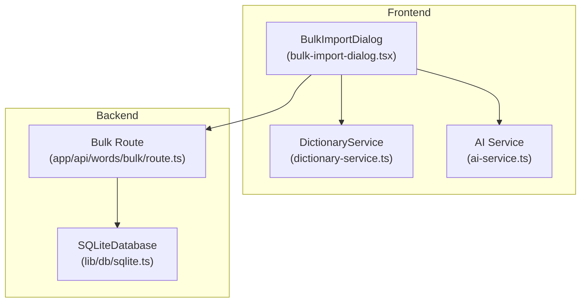
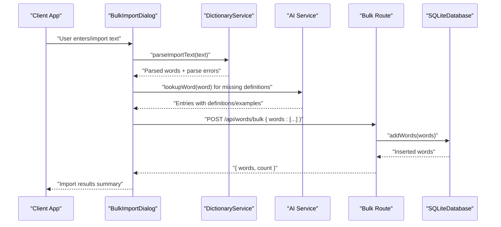
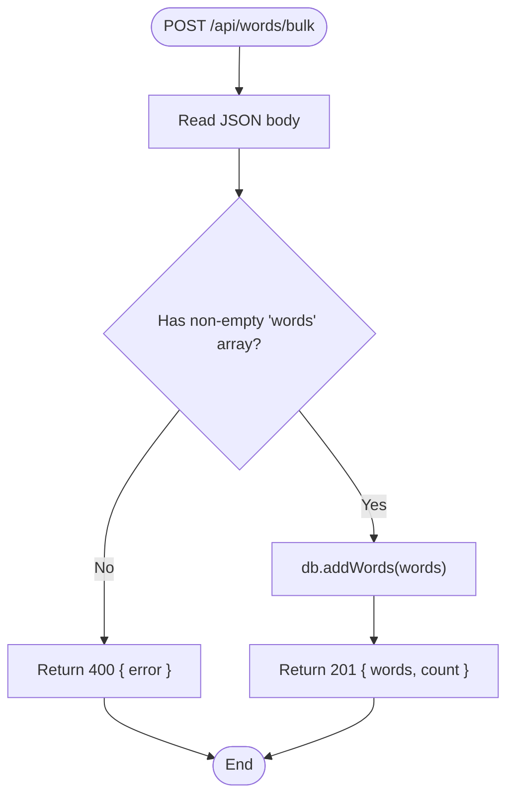
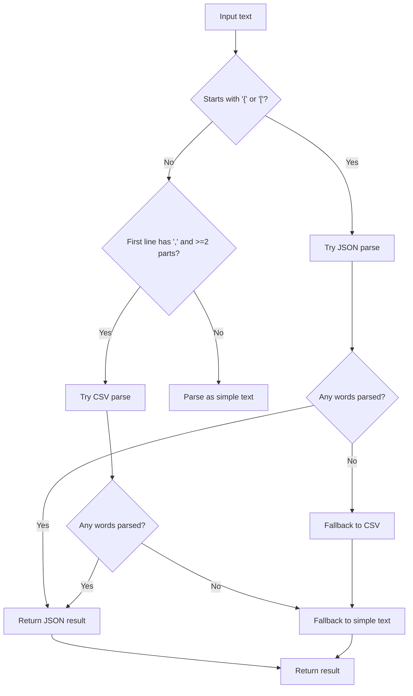
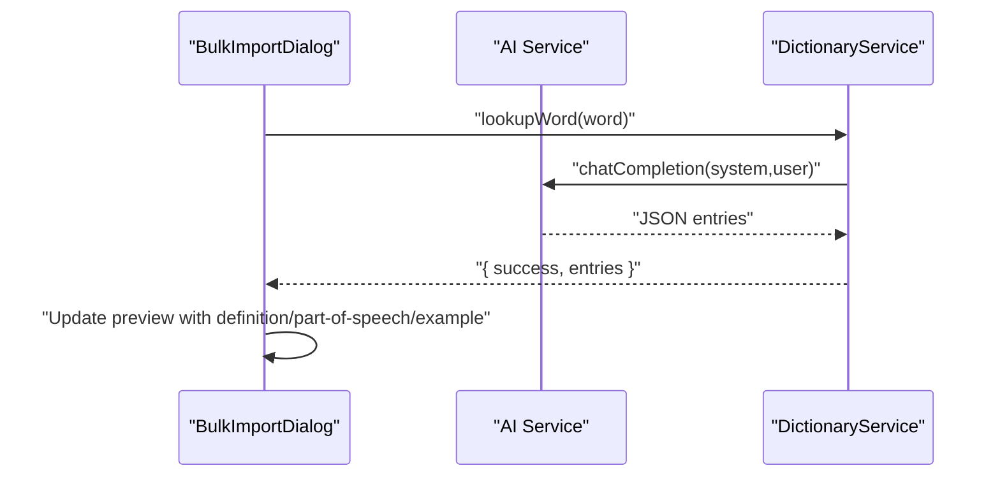
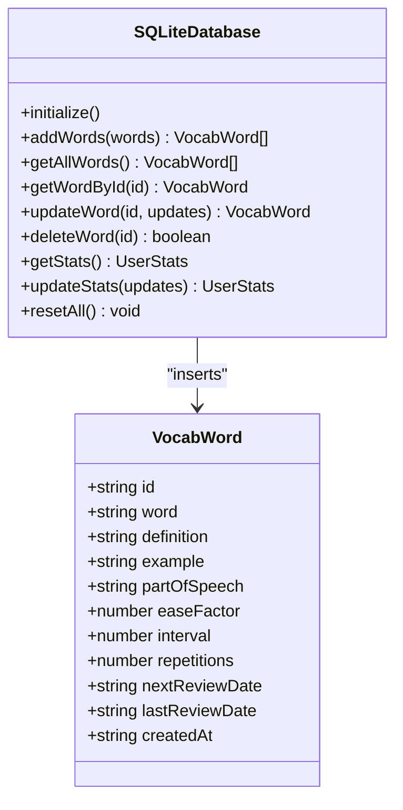
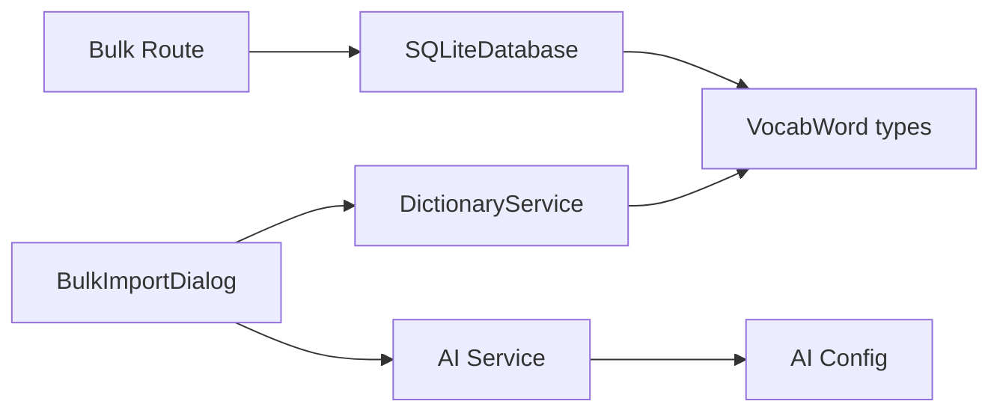

# Bulk Import Operations

<cite>
**Referenced Files in This Document**
- [route.ts](file://app/api/words/bulk/route.ts)
- [bulk-import-dialog.tsx](file://components/bulk-import-dialog.tsx)
- [dictionary-service.ts](file://lib/dictionary-service.ts)
- [sqlite.ts](file://lib/db/sqlite.ts)
- [types.ts](file://lib/types.ts)
- [spaced-repetition.ts](file://lib/spaced-repetition.ts)
- [config.ts](file://lib/config.ts)
- [ai-service.ts](file://lib/ai-service.ts)
- [package.json](file://package.json)
</cite>

## Table of Contents
1. [Introduction](#introduction)
2. [Project Structure](#project-structure)
3. [Core Components](#core-components)
4. [Architecture Overview](#architecture-overview)
5. [Detailed Component Analysis](#detailed-component-analysis)
6. [Dependency Analysis](#dependency-analysis)
7. [Performance Considerations](#performance-considerations)
8. [Troubleshooting Guide](#troubleshooting-guide)
9. [Conclusion](#conclusion)
10. [Appendices](#appendices)

## Introduction
This document explains the bulk import functionality for vocabulary words. It covers the POST /api/words/bulk endpoint, supported input formats, parsing and validation rules, upload mechanisms, batch processing behavior, and error handling. It also provides examples of import formats, best practices for large-scale ingestion, and performance considerations.

## Project Structure
The bulk import feature spans frontend and backend components:
- Frontend dialog parses user input, previews candidates, enriches definitions via AI, and triggers the backend API.
- Backend API validates the payload and persists words to the database.

**Diagram sources**
- [bulk-import-dialog.tsx](file://components/bulk-import-dialog.tsx#L30-L494)
- [dictionary-service.ts](file://lib/dictionary-service.ts#L92-L254)
- [ai-service.ts](file://lib/ai-service.ts#L66-L111)
- [route.ts](file://app/api/words/bulk/route.ts#L4-L18)
- [sqlite.ts](file://lib/db/sqlite.ts#L161-L188)

**Section sources**
- [bulk-import-dialog.tsx](file://components/bulk-import-dialog.tsx#L30-L494)
- [route.ts](file://app/api/words/bulk/route.ts#L4-L18)

## Core Components
- POST /api/words/bulk endpoint: Accepts a JSON payload containing an array of word objects and returns the persisted words and count.
- Frontend parser: Supports CSV, JSON, and simple text formats, auto-detecting format and reporting parse errors.
- AI enrichment: Optional enrichment of definitions and examples for candidate words.
- Database persistence: Inserts multiple words atomically and updates statistics.

**Section sources**
- [route.ts](file://app/api/words/bulk/route.ts#L4-L18)
- [dictionary-service.ts](file://lib/dictionary-service.ts#L92-L254)
- [bulk-import-dialog.tsx](file://components/bulk-import-dialog.tsx#L90-L141)
- [sqlite.ts](file://lib/db/sqlite.ts#L161-L188)

## Architecture Overview
The bulk import pipeline consists of three stages:
1. Input parsing and validation (frontend)
2. Optional AI enrichment (optional)
3. Backend persistence and response

**Diagram sources**
- [bulk-import-dialog.tsx](file://components/bulk-import-dialog.tsx#L72-L88)
- [dictionary-service.ts](file://lib/dictionary-service.ts#L236-L254)
- [ai-service.ts](file://lib/ai-service.ts#L66-L111)
- [route.ts](file://app/api/words/bulk/route.ts#L5-L13)
- [sqlite.ts](file://lib/db/sqlite.ts#L161-L188)

## Detailed Component Analysis

### API Endpoint: POST /api/words/bulk
- Purpose: Persist an array of vocabulary words.
- Request payload schema:
  - words: array of word objects
    - Required fields: word, definition
    - Optional fields: example, partOfSpeech
    - Defaults: partOfSpeech defaults to noun if omitted
- Validation rules:
  - Rejects requests without a non-empty words array.
  - On invalid payloads, responds with 400 and an error message.
- Success response:
  - Status: 201 Created
  - Body: { words: VocabWord[], count: number }
- Error response:
  - Status: 500 Internal Server Error
  - Body: { error: string }

**Diagram sources**
- [route.ts](file://app/api/words/bulk/route.ts#L5-L13)
- [sqlite.ts](file://lib/db/sqlite.ts#L161-L188)

**Section sources**
- [route.ts](file://app/api/words/bulk/route.ts#L5-L13)
- [sqlite.ts](file://lib/db/sqlite.ts#L161-L188)
- [types.ts](file://lib/types.ts#L1-L14)

### Supported Input Formats and Parsing
The frontend supports three input formats. The parser auto-detects the format and reports parse errors.

- CSV format:
  - Columns: word, definition, example, partOfSpeech
  - Header row is optional and may be skipped
  - Handles quoted values and escaped commas
- JSON format:
  - Accepts either an array of objects or a single object
  - Field aliases are normalized to word, definition, example, partOfSpeech
- Simple text format:
  - Lines with "word - definition" or "word: definition"
  - Lines with just a word are accepted as minimal entries
  - Supports separators: " - ", ": ", " – ", " — ", tab

**Diagram sources**
- [dictionary-service.ts](file://lib/dictionary-service.ts#L236-L254)
- [dictionary-service.ts](file://lib/dictionary-service.ts#L107-L137)
- [dictionary-service.ts](file://lib/dictionary-service.ts#L163-L189)
- [dictionary-service.ts](file://lib/dictionary-service.ts#L192-L233)

**Section sources**
- [dictionary-service.ts](file://lib/dictionary-service.ts#L107-L137)
- [dictionary-service.ts](file://lib/dictionary-service.ts#L163-L189)
- [dictionary-service.ts](file://lib/dictionary-service.ts#L192-L233)
- [dictionary-service.ts](file://lib/dictionary-service.ts#L236-L254)

### Upload Mechanisms
- File upload: Reads plain text files (.txt, .csv, .json) via FileReader and populates the input area.
- Clipboard paste: Reads text from the clipboard and populates the input area.
- Manual text entry: Supports all supported formats directly in the text area.

**Section sources**
- [bulk-import-dialog.tsx](file://components/bulk-import-dialog.tsx#L46-L70)
- [bulk-import-dialog.tsx](file://components/bulk-import-dialog.tsx#L252-L258)

### AI Enrichment Workflow
- When definitions are missing, the UI can fetch definitions via AI.
- The UI processes words sequentially with small delays to avoid rate limiting.
- On success, the UI updates the preview with definition, partOfSpeech, and example.

**Diagram sources**
- [bulk-import-dialog.tsx](file://components/bulk-import-dialog.tsx#L90-L141)
- [ai-service.ts](file://lib/ai-service.ts#L66-L111)
- [dictionary-service.ts](file://lib/dictionary-service.ts#L21-L26)

**Section sources**
- [bulk-import-dialog.tsx](file://components/bulk-import-dialog.tsx#L90-L141)
- [ai-service.ts](file://lib/ai-service.ts#L66-L111)
- [dictionary-service.ts](file://lib/dictionary-service.ts#L21-L26)

### Batch Processing and Persistence
- The frontend creates VocabWord objects with default spaced-repetition fields and submits them to the backend.
- The backend performs a transactional insert of all words and returns the inserted set plus the count.

**Diagram sources**
- [types.ts](file://lib/types.ts#L1-L14)
- [sqlite.ts](file://lib/db/sqlite.ts#L161-L188)

**Section sources**
- [spaced-repetition.ts](file://lib/spaced-repetition.ts#L71-L91)
- [sqlite.ts](file://lib/db/sqlite.ts#L161-L188)
- [types.ts](file://lib/types.ts#L1-L14)

### Validation Rules and Error Handling
- Backend validation:
  - Rejects missing or empty words array with 400.
  - On internal errors, returns 500 with error message.
- Frontend validation:
  - Detects parse errors and displays warnings.
  - Prevents importing duplicates and words without definitions unless enriched.
  - Tracks success/failure/skipped counts during import.

**Section sources**
- [route.ts](file://app/api/words/bulk/route.ts#L8-L10)
- [route.ts](file://app/api/words/bulk/route.ts#L14-L17)
- [bulk-import-dialog.tsx](file://components/bulk-import-dialog.tsx#L72-L88)
- [bulk-import-dialog.tsx](file://components/bulk-import-dialog.tsx#L156-L196)

## Dependency Analysis
- The API depends on the database abstraction and delegates persistence to SQLiteDatabase.
- The frontend dialog depends on DictionaryService for parsing and optionally on AI Service for enrichment.
- AI Service depends on configuration for API credentials and base URL.

**Diagram sources**
- [route.ts](file://app/api/words/bulk/route.ts#L1-L2)
- [sqlite.ts](file://lib/db/sqlite.ts#L1-L6)
- [bulk-import-dialog.tsx](file://components/bulk-import-dialog.tsx#L10-L12)
- [dictionary-service.ts](file://lib/dictionary-service.ts#L1-L18)
- [ai-service.ts](file://lib/ai-service.ts#L23-L40)
- [config.ts](file://lib/config.ts#L23-L56)

**Section sources**
- [route.ts](file://app/api/words/bulk/route.ts#L1-L2)
- [sqlite.ts](file://lib/db/sqlite.ts#L1-L6)
- [bulk-import-dialog.tsx](file://components/bulk-import-dialog.tsx#L10-L12)
- [dictionary-service.ts](file://lib/dictionary-service.ts#L1-L18)
- [ai-service.ts](file://lib/ai-service.ts#L23-L40)
- [config.ts](file://lib/config.ts#L23-L56)

## Performance Considerations
- Database batching: The backend inserts all words in a single transaction to minimize overhead.
- Memory usage: The frontend holds parsed words in memory during preview and import. Large batches increase memory consumption.
- Network I/O: AI enrichment is rate-limited by sequential processing with small delays.
- Recommended file sizes:
  - For reliable performance, keep batches under a few thousand words.
  - For very large datasets, split into smaller chunks and import sequentially.
- SQLite characteristics: The current backend uses SQLite. For very large-scale ingestion, consider migrating to a server-side relational database with optimized bulk insert capabilities.

**Section sources**
- [sqlite.ts](file://lib/db/sqlite.ts#L167-L183)
- [bulk-import-dialog.tsx](file://components/bulk-import-dialog.tsx#L171-L191)
- [package.json](file://package.json#L11-L21)

## Troubleshooting Guide
- 400 Bad Request on API:
  - Cause: Missing or empty words array.
  - Resolution: Ensure the payload contains a non-empty array of word objects.
- 500 Internal Server Error on API:
  - Cause: Unexpected error during persistence.
  - Resolution: Check server logs and retry. Validate input format and word fields.
- Parse warnings in UI:
  - Cause: Malformed lines or missing fields.
  - Resolution: Fix the input text according to supported formats.
- AI enrichment failures:
  - Cause: API key not configured or network issues.
  - Resolution: Configure AI settings and verify connectivity.
- Large batch memory pressure:
  - Cause: High memory usage from large preview/import arrays.
  - Resolution: Split imports into smaller batches.

**Section sources**
- [route.ts](file://app/api/words/bulk/route.ts#L8-L10)
- [route.ts](file://app/api/words/bulk/route.ts#L14-L17)
- [bulk-import-dialog.tsx](file://components/bulk-import-dialog.tsx#L308-L323)
- [config.ts](file://lib/config.ts#L52-L56)
- [ai-service.ts](file://lib/ai-service.ts#L77-L79)

## Conclusion
The bulk import feature provides a flexible, user-friendly pathway to ingest vocabulary data. It supports multiple input formats, optional AI enrichment, and robust backend persistence. By following the validation rules, splitting large imports, and configuring AI appropriately, teams can reliably scale bulk ingestion while maintaining performance and data quality.

## Appendices

### Request Payload Schema
- words: array
  - word: string (required)
  - definition: string (required)
  - example: string (optional)
  - partOfSpeech: string (optional, defaults to noun)

**Section sources**
- [route.ts](file://app/api/words/bulk/route.ts#L7-L13)
- [types.ts](file://lib/types.ts#L1-L14)

### Success and Error Response Formats
- Success (201):
  - { words: VocabWord[], count: number }
- Error (400):
  - { error: string }
- Error (500):
  - { error: string }

**Section sources**
- [route.ts](file://app/api/words/bulk/route.ts#L11-L13)
- [route.ts](file://app/api/words/bulk/route.ts#L14-L17)

### Example Import Formats
- CSV:
  - word,definition,example,partOfSpeech
  - Example line: resilient,lasting for a short time,The resilient community rebuilt after the disaster,noun
- JSON:
  - Array: [{ "word": "...", "definition": "...", "example": "...", "partOfSpeech": "..." }]
  - Single object: Same fields as above
- Simple text:
  - word - definition
  - word: definition
  - word (definition fetched via AI)

**Section sources**
- [dictionary-service.ts](file://lib/dictionary-service.ts#L107-L137)
- [dictionary-service.ts](file://lib/dictionary-service.ts#L163-L189)
- [dictionary-service.ts](file://lib/dictionary-service.ts#L192-L233)

### Best Practices for Large-Scale Ingestion
- Split files into batches of a few thousand words.
- Pre-enrich definitions via AI to reduce runtime latency.
- Validate inputs locally before sending to the API.
- Monitor memory usage during preview and import.
- For persistent performance, consider migrating the backend to a server-side RDBMS with optimized bulk insert support.

[No sources needed since this section provides general guidance]