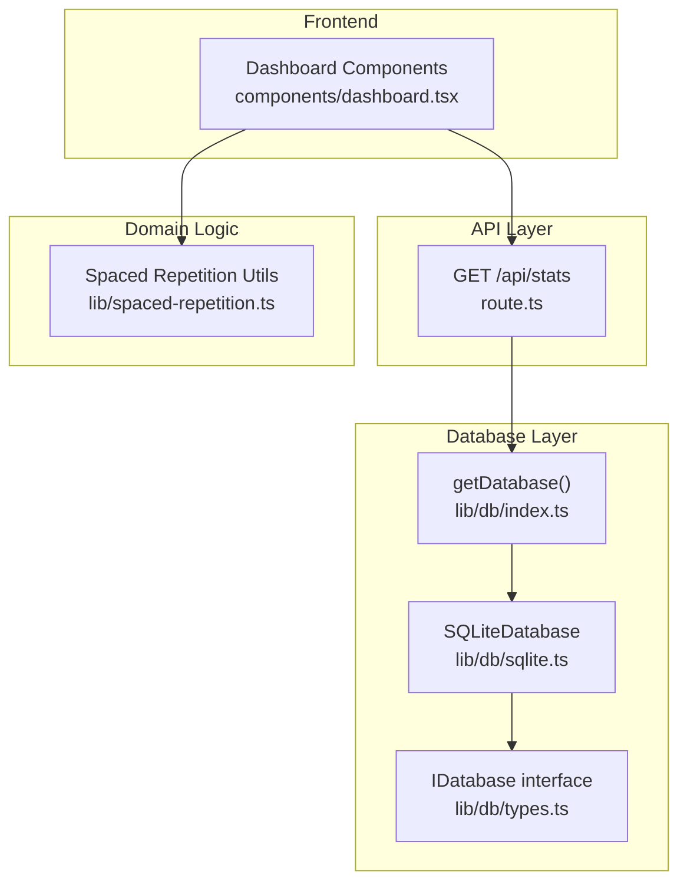
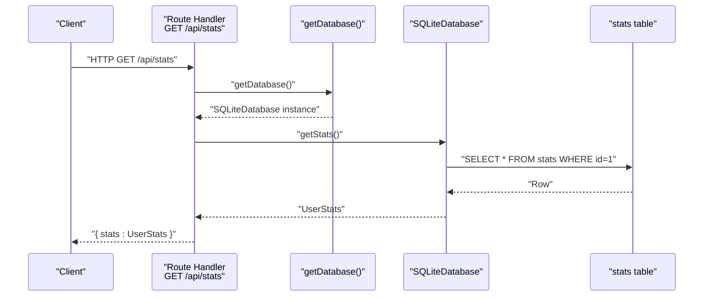
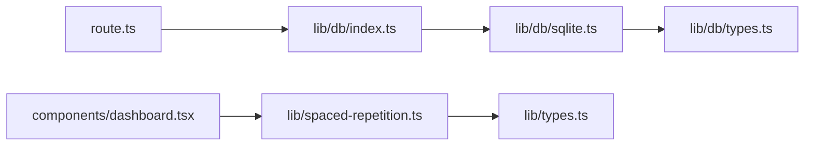
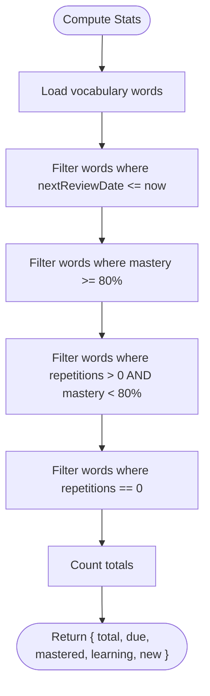

# Statistics & Analytics Endpoints

<cite>
**Referenced Files in This Document**
- [route.ts](file://app/api/stats/route.ts)
- [sqlite.ts](file://lib/db/sqlite.ts)
- [types.ts](file://lib/db/types.ts)
- [index.ts](file://lib/db/index.ts)
- [spaced-repetition.ts](file://lib/spaced-repetition.ts)
- [dashboard.tsx](file://components/dashboard.tsx)
- [types.ts](file://lib/types.ts)
</cite>

## Table of Contents
1. [Introduction](#introduction)
2. [Project Structure](#project-structure)
3. [Core Components](#core-components)
4. [Architecture Overview](#architecture-overview)
5. [Detailed Component Analysis](#detailed-component-analysis)
6. [Dependency Analysis](#dependency-analysis)
7. [Performance Considerations](#performance-considerations)
8. [Troubleshooting Guide](#troubleshooting-guide)
9. [Conclusion](#conclusion)
10. [Appendices](#appendices)

## Introduction
This document provides comprehensive documentation for the statistics and analytics endpoints, focusing on the GET /api/stats endpoint that retrieves user progress, mastery statistics, streak calculations, and learning metrics. It covers response schemas, aggregation logic, filtering options, data visualization formats, caching strategies, data freshness, performance optimization, and integration examples for dashboard implementations.

## Project Structure
The statistics and analytics functionality spans a small set of focused modules:
- API route handler for stats endpoints
- Database abstraction and implementation
- Spaced repetition and statistics calculation utilities
- Frontend dashboard components that consume and visualize stats

**Diagram sources**
- [route.ts](file://app/api/stats/route.ts#L1-L26)
- [index.ts](file://lib/db/index.ts#L1-L21)
- [types.ts](file://lib/db/types.ts#L1-L35)
- [sqlite.ts](file://lib/db/sqlite.ts#L1-L297)
- [spaced-repetition.ts](file://lib/spaced-repetition.ts#L1-L123)
- [dashboard.tsx](file://components/dashboard.tsx#L1-L154)

**Section sources**
- [route.ts](file://app/api/stats/route.ts#L1-L26)
- [index.ts](file://lib/db/index.ts#L1-L21)
- [types.ts](file://lib/db/types.ts#L1-L35)
- [sqlite.ts](file://lib/db/sqlite.ts#L1-L297)
- [spaced-repetition.ts](file://lib/spaced-repetition.ts#L1-L123)
- [dashboard.tsx](file://components/dashboard.tsx#L1-L154)

## Core Components
- API route handler: Exposes GET /api/stats and PUT /api/stats for retrieval and updates of user statistics.
- Database layer: Provides a singleton database accessor and a SQLite-backed implementation with a dedicated stats table.
- Spaced repetition utilities: Computes mastery levels and aggregates learning progress from vocabulary words.
- Frontend dashboard: Consumes stats for rendering progress cards, mastery charts, and streak indicators.

Key responsibilities:
- Retrieve aggregated statistics for dashboards and analytics views
- Persist and update user statistics (streaks, totals)
- Compute derived metrics such as mastery percentages and category counts

**Section sources**
- [route.ts](file://app/api/stats/route.ts#L4-L25)
- [sqlite.ts](file://lib/db/sqlite.ts#L232-L267)
- [spaced-repetition.ts](file://lib/spaced-repetition.ts#L108-L122)
- [dashboard.tsx](file://components/dashboard.tsx#L16-L51)

## Architecture Overview
The stats endpoint follows a layered architecture:
- HTTP request enters the route handler
- Route handler delegates to the database accessor
- Database accessor returns a concrete implementation
- Implementation queries or updates the stats table
- Response is returned as JSON

**Diagram sources**
- [route.ts](file://app/api/stats/route.ts#L5-L12)
- [index.ts](file://lib/db/index.ts#L12-L18)
- [sqlite.ts](file://lib/db/sqlite.ts#L232-L244)

## Detailed Component Analysis

### Endpoint: GET /api/stats
Purpose:
- Returns the current user statistics including totals, learned counts, streaks, and last study date.

Behavior:
- Retrieves a single stats row keyed by id=1
- Returns a JSON payload containing the stats object

Response schema:
- stats: UserStats
  - totalWords: integer
  - wordsLearned: integer
  - currentStreak: integer
  - longestStreak: integer
  - lastStudyDate: string | null

Error handling:
- Catches exceptions and returns a 500 JSON response with an error field

Integration note:
- The frontend dashboard also computes derived stats from vocabulary words for display, while the API endpoint provides persisted totals.

**Section sources**
- [route.ts](file://app/api/stats/route.ts#L4-L13)
- [sqlite.ts](file://lib/db/sqlite.ts#L232-L244)
- [types.ts](file://lib/db/types.ts#L4-L10)

### Endpoint: PUT /api/stats
Purpose:
- Updates user statistics with partial data.

Behavior:
- Accepts a JSON body with partial UserStats fields
- Merges incoming updates with current stats
- Persists the updated stats to the database
- Returns the merged stats object

Response schema:
- stats: UserStats (updated)

Error handling:
- Catches exceptions and returns a 500 JSON response with an error field

**Section sources**
- [route.ts](file://app/api/stats/route.ts#L15-L25)
- [sqlite.ts](file://lib/db/sqlite.ts#L246-L267)

### Database Abstraction and Implementation
Database interface:
- IDatabase defines methods for initialization, word CRUD operations, stats retrieval and updates, and reset utilities.

Singleton accessor:
- getDatabase() ensures a single SQLiteDatabase instance is created and initialized on first use.

SQLite implementation highlights:
- Stats table schema with id=1 enforced via a CHECK constraint
- Indexes on words for performance (e.g., next_review_date)
- Initialization seeds sample words and ensures a stats row exists
- Stats synchronization updates total and learned counts when vocabulary changes

Stats persistence:
- getStats() reads the single stats row
- updateStats() merges and writes stats atomically

**Section sources**
- [types.ts](file://lib/db/types.ts#L16-L34)
- [index.ts](file://lib/db/index.ts#L12-L18)
- [sqlite.ts](file://lib/db/sqlite.ts#L35-L81)
- [sqlite.ts](file://lib/db/sqlite.ts#L52-L63)
- [sqlite.ts](file://lib/db/sqlite.ts#L232-L267)

### Spaced Repetition and Aggregation Utilities
Aggregation logic:
- getStats(words) computes:
  - total: total vocabulary count
  - due: words whose next review date is today or earlier
  - mastered: words with mastery >= 80%
  - learning: words with repetitions > 0 and mastery < 80%
  - new: words with repetitions == 0

Mastery calculation:
- calculateMastery(word) combines repetition count, ease factor, and interval to derive a percentage capped at 100%

Usage in frontend:
- The dashboard computes a mastery percentage from the aggregated stats for visualization.

**Section sources**
- [spaced-repetition.ts](file://lib/spaced-repetition.ts#L108-L122)
- [spaced-repetition.ts](file://lib/spaced-repetition.ts#L99-L105)
- [dashboard.tsx](file://components/dashboard.tsx#L17-L20)

### Frontend Dashboard Integration
Dashboard components consume:
- Vocabulary words to compute derived stats
- Current and longest streak values for display
- Renders progress cards, mastery bars, and streak indicators

Visualization patterns:
- Overall mastery percentage and category breakdown
- Current vs longest streak comparison
- Responsive grid layout for metric cards

**Section sources**
- [dashboard.tsx](file://components/dashboard.tsx#L16-L51)
- [dashboard.tsx](file://components/dashboard.tsx#L78-L150)

## Dependency Analysis
The stats endpoint depends on:
- Route handler -> Database accessor -> SQLite implementation
- Frontend dashboard -> Spaced repetition utilities -> Vocabulary words

**Diagram sources**
- [route.ts](file://app/api/stats/route.ts#L1-L2)
- [index.ts](file://lib/db/index.ts#L1-L21)
- [sqlite.ts](file://lib/db/sqlite.ts#L1-L297)
- [types.ts](file://lib/db/types.ts#L1-L35)
- [dashboard.tsx](file://components/dashboard.tsx#L1-L8)
- [spaced-repetition.ts](file://lib/spaced-repetition.ts#L1-L2)
- [types.ts](file://lib/types.ts#L1-L14)

**Section sources**
- [route.ts](file://app/api/stats/route.ts#L1-L2)
- [index.ts](file://lib/db/index.ts#L1-L21)
- [sqlite.ts](file://lib/db/sqlite.ts#L1-L297)
- [types.ts](file://lib/db/types.ts#L1-L35)
- [dashboard.tsx](file://components/dashboard.tsx#L1-L8)
- [spaced-repetition.ts](file://lib/spaced-repetition.ts#L1-L2)
- [types.ts](file://lib/types.ts#L1-L14)

## Performance Considerations
Observed characteristics:
- Single-row stats table with a primary key check constraint enforces a single stats record
- Index on words.next_review_date supports efficient due-date filtering
- Stats synchronization occurs on vocabulary mutations to keep totals accurate

Recommendations for analytics queries:
- For future expansion, consider adding indexes on frequently filtered columns (e.g., last_review_date)
- Batch updates for stats when performing bulk vocabulary operations
- Use pagination for word lists when aggregating becomes expensive
- Offload heavy computations to background jobs if needed

[No sources needed since this section provides general guidance]

## Troubleshooting Guide
Common issues and resolutions:
- Empty or missing stats row: The initializer seeds a default stats row if none exists; verify initialization ran successfully
- Incorrect totals: Ensure vocabulary mutations trigger stats synchronization
- Streak anomalies: Verify that current and longest streak values are updated consistently during learning sessions
- API errors: Inspect the error field in the 500 response for underlying causes

**Section sources**
- [sqlite.ts](file://lib/db/sqlite.ts#L65-L71)
- [sqlite.ts](file://lib/db/sqlite.ts#L220-L227)
- [route.ts](file://app/api/stats/route.ts#L10-L12)

## Conclusion
The statistics and analytics endpoints provide a concise and efficient foundation for retrieving and updating user learning metrics. The current implementation focuses on persisted totals and basic streak data, complemented by frontend-driven aggregations for mastery and category breakdowns. The modular design enables straightforward scaling to richer analytics, including historical trends and cohort comparisons.

[No sources needed since this section summarizes without analyzing specific files]

## Appendices

### Response Schema Reference
- stats: UserStats
  - totalWords: integer
  - wordsLearned: integer
  - currentStreak: integer
  - longestStreak: integer
  - lastStudyDate: string | null

**Section sources**
- [types.ts](file://lib/db/types.ts#L4-L10)

### Aggregation Logic Flow

**Diagram sources**
- [spaced-repetition.ts](file://lib/spaced-repetition.ts#L108-L122)

### Filtering Options
- By due date: Filter words whose next review date is today or earlier
- By mastery threshold: Mastered vs learning vs new categories
- By repetition count: New (0), learning (>0), mastered (threshold-based)

**Section sources**
- [spaced-repetition.ts](file://lib/spaced-repetition.ts#L108-L122)

### Data Visualization Formats
- Percentage bars for mastery and streak progression
- Category breakdown cards (mastered, learning, new)
- Streak comparison (current vs longest)
- Responsive grid layouts for metric cards

**Section sources**
- [dashboard.tsx](file://components/dashboard.tsx#L78-L150)

### Caching Strategies and Data Freshness
- Current implementation: No explicit caching layer for stats; requests read directly from the database
- Recommendations:
  - Add short-lived caching for read-heavy dashboards
  - Invalidate cache on vocabulary or stats updates
  - Consider ETags or Last-Modified headers for conditional requests
  - Use database-level WAL mode for concurrent reads/writes

**Section sources**
- [sqlite.ts](file://lib/db/sqlite.ts#L22-L23)
- [sqlite.ts](file://lib/db/sqlite.ts#L220-L227)

### Integration Examples for Dashboards
- Fetch stats on dashboard load and refresh periodically
- Combine API stats with computed frontend metrics for richer visuals
- Use progress bars and cards to represent mastery and streaks
- Implement polling or SSE for near-real-time updates

**Section sources**
- [route.ts](file://app/api/stats/route.ts#L5-L12)
- [dashboard.tsx](file://components/dashboard.tsx#L16-L51)