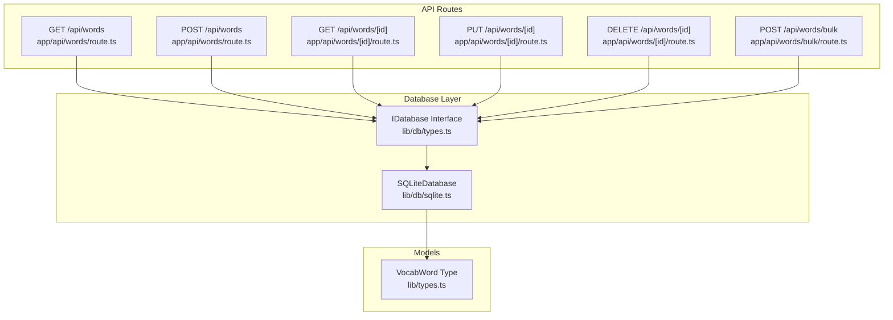
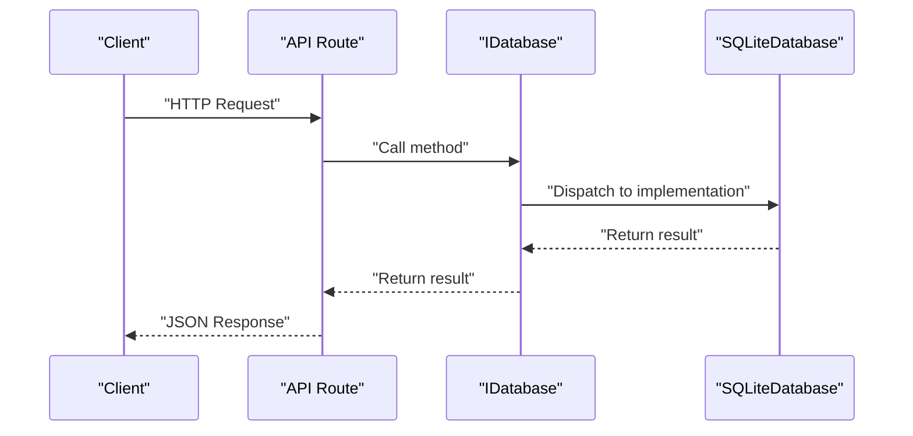
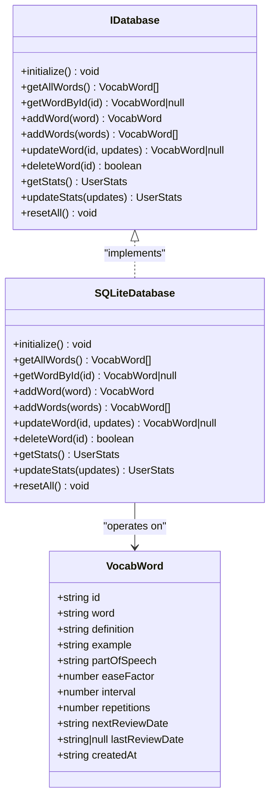

# Vocabulary Management Endpoints

<cite>
**Referenced Files in This Document**
- [app/api/words/route.ts](file://app/api/words/route.ts)
- [app/api/words/[id]/route.ts](file://app/api/words/[id]/route.ts)
- [app/api/words/bulk/route.ts](file://app/api/words/bulk/route.ts)
- [lib/db/sqlite.ts](file://lib/db/sqlite.ts)
- [lib/db/types.ts](file://lib/db/types.ts)
- [lib/types.ts](file://lib/types.ts)
- [lib/storage.ts](file://lib/storage.ts)
- [lib/dictionary-service.ts](file://lib/dictionary-service.ts)
- [lib/spaced-repetition.ts](file://lib/spaced-repetition.ts)
- [components/add-word-dialog.tsx](file://components/add-word-dialog.tsx)
- [components/bulk-import-dialog.tsx](file://components/bulk-import-dialog.tsx)
</cite>

## Table of Contents
1. [Introduction](#introduction)
2. [Project Structure](#project-structure)
3. [Core Components](#core-components)
4. [Architecture Overview](#architecture-overview)
5. [Detailed Component Analysis](#detailed-component-analysis)
6. [Dependency Analysis](#dependency-analysis)
7. [Performance Considerations](#performance-considerations)
8. [Troubleshooting Guide](#troubleshooting-guide)
9. [Conclusion](#conclusion)
10. [Appendices](#appendices)

## Introduction
This document provides comprehensive API documentation for the vocabulary management endpoints. It covers the five primary endpoints:
- GET /api/words (retrieve all words)
- POST /api/words (add a single word)
- GET /api/words/[id] (get a specific word)
- PUT /api/words/[id] (update a word)
- DELETE /api/words/[id] (delete a word)

It includes request/response schemas, parameter validation rules, error handling patterns, HTTP status codes, examples, data validation requirements, database constraints, rate limiting considerations, and client implementation patterns.

## Project Structure
The vocabulary endpoints are implemented as Next.js App Router API routes under app/api/words. The database layer abstracts persistence via an interface and currently uses an SQLite implementation. Data models are defined in shared types, and client-side integration utilities are provided.

**Diagram sources**
- [app/api/words/route.ts](file://app/api/words/route.ts#L1-L28)
- [app/api/words/[id]/route.ts](file://app/api/words/[id]/route.ts#L1-L55)
- [app/api/words/bulk/route.ts](file://app/api/words/bulk/route.ts#L1-L19)
- [lib/db/types.ts](file://lib/db/types.ts#L16-L34)
- [lib/db/sqlite.ts](file://lib/db/sqlite.ts#L28-L297)
- [lib/types.ts](file://lib/types.ts#L1-L14)

**Section sources**
- [app/api/words/route.ts](file://app/api/words/route.ts#L1-L28)
- [app/api/words/[id]/route.ts](file://app/api/words/[id]/route.ts#L1-L55)
- [app/api/words/bulk/route.ts](file://app/api/words/bulk/route.ts#L1-L19)
- [lib/db/types.ts](file://lib/db/types.ts#L1-L35)
- [lib/db/sqlite.ts](file://lib/db/sqlite.ts#L1-L297)
- [lib/types.ts](file://lib/types.ts#L1-L105)

## Core Components
- API routes: Implement HTTP handlers for CRUD operations on vocabulary words.
- Database abstraction: IDatabase interface defines methods for word operations and statistics.
- SQLite implementation: Concrete implementation with table creation, seeding, and transaction support.
- Data models: VocabWord interface defines the shape of vocabulary records.
- Client utilities: Storage helpers for browser-based consumption of the API.

**Section sources**
- [lib/db/types.ts](file://lib/db/types.ts#L16-L34)
- [lib/db/sqlite.ts](file://lib/db/sqlite.ts#L28-L297)
- [lib/types.ts](file://lib/types.ts#L1-L14)
- [lib/storage.ts](file://lib/storage.ts#L1-L39)

## Architecture Overview
The API follows a layered architecture:
- HTTP layer: Next.js App Router routes handle requests and responses.
- Domain layer: Database interface encapsulates persistence logic.
- Data layer: SQLite-backed implementation with schema and indices.
- Model layer: TypeScript interfaces define data contracts.

**Diagram sources**
- [app/api/words/route.ts](file://app/api/words/route.ts#L5-L27)
- [app/api/words/[id]/route.ts](file://app/api/words/[id]/route.ts#L5-L54)
- [lib/db/types.ts](file://lib/db/types.ts#L16-L34)
- [lib/db/sqlite.ts](file://lib/db/sqlite.ts#L28-L297)

## Detailed Component Analysis

### GET /api/words
- Purpose: Retrieve all vocabulary words.
- Handler: app/api/words/route.ts
- Request: No body; query parameters not supported.
- Response: JSON object containing an array of VocabWord.
- Status codes:
  - 200 OK: Successful retrieval.
  - 500 Internal Server Error: On unexpected errors.
- Validation: None required for request; response validated by schema.
- Error handling: Catches exceptions and returns a JSON error object with 500 status.

Example request:
- Method: GET
- URL: /api/words
- Headers: Accept: application/json

Example response:
- Status: 200
- Body: {"words": [{...VocabWord}, ...]}

Notes:
- Sorting order is defined by the database implementation (creation time descending).
- No pagination is implemented; clients should consider slicing if needed.

**Section sources**
- [app/api/words/route.ts](file://app/api/words/route.ts#L4-L14)
- [lib/db/sqlite.ts](file://lib/db/sqlite.ts#L130-L133)
- [lib/types.ts](file://lib/types.ts#L1-L14)

### POST /api/words
- Purpose: Add a single vocabulary word.
- Handler: app/api/words/route.ts
- Request: JSON body representing VocabWord.
- Response: JSON object containing the created VocabWord.
- Status codes:
  - 201 Created: Word successfully added.
  - 500 Internal Server Error: On unexpected errors.
- Validation:
  - Body must be a valid JSON object.
  - The database implementation expects all required fields to be present.
- Error handling: Catches exceptions and returns a JSON error object with 500 status.

Example request:
- Method: POST
- URL: /api/words
- Headers: Content-Type: application/json
- Body: {"id":"...","word":"...","definition":"...","example":"","partOfSpeech":"noun","easeFactor":2.5,"interval":0,"repetitions":0,"nextReviewDate":"...","lastReviewDate":null,"createdAt":"..."}

Example response:
- Status: 201
- Body: {"word": {...VocabWord}}

Validation and constraints:
- Database schema enforces NOT NULL constraints on specific columns and defaults for others.
- The client-side creation utility sets default spaced repetition fields.

**Section sources**
- [app/api/words/route.ts](file://app/api/words/route.ts#L16-L27)
- [lib/db/sqlite.ts](file://lib/db/sqlite.ts#L140-L159)
- [lib/types.ts](file://lib/types.ts#L1-L14)
- [lib/spaced-repetition.ts](file://lib/spaced-repetition.ts#L71-L91)

### GET /api/words/[id]
- Purpose: Retrieve a specific vocabulary word by ID.
- Handler: app/api/words/[id]/route.ts
- Path parameters:
  - id: string (required)
- Response: JSON object containing the requested VocabWord.
- Status codes:
  - 200 OK: Word found.
  - 404 Not Found: Word does not exist.
  - 500 Internal Server Error: On unexpected errors.
- Validation:
  - id must be a non-empty string.
- Error handling:
  - Returns 404 with error message if word not found.
  - Catches exceptions and returns a JSON error object with 500 status.

Example request:
- Method: GET
- URL: /api/words/{id}
- Headers: Accept: application/json

Example response:
- Status: 200
- Body: {"word": {...VocabWord}}

**Section sources**
- [app/api/words/[id]/route.ts](file://app/api/words/[id]/route.ts#L4-L19)
- [lib/db/sqlite.ts](file://lib/db/sqlite.ts#L135-L138)
- [lib/types.ts](file://lib/types.ts#L1-L14)

### PUT /api/words/[id]
- Purpose: Update an existing vocabulary word by ID.
- Handler: app/api/words/[id]/route.ts
- Path parameters:
  - id: string (required)
- Request: JSON body with partial VocabWord fields to update.
- Response: JSON object containing the updated VocabWord.
- Status codes:
  - 200 OK: Word updated successfully.
  - 404 Not Found: Word does not exist.
  - 500 Internal Server Error: On unexpected errors.
- Validation:
  - id must be a non-empty string.
  - Body must be a valid JSON object.
- Error handling:
  - Returns 404 with error message if word not found.
  - Catches exceptions and returns a JSON error object with 500 status.

Example request:
- Method: PUT
- URL: /api/words/{id}
- Headers: Content-Type: application/json
- Body: {"definition":"Updated definition","example":"Updated example"}

Example response:
- Status: 200
- Body: {"word": {...Updated VocabWord}}

**Section sources**
- [app/api/words/[id]/route.ts](file://app/api/words/[id]/route.ts#L21-L37)
- [lib/db/sqlite.ts](file://lib/db/sqlite.ts#L190-L222)
- [lib/types.ts](file://lib/types.ts#L1-L14)

### DELETE /api/words/[id]
- Purpose: Delete a vocabulary word by ID.
- Handler: app/api/words/[id]/route.ts
- Path parameters:
  - id: string (required)
- Response: JSON object indicating success.
- Status codes:
  - 200 OK: Deletion successful.
  - 404 Not Found: Word does not exist.
  - 500 Internal Server Error: On unexpected errors.
- Validation:
  - id must be a non-empty string.
- Error handling:
  - Returns 404 with error message if word not found.
  - Catches exceptions and returns a JSON error object with 500 status.

Example request:
- Method: DELETE
- URL: /api/words/{id}
- Headers: Accept: application/json

Example response:
- Status: 200
- Body: {"success": true}

**Section sources**
- [app/api/words/[id]/route.ts](file://app/api/words/[id]/route.ts#L39-L54)
- [lib/db/sqlite.ts](file://lib/db/sqlite.ts#L224-L228)

### POST /api/words/bulk (Reference)
While not requested, this endpoint is documented for completeness:
- Purpose: Add multiple vocabulary words in a single request.
- Handler: app/api/words/bulk/route.ts
- Request: JSON body with an array of VocabWord objects.
- Response: JSON object containing the added words and count.
- Status codes:
  - 201 Created: Words successfully added.
  - 400 Bad Request: Missing or empty words array.
  - 500 Internal Server Error: On unexpected errors.

**Section sources**
- [app/api/words/bulk/route.ts](file://app/api/words/bulk/route.ts#L4-L18)
- [lib/db/sqlite.ts](file://lib/db/sqlite.ts#L161-L188)

## Dependency Analysis
The API routes depend on the database abstraction and types. The SQLite implementation depends on the VocabWord model and uses transactions for bulk operations.

**Diagram sources**
- [lib/db/types.ts](file://lib/db/types.ts#L16-L34)
- [lib/db/sqlite.ts](file://lib/db/sqlite.ts#L28-L297)
- [lib/types.ts](file://lib/types.ts#L1-L14)

**Section sources**
- [lib/db/types.ts](file://lib/db/types.ts#L16-L34)
- [lib/db/sqlite.ts](file://lib/db/sqlite.ts#L28-L297)
- [lib/types.ts](file://lib/types.ts#L1-L14)

## Performance Considerations
- Indexes: The SQLite implementation creates indexes on next review date and word for efficient queries.
- Transactions: Bulk insertions use transactions to reduce overhead and maintain consistency.
- Pagination: The GET /api/words endpoint returns all words without pagination; consider client-side slicing or future pagination for large datasets.
- Concurrency: The database connection is initialized once and reused; ensure proper isolation if scaling horizontally.

**Section sources**
- [lib/db/sqlite.ts](file://lib/db/sqlite.ts#L61-L62)
- [lib/db/sqlite.ts](file://lib/db/sqlite.ts#L167-L183)

## Troubleshooting Guide
Common issues and resolutions:
- 404 Not Found on GET/PUT/DELETE /[id]: Ensure the ID exists in the database.
- 500 Internal Server Error: Inspect server logs for underlying database or runtime errors.
- Validation failures: Ensure request bodies conform to the VocabWord schema and required fields are present.
- Rate limiting considerations: While the API itself does not implement rate limiting, external services (dictionary lookups) may enforce limits. The client-side bulk import demonstrates a small delay between lookups to mitigate rate limiting.

**Section sources**
- [app/api/words/[id]/route.ts](file://app/api/words/[id]/route.ts#L12-L18)
- [app/api/words/[id]/route.ts](file://app/api/words/[id]/route.ts#L30-L36)
- [components/bulk-import-dialog.tsx](file://components/bulk-import-dialog.tsx#L134-L138)

## Conclusion
The vocabulary management endpoints provide a straightforward CRUD interface for managing vocabulary entries backed by an SQLite database. The design leverages a clean separation of concerns with an abstract database interface, typed models, and practical client utilities. Extending validation, adding pagination, and implementing rate limiting for external lookups would further improve robustness and scalability.

## Appendices

### Request/Response Schemas
- VocabWord (fields):
  - id: string
  - word: string
  - definition: string
  - example: string
  - partOfSpeech: string
  - easeFactor: number
  - interval: number
  - repetitions: number
  - nextReviewDate: string (ISO date)
  - lastReviewDate: string | null
  - createdAt: string (ISO date)

- Response envelopes:
  - List response: {"words": [VocabWord, ...]}
  - Single resource: {"word": VocabWord}
  - Bulk response: {"words": [VocabWord, ...], "count": number}
  - Error response: {"error": string}
  - Success response: {"success": true}

**Section sources**
- [lib/types.ts](file://lib/types.ts#L1-L14)
- [app/api/words/route.ts](file://app/api/words/route.ts#L9-L9)
- [app/api/words/bulk/route.ts](file://app/api/words/bulk/route.ts#L13-L13)

### HTTP Status Codes Reference
- 200 OK: Successful GET/PUT/DELETE operations.
- 201 Created: Successful POST (single) and POST (bulk).
- 400 Bad Request: Missing or invalid words array in bulk endpoint.
- 404 Not Found: Resource not found for GET/PUT/DELETE /[id].
- 500 Internal Server Error: Unexpected server errors.

**Section sources**
- [app/api/words/route.ts](file://app/api/words/route.ts#L12-L12)
- [app/api/words/route.ts](file://app/api/words/route.ts#L25-L25)
- [app/api/words/[id]/route.ts](file://app/api/words/[id]/route.ts#L13-L13)
- [app/api/words/[id]/route.ts](file://app/api/words/[id]/route.ts#L31-L31)
- [app/api/words/[id]/route.ts](file://app/api/words/[id]/route.ts#L48-L48)
- [app/api/words/bulk/route.ts](file://app/api/words/bulk/route.ts#L9-L9)

### Data Validation and Database Constraints
- Required fields (enforced by schema): word, definition, partOfSpeech (with default), nextReviewDate, createdAt.
- Defaults: partOfSpeech defaults to "noun"; example defaults to empty string; spaced repetition fields have numeric defaults.
- Indices: next_review_date and word for performance.

**Section sources**
- [lib/db/sqlite.ts](file://lib/db/sqlite.ts#L37-L63)
- [lib/db/sqlite.ts](file://lib/db/sqlite.ts#L140-L159)
- [lib/db/sqlite.ts](file://lib/db/sqlite.ts#L161-L188)

### Rate Limiting Considerations
- External dictionary lookups may enforce rate limits. The client-side bulk import introduces small delays between API calls to avoid throttling.
- The API routes themselves do not implement rate limiting.

**Section sources**
- [components/bulk-import-dialog.tsx](file://components/bulk-import-dialog.tsx#L134-L138)
- [lib/dictionary-service.ts](file://lib/dictionary-service.ts#L52-L90)

### Client Implementation Examples
- Browser utilities:
  - Fetch all words: see [lib/storage.ts](file://lib/storage.ts#L5-L10)
  - Add a single word: see [lib/storage.ts](file://lib/storage.ts#L19-L28)
  - Bulk add words: see [lib/storage.ts](file://lib/storage.ts#L30-L39)
- UI integration:
  - Add word dialog uses dictionary lookup and submission: see [components/add-word-dialog.tsx](file://components/add-word-dialog.tsx#L96-L104)
  - Bulk import dialog parses input, enriches with AI, and submits: see [components/bulk-import-dialog.tsx](file://components/bulk-import-dialog.tsx#L156-L196)

**Section sources**
- [lib/storage.ts](file://lib/storage.ts#L5-L39)
- [components/add-word-dialog.tsx](file://components/add-word-dialog.tsx#L96-L104)
- [components/bulk-import-dialog.tsx](file://components/bulk-import-dialog.tsx#L156-L196)