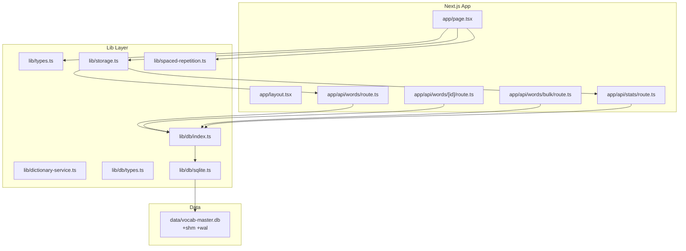
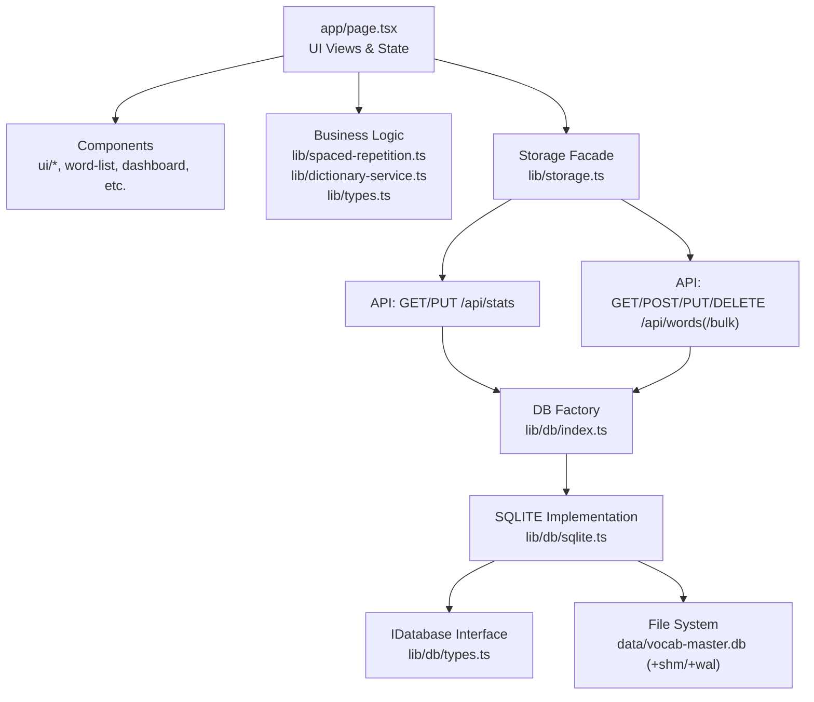
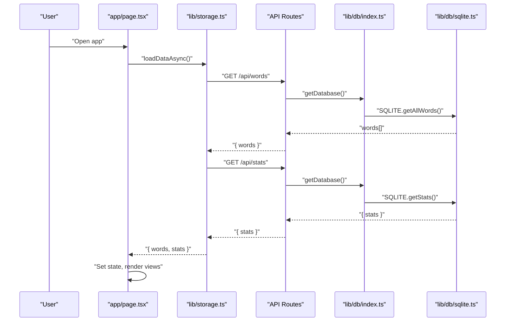
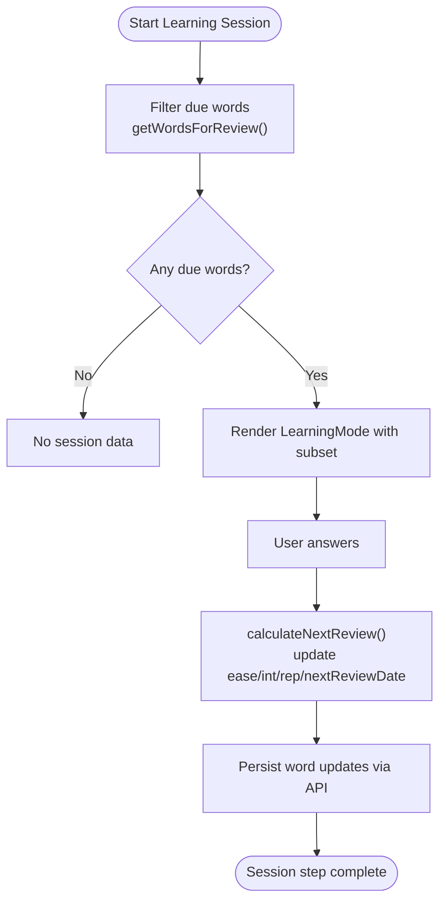
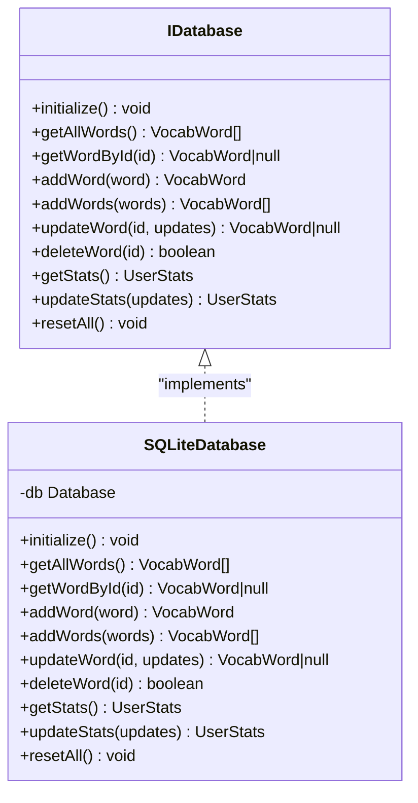
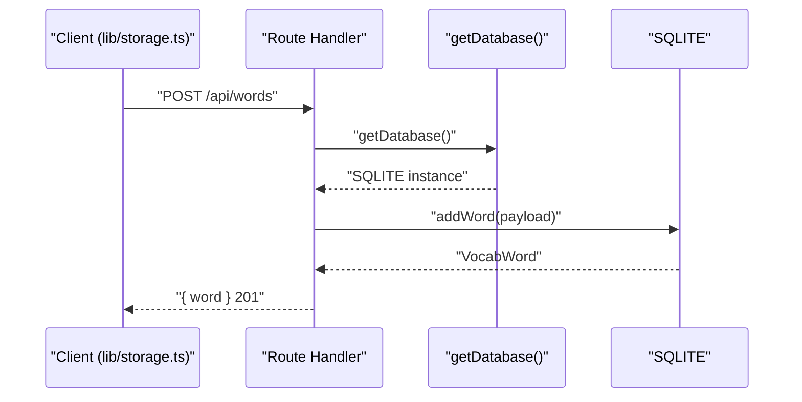
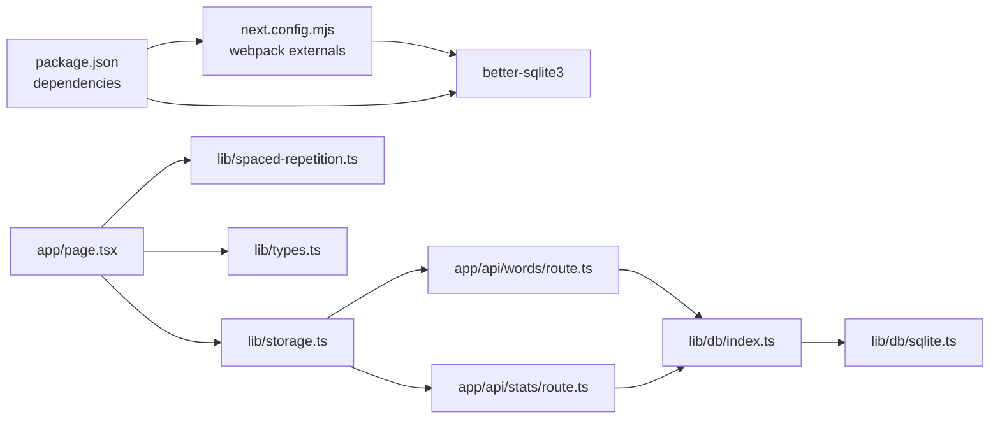

# Architecture & Design

<cite>
**Referenced Files in This Document**
- [app/layout.tsx](file://app/layout.tsx)
- [app/page.tsx](file://app/page.tsx)
- [app/api/stats/route.ts](file://app/api/stats/route.ts)
- [app/api/words/route.ts](file://app/api/words/route.ts)
- [app/api/words/[id]/route.ts](file://app/api/words/[id]/route.ts)
- [app/api/words/bulk/route.ts](file://app/api/words/bulk/route.ts)
- [lib/db/index.ts](file://lib/db/index.ts)
- [lib/db/types.ts](file://lib/db/types.ts)
- [lib/db/sqlite.ts](file://lib/db/sqlite.ts)
- [lib/storage.ts](file://lib/storage.ts)
- [lib/spaced-repetition.ts](file://lib/spaced-repetition.ts)
- [lib/dictionary-service.ts](file://lib/dictionary-service.ts)
- [lib/types.ts](file://lib/types.ts)
- [next.config.mjs](file://next.config.mjs)
- [package.json](file://package.json)
</cite>

## Table of Contents
1. [Introduction](#introduction)
2. [Project Structure](#project-structure)
3. [Core Components](#core-components)
4. [Architecture Overview](#architecture-overview)
5. [Detailed Component Analysis](#detailed-component-analysis)
6. [Dependency Analysis](#dependency-analysis)
7. [Performance Considerations](#performance-considerations)
8. [Troubleshooting Guide](#troubleshooting-guide)
9. [Conclusion](#conclusion)
10. [Appendices](#appendices)

## Introduction
This document describes the system architecture of VocabMaster, focusing on its layered design, Next.js 14 Pages Router usage, API routes, component hierarchy, database abstraction, and service architecture. It explains how the presentation layer (UI), business logic (spaced repetition, dictionary services), and data access layer (SQLite via a database abstraction) collaborate. It also covers system boundaries, data flows, separation of concerns, scalability considerations, performance optimizations, and extensibility points.

## Project Structure
VocabMaster follows a conventional Next.js 14 app directory structure with:
- app: Next.js Pages Router entry points and API routes
- components: Reusable UI components
- lib: Business logic, services, and database abstraction
- data: Local SQLite database files

**Diagram sources**
- [app/layout.tsx](file://app/layout.tsx#L1-L24)
- [app/page.tsx](file://app/page.tsx#L1-L316)
- [app/api/stats/route.ts](file://app/api/stats/route.ts#L1-L26)
- [app/api/words/route.ts](file://app/api/words/route.ts#L1-L28)
- [app/api/words/[id]/route.ts](file://app/api/words/[id]/route.ts#L1-L55)
- [app/api/words/bulk/route.ts](file://app/api/words/bulk/route.ts#L1-L19)
- [lib/db/index.ts](file://lib/db/index.ts#L1-L21)
- [lib/db/types.ts](file://lib/db/types.ts#L1-L35)
- [lib/db/sqlite.ts](file://lib/db/sqlite.ts#L1-L297)
- [lib/storage.ts](file://lib/storage.ts#L1-L137)
- [lib/spaced-repetition.ts](file://lib/spaced-repetition.ts#L1-L123)
- [lib/dictionary-service.ts](file://lib/dictionary-service.ts#L1-L255)
- [lib/types.ts](file://lib/types.ts#L1-L105)

**Section sources**
- [app/layout.tsx](file://app/layout.tsx#L1-L24)
- [app/page.tsx](file://app/page.tsx#L1-L316)
- [lib/types.ts](file://lib/types.ts#L1-L105)

## Core Components
- Presentation layer (UI):
  - Root layout and global styles
  - Page component orchestrating views and state
  - UI components for dialogs, lists, and dashboards
- Business logic:
  - Spaced repetition calculations and scheduling
  - Dictionary service with AI and fallback
  - Types and constants for domain model
- Data access:
  - Database abstraction interface
  - SQLite implementation with initialization, seeding, and transactions
  - Storage façade for API-driven client operations

Key responsibilities:
- app/page.tsx: Renders views, manages local state, delegates persistence to lib/storage.ts, and computes learning statistics via lib/spaced-repetition.ts.
- lib/storage.ts: Encapsulates HTTP calls to app/api/* routes, returning typed data to the UI.
- lib/db/*: Provides a singleton database accessor and an IDatabase interface for pluggable backends.
- lib/spaced-repetition.ts: Implements SM-2 scheduling and mastery metrics.
- lib/dictionary-service.ts: Integrates AI-powered lookups with a free dictionary fallback and robust import parsing.

**Section sources**
- [app/page.tsx](file://app/page.tsx#L1-L316)
- [lib/storage.ts](file://lib/storage.ts#L1-L137)
- [lib/db/index.ts](file://lib/db/index.ts#L1-L21)
- [lib/db/types.ts](file://lib/db/types.ts#L1-L35)
- [lib/db/sqlite.ts](file://lib/db/sqlite.ts#L1-L297)
- [lib/spaced-repetition.ts](file://lib/spaced-repetition.ts#L1-L123)
- [lib/dictionary-service.ts](file://lib/dictionary-service.ts#L1-L255)
- [lib/types.ts](file://lib/types.ts#L1-L105)

## Architecture Overview
VocabMaster employs a layered architecture:
- Presentation layer: Next.js app directory with page.tsx rendering UI and coordinating user actions.
- Business logic layer: TypeScript modules under lib/ implementing domain rules and integrations.
- Data access layer: Abstraction over SQLite with a factory and singleton pattern.

System boundaries:
- API boundary: app/api/* routes expose CRUD and stats endpoints.
- Persistence boundary: lib/db/* encapsulates schema, migrations, and queries.
- UI boundary: app/page.tsx and components/ui/* define the user interface.

**Diagram sources**
- [app/page.tsx](file://app/page.tsx#L1-L316)
- [lib/storage.ts](file://lib/storage.ts#L1-L137)
- [app/api/stats/route.ts](file://app/api/stats/route.ts#L1-L26)
- [app/api/words/route.ts](file://app/api/words/route.ts#L1-L28)
- [app/api/words/[id]/route.ts](file://app/api/words/[id]/route.ts#L1-L55)
- [app/api/words/bulk/route.ts](file://app/api/words/bulk/route.ts#L1-L19)
- [lib/db/index.ts](file://lib/db/index.ts#L1-L21)
- [lib/db/types.ts](file://lib/db/types.ts#L1-L35)
- [lib/db/sqlite.ts](file://lib/db/sqlite.ts#L1-L297)

## Detailed Component Analysis

### Presentation Layer: Next.js Pages Router and Component Hierarchy
- app/layout.tsx: Sets global metadata and font, wraps children in HTML structure.
- app/page.tsx: Client component managing:
  - View state (dashboard, words, learning, complete)
  - Local word list and stats
  - Dialog orchestration (add word, bulk import, settings)
  - Lifecycle data loading via lib/storage.loadDataAsync
  - Learning mode transitions and session completion handling
  - Navigation and action buttons

Component hierarchy:
- Header and navigation rendered conditionally based on view
- Conditional rendering of Dashboard, WordList, LearningMode, SessionComplete
- Floating action button for mobile
- Modal dialogs for add/import/settings

**Diagram sources**
- [app/page.tsx](file://app/page.tsx#L1-L316)
- [lib/storage.ts](file://lib/storage.ts#L77-L84)
- [app/api/words/route.ts](file://app/api/words/route.ts#L1-L28)
- [app/api/stats/route.ts](file://app/api/stats/route.ts#L1-L26)
- [lib/db/index.ts](file://lib/db/index.ts#L12-L18)
- [lib/db/sqlite.ts](file://lib/db/sqlite.ts#L130-L138)

**Section sources**
- [app/layout.tsx](file://app/layout.tsx#L1-L24)
- [app/page.tsx](file://app/page.tsx#L1-L316)

### Business Logic Layer: Spaced Repetition and Dictionary Services
- Spaced repetition:
  - SM-2 scheduling with ease factor, interval, repetitions, and next review date
  - Mastery calculation and prioritization of due words
  - Utility ID generation for new words
- Dictionary service:
  - AI-powered lookup with fallback to free dictionary API
  - Robust parsing for CSV, JSON, and simple text import formats

**Diagram sources**
- [lib/spaced-repetition.ts](file://lib/spaced-repetition.ts#L50-L68)
- [lib/spaced-repetition.ts](file://lib/spaced-repetition.ts#L8-L48)
- [lib/storage.ts](file://lib/storage.ts#L41-L53)

**Section sources**
- [lib/spaced-repetition.ts](file://lib/spaced-repetition.ts#L1-L123)
- [lib/dictionary-service.ts](file://lib/dictionary-service.ts#L1-L255)
- [lib/types.ts](file://lib/types.ts#L1-L105)

### Data Access Layer: Database Abstraction and SQLite Implementation
- Abstraction:
  - IDatabase interface defines methods for words and stats
  - Factory function getDatabase() returns a singleton implementation
- SQLite implementation:
  - Initializes schema, indexes, seeds sample words, and synchronizes stats
  - Uses WAL mode and foreign keys enabled
  - Transactions for bulk inserts
  - Row mapping helpers

**Diagram sources**
- [lib/db/types.ts](file://lib/db/types.ts#L16-L34)
- [lib/db/sqlite.ts](file://lib/db/sqlite.ts#L28-L279)

**Section sources**
- [lib/db/index.ts](file://lib/db/index.ts#L1-L21)
- [lib/db/types.ts](file://lib/db/types.ts#L1-L35)
- [lib/db/sqlite.ts](file://lib/db/sqlite.ts#L1-L297)

### API Routes: Next.js App Router Endpoints
- GET /api/words: Returns all words
- POST /api/words: Creates a single word
- GET /api/words/[id]: Retrieves a word by ID
- PUT /api/words/[id]: Updates a word
- DELETE /api/words/[id]: Deletes a word
- POST /api/words/bulk: Bulk inserts words
- GET /api/stats: Retrieves user stats
- PUT /api/stats: Updates user stats

**Diagram sources**
- [app/api/words/route.ts](file://app/api/words/route.ts#L16-L27)
- [lib/db/index.ts](file://lib/db/index.ts#L12-L18)
- [lib/db/sqlite.ts](file://lib/db/sqlite.ts#L140-L159)

**Section sources**
- [app/api/words/route.ts](file://app/api/words/route.ts#L1-L28)
- [app/api/words/[id]/route.ts](file://app/api/words/[id]/route.ts#L1-L55)
- [app/api/words/bulk/route.ts](file://app/api/words/bulk/route.ts#L1-L19)
- [app/api/stats/route.ts](file://app/api/stats/route.ts#L1-L26)

## Dependency Analysis
- Next.js configuration excludes better-sqlite3 from client bundling; it runs server-side in API routes.
- Runtime dependencies include Next.js, React, Tailwind UI primitives, and better-sqlite3 for server-side DB access.
- Internal dependencies:
  - app/page.tsx depends on lib/storage.ts, lib/spaced-repetition.ts, and lib/types.ts
  - lib/storage.ts depends on app/api/* routes
  - API routes depend on lib/db/index.ts and lib/db/sqlite.ts
  - lib/db/index.ts depends on lib/db/sqlite.ts and exposes IDatabase

**Diagram sources**
- [next.config.mjs](file://next.config.mjs#L1-L15)
- [package.json](file://package.json#L11-L21)
- [app/page.tsx](file://app/page.tsx#L1-L316)
- [lib/storage.ts](file://lib/storage.ts#L1-L137)
- [app/api/words/route.ts](file://app/api/words/route.ts#L1-L28)
- [app/api/stats/route.ts](file://app/api/stats/route.ts#L1-L26)
- [lib/db/index.ts](file://lib/db/index.ts#L1-L21)
- [lib/db/sqlite.ts](file://lib/db/sqlite.ts#L1-L297)

**Section sources**
- [next.config.mjs](file://next.config.mjs#L1-L15)
- [package.json](file://package.json#L11-L21)

## Performance Considerations
- Database:
  - WAL mode improves concurrency and read throughput.
  - Indexes on next_review_date and word support efficient filtering and sorting.
  - Transactions for bulk inserts reduce overhead.
- API:
  - Single-page app reduces round trips; initial load uses concurrent fetches for words and stats.
- UI:
  - Client-side sorting and filtering for due words avoids frequent server calls.
- Scalability:
  - Current SQLite setup is file-based and suitable for single-instance deployments.
  - The IDatabase abstraction enables migration to cloud databases (e.g., MySQL/PostgreSQL) by swapping implementations.

[No sources needed since this section provides general guidance]

## Troubleshooting Guide
- API errors:
  - API routes return structured error messages; check status codes and bodies for failures during CRUD or stats operations.
- Database initialization:
  - On first run, schema is created and sample words seeded; verify data directory existence and permissions.
- Client-side state:
  - If UI does not reflect updates, confirm that lib/storage.ts fetches succeed and that app/page.tsx state updates are triggered.

**Section sources**
- [app/api/words/route.ts](file://app/api/words/route.ts#L10-L13)
- [app/api/stats/route.ts](file://app/api/stats/route.ts#L10-L12)
- [lib/db/sqlite.ts](file://lib/db/sqlite.ts#L35-L81)
- [lib/storage.ts](file://lib/storage.ts#L5-L17)

## Conclusion
VocabMaster’s architecture cleanly separates presentation, business logic, and data access layers. The Next.js Pages Router integrates seamlessly with API routes, while a database abstraction enables future backend swaps. The spaced repetition engine and dictionary service provide rich learning features. With WAL mode, indexes, and transactions, the system balances simplicity and performance for a single-user learning application.

[No sources needed since this section summarizes without analyzing specific files]

## Appendices

### System Boundaries and Data Flow Summary
- Presentation boundary: app/page.tsx renders views and triggers actions.
- Business boundary: lib/spaced-repetition.ts and lib/dictionary-service.ts encapsulate domain logic.
- Data boundary: lib/db/* abstracts persistence; app/api/* bridge to the database.
- Data flow: UI -> Storage facade -> API routes -> Database implementation -> File system.

[No sources needed since this section provides a summary]