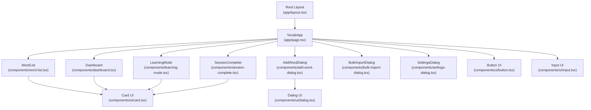
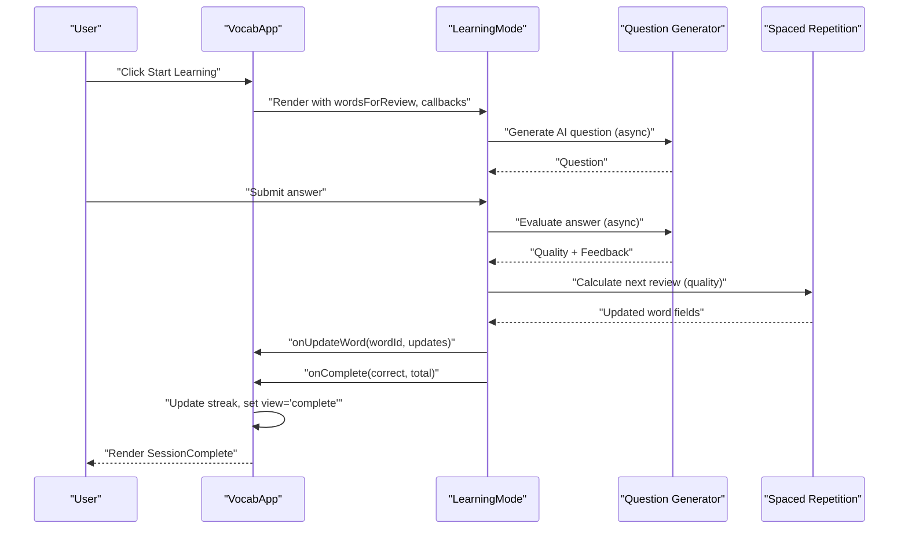
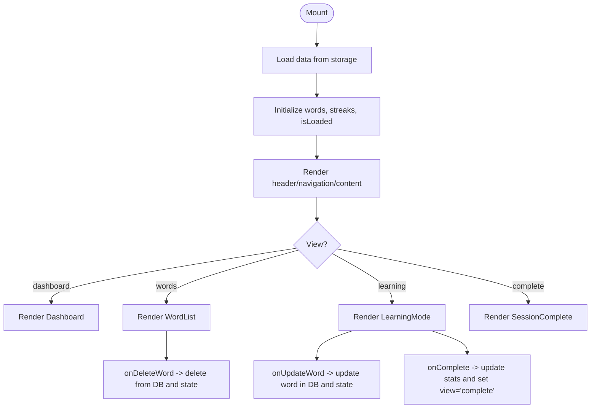
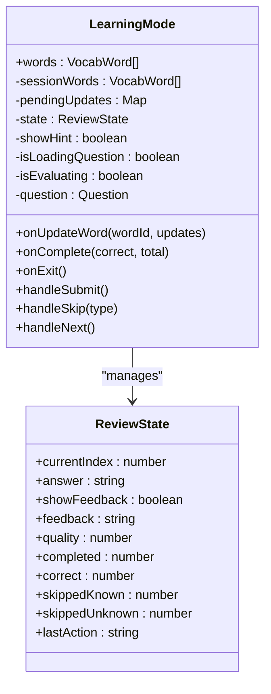
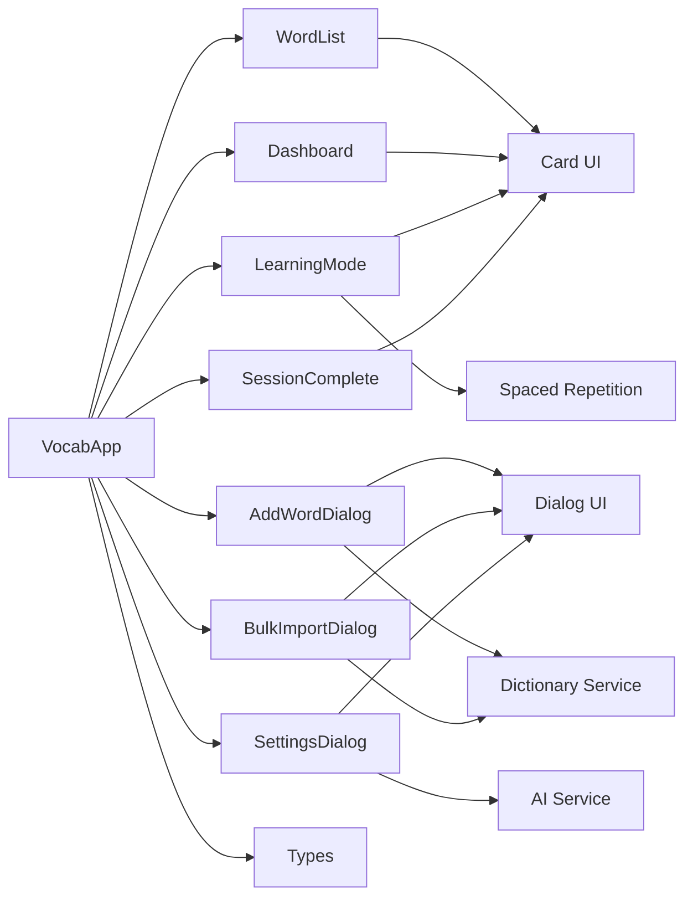

# Component Architecture

<cite>
**Referenced Files in This Document**
- [layout.tsx](file://app/layout.tsx)
- [page.tsx](file://app/page.tsx)
- [dashboard.tsx](file://components/dashboard.tsx)
- [word-list.tsx](file://components/word-list.tsx)
- [learning-mode.tsx](file://components/learning-mode.tsx)
- [session-complete.tsx](file://components/session-complete.tsx)
- [add-word-dialog.tsx](file://components/add-word-dialog.tsx)
- [bulk-import-dialog.tsx](file://components/bulk-import-dialog.tsx)
- [settings-dialog.tsx](file://components/settings-dialog.tsx)
- [dialog.tsx](file://components/ui/dialog.tsx)
- [card.tsx](file://components/ui/card.tsx)
- [button.tsx](file://components/ui/button.tsx)
- [input.tsx](file://components/ui/input.tsx)
- [types.ts](file://lib/types.ts)
- [spaced-repetition.ts](file://lib/spaced-repetition.ts)
</cite>

## Table of Contents
1. [Introduction](#introduction)
2. [Project Structure](#project-structure)
3. [Core Components](#core-components)
4. [Architecture Overview](#architecture-overview)
5. [Detailed Component Analysis](#detailed-component-analysis)
6. [Dependency Analysis](#dependency-analysis)
7. [Performance Considerations](#performance-considerations)
8. [Troubleshooting Guide](#troubleshooting-guide)
9. [Conclusion](#conclusion)

## Introduction
This document describes the React component architecture of VocabMaster, focusing on the main application container, component composition patterns, prop drilling strategies, and state management. It explains how page-level components (dashboard, word list, learning mode, session completion) integrate with reusable UI components and dialogs, and how data flows from parent to child components. It also covers lifecycle management, event handling, reusability, customization options, and integration with global application state.

## Project Structure
The application follows a Next.js App Router structure with a single-page client-side application entry. The main client component orchestrates navigation, state, and rendering of feature-specific pages and reusable dialogs.

**Diagram sources**
- [layout.tsx](file://app/layout.tsx#L1-L24)
- [page.tsx](file://app/page.tsx#L1-L316)
- [dashboard.tsx](file://components/dashboard.tsx#L1-L154)
- [word-list.tsx](file://components/word-list.tsx#L1-L123)
- [learning-mode.tsx](file://components/learning-mode.tsx#L1-L370)
- [session-complete.tsx](file://components/session-complete.tsx#L1-L73)
- [add-word-dialog.tsx](file://components/add-word-dialog.tsx#L1-L297)
- [bulk-import-dialog.tsx](file://components/bulk-import-dialog.tsx#L1-L495)
- [settings-dialog.tsx](file://components/settings-dialog.tsx#L1-L249)
- [dialog.tsx](file://components/ui/dialog.tsx#L1-L94)
- [card.tsx](file://components/ui/card.tsx#L1-L79)
- [button.tsx](file://components/ui/button.tsx#L1-L54)
- [input.tsx](file://components/ui/input.tsx#L1-L25)

**Section sources**
- [layout.tsx](file://app/layout.tsx#L1-L24)
- [page.tsx](file://app/page.tsx#L1-L316)

## Core Components
- VocabApp (client component): Central orchestrator managing global state (view, words, streaks, dialogs), loading data, and coordinating page-level components.
- Page-level components:
  - Dashboard: Displays learning statistics and streak metrics.
  - WordList: Renders a grid of vocabulary cards with deletion actions.
  - LearningMode: Interactive quiz engine with AI question generation, answer evaluation, and spaced repetition updates.
  - SessionComplete: Post-session summary with performance stars and restart/exit actions.
- Dialog components:
  - AddWordDialog: Single-word addition with AI-powered dictionary lookup and suggestions.
  - BulkImportDialog: Multi-word import pipeline with parsing, enrichment, and batch import.
  - SettingsDialog: AI configuration and connection testing.
- Reusable UI primitives:
  - Dialog, Card, Button, Input, Badge, Progress, Textarea.

Key prop drilling strategies:
- Parent-to-child props: VocabApp passes data and callbacks down to children (e.g., words, handlers).
- Callback inversion: Children invoke callbacks to update parent state (e.g., handleAddWord, handleImportWords, handleUpdateWord, handleSessionComplete).
- Localized state: Dialogs and LearningMode maintain internal state for UX (open/closed, form fields, review state).

**Section sources**
- [page.tsx](file://app/page.tsx#L29-L316)
- [dashboard.tsx](file://components/dashboard.tsx#L10-L154)
- [word-list.tsx](file://components/word-list.tsx#L12-L123)
- [learning-mode.tsx](file://components/learning-mode.tsx#L15-L370)
- [session-complete.tsx](file://components/session-complete.tsx#L8-L73)
- [add-word-dialog.tsx](file://components/add-word-dialog.tsx#L14-L297)
- [bulk-import-dialog.tsx](file://components/bulk-import-dialog.tsx#L14-L495)
- [settings-dialog.tsx](file://components/settings-dialog.tsx#L12-L249)

## Architecture Overview
The architecture is a unidirectional data flow pattern:
- VocabApp holds global state and loads data on mount.
- It renders one of several views based on the current view state.
- Child components receive props and call callbacks to mutate parent state.
- Dialogs encapsulate complex forms and workflows while delegating persistence to parent handlers.

**Diagram sources**
- [page.tsx](file://app/page.tsx#L97-L109)
- [learning-mode.tsx](file://components/learning-mode.tsx#L76-L156)
- [spaced-repetition.ts](file://lib/spaced-repetition.ts#L8-L48)

**Section sources**
- [page.tsx](file://app/page.tsx#L93-L117)
- [learning-mode.tsx](file://components/learning-mode.tsx#L35-L156)

## Detailed Component Analysis

### VocabApp (Main Application Container)
Responsibilities:
- Global state: view, words, streaks, dialogs visibility, session result.
- Lifecycle: loads data on mount, calculates derived stats, exposes CRUD handlers.
- Navigation: switches among dashboard, word list, learning mode, and completion screens.
- Event handling: starts learning, handles session completion, manages exit/restart.

Patterns:
- React hooks for state and effects.
- Derived data computed from loaded words (due, mastered, learning, new).
- Callbacks passed down to child components to mutate state.

**Diagram sources**
- [page.tsx](file://app/page.tsx#L41-L53)
- [page.tsx](file://app/page.tsx#L55-L91)
- [page.tsx](file://app/page.tsx#L230-L280)

**Section sources**
- [page.tsx](file://app/page.tsx#L29-L316)

### Dashboard Component
Responsibilities:
- Displays learning statistics (total, due, mastered, learning, new).
- Shows overall mastery percentage and current/longest streak.
- Uses reusable Card and Progress components.

Patterns:
- Receives words and streaks as props.
- Computes derived stats internally.
- Uses UI primitives for layout and progress visualization.

**Section sources**
- [dashboard.tsx](file://components/dashboard.tsx#L16-L154)
- [card.tsx](file://components/ui/card.tsx#L1-L79)

### WordList Component
Responsibilities:
- Renders a responsive grid of vocabulary cards.
- Deletion action delegated to parent via callback.
- Calculates mastery and due status per card.

Patterns:
- Accepts words and onDelete callback.
- Uses internal helpers to compute mastery and due dates.
- Composes Card and Badge components.

**Section sources**
- [word-list.tsx](file://components/word-list.tsx#L17-L123)

### LearningMode Component
Responsibilities:
- Interactive quiz with AI-generated questions and grammar hints.
- Tracks review state (current index, answer, feedback, quality).
- Applies spaced repetition updates after each answer.
- Manages transitions between words and session completion.

Patterns:
- Uses refs to snapshot words at session start.
- Maintains a pending updates map to batch updates.
- Async question generation and evaluation.
- Emits callbacks to parent for persistence and view transitions.

**Diagram sources**
- [learning-mode.tsx](file://components/learning-mode.tsx#L15-L51)

**Section sources**
- [learning-mode.tsx](file://components/learning-mode.tsx#L35-L370)
- [spaced-repetition.ts](file://lib/spaced-repetition.ts#L8-L48)

### SessionComplete Component
Responsibilities:
- Presents a performance summary with emoji and star ratings.
- Provides restart and exit actions.

Patterns:
- Receives correct/total and callbacks to control navigation.

**Section sources**
- [session-complete.tsx](file://components/session-complete.tsx#L15-L73)

### Dialog Components and Reusable UI

#### AddWordDialog
Responsibilities:
- Single-word creation with AI-powered dictionary lookup.
- Debounced word lookup with suggestions dropdown.
- Form validation and submission.

Patterns:
- Internal state for form fields and suggestions.
- Cleanup of timeouts on unmount.
- Resets form on dialog close.

**Section sources**
- [add-word-dialog.tsx](file://components/add-word-dialog.tsx#L20-L297)

#### BulkImportDialog
Responsibilities:
- Multi-step import workflow: input → preview → importing → complete.
- Parses various formats, detects duplicates, enriches with AI.
- Batch creation and progress reporting.

Patterns:
- Step-based UI with controlled navigation.
- Rate-limited AI enrichment.
- Batch import with progress and results.

**Section sources**
- [bulk-import-dialog.tsx](file://components/bulk-import-dialog.tsx#L30-L495)

#### SettingsDialog
Responsibilities:
- Configures AI provider settings (API key, base URL, model, temperature, tokens).
- Tests connection and resets configuration.

Patterns:
- Persists configuration locally and reloads on open.
- Masked API key display with toggle.

**Section sources**
- [settings-dialog.tsx](file://components/settings-dialog.tsx#L17-L249)

#### Reusable UI Primitives
- Dialog: Modal overlay with close button and backdrop blur.
- Card: Consistent card layout with header/title/content/footer slots.
- Button: Variants and sizes via class variance authority.
- Input: Styled text input with focus/ring behavior.

**Section sources**
- [dialog.tsx](file://components/ui/dialog.tsx#L13-L94)
- [card.tsx](file://components/ui/card.tsx#L4-L79)
- [button.tsx](file://components/ui/button.tsx#L5-L54)
- [input.tsx](file://components/ui/input.tsx#L7-L25)

## Dependency Analysis
Component dependencies and data flow:

**Diagram sources**
- [page.tsx](file://app/page.tsx#L7-L25)
- [add-word-dialog.tsx](file://components/add-word-dialog.tsx#L10-L12)
- [bulk-import-dialog.tsx](file://components/bulk-import-dialog.tsx#L9-L12)
- [settings-dialog.tsx](file://components/settings-dialog.tsx#L9-L10)
- [learning-mode.tsx](file://components/learning-mode.tsx#L11-L13)
- [dashboard.tsx](file://components/dashboard.tsx#L7-L8)
- [word-list.tsx](file://components/word-list.tsx#L9-L10)

**Section sources**
- [page.tsx](file://app/page.tsx#L7-L25)
- [types.ts](file://lib/types.ts#L1-L105)
- [spaced-repetition.ts](file://lib/spaced-repetition.ts#L1-L123)

## Performance Considerations
- Debounced lookups: AddWordDialog uses a timeout to avoid excessive API calls during typing.
- Memoized duplicate detection: BulkImportDialog computes a set of existing words once from props.
- Minimal re-renders: LearningMode snapshots words at session start to prevent mid-session mutations from triggering unnecessary renders.
- Batched updates: Pending updates are stored and applied when moving to the next word, reducing frequent re-renders and database writes.
- Lazy AI generation: Questions are fetched asynchronously only when AI is configured, avoiding blocking the UI.

[No sources needed since this section provides general guidance]

## Troubleshooting Guide
Common issues and remedies:
- Dialogs not closing: Ensure onOpenChange is wired correctly and that dialogs’ close buttons trigger the change handler.
- Empty learning session: LearningMode gracefully handles zero due words and routes back to dashboard.
- Streak not updating: Verify that onSessionComplete triggers fetchStats and updateStatsInDb, and that state is updated accordingly.
- Import failures: BulkImportDialog reports successes/failures/skips; check parse errors and network connectivity for AI enrichment.
- AI configuration: Use SettingsDialog to test connection and confirm API key masking and visibility toggles.

**Section sources**
- [page.tsx](file://app/page.tsx#L97-L109)
- [learning-mode.tsx](file://components/learning-mode.tsx#L158-L173)
- [bulk-import-dialog.tsx](file://components/bulk-import-dialog.tsx#L156-L196)
- [settings-dialog.tsx](file://components/settings-dialog.tsx#L40-L51)

## Conclusion
VocabMaster’s component architecture centers around a single client component that manages global state and composes page-level and dialog components. Prop drilling is minimized by passing only necessary props and callbacks, while reusable UI primitives ensure consistency. LearningMode demonstrates advanced patterns for asynchronous workflows, state management, and integration with spaced repetition logic. The design supports scalability, reusability, and clear data flow from parent to child components.