# Data Flow & State Management

<cite>
**Referenced Files in This Document**
- [app/page.tsx](file://app/page.tsx)
- [lib/storage.ts](file://lib/storage.ts)
- [lib/db/index.ts](file://lib/db/index.ts)
- [lib/db/types.ts](file://lib/db/types.ts)
- [lib/db/sqlite.ts](file://lib/db/sqlite.ts)
- [app/api/words/route.ts](file://app/api/words/route.ts)
- [app/api/words/bulk/route.ts](file://app/api/words/bulk/route.ts)
- [app/api/words/[id]/route.ts](file://app/api/words/[id]/route.ts)
- [app/api/stats/route.ts](file://app/api/stats/route.ts)
- [lib/spaced-repetition.ts](file://lib/spaced-repetition.ts)
- [lib/types.ts](file://lib/types.ts)
- [components/dashboard.tsx](file://components/dashboard.tsx)
- [components/word-list.tsx](file://components/word-list.tsx)
- [components/learning-mode.tsx](file://components/learning-mode.tsx)
</cite>

## Table of Contents
1. [Introduction](#introduction)
2. [Project Structure](#project-structure)
3. [Core Components](#core-components)
4. [Architecture Overview](#architecture-overview)
5. [Detailed Component Analysis](#detailed-component-analysis)
6. [Dependency Analysis](#dependency-analysis)
7. [Performance Considerations](#performance-considerations)
8. [Troubleshooting Guide](#troubleshooting-guide)
9. [Conclusion](#conclusion)

## Introduction
This document explains VocabMaster’s data flow and state management architecture. It focuses on:
- Centralized storage module pattern using an API-first approach
- Database abstraction enabling pluggable backends (currently SQLite)
- How user interactions propagate through React state, API calls, database operations, and UI updates
- State management strategies with React hooks, data synchronization, and error handling
- Repository pattern implementation for database operations, caching strategies, and performance optimizations

## Project Structure
The application follows a clear separation of concerns:
- UI pages and components manage user interactions and local state
- A centralized storage module exposes async functions that communicate with API routes
- API routes delegate to a database abstraction layer implementing a repository pattern
- The database layer encapsulates SQLite operations and maintains indexes and seeds

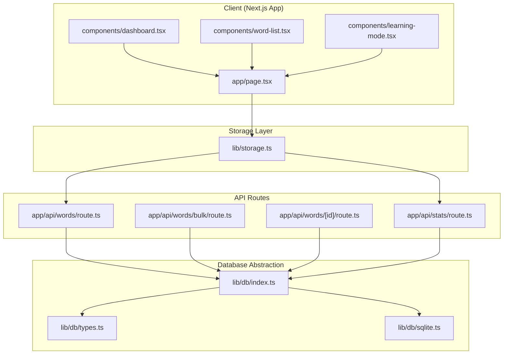

**Diagram sources**
- [app/page.tsx](file://app/page.tsx#L29-L128)
- [lib/storage.ts](file://lib/storage.ts#L5-L84)
- [app/api/words/route.ts](file://app/api/words/route.ts#L4-L14)
- [app/api/words/bulk/route.ts](file://app/api/words/bulk/route.ts#L4-L18)
- [app/api/words/[id]/route.ts](file://app/api/words/[id]/route.ts#L4-L54)
- [app/api/stats/route.ts](file://app/api/stats/route.ts#L4-L25)
- [lib/db/index.ts](file://lib/db/index.ts#L1-L21)
- [lib/db/types.ts](file://lib/db/types.ts#L1-L35)
- [lib/db/sqlite.ts](file://lib/db/sqlite.ts#L28-L279)

**Section sources**
- [app/page.tsx](file://app/page.tsx#L1-L316)
- [lib/storage.ts](file://lib/storage.ts#L1-L137)
- [lib/db/index.ts](file://lib/db/index.ts#L1-L21)
- [lib/db/types.ts](file://lib/db/types.ts#L1-L35)
- [lib/db/sqlite.ts](file://lib/db/sqlite.ts#L1-L297)
- [app/api/words/route.ts](file://app/api/words/route.ts#L1-L28)
- [app/api/words/bulk/route.ts](file://app/api/words/bulk/route.ts#L1-L19)
- [app/api/words/[id]/route.ts](file://app/api/words/[id]/route.ts#L1-L55)
- [app/api/stats/route.ts](file://app/api/stats/route.ts#L1-L26)

## Core Components
- Centralized storage module: Provides async functions for fetching and mutating words and stats, delegating to API routes.
- Database abstraction: Defines a repository interface and a concrete SQLite implementation with initialization, seeding, and indexing.
- API routes: Expose REST endpoints that call into the database repository.
- UI state management: Uses React hooks to manage view state, lists, and transient learning session state.

Key responsibilities:
- Data loading: Parallel fetch of words and stats on app mount
- Mutations: Add, update, delete words; update stats
- Learning session: Local state machine for reviewing words and deferring DB updates until session completion
- Stats computation: Client-side aggregation for dashboard and learning UI

**Section sources**
- [lib/storage.ts](file://lib/storage.ts#L5-L84)
- [lib/db/types.ts](file://lib/db/types.ts#L12-L34)
- [lib/db/sqlite.ts](file://lib/db/sqlite.ts#L35-L81)
- [app/api/words/route.ts](file://app/api/words/route.ts#L4-L14)
- [app/api/stats/route.ts](file://app/api/stats/route.ts#L4-L25)
- [app/page.tsx](file://app/page.tsx#L40-L53)

## Architecture Overview
The system enforces a unidirectional data flow:
- UI triggers actions via handlers
- Handlers call storage functions (async)
- Storage functions issue HTTP requests to API routes
- API routes resolve the database singleton and delegate to repository methods
- Repository executes SQL statements and returns typed data
- Responses update React state, which re-renders the UI

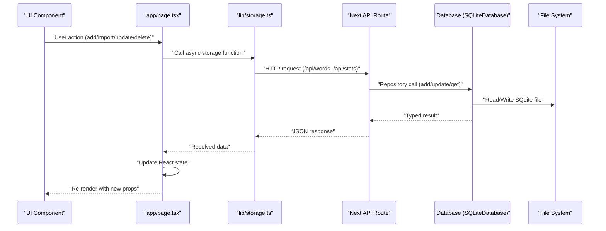

**Diagram sources**
- [app/page.tsx](file://app/page.tsx#L55-L109)
- [lib/storage.ts](file://lib/storage.ts#L19-L73)
- [app/api/words/route.ts](file://app/api/words/route.ts#L4-L27)
- [app/api/stats/route.ts](file://app/api/stats/route.ts#L4-L25)
- [lib/db/sqlite.ts](file://lib/db/sqlite.ts#L140-L228)

## Detailed Component Analysis

### Centralized Storage Module Pattern
The storage module centralizes all data access behind async functions that:
- Fetch lists and stats via GET endpoints
- Add/update/delete words via POST/PUT/DELETE endpoints
- Update stats via PUT endpoint
- Load full app state in parallel using Promise.all
- Compute streak client-side and persist to DB via updateStatsInDb

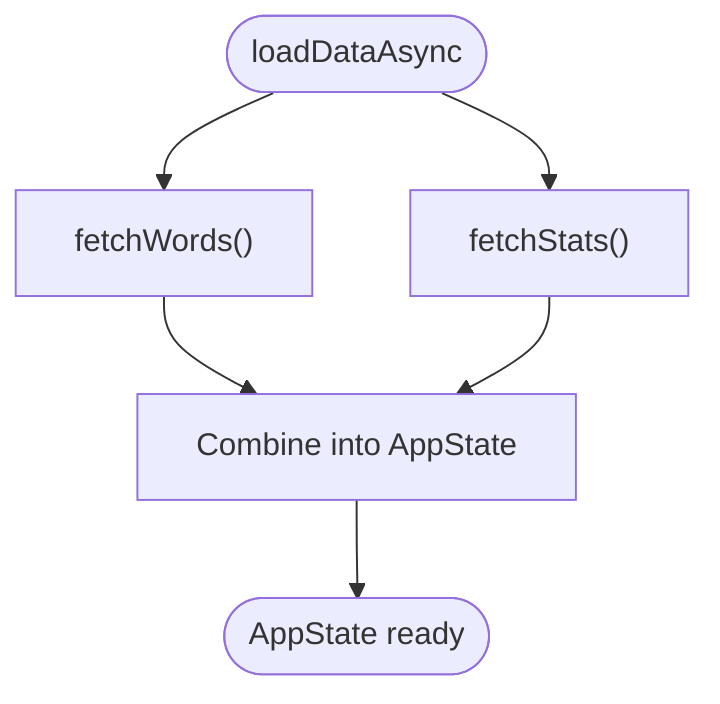

**Diagram sources**
- [lib/storage.ts](file://lib/storage.ts#L77-L84)
- [lib/storage.ts](file://lib/storage.ts#L5-L17)

**Section sources**
- [lib/storage.ts](file://lib/storage.ts#L5-L84)
- [lib/storage.ts](file://lib/storage.ts#L88-L115)

### API Communication Layer
API routes implement CRUD operations:
- Words: GET all, POST single, POST bulk, GET by id, PUT by id, DELETE by id
- Stats: GET, PUT

Error handling:
- Routes catch exceptions and return structured JSON with error messages and appropriate HTTP status codes

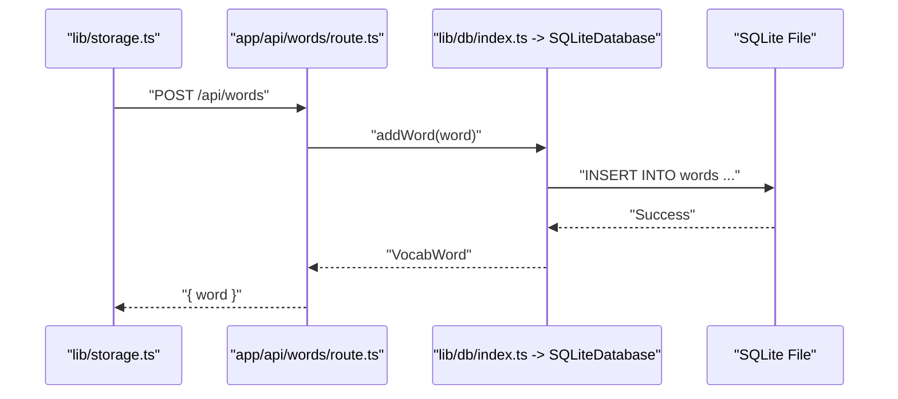

**Diagram sources**
- [app/api/words/route.ts](file://app/api/words/route.ts#L16-L27)
- [lib/db/sqlite.ts](file://lib/db/sqlite.ts#L140-L159)
- [lib/db/index.ts](file://lib/db/index.ts#L12-L18)

**Section sources**
- [app/api/words/route.ts](file://app/api/words/route.ts#L1-L28)
- [app/api/words/bulk/route.ts](file://app/api/words/bulk/route.ts#L1-L19)
- [app/api/words/[id]/route.ts](file://app/api/words/[id]/route.ts#L1-L55)
- [app/api/stats/route.ts](file://app/api/stats/route.ts#L1-L26)

### Database Abstraction Patterns
The repository pattern defines a clean contract for database operations:
- IDatabase interface declares methods for words and stats
- SQLiteDatabase implements the interface with:
  - Initialization: creates tables, indexes, seeds sample words, and synchronizes stats totals
  - CRUD operations for words and stats
  - Utility reset operation

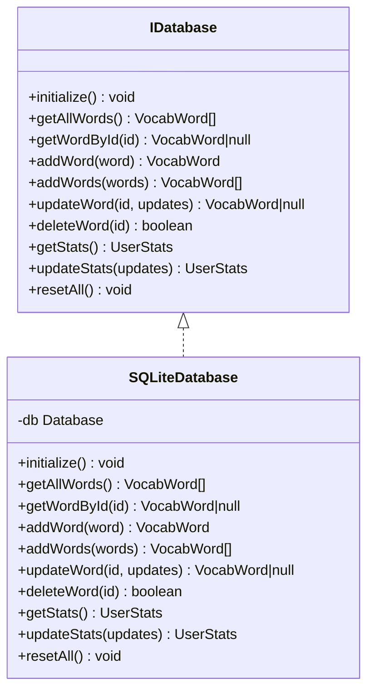

**Diagram sources**
- [lib/db/types.ts](file://lib/db/types.ts#L16-L34)
- [lib/db/sqlite.ts](file://lib/db/sqlite.ts#L28-L279)

**Section sources**
- [lib/db/types.ts](file://lib/db/types.ts#L1-L35)
- [lib/db/sqlite.ts](file://lib/db/sqlite.ts#L1-L297)
- [lib/db/index.ts](file://lib/db/index.ts#L1-L21)

### State Management Strategies Using React Hooks
- App-level state: Managed in the root page component using useState for words, streaks, session result, and view navigation
- Effects: loadDataAsync is invoked once on mount to hydrate state
- Mutations: Handlers call storage functions and update state optimistically; errors are logged
- Learning mode: Maintains a transient session state with a snapshot of words at session start and a pending updates map to defer DB writes until session completion

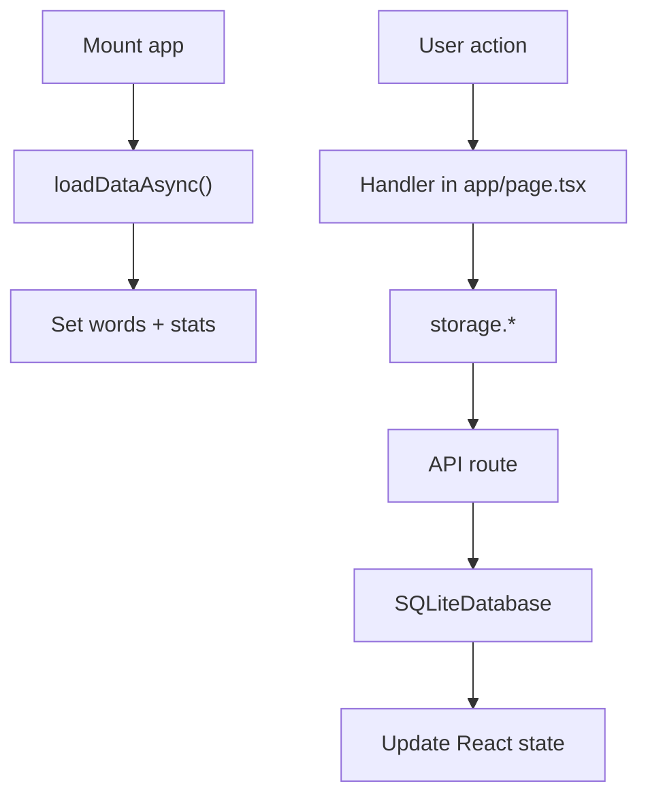

**Diagram sources**
- [app/page.tsx](file://app/page.tsx#L40-L53)
- [app/page.tsx](file://app/page.tsx#L55-L109)
- [components/learning-mode.tsx](file://components/learning-mode.tsx#L35-L156)

**Section sources**
- [app/page.tsx](file://app/page.tsx#L29-L128)
- [components/learning-mode.tsx](file://components/learning-mode.tsx#L35-L156)

### Data Synchronization Patterns
- Client-side computation: Streak calculation and stats aggregation occur in memory
- Persistence: After learning, stats are fetched, updated locally, persisted to DB, and UI state is refreshed
- Deferred writes: Learning session defers per-word updates until moving to the next item or completing the session

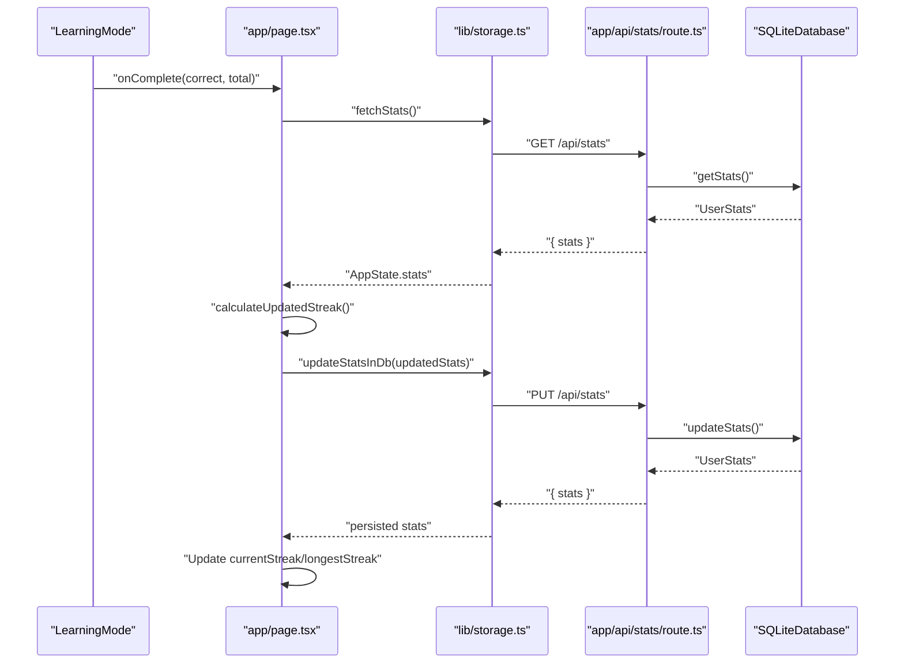

**Diagram sources**
- [app/page.tsx](file://app/page.tsx#L97-L109)
- [lib/storage.ts](file://lib/storage.ts#L12-L17)
- [lib/storage.ts](file://lib/storage.ts#L64-L73)
- [app/api/stats/route.ts](file://app/api/stats/route.ts#L15-L25)
- [lib/db/sqlite.ts](file://lib/db/sqlite.ts#L246-L267)

**Section sources**
- [app/page.tsx](file://app/page.tsx#L97-L109)
- [lib/storage.ts](file://lib/storage.ts#L88-L115)
- [app/api/stats/route.ts](file://app/api/stats/route.ts#L1-L26)

### Error Handling Throughout the Pipeline
- API routes: Catch exceptions and return JSON with error message and HTTP status
- Storage functions: Throw on non-OK responses; callers log and continue
- UI: Displays loading state while initializing; logs errors during mutations

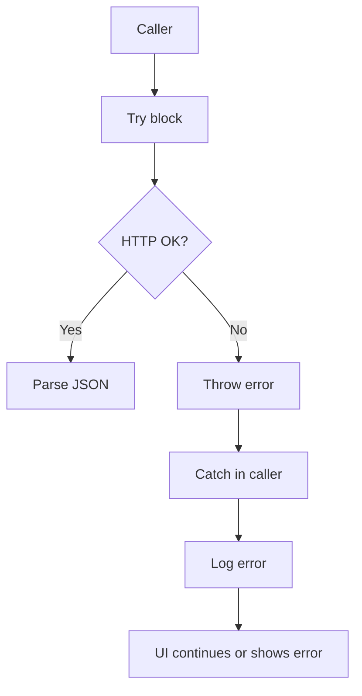

**Diagram sources**
- [lib/storage.ts](file://lib/storage.ts#L5-L17)
- [app/api/words/route.ts](file://app/api/words/route.ts#L10-L13)
- [app/api/stats/route.ts](file://app/api/stats/route.ts#L10-L12)

**Section sources**
- [lib/storage.ts](file://lib/storage.ts#L5-L17)
- [app/api/words/route.ts](file://app/api/words/route.ts#L10-L13)
- [app/api/stats/route.ts](file://app/api/stats/route.ts#L10-L12)

### Repository Pattern Implementation for Database Operations
- Initialization: Ensures tables and indexes exist; seeds sample words if empty; syncs stats totals
- CRUD: Straightforward mapping from typed requests to SQL statements
- Transactions: Bulk inserts wrapped in transactions for atomicity
- Indexes: Optimizes queries on review dates and word text

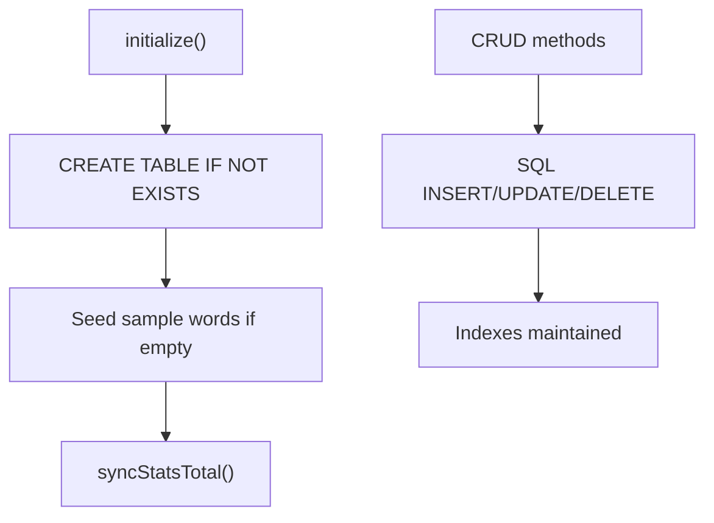

**Diagram sources**
- [lib/db/sqlite.ts](file://lib/db/sqlite.ts#L35-L81)
- [lib/db/sqlite.ts](file://lib/db/sqlite.ts#L161-L188)
- [lib/db/sqlite.ts](file://lib/db/sqlite.ts#L282-L296)

**Section sources**
- [lib/db/sqlite.ts](file://lib/db/sqlite.ts#L35-L81)
- [lib/db/sqlite.ts](file://lib/db/sqlite.ts#L161-L188)
- [lib/db/sqlite.ts](file://lib/db/sqlite.ts#L282-L296)

### Caching Strategies and Performance Optimizations
- Client-side caching: React state holds words and stats; UI components compute derived data (e.g., mastery percentage, due counts)
- Network caching: Not implemented at the storage layer; rely on browser caching and minimal requests
- Database optimizations:
  - WAL mode and foreign keys enabled
  - Indexes on next review date and word text
  - Transaction batching for bulk inserts
  - Stats synchronization after mutations

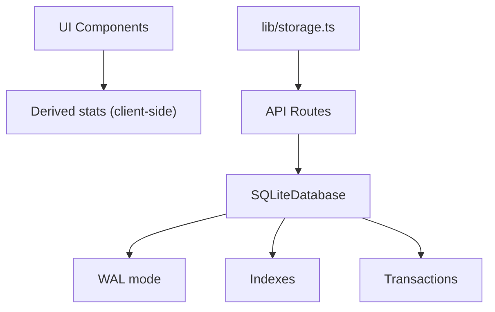

**Diagram sources**
- [lib/db/sqlite.ts](file://lib/db/sqlite.ts#L22-L24)
- [lib/db/sqlite.ts](file://lib/db/sqlite.ts#L61-L62)
- [lib/db/sqlite.ts](file://lib/db/sqlite.ts#L167-L183)

**Section sources**
- [lib/db/sqlite.ts](file://lib/db/sqlite.ts#L22-L24)
- [lib/db/sqlite.ts](file://lib/db/sqlite.ts#L61-L62)
- [lib/db/sqlite.ts](file://lib/db/sqlite.ts#L167-L183)

### Data Models and Types
- VocabWord: Core entity with spaced repetition fields
- AppState: Aggregates words, current session, and stats
- UserStats: Stats shape persisted in DB

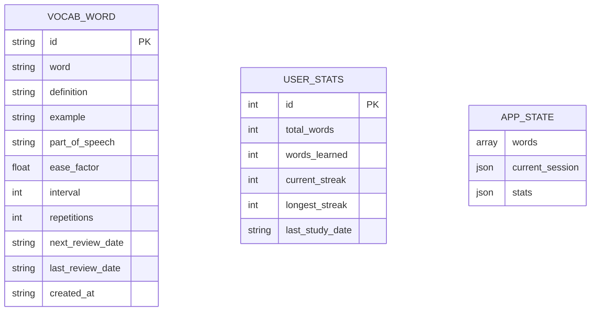

**Diagram sources**
- [lib/types.ts](file://lib/types.ts#L1-L52)

**Section sources**
- [lib/types.ts](file://lib/types.ts#L1-L52)

## Dependency Analysis
The dependency chain is intentionally layered:
- UI depends on storage functions
- Storage functions depend on API routes
- API routes depend on the database factory
- Database factory depends on the concrete SQLite implementation
- SQLite depends on the file system and better-sqlite3

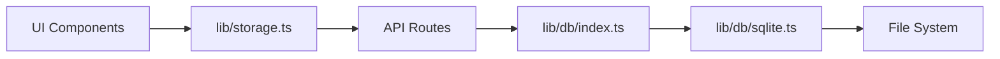

**Diagram sources**
- [app/page.tsx](file://app/page.tsx#L15-L24)
- [lib/storage.ts](file://lib/storage.ts#L5-L17)
- [app/api/words/route.ts](file://app/api/words/route.ts#L2)
- [lib/db/index.ts](file://lib/db/index.ts#L12-L18)
- [lib/db/sqlite.ts](file://lib/db/sqlite.ts#L1-L10)

**Section sources**
- [app/page.tsx](file://app/page.tsx#L15-L24)
- [lib/storage.ts](file://lib/storage.ts#L5-L17)
- [lib/db/index.ts](file://lib/db/index.ts#L1-L21)
- [lib/db/sqlite.ts](file://lib/db/sqlite.ts#L1-L10)

## Performance Considerations
- Prefer bulk operations for imports to reduce round trips
- Use indexes on frequently queried columns (review dates, word text)
- Keep UI computations lightweight; derive stats from in-memory data
- Avoid unnecessary re-renders by passing memoized props and using stable references where appropriate
- Consider adding optimistic updates with rollback on failure for smoother UX

## Troubleshooting Guide
Common issues and resolutions:
- Words not loading: Verify API routes are reachable and database initialized; check console for network errors
- Streak not updating: Ensure fetchStats and updateStatsInDb are called in sequence; confirm client-side calculation and DB write succeed
- Bulk import failures: Confirm payload is an array; inspect API route error responses
- SQLite file access errors: Ensure the data directory exists and is writable

**Section sources**
- [lib/storage.ts](file://lib/storage.ts#L5-L17)
- [app/api/words/bulk/route.ts](file://app/api/words/bulk/route.ts#L8-L10)
- [lib/db/sqlite.ts](file://lib/db/sqlite.ts#L14-L26)

## Conclusion
VocabMaster employs a clean, layered architecture:
- UI state is managed with React hooks and updated through centralized async storage functions
- API routes provide a stable contract to the database abstraction
- The repository pattern isolates database concerns and enables future backend swaps
- Client-side computations and deferred writes optimize user experience while maintaining correctness
- SQLite-backed persistence with indexes and transactions ensures reliability and performance