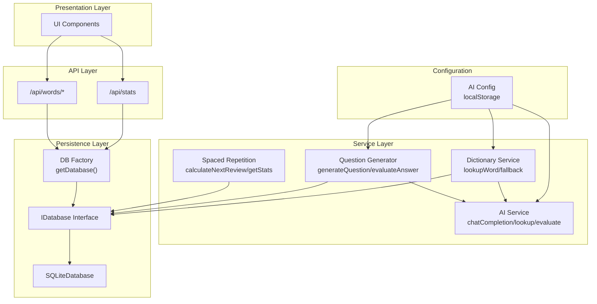
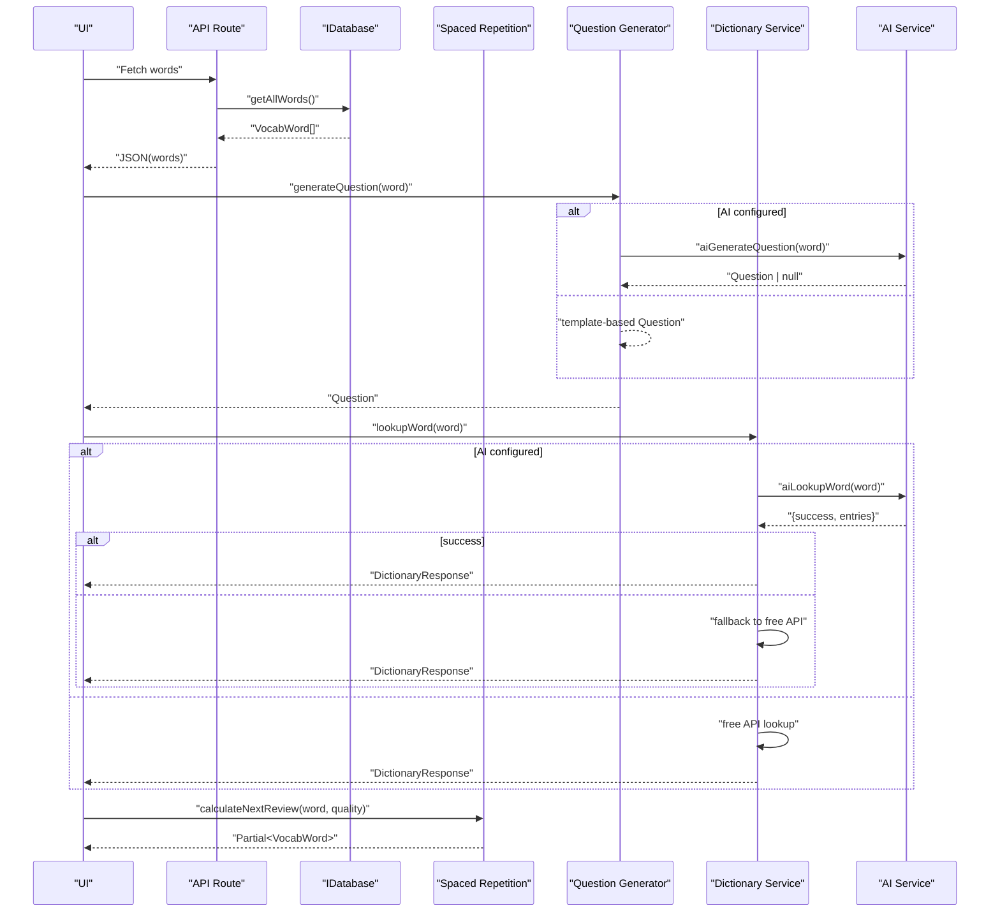
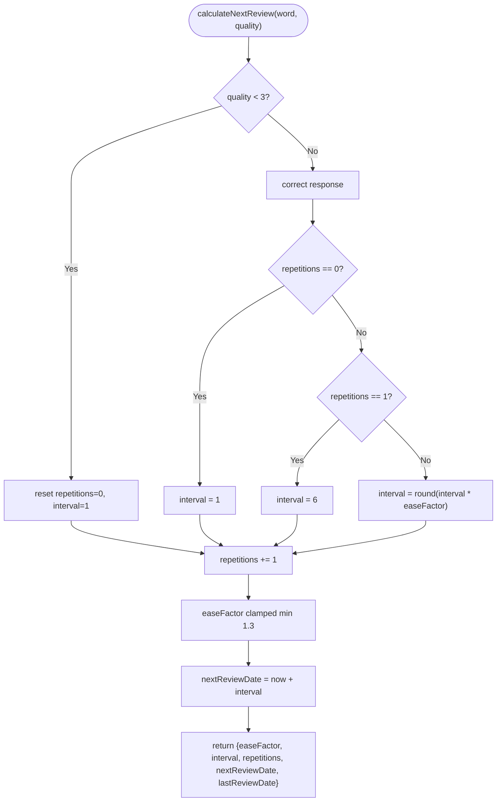
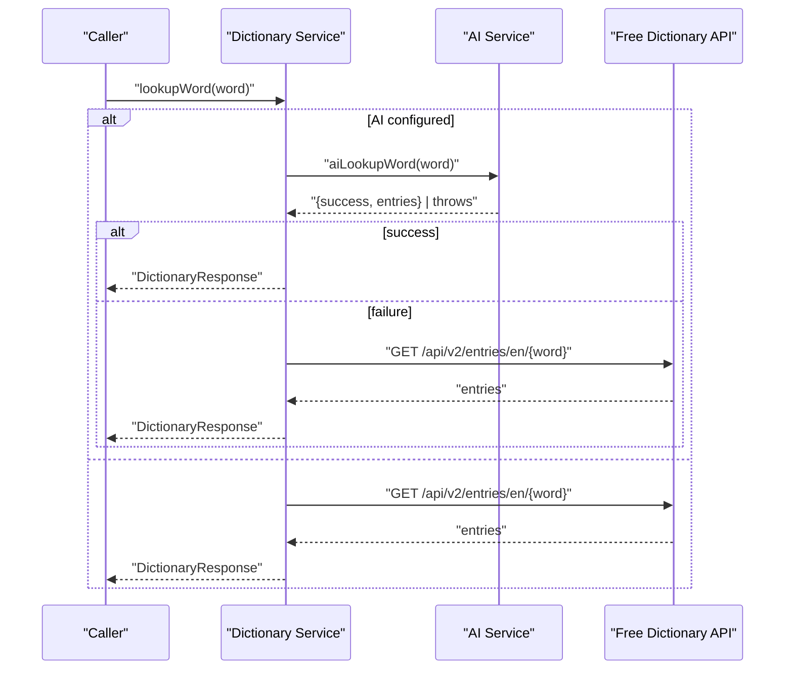
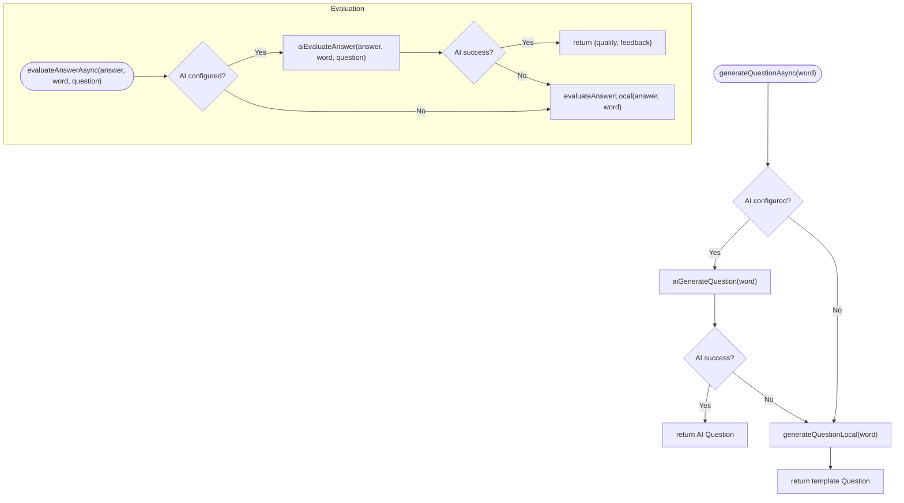
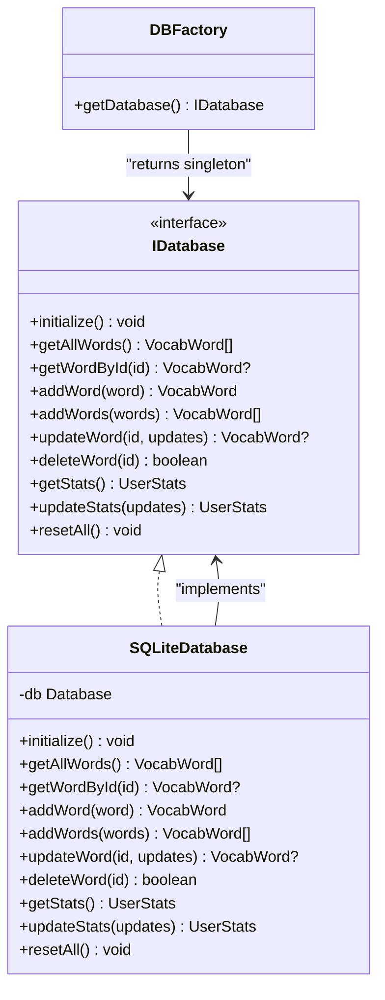
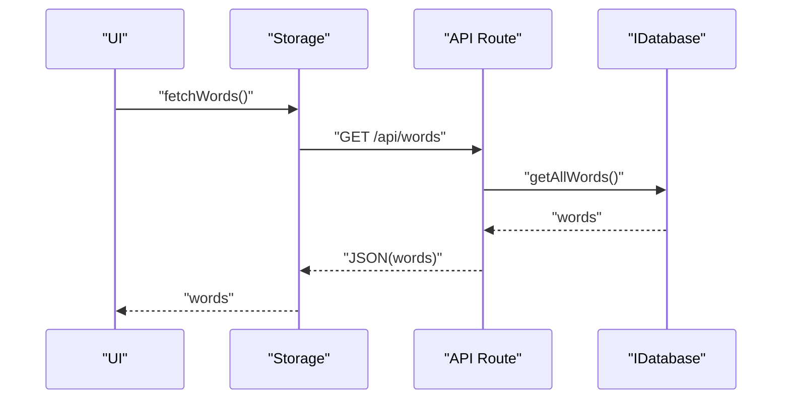
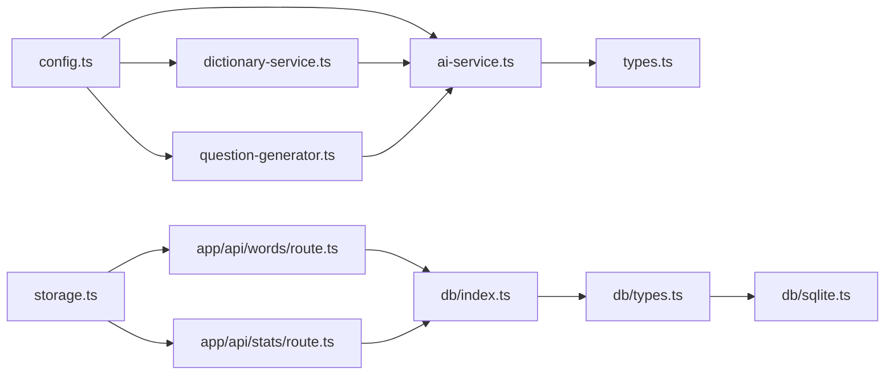

# Service Layer & Business Logic

<cite>
**Referenced Files in This Document**
- [spaced-repetition.ts](file://lib/spaced-repetition.ts)
- [ai-service.ts](file://lib/ai-service.ts)
- [dictionary-service.ts](file://lib/dictionary-service.ts)
- [question-generator.ts](file://lib/question-generator.ts)
- [types.ts](file://lib/types.ts)
- [config.ts](file://lib/config.ts)
- [db/index.ts](file://lib/db/index.ts)
- [db/types.ts](file://lib/db/types.ts)
- [db/sqlite.ts](file://lib/db/sqlite.ts)
- [storage.ts](file://lib/storage.ts)
- [words/route.ts](file://app/api/words/route.ts)
- [stats/route.ts](file://app/api/stats/route.ts)
</cite>

## Table of Contents
1. [Introduction](#introduction)
2. [Project Structure](#project-structure)
3. [Core Components](#core-components)
4. [Architecture Overview](#architecture-overview)
5. [Detailed Component Analysis](#detailed-component-analysis)
6. [Dependency Analysis](#dependency-analysis)
7. [Performance Considerations](#performance-considerations)
8. [Troubleshooting Guide](#troubleshooting-guide)
9. [Conclusion](#conclusion)
10. [Appendices](#appendices)

## Introduction
This document explains VocabMaster’s service layer and business logic architecture. It focuses on:
- Spaced repetition algorithm services
- AI question generation and evaluation services
- Dictionary integration with fallback mechanisms
- Factory patterns for service instantiation and lifecycle management
- Dependency injection strategies and service communication patterns
- Error handling and performance considerations
- Extensibility points for adding new services and integrating external APIs

## Project Structure
VocabMaster organizes business logic into cohesive service modules:
- Spaced repetition algorithms for scheduling and progress tracking
- AI service for OpenAI-compatible question generation, evaluation, and dictionary lookups
- Dictionary service orchestrating AI and free API fallbacks
- Question generator providing AI-driven or template-based questions and evaluations
- Database abstraction with a singleton factory and SQLite implementation
- Storage facade for API-based persistence
- API routes delegating to database services



**Diagram sources**
- [words/route.ts](file://app/api/words/route.ts#L1-L28)
- [stats/route.ts](file://app/api/stats/route.ts#L1-L26)
- [db/index.ts](file://lib/db/index.ts#L1-L21)
- [db/types.ts](file://lib/db/types.ts#L1-L35)
- [db/sqlite.ts](file://lib/db/sqlite.ts#L1-L297)
- [spaced-repetition.ts](file://lib/spaced-repetition.ts#L1-L123)
- [dictionary-service.ts](file://lib/dictionary-service.ts#L1-L255)
- [question-generator.ts](file://lib/question-generator.ts#L1-L255)
- [ai-service.ts](file://lib/ai-service.ts#L1-L239)
- [config.ts](file://lib/config.ts#L1-L63)

**Section sources**
- [words/route.ts](file://app/api/words/route.ts#L1-L28)
- [stats/route.ts](file://app/api/stats/route.ts#L1-L26)
- [db/index.ts](file://lib/db/index.ts#L1-L21)
- [db/types.ts](file://lib/db/types.ts#L1-L35)
- [db/sqlite.ts](file://lib/db/sqlite.ts#L1-L297)
- [spaced-repetition.ts](file://lib/spaced-repetition.ts#L1-L123)
- [dictionary-service.ts](file://lib/dictionary-service.ts#L1-L255)
- [question-generator.ts](file://lib/question-generator.ts#L1-L255)
- [ai-service.ts](file://lib/ai-service.ts#L1-L239)
- [config.ts](file://lib/config.ts#L1-L63)

## Core Components
- Spaced Repetition Service: Implements SM-2 scheduling, due word filtering, mastery calculation, and statistics aggregation.
- AI Service: Provides OpenAI-compatible chat completions for dictionary lookups, question generation, and answer evaluation.
- Dictionary Service: Orchestrates AI-powered lookups with a free dictionary API fallback.
- Question Generator: Generates AI-driven questions with graceful fallback to template-based generation and evaluation.
- Database Abstraction: Defines IDatabase interface and a singleton factory returning a concrete SQLite implementation.
- Storage Facade: Exposes async API-based CRUD operations for words and stats.
- Configuration: Manages AI endpoint configuration via localStorage with defaults and overrides.

**Section sources**
- [spaced-repetition.ts](file://lib/spaced-repetition.ts#L1-L123)
- [ai-service.ts](file://lib/ai-service.ts#L1-L239)
- [dictionary-service.ts](file://lib/dictionary-service.ts#L1-L255)
- [question-generator.ts](file://lib/question-generator.ts#L1-L255)
- [db/types.ts](file://lib/db/types.ts#L1-L35)
- [db/index.ts](file://lib/db/index.ts#L1-L21)
- [storage.ts](file://lib/storage.ts#L1-L137)
- [config.ts](file://lib/config.ts#L1-L63)

## Architecture Overview
The service layer follows a layered architecture:
- Presentation layer interacts with Next.js API routes.
- API routes delegate to database services via a factory.
- Business logic services (spaced repetition, dictionary, question generation, AI) operate independently and are injected via configuration checks and module imports.
- Persistence is abstracted behind IDatabase, enabling future backend swaps.



**Diagram sources**
- [words/route.ts](file://app/api/words/route.ts#L1-L28)
- [db/types.ts](file://lib/db/types.ts#L1-L35)
- [spaced-repetition.ts](file://lib/spaced-repetition.ts#L1-L123)
- [question-generator.ts](file://lib/question-generator.ts#L1-L255)
- [dictionary-service.ts](file://lib/dictionary-service.ts#L1-L255)
- [ai-service.ts](file://lib/ai-service.ts#L1-L239)

## Detailed Component Analysis

### Spaced Repetition Service
Implements the SM-2 algorithm for scheduling vocabulary reviews:
- Calculates next review date based on quality ratings (0–5), updating ease factor, interval, and repetition counts.
- Filters due words and sorts by overdue date and difficulty.
- Computes mastery percentage and aggregates learning statistics.



**Diagram sources**
- [spaced-repetition.ts](file://lib/spaced-repetition.ts#L9-L48)

**Section sources**
- [spaced-repetition.ts](file://lib/spaced-repetition.ts#L1-L123)

### AI Service Interface Design
Provides OpenAI-compatible chat completions and specialized vocabulary features:
- chatCompletion: Core HTTP client with configurable endpoint, model, tokens, and temperature.
- aiLookupWord: Structured JSON extraction for dictionary entries.
- aiGenerateQuestion: Creative, grammar-structured question generation.
- aiEvaluateAnswer: Quality scoring with grammar-aware feedback.
- aiBulkLookup: Batch dictionary lookups.
- testConnection: Health check for AI endpoint.

```mermaid
classDiagram
class AIService {
+testConnection() Promise~{success,error}~
+aiLookupWord(word) Promise~LookupResult~
+aiGenerateQuestion(word) Promise~Question|null~
+aiEvaluateAnswer(answer, word, question) Promise~{quality,feedback}|null~
+aiBulkLookup(words) Promise~Entry[]~
-chatCompletion(messages, options) Promise~string~
}
class Config {
+getAIConfig() AIConfig
+isAIConfigured() boolean
}
AIService --> Config : "reads configuration"
```

**Diagram sources**
- [ai-service.ts](file://lib/ai-service.ts#L1-L239)
- [config.ts](file://lib/config.ts#L1-L63)

**Section sources**
- [ai-service.ts](file://lib/ai-service.ts#L1-L239)
- [config.ts](file://lib/config.ts#L1-L63)

### Dictionary Service with Fallback
Routes lookups to AI when configured; otherwise uses a free dictionary API. On AI failure, automatically falls back to free API.



**Diagram sources**
- [dictionary-service.ts](file://lib/dictionary-service.ts#L20-L90)
- [ai-service.ts](file://lib/ai-service.ts#L66-L111)

**Section sources**
- [dictionary-service.ts](file://lib/dictionary-service.ts#L1-L255)

### Question Generator Service
Generates AI-driven questions with graceful fallback to template-based generation and evaluation. Uses grammar templates and context topics to produce varied prompts.



**Diagram sources**
- [question-generator.ts](file://lib/question-generator.ts#L100-L188)

**Section sources**
- [question-generator.ts](file://lib/question-generator.ts#L1-L255)

### Database Abstraction and Factory Pattern
IDatabase defines the contract for persistence. The factory ensures a singleton instance of SQLiteDatabase, initializing tables, seeding sample data, and maintaining stats synchronization.



**Diagram sources**
- [db/types.ts](file://lib/db/types.ts#L16-L34)
- [db/sqlite.ts](file://lib/db/sqlite.ts#L28-L279)
- [db/index.ts](file://lib/db/index.ts#L12-L18)

**Section sources**
- [db/types.ts](file://lib/db/types.ts#L1-L35)
- [db/sqlite.ts](file://lib/db/sqlite.ts#L1-L297)
- [db/index.ts](file://lib/db/index.ts#L1-L21)

### Storage Facade and API Routes
Storage exposes async functions that call Next.js API endpoints. API routes instantiate the database factory and delegate to IDatabase methods.



**Diagram sources**
- [storage.ts](file://lib/storage.ts#L5-L17)
- [words/route.ts](file://app/api/words/route.ts#L4-L14)
- [db/index.ts](file://lib/db/index.ts#L12-L18)

**Section sources**
- [storage.ts](file://lib/storage.ts#L1-L137)
- [words/route.ts](file://app/api/words/route.ts#L1-L28)
- [stats/route.ts](file://app/api/stats/route.ts#L1-L26)

## Dependency Analysis
- AI Service depends on configuration for endpoint settings and performs HTTP requests.
- Dictionary Service depends on AI Service when configured; otherwise uses free API.
- Question Generator depends on AI Service when configured; otherwise uses local templates.
- Database services depend on IDatabase interface; factory enforces singleton behavior.
- API routes depend on the database factory and return structured JSON responses.
- Storage facade depends on API routes for persistence.



**Diagram sources**
- [config.ts](file://lib/config.ts#L1-L63)
- [ai-service.ts](file://lib/ai-service.ts#L1-L239)
- [dictionary-service.ts](file://lib/dictionary-service.ts#L1-L255)
- [question-generator.ts](file://lib/question-generator.ts#L1-L255)
- [db/index.ts](file://lib/db/index.ts#L1-L21)
- [db/types.ts](file://lib/db/types.ts#L1-L35)
- [db/sqlite.ts](file://lib/db/sqlite.ts#L1-L297)
- [storage.ts](file://lib/storage.ts#L1-L137)
- [words/route.ts](file://app/api/words/route.ts#L1-L28)
- [stats/route.ts](file://app/api/stats/route.ts#L1-L26)

**Section sources**
- [config.ts](file://lib/config.ts#L1-L63)
- [ai-service.ts](file://lib/ai-service.ts#L1-L239)
- [dictionary-service.ts](file://lib/dictionary-service.ts#L1-L255)
- [question-generator.ts](file://lib/question-generator.ts#L1-L255)
- [db/index.ts](file://lib/db/index.ts#L1-L21)
- [db/types.ts](file://lib/db/types.ts#L1-L35)
- [db/sqlite.ts](file://lib/db/sqlite.ts#L1-L297)
- [storage.ts](file://lib/storage.ts#L1-L137)
- [words/route.ts](file://app/api/words/route.ts#L1-L28)
- [stats/route.ts](file://app/api/stats/route.ts#L1-L26)

## Performance Considerations
- Spaced repetition calculations are O(n log n) due to sorting due words; consider indexing nextReviewDate in the database for efficient retrieval.
- AI calls are asynchronous and may fail; implement retry/backoff and caching for dictionary entries to reduce latency.
- Bulk operations (bulk lookup, bulk add) should leverage batch inserts and transactions to minimize round-trips.
- Template-based question generation avoids network calls and scales linearly with the number of templates.
- Database initialization and seeding occur once; ensure indexes are created to optimize frequent queries.

[No sources needed since this section provides general guidance]

## Troubleshooting Guide
- AI configuration issues:
  - Verify API key presence via configuration checks.
  - Use health check to confirm endpoint availability.
  - Monitor error responses from chat completion and surface actionable messages.
- Dictionary lookup failures:
  - Confirm fallback to free API is triggered on AI errors.
  - Validate network connectivity and free API response codes.
- Question generation and evaluation:
  - Ensure grammar templates and context topics are available when AI is disabled.
  - Validate JSON parsing and cleaning steps for AI-generated content.
- Database operations:
  - Check table creation and indices; ensure WAL mode and foreign keys are enabled.
  - Verify transaction boundaries for bulk inserts and stats synchronization.
- API route errors:
  - Inspect error logging and return structured JSON with status codes.

**Section sources**
- [config.ts](file://lib/config.ts#L52-L56)
- [ai-service.ts](file://lib/ai-service.ts#L52-L63)
- [dictionary-service.ts](file://lib/dictionary-service.ts#L44-L49)
- [question-generator.ts](file://lib/question-generator.ts#L102-L111)
- [db/sqlite.ts](file://lib/db/sqlite.ts#L35-L81)

## Conclusion
VocabMaster’s service layer cleanly separates concerns:
- Spaced repetition encapsulates scheduling and progress analytics.
- AI service provides extensible, OpenAI-compatible capabilities with robust fallbacks.
- Dictionary and question generators offer flexible, configurable experiences.
- Database abstraction and factory patterns enable easy backend swaps and lifecycle management.
- API routes and storage facade provide clean integration points for persistence and presentation.

[No sources needed since this section summarizes without analyzing specific files]

## Appendices

### Extensibility Points
- Adding a new database backend:
  - Implement IDatabase and replace the singleton instance in the factory.
  - Ensure table schemas and indexes align with IDatabase contract.
- Integrating external APIs:
  - Extend AI service with new endpoints while preserving JSON contracts.
  - Add new fallback providers in dictionary service with consistent response shapes.
- New question types:
  - Expand question templates and grammar structures in the question generator.
  - Introduce new evaluation heuristics or integrate external grading services.

**Section sources**
- [db/types.ts](file://lib/db/types.ts#L16-L34)
- [db/index.ts](file://lib/db/index.ts#L12-L18)
- [ai-service.ts](file://lib/ai-service.ts#L1-L239)
- [dictionary-service.ts](file://lib/dictionary-service.ts#L1-L255)
- [question-generator.ts](file://lib/question-generator.ts#L1-L255)