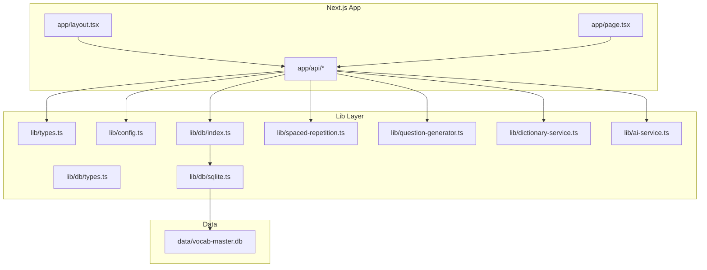
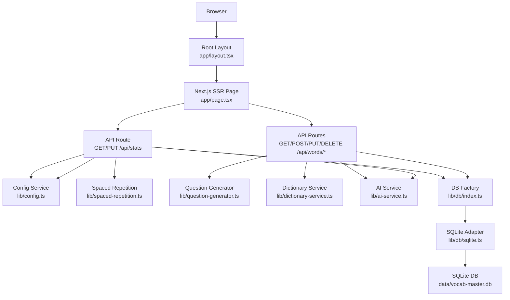
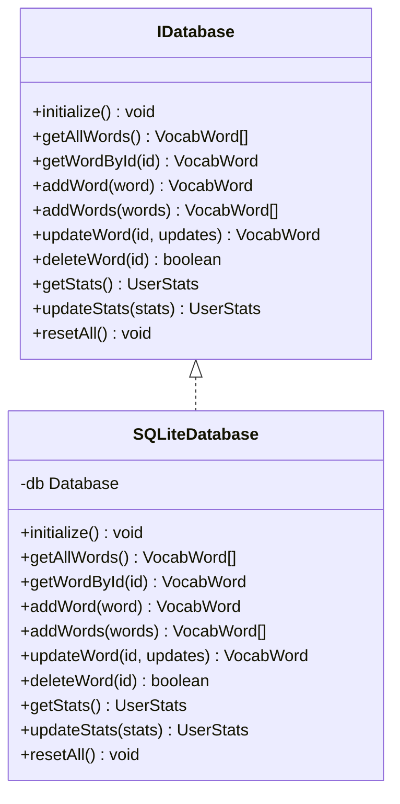
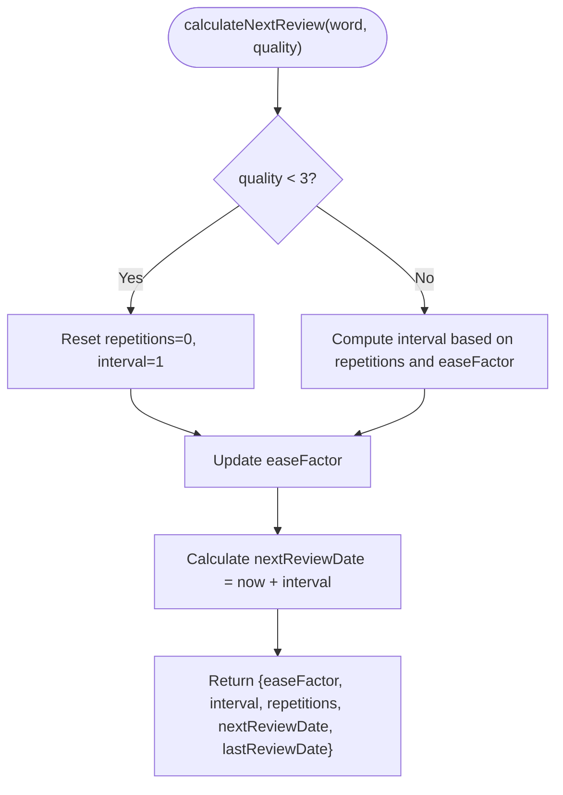
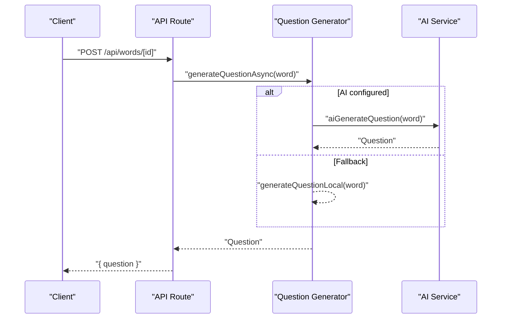
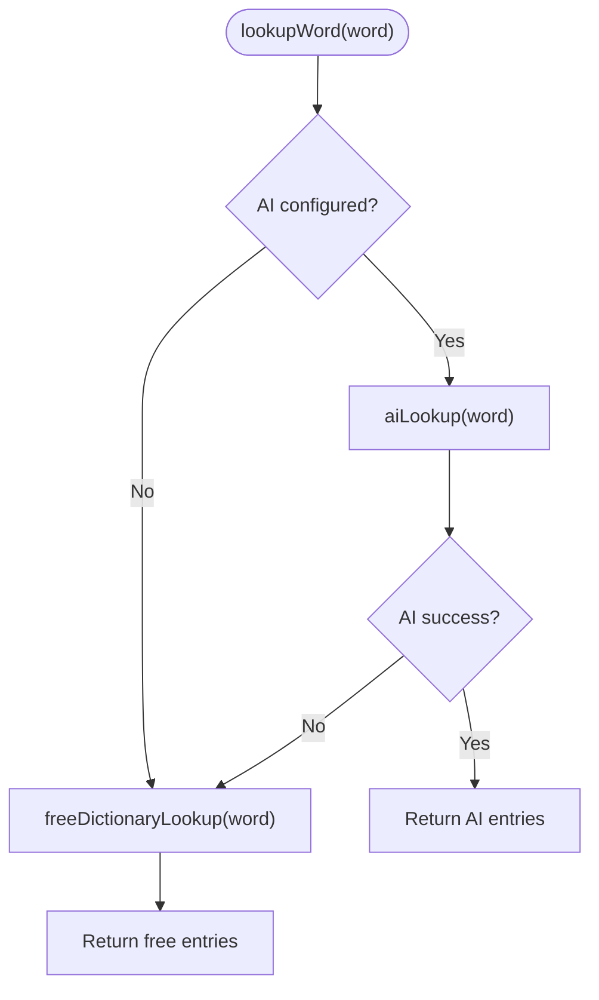
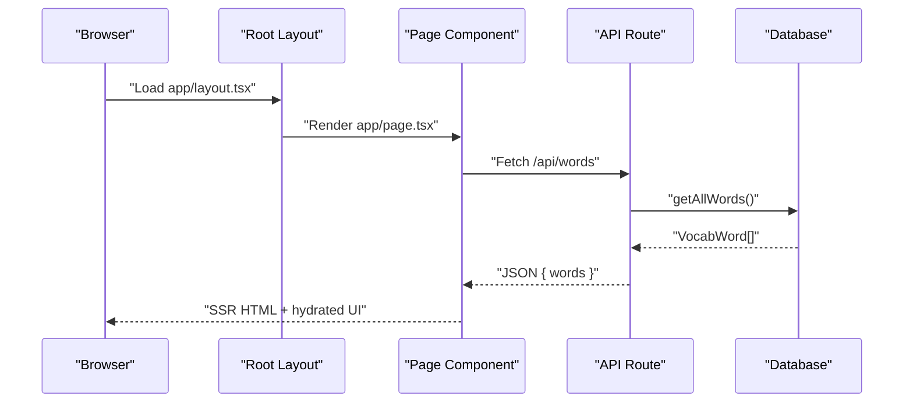
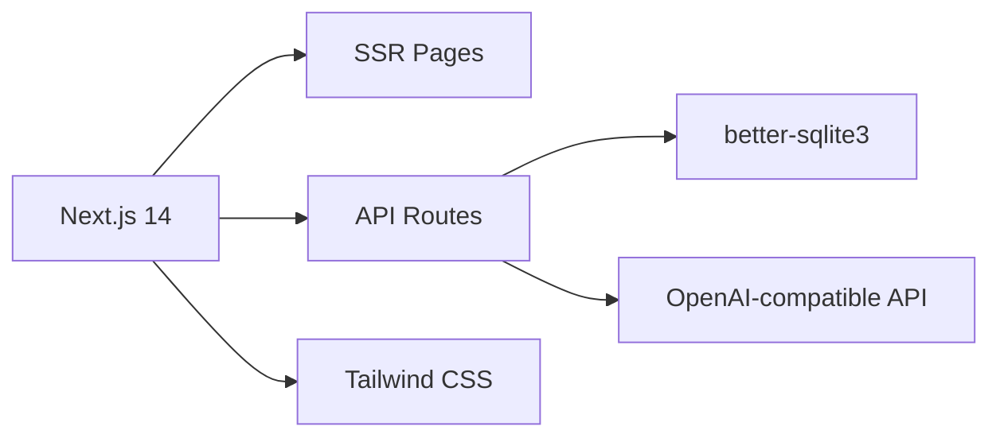

# System Overview

<cite>
**Referenced Files in This Document**
- [package.json](file://package.json)
- [next.config.mjs](file://next.config.mjs)
- [app/layout.tsx](file://app/layout.tsx)
- [lib/types.ts](file://lib/types.ts)
- [lib/config.ts](file://lib/config.ts)
- [lib/db/types.ts](file://lib/db/types.ts)
- [lib/db/index.ts](file://lib/db/index.ts)
- [lib/db/sqlite.ts](file://lib/db/sqlite.ts)
- [lib/spaced-repetition.ts](file://lib/spaced-repetition.ts)
- [lib/question-generator.ts](file://lib/question-generator.ts)
- [lib/dictionary-service.ts](file://lib/dictionary-service.ts)
- [lib/ai-service.ts](file://lib/ai-service.ts)
- [app/api/stats/route.ts](file://app/api/stats/route.ts)
- [app/api/words/route.ts](file://app/api/words/route.ts)
- [app/api/words/[id]/route.ts](file://app/api/words/[id]/route.ts)
</cite>

## Table of Contents
1. [Introduction](#introduction)
2. [Project Structure](#project-structure)
3. [Core Components](#core-components)
4. [Architecture Overview](#architecture-overview)
5. [Detailed Component Analysis](#detailed-component-analysis)
6. [Dependency Analysis](#dependency-analysis)
7. [Performance Considerations](#performance-considerations)
8. [Troubleshooting Guide](#troubleshooting-guide)
9. [Conclusion](#conclusion)

## Introduction
This document presents a comprehensive system overview of VocabMaster’s architecture. It explains the design philosophy, technology stack rationale, and high-level component relationships. The system is built on Next.js 14 with a full-stack approach combining server-side rendering (SSR) and API routes. The architecture follows a layered approach that separates presentation, business logic, and data access. External dependencies and integration points are documented, along with system boundaries and how the system maintains separation of concerns across functional domains.

## Project Structure
VocabMaster organizes code into clear functional areas:
- app/: Next.js app directory containing pages, layouts, and API routes
- components/: UI primitives and domain-specific components
- lib/: Business logic, services, and data access abstractions
- data/: Local SQLite database files
- Tailwind CSS and PostCSS configuration for styling

**Diagram sources**
- [app/layout.tsx](file://app/layout.tsx#L1-L24)
- [lib/db/index.ts](file://lib/db/index.ts#L1-L21)
- [lib/db/types.ts](file://lib/db/types.ts#L1-L35)
- [lib/db/sqlite.ts](file://lib/db/sqlite.ts#L1-L297)
- [lib/spaced-repetition.ts](file://lib/spaced-repetition.ts#L1-L123)
- [lib/question-generator.ts](file://lib/question-generator.ts#L1-L255)
- [lib/dictionary-service.ts](file://lib/dictionary-service.ts#L1-L255)
- [lib/ai-service.ts](file://lib/ai-service.ts#L1-L239)
- [lib/config.ts](file://lib/config.ts#L1-L63)

**Section sources**
- [package.json](file://package.json#L1-L33)
- [next.config.mjs](file://next.config.mjs#L1-L15)
- [app/layout.tsx](file://app/layout.tsx#L1-L24)

## Core Components
- Presentation layer: Next.js app router pages and components render UI and manage client state.
- Business logic layer: Services encapsulate domain logic such as spaced repetition scheduling, question generation, dictionary lookups, and AI integration.
- Data access layer: A database abstraction enables pluggable persistence. The current implementation uses SQLite with better-sqlite3.

Key responsibilities:
- Types and constants define shared domain models and defaults.
- Configuration manages AI endpoint settings and persistence.
- API routes orchestrate requests, delegate to services, and return structured JSON responses.
- Database factory and adapter provide a clean boundary between app logic and persistence.

**Section sources**
- [lib/types.ts](file://lib/types.ts#L1-L105)
- [lib/config.ts](file://lib/config.ts#L1-L63)
- [lib/db/types.ts](file://lib/db/types.ts#L1-L35)
- [lib/db/index.ts](file://lib/db/index.ts#L1-L21)

## Architecture Overview
VocabMaster employs a layered architecture:
- Presentation: Next.js app router pages and components
- Application/API: Next.js API routes under app/api/*
- Domain services: Spaced repetition, question generation, dictionary lookup, AI service
- Data access: Database abstraction with SQLite implementation
- External integrations: AI-compatible API for dictionary and question generation, Free Dictionary API as fallback

**Diagram sources**
- [app/layout.tsx](file://app/layout.tsx#L1-L24)
- [app/api/stats/route.ts](file://app/api/stats/route.ts#L1-L26)
- [app/api/words/route.ts](file://app/api/words/route.ts#L1-L28)
- [app/api/words/[id]/route.ts](file://app/api/words/[id]/route.ts#L1-L55)
- [lib/config.ts](file://lib/config.ts#L1-L63)
- [lib/spaced-repetition.ts](file://lib/spaced-repetition.ts#L1-L123)
- [lib/question-generator.ts](file://lib/question-generator.ts#L1-L255)
- [lib/dictionary-service.ts](file://lib/dictionary-service.ts#L1-L255)
- [lib/ai-service.ts](file://lib/ai-service.ts#L1-L239)
- [lib/db/index.ts](file://lib/db/index.ts#L1-L21)
- [lib/db/sqlite.ts](file://lib/db/sqlite.ts#L1-L297)

## Detailed Component Analysis

### Data Access Layer
The data access layer is abstracted behind an interface to enable future database backends. The current implementation uses SQLite with better-sqlite3, initialized on first use and seeded with sample words if empty. Indexes optimize queries for review scheduling.

**Diagram sources**
- [lib/db/types.ts](file://lib/db/types.ts#L16-L34)
- [lib/db/sqlite.ts](file://lib/db/sqlite.ts#L28-L279)

**Section sources**
- [lib/db/types.ts](file://lib/db/types.ts#L1-L35)
- [lib/db/index.ts](file://lib/db/index.ts#L1-L21)
- [lib/db/sqlite.ts](file://lib/db/sqlite.ts#L1-L297)

### Spaced Repetition Service
The spaced repetition service implements the SM-2 algorithm to schedule reviews, compute mastery, and prioritize words due for review. It integrates with the database to persist updated scheduling fields.

**Diagram sources**
- [lib/spaced-repetition.ts](file://lib/spaced-repetition.ts#L8-L48)

**Section sources**
- [lib/spaced-repetition.ts](file://lib/spaced-repetition.ts#L1-L123)

### Question Generation and Evaluation
The question generator creates contextual questions that combine vocabulary understanding with specific grammar structures. It uses an AI-compatible API when configured, falling back to template-based generation otherwise. Answer evaluation uses AI when available, otherwise applies heuristic rules.

**Diagram sources**
- [lib/question-generator.ts](file://lib/question-generator.ts#L100-L116)
- [lib/ai-service.ts](file://lib/ai-service.ts#L113-L159)

**Section sources**
- [lib/question-generator.ts](file://lib/question-generator.ts#L1-L255)
- [lib/ai-service.ts](file://lib/ai-service.ts#L1-L239)

### Dictionary Lookup Service
The dictionary service provides a unified interface for word lookups. It attempts AI-powered lookups first, then falls back to a free dictionary API. It also supports parsing bulk import formats.

**Diagram sources**
- [lib/dictionary-service.ts](file://lib/dictionary-service.ts#L20-L49)

**Section sources**
- [lib/dictionary-service.ts](file://lib/dictionary-service.ts#L1-L255)

### API Routes and SSR Integration
API routes under app/api/* expose CRUD operations for words and statistics. They integrate with the database factory and services, returning JSON responses. The root layout sets global metadata and font, while pages leverage SSR to render initial content.

**Diagram sources**
- [app/layout.tsx](file://app/layout.tsx#L1-L24)
- [app/api/words/route.ts](file://app/api/words/route.ts#L1-L28)
- [lib/db/sqlite.ts](file://lib/db/sqlite.ts#L130-L133)

**Section sources**
- [app/layout.tsx](file://app/layout.tsx#L1-L24)
- [app/api/stats/route.ts](file://app/api/stats/route.ts#L1-L26)
- [app/api/words/route.ts](file://app/api/words/route.ts#L1-L28)
- [app/api/words/[id]/route.ts](file://app/api/words/[id]/route.ts#L1-L55)

## Dependency Analysis
Technology stack and external dependencies:
- Next.js 14 for full-stack SSR and API routes
- better-sqlite3 for embedded database access (server-side only)
- Tailwind CSS and related tooling for styling
- OpenAI-compatible AI endpoints for vocabulary features

**Diagram sources**
- [package.json](file://package.json#L11-L21)
- [next.config.mjs](file://next.config.mjs#L6-L11)

**Section sources**
- [package.json](file://package.json#L1-L33)
- [next.config.mjs](file://next.config.mjs#L1-L15)

## Performance Considerations
- Database initialization and seeding occur on first use; indexes improve query performance for review scheduling.
- API routes batch operations where applicable (e.g., adding multiple words).
- AI calls are asynchronous and include fallbacks to reduce latency and improve reliability.
- Next.js SSR reduces initial load time by sending pre-rendered HTML.

## Troubleshooting Guide
Common issues and diagnostics:
- AI configuration: Verify API key and base URL are set; use the configuration helpers to check and reset settings.
- API connectivity: Test connection to the AI endpoint using the provided helper.
- Database readiness: On first run, the database initializes tables and seeds sample words automatically.
- API route errors: Inspect returned error messages from API routes for detailed failures.

**Section sources**
- [lib/config.ts](file://lib/config.ts#L52-L62)
- [lib/ai-service.ts](file://lib/ai-service.ts#L52-L63)
- [lib/db/sqlite.ts](file://lib/db/sqlite.ts#L35-L81)
- [app/api/stats/route.ts](file://app/api/stats/route.ts#L10-L12)
- [app/api/words/route.ts](file://app/api/words/route.ts#L11-L13)

## Conclusion
VocabMaster’s architecture balances simplicity and extensibility. The Next.js 14 SSR and API routes provide a cohesive full-stack foundation. The layered design cleanly separates presentation, business logic, and data access, enabling straightforward enhancements such as switching the database backend or integrating additional AI capabilities. External dependencies are encapsulated behind services, maintaining system boundaries and separation of concerns across functional domains.