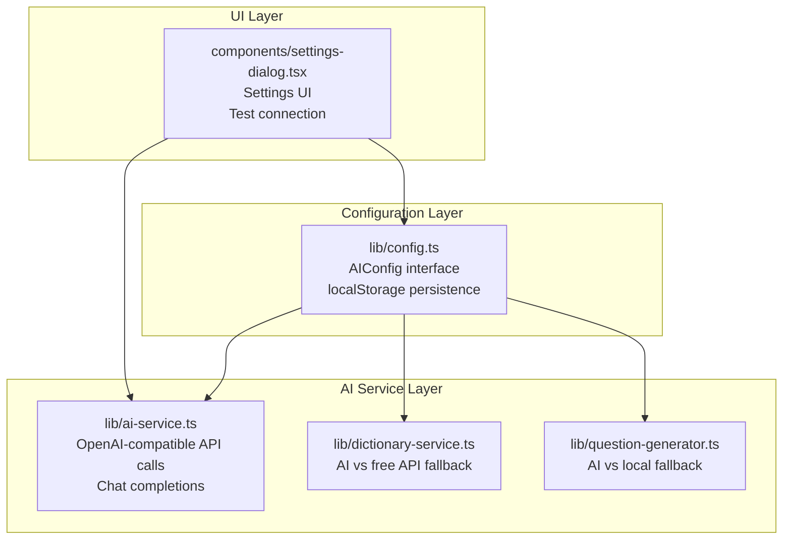
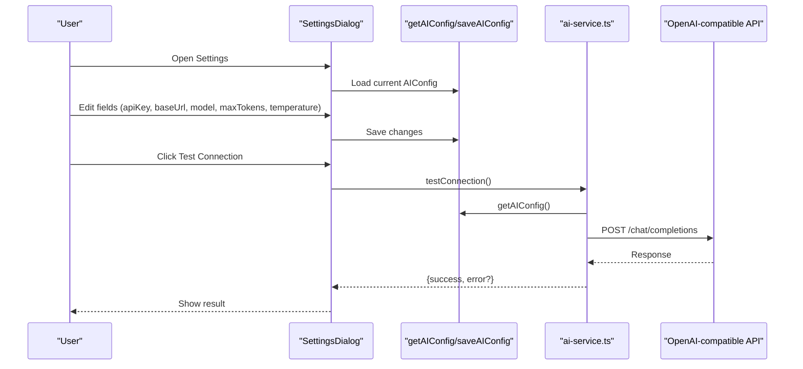
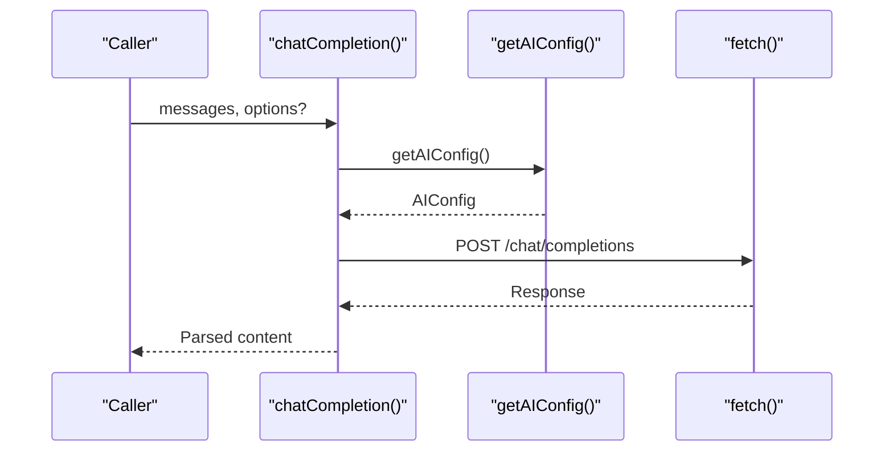
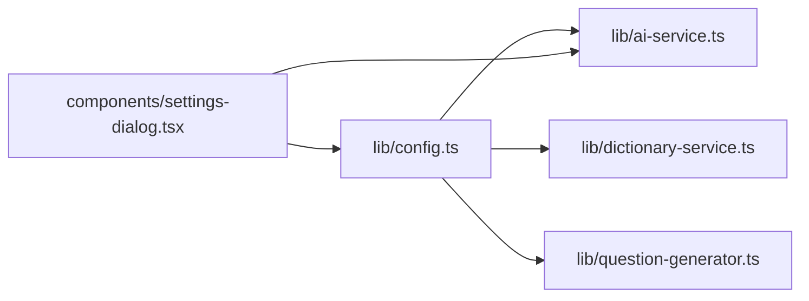

# AI Service Configuration

<cite>
**Referenced Files in This Document**
- [config.ts](file://lib/config.ts)
- [ai-service.ts](file://lib/ai-service.ts)
- [dictionary-service.ts](file://lib/dictionary-service.ts)
- [question-generator.ts](file://lib/question-generator.ts)
- [settings-dialog.tsx](file://components/settings-dialog.tsx)
- [types.ts](file://lib/types.ts)
</cite>

## Table of Contents
1. [Introduction](#introduction)
2. [Project Structure](#project-structure)
3. [Core Components](#core-components)
4. [Architecture Overview](#architecture-overview)
5. [Detailed Component Analysis](#detailed-component-analysis)
6. [Dependency Analysis](#dependency-analysis)
7. [Performance Considerations](#performance-considerations)
8. [Troubleshooting Guide](#troubleshooting-guide)
9. [Conclusion](#conclusion)

## Introduction
This document explains how VocabMaster configures and manages its AI service. It covers the AIConfig interface, default values, localStorage-based persistence, runtime configuration management, OpenAI-compatible API integration, custom endpoint support, security considerations for API keys, common configuration scenarios, troubleshooting guidance, and best practices for optimizing AI service performance.

## Project Structure
VocabMaster centralizes AI configuration in a small set of modules:
- Configuration management: lib/config.ts
- AI service integration: lib/ai-service.ts
- Fallback dictionary service: lib/dictionary-service.ts
- Question generation fallback: lib/question-generator.ts
- UI settings dialog: components/settings-dialog.tsx
- Shared types: lib/types.ts

**Diagram sources**
- [config.ts](file://lib/config.ts#L1-L63)
- [ai-service.ts](file://lib/ai-service.ts#L1-L239)
- [dictionary-service.ts](file://lib/dictionary-service.ts#L1-L255)
- [question-generator.ts](file://lib/question-generator.ts#L1-L197)
- [settings-dialog.tsx](file://components/settings-dialog.tsx#L1-L249)

**Section sources**
- [config.ts](file://lib/config.ts#L1-L63)
- [ai-service.ts](file://lib/ai-service.ts#L1-L239)
- [dictionary-service.ts](file://lib/dictionary-service.ts#L1-L255)
- [question-generator.ts](file://lib/question-generator.ts#L1-L197)
- [settings-dialog.tsx](file://components/settings-dialog.tsx#L1-L249)

## Core Components
- AIConfig interface defines the configuration shape used across the app.
- getAIConfig loads configuration from localStorage with sensible defaults.
- saveAIConfig persists user changes to localStorage.
- isAIConfigured determines whether AI features should be enabled.
- resetAIConfig clears stored configuration to defaults.
- testConnection validates endpoint accessibility and credentials.

Key behaviors:
- Default values are applied when localStorage lacks a stored configuration.
- Values stored in localStorage override defaults for the current session.
- Runtime configuration changes are immediately reflected in subsequent AI calls.

**Section sources**
- [config.ts](file://lib/config.ts#L4-L20)
- [config.ts](file://lib/config.ts#L23-L37)
- [config.ts](file://lib/config.ts#L40-L50)
- [config.ts](file://lib/config.ts#L53-L56)
- [config.ts](file://lib/config.ts#L59-L62)

## Architecture Overview
The AI configuration system integrates with the AI service and UI:

**Diagram sources**
- [settings-dialog.tsx](file://components/settings-dialog.tsx#L17-L57)
- [config.ts](file://lib/config.ts#L23-L50)
- [ai-service.ts](file://lib/ai-service.ts#L53-L63)
- [ai-service.ts](file://lib/ai-service.ts#L29-L50)

## Detailed Component Analysis

### AIConfig Interface and Defaults
- Fields: apiKey, baseUrl, model, maxTokens, temperature.
- Defaults are defined centrally and merged with stored values.
- isAIConfigured checks for a non-empty apiKey to enable AI features.

Behavior highlights:
- If running outside the browser (e.g., SSR), defaults are returned directly.
- Stored values are merged with defaults; missing fields fall back to defaults.
- resetAIConfig removes stored configuration to force defaults.

**Section sources**
- [config.ts](file://lib/config.ts#L4-L10)
- [config.ts](file://lib/config.ts#L14-L20)
- [config.ts](file://lib/config.ts#L23-L37)
- [config.ts](file://lib/config.ts#L53-L56)
- [config.ts](file://lib/config.ts#L59-L62)

### localStorage-Based Configuration Storage
- Storage key: a fixed string used to persist configuration.
- Loading: attempts to parse stored JSON; on error, logs and falls back to defaults.
- Saving: merges current config with new values and writes back to localStorage.
- Reset: removes the stored key to revert to defaults.

Operational notes:
- Errors during load/save are logged; UI remains functional with defaults.
- Changes take effect immediately for subsequent requests.

**Section sources**
- [config.ts](file://lib/config.ts#L12-L12)
- [config.ts](file://lib/config.ts#L26-L36)
- [config.ts](file://lib/config.ts#L43-L50)
- [config.ts](file://lib/config.ts#L60-L62)

### OpenAI-Compatible API Integration
- Endpoint: POST to baseUrl/chat/completions.
- Headers: Content-Type and Authorization (Bearer apiKey).
- Payload: model, messages, max_tokens, temperature.
- Response: extracts the first choice’s content.

Runtime overrides:
- maxTokens and temperature can be overridden per-call; otherwise, config values apply.

Error handling:
- Non-OK responses trigger an error with status and body text.
- API key absence throws a clear error.

**Section sources**
- [ai-service.ts](file://lib/ai-service.ts#L29-L50)
- [ai-service.ts](file://lib/ai-service.ts#L43-L46)
- [ai-service.ts](file://lib/ai-service.ts#L25-L27)

### Custom Endpoint Configuration
- baseUrl is configurable; any OpenAI-compatible endpoint works.
- The service constructs the chat completions URL from baseUrl.
- Supports OpenAI, Azure OpenAI, and local LLM endpoints.

Validation:
- The UI warns that any OpenAI-compatible endpoint can be used.
- testConnection verifies reachability and authentication.

**Section sources**
- [ai-service.ts](file://lib/ai-service.ts#L29-L30)
- [settings-dialog.tsx](file://components/settings-dialog.tsx#L135-L138)
- [settings-dialog.tsx](file://components/settings-dialog.tsx#L214-L220)

### Security Considerations for API Keys
- apiKey is stored in localStorage on the client.
- UI masks the key display by default and reveals it only on demand.
- The service requires apiKey presence; calls without it fail fast.
- Network requests occur from the browser; consider proxying or server-side routing for stricter security.

Recommendations:
- Prefer server-side API key management for production deployments.
- Use HTTPS endpoints and restrict CORS policies.
- Avoid exposing keys in client-side logs or error messages.

**Section sources**
- [settings-dialog.tsx](file://components/settings-dialog.tsx#L65-L67)
- [settings-dialog.tsx](file://components/settings-dialog.tsx#L98-L114)
- [ai-service.ts](file://lib/ai-service.ts#L25-L27)

### Runtime Configuration Management
- SettingsDialog loads current config on open and updates state locally.
- Save persists changes to localStorage; Test Connection saves first then validates.
- Reset restores defaults and clears stored configuration.

UI feedback:
- Status badge reflects configured state.
- Test result displays success or error messaging.

**Section sources**
- [settings-dialog.tsx](file://components/settings-dialog.tsx#L17-L31)
- [settings-dialog.tsx](file://components/settings-dialog.tsx#L33-L38)
- [settings-dialog.tsx](file://components/settings-dialog.tsx#L40-L51)
- [settings-dialog.tsx](file://components/settings-dialog.tsx#L53-L57)
- [settings-dialog.tsx](file://components/settings-dialog.tsx#L86-L90)

### AI Feature Integration and Fallbacks
- Dictionary lookups: Uses AI when configured; falls back to a free dictionary API on failure.
- Question generation: Uses AI when configured; falls back to local templates otherwise.
- Answer evaluation: Uses AI when configured; otherwise applies local heuristics.

Fallback behavior ensures reliability when AI is unavailable or misconfigured.

**Section sources**
- [dictionary-service.ts](file://lib/dictionary-service.ts#L21-L26)
- [dictionary-service.ts](file://lib/dictionary-service.ts#L29-L49)
- [question-generator.ts](file://lib/question-generator.ts#L173-L188)

### Configuration Scenarios and Examples
Common scenarios:
- OpenAI-compatible endpoint
  - Set baseUrl to your provider’s base URL.
  - Set apiKey to your credential.
  - Adjust model and temperature for desired creativity.
- Azure OpenAI
  - Set baseUrl to your Azure endpoint.
  - Ensure model matches your deployment.
- Local LLM
  - Set baseUrl to your local API endpoint.
  - Verify model and adjust maxTokens for local limits.

Best practices:
- Start with conservative temperature and moderate maxTokens.
- Use smaller models for constrained environments.
- Keep baseUrl trailing slash consistent with provider expectations.

[No sources needed since this section provides general guidance]

### API Call Flow (Code-Level)

**Diagram sources**
- [ai-service.ts](file://lib/ai-service.ts#L19-L50)
- [config.ts](file://lib/config.ts#L23-L37)

## Dependency Analysis
The AI configuration system exhibits clean separation of concerns:
- config.ts provides the contract and persistence.
- ai-service.ts consumes configuration and performs network calls.
- dictionary-service.ts and question-generator.ts gate features on configuration.
- settings-dialog.tsx manages UI state and triggers persistence.

**Diagram sources**
- [config.ts](file://lib/config.ts#L1-L63)
- [ai-service.ts](file://lib/ai-service.ts#L1-L239)
- [dictionary-service.ts](file://lib/dictionary-service.ts#L1-L255)
- [question-generator.ts](file://lib/question-generator.ts#L1-L197)
- [settings-dialog.tsx](file://components/settings-dialog.tsx#L1-L249)

**Section sources**
- [config.ts](file://lib/config.ts#L1-L63)
- [ai-service.ts](file://lib/ai-service.ts#L1-L239)
- [dictionary-service.ts](file://lib/dictionary-service.ts#L1-L255)
- [question-generator.ts](file://lib/question-generator.ts#L1-L197)
- [settings-dialog.tsx](file://components/settings-dialog.tsx#L1-L249)

## Performance Considerations
- Temperature tuning:
  - Lower values (~0.3) yield more deterministic outputs suitable for definitions and evaluations.
  - Higher values (~0.9) increase creativity for question generation.
- Max tokens:
  - Increase for richer definitions; reduce for constrained environments or latency-sensitive flows.
- Model selection:
  - Choose models aligned with your latency and quality targets.
- Request batching:
  - Use bulk lookup for importing many words to minimize round trips.
- Caching:
  - Consider caching frequent lookups if your use case allows it.

[No sources needed since this section provides general guidance]

## Troubleshooting Guide
Common issues and resolutions:
- API key not configured
  - Symptom: Immediate error when attempting AI features.
  - Resolution: Enter a valid apiKey in Settings.
- Invalid or expired API key
  - Symptom: Authentication failures from the API.
  - Resolution: Re-enter a valid key; verify provider account status.
- Incorrect baseUrl
  - Symptom: Network errors or 404/405 responses.
  - Resolution: Confirm endpoint supports /chat/completions; remove trailing slashes inconsistencies.
- Network connectivity problems
  - Symptom: Generic network errors or timeouts.
  - Resolution: Test connection from Settings; verify firewall/proxy settings.
- JSON parsing failures
  - Symptom: Errors parsing AI responses.
  - Resolution: Ensure system prompts return strict JSON; verify model compatibility.
- Fallback behavior
  - Symptom: AI features unavailable despite configuration.
  - Resolution: Check isAIConfigured; confirm fallbacks are acceptable for your use case.

Diagnostic steps:
- Use Settings > Test Connection to validate endpoint and credentials.
- Inspect browser network tab for request/response details.
- Verify localStorage contains expected configuration after saving.

**Section sources**
- [ai-service.ts](file://lib/ai-service.ts#L25-L27)
- [ai-service.ts](file://lib/ai-service.ts#L43-L46)
- [settings-dialog.tsx](file://components/settings-dialog.tsx#L40-L51)

## Conclusion
VocabMaster’s AI configuration system provides a robust, flexible foundation for integrating OpenAI-compatible APIs. It offers sensible defaults, localStorage-backed persistence, and clear fallbacks for resilience. By carefully managing apiKey security, validating endpoints, and tuning temperature and maxTokens, teams can optimize both performance and user experience. The modular design ensures easy extension to additional providers or advanced features.