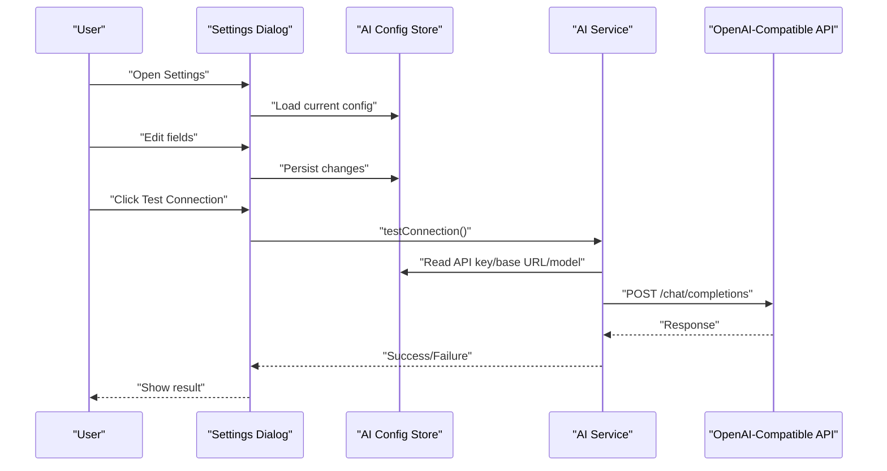
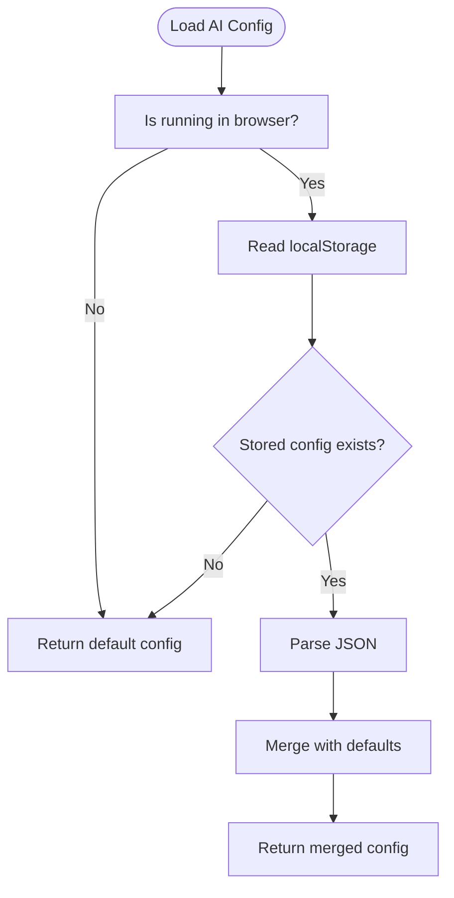
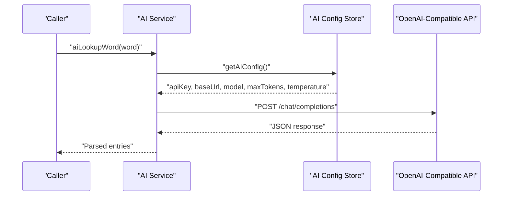
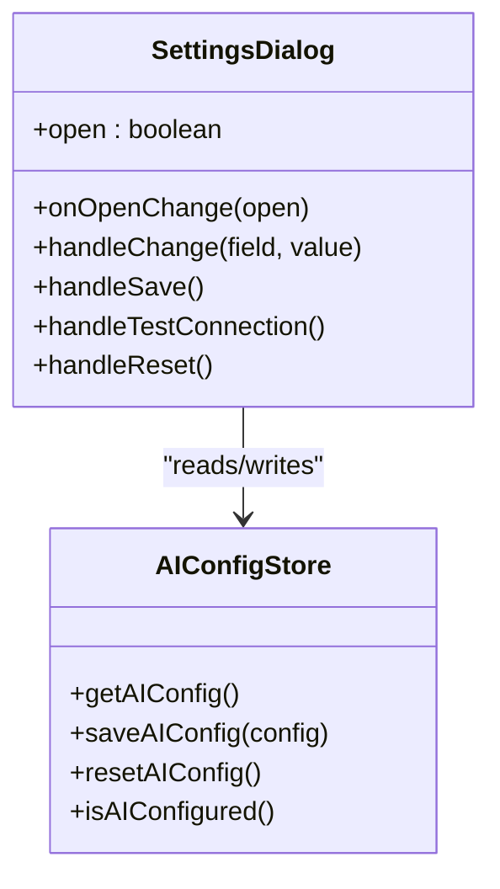
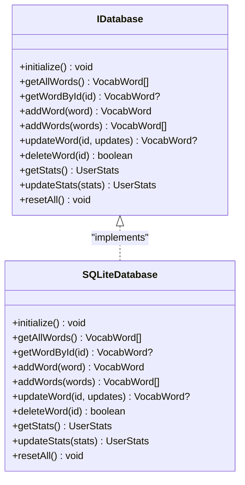
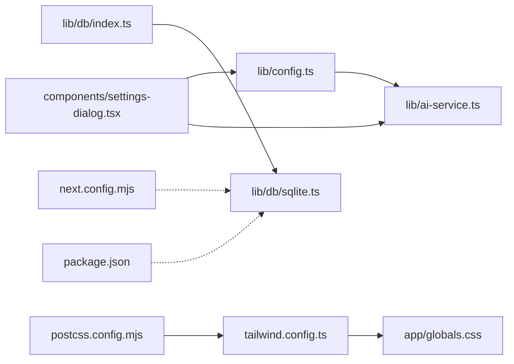

# Configuration & Customization

<cite>
**Referenced Files in This Document**
- [lib/config.ts](file://lib/config.ts)
- [lib/ai-service.ts](file://lib/ai-service.ts)
- [components/settings-dialog.tsx](file://components/settings-dialog.tsx)
- [lib/db/index.ts](file://lib/db/index.ts)
- [lib/db/sqlite.ts](file://lib/db/sqlite.ts)
- [lib/db/types.ts](file://lib/db/types.ts)
- [next.config.mjs](file://next.config.mjs)
- [package.json](file://package.json)
- [.qoder/settings.local.json](file://.qoder/settings.local.json)
- [tailwind.config.ts](file://tailwind.config.ts)
- [app/globals.css](file://app/globals.css)
- [postcss.config.mjs](file://postcss.config.mjs)
- [app/page.tsx](file://app/page.tsx)
- [components/learning-mode.tsx](file://components/learning-mode.tsx)
</cite>

## Update Summary
**Changes Made**
- Added new 'xs' breakpoint at 475px for enhanced mobile-first responsive design
- Enhanced Tailwind configuration with custom utilities for mobile-specific patterns
- Updated responsive design patterns across UI components using the new breakpoint
- Added mobile-specific utility classes for improved touch interaction and safe area handling

## Table of Contents
1. [Introduction](#introduction)
2. [Project Structure](#project-structure)
3. [Core Components](#core-components)
4. [Architecture Overview](#architecture-overview)
5. [Detailed Component Analysis](#detailed-component-analysis)
6. [Responsive Design System](#responsive-design-system)
7. [Dependency Analysis](#dependency-analysis)
8. [Performance Considerations](#performance-considerations)
9. [Troubleshooting Guide](#troubleshooting-guide)
10. [Conclusion](#conclusion)
11. [Appendices](#appendices)

## Introduction
This document explains how to configure and customize VocabMaster. It covers:
- Environment variables and feature flags
- AI service configuration for OpenAI-compatible APIs
- Database connection settings
- Performance tuning parameters
- Configuration file structure, defaults, and override mechanisms
- Responsive design system with mobile-first approach
- Security considerations for sensitive configuration data
- Common configuration scenarios and troubleshooting guidance

## Project Structure
VocabMaster is a Next.js application with a clear separation of concerns:
- Configuration for AI services is centralized and persisted locally in the browser.
- Database abstraction supports pluggable backends with SQLite as the default.
- Build-time configuration excludes native modules from client-side bundling.
- A settings dialog provides a user interface to manage AI configuration.
- Enhanced responsive design system with mobile-first breakpoints and custom utilities.

```mermaid
graph TB
subgraph "Browser Runtime"
UI["Settings Dialog<br/>(components/settings-dialog.tsx)"]
CFG["AI Config Store<br/>(lib/config.ts)"]
RESP["Responsive System<br/>(tailwind.config.ts)"]
MOBILE["Mobile Utilities<br/>(app/globals.css)"]
END
subgraph "Application Runtime"
AISVC["AI Service<br/>(lib/ai-service.ts)"]
DBIDX["DB Factory<br/>(lib/db/index.ts)"]
DBSQL["SQLite Adapter<br/>(lib/db/sqlite.ts)"]
END
subgraph "Build/Runtime"
NEXT["Next.js Config<br/>(next.config.mjs)"]
PKG["Dependencies<br/>(package.json)"]
POSTCSS["PostCSS Config<br/>(postcss.config.mjs)"]
END
UI --> CFG
UI --> RESP
RESP --> MOBILE
AISVC --> CFG
AISVC --> DBIDX
DBIDX --> DBSQL
NEXT --> DBSQL
PKG --> DBSQL
POSTCSS --> RESP
```

**Diagram sources**
- [components/settings-dialog.tsx](file://components/settings-dialog.tsx#L1-L249)
- [lib/config.ts](file://lib/config.ts#L1-L63)
- [lib/ai-service.ts](file://lib/ai-service.ts#L1-L239)
- [lib/db/index.ts](file://lib/db/index.ts#L1-L21)
- [lib/db/sqlite.ts](file://lib/db/sqlite.ts#L1-L297)
- [next.config.mjs](file://next.config.mjs#L1-L15)
- [package.json](file://package.json#L1-L33)
- [tailwind.config.ts](file://tailwind.config.ts#L1-L121)
- [app/globals.css](file://app/globals.css#L1-L183)
- [postcss.config.mjs](file://postcss.config.mjs#L1-L10)

**Section sources**
- [lib/config.ts](file://lib/config.ts#L1-L63)
- [lib/ai-service.ts](file://lib/ai-service.ts#L1-L239)
- [components/settings-dialog.tsx](file://components/settings-dialog.tsx#L1-L249)
- [lib/db/index.ts](file://lib/db/index.ts#L1-L21)
- [lib/db/sqlite.ts](file://lib/db/sqlite.ts#L1-L297)
- [next.config.mjs](file://next.config.mjs#L1-L15)
- [package.json](file://package.json#L1-L33)
- [tailwind.config.ts](file://tailwind.config.ts#L1-L121)
- [app/globals.css](file://app/globals.css#L1-L183)
- [postcss.config.mjs](file://postcss.config.mjs#L1-L10)

## Core Components
- AI configuration store: Provides default values, persistence in localStorage, and helpers to load/save/reset configuration.
- AI service: Consumes the AI configuration to call OpenAI-compatible endpoints for word lookup, question generation, answer evaluation, and bulk lookups.
- Database abstraction: Defines a clean interface for swapping implementations; SQLite is initialized with pragmas and indices.
- Settings dialog: Exposes UI controls to edit AI configuration, test connectivity, and persist changes.
- Responsive design system: Implements mobile-first breakpoints with custom utilities for enhanced mobile experience.

**Section sources**
- [lib/config.ts](file://lib/config.ts#L1-L63)
- [lib/ai-service.ts](file://lib/ai-service.ts#L1-L239)
- [lib/db/types.ts](file://lib/db/types.ts#L1-L35)
- [lib/db/sqlite.ts](file://lib/db/sqlite.ts#L1-L297)
- [components/settings-dialog.tsx](file://components/settings-dialog.tsx#L1-L249)
- [tailwind.config.ts](file://tailwind.config.ts#L25-L28)

## Architecture Overview
The configuration architecture centers around a single source of truth for AI settings and a layered approach to persistence and runtime behavior, enhanced with a comprehensive responsive design system.



**Diagram sources**
- [components/settings-dialog.tsx](file://components/settings-dialog.tsx#L1-L249)
- [lib/config.ts](file://lib/config.ts#L1-L63)
- [lib/ai-service.ts](file://lib/ai-service.ts#L1-L239)

## Detailed Component Analysis

### AI Configuration Store
- Purpose: Centralize AI service configuration with defaults and localStorage persistence.
- Defaults: Includes API key, base URL, model, max tokens, and temperature.
- Overrides: Values stored in localStorage merge with defaults at runtime.
- Helpers:
  - Load configuration
  - Save partial configuration
  - Check if configured
  - Reset to defaults



**Diagram sources**
- [lib/config.ts](file://lib/config.ts#L22-L37)

**Section sources**
- [lib/config.ts](file://lib/config.ts#L1-L63)

### AI Service Layer
- Endpoint: Calls the OpenAI-compatible chat completions endpoint using the configured base URL.
- Authentication: Uses Authorization Bearer with the configured API key.
- Parameters: Respects model, max tokens, and temperature overrides per call.
- Features:
  - Connection test
  - Word lookup returning structured definitions
  - Question generation for vocabulary and grammar
  - Answer evaluation with quality and feedback
  - Bulk word lookup



**Diagram sources**
- [lib/ai-service.ts](file://lib/ai-service.ts#L66-L111)
- [lib/config.ts](file://lib/config.ts#L23-L50)

**Section sources**
- [lib/ai-service.ts](file://lib/ai-service.ts#L1-L239)
- [lib/config.ts](file://lib/config.ts#L1-L63)

### Settings Dialog (User Interface)
- Fields: API key, base URL, model, max tokens, temperature.
- Behavior:
  - Masked display of API key with toggle visibility.
  - Real-time validation and saving.
  - Connection testing against the configured endpoint.
  - Reset to defaults.



**Diagram sources**
- [components/settings-dialog.tsx](file://components/settings-dialog.tsx#L17-L63)
- [lib/config.ts](file://lib/config.ts#L23-L62)

**Section sources**
- [components/settings-dialog.tsx](file://components/settings-dialog.tsx#L1-L249)
- [lib/config.ts](file://lib/config.ts#L1-L63)

### Database Abstraction and Initialization
- Factory pattern: Returns a singleton implementing the database interface.
- SQLite adapter:
  - Initializes the database file path under the data directory.
  - Sets SQLite pragmas for journal mode WAL and foreign keys.
  - Creates tables and indices, seeds sample words if empty, and synchronizes stats.
- Pluggable design: The interface enables future backends (e.g., MySQL, PostgreSQL).



**Diagram sources**
- [lib/db/types.ts](file://lib/db/types.ts#L12-L34)
- [lib/db/sqlite.ts](file://lib/db/sqlite.ts#L28-L297)

**Section sources**
- [lib/db/index.ts](file://lib/db/index.ts#L1-L21)
- [lib/db/types.ts](file://lib/db/types.ts#L1-L35)
- [lib/db/sqlite.ts](file://lib/db/sqlite.ts#L1-L297)

### Build-Time Configuration
- Webpack exclusion: The native better-sqlite3 module is excluded from client-side bundling because it runs server-side in API routes.
- Dependencies: The project relies on Next.js and related tooling.
- PostCSS processing: Tailwind CSS is processed through PostCSS with autoprefixer for vendor prefix support.

**Section sources**
- [next.config.mjs](file://next.config.mjs#L1-L15)
- [package.json](file://package.json#L1-L33)
- [postcss.config.mjs](file://postcss.config.mjs#L1-L10)

### Qoder Local Settings
- The repository includes a local settings file for an internal agent framework. While not directly used by VocabMaster, it demonstrates a pattern for local configuration overrides.

**Section sources**
- [.qoder/settings.local.json](file://.qoder/settings.local.json#L1-L4)

## Responsive Design System

**Updated** Enhanced with new 'xs' breakpoint at 475px for improved mobile-first responsive design patterns.

VocabMaster implements a comprehensive responsive design system with mobile-first approach:

### Breakpoints and Screen Sizes
- **xs**: 475px - New extra-small breakpoint for phones with screen widths below 475px
- **sm**: 640px - Small devices (phones)
- **md**: 768px - Medium devices (tablets)
- **lg**: 1024px - Large devices (desktops)
- **xl**: 1280px - Extra-large devices
- **2xl**: 1400px - Extra-extra-large devices

### Mobile-Specific Utilities
The design system includes specialized utilities for enhanced mobile experience:

- **scrollbar-hide**: Removes scrollbars for cleaner mobile interface
- **tap-highlight-transparent**: Eliminates tap highlight for better visual control
- **safe-area-insets**: Handles safe area insets for modern mobile devices with notches or home indicators
- **Gradient utilities**: Custom gradient backgrounds for visual appeal
- **Shadow utilities**: Custom shadow effects for depth perception

### Implementation Pattern
Components use responsive utility classes with mobile-first approach:

```typescript
// Example responsive patterns from the codebase
<span className="hidden xs:inline">Start Learning</span>
<span className="xs:hidden">Learn</span>
<p className="text-xs text-muted-foreground hidden xs:block">AI-Powered Learning</p>
```

This pattern ensures optimal user experience across all device sizes while maintaining clean, readable code.

**Section sources**
- [tailwind.config.ts](file://tailwind.config.ts#L25-L28)
- [app/globals.css](file://app/globals.css#L104-L129)
- [app/page.tsx](file://app/page.tsx#L144-L145)
- [app/page.tsx](file://app/page.tsx#L185-L187)
- [components/learning-mode.tsx](file://components/learning-mode.tsx#L274-L277)

## Dependency Analysis
- AI service depends on the AI configuration store for runtime parameters.
- Settings dialog depends on the AI configuration store and AI service for testing.
- Database factory depends on the SQLite adapter; the adapter depends on better-sqlite3 and the data directory path.
- Build configuration affects packaging of native modules.
- Responsive design system depends on Tailwind CSS configuration and PostCSS processing.



**Diagram sources**
- [lib/config.ts](file://lib/config.ts#L1-L63)
- [lib/ai-service.ts](file://lib/ai-service.ts#L1-L239)
- [components/settings-dialog.tsx](file://components/settings-dialog.tsx#L1-L249)
- [lib/db/index.ts](file://lib/db/index.ts#L1-L21)
- [lib/db/sqlite.ts](file://lib/db/sqlite.ts#L1-L297)
- [next.config.mjs](file://next.config.mjs#L1-L15)
- [package.json](file://package.json#L1-L33)
- [tailwind.config.ts](file://tailwind.config.ts#L1-L121)
- [app/globals.css](file://app/globals.css#L1-L183)
- [postcss.config.mjs](file://postcss.config.mjs#L1-L10)

**Section sources**
- [lib/config.ts](file://lib/config.ts#L1-L63)
- [lib/ai-service.ts](file://lib/ai-service.ts#L1-L239)
- [components/settings-dialog.tsx](file://components/settings-dialog.tsx#L1-L249)
- [lib/db/index.ts](file://lib/db/index.ts#L1-L21)
- [lib/db/sqlite.ts](file://lib/db/sqlite.ts#L1-L297)
- [next.config.mjs](file://next.config.mjs#L1-L15)
- [package.json](file://package.json#L1-L33)
- [tailwind.config.ts](file://tailwind.config.ts#L1-L121)
- [app/globals.css](file://app/globals.css#L1-L183)
- [postcss.config.mjs](file://postcss.config.mjs#L1-L10)

## Performance Considerations
- Token limits: Adjust max tokens to balance response quality and cost/latency.
- Temperature: Lower values increase determinism for tasks like evaluation; higher values encourage creativity for question generation.
- Database:
  - SQLite WAL mode improves concurrency and write performance.
  - Indices on review dates and word text improve query performance for scheduling and lookups.
- Network:
  - Prefer a nearby OpenAI-compatible endpoint to reduce latency.
  - Ensure stable connectivity and retry logic at the caller level if needed.
- Responsive Design:
  - The new 'xs' breakpoint optimizes mobile performance for smaller screens.
  - Custom utilities reduce unnecessary CSS bloat while maintaining visual consistency.
  - Mobile-first approach minimizes media query complexity and improves rendering performance.

## Troubleshooting Guide
- API key not configured:
  - Symptom: Lookup and question generation fail early.
  - Action: Enter a valid API key in the settings dialog and save.
- Connection test fails:
  - Symptom: Test result indicates failure.
  - Action: Verify base URL, model, and network access; re-test after corrections.
- Unexpected JSON parsing errors:
  - Symptom: Lookup or question generation returns parsing errors.
  - Action: Confirm the endpoint returns plain JSON without markdown wrappers.
- Database initialization issues:
  - Symptom: Tables not created or seeded.
  - Action: Ensure the data directory exists and is writable; restart the server to trigger initialization.
- Native module bundling errors:
  - Symptom: Build warnings about better-sqlite3.
  - Action: Ensure the exclusion is applied in server-side contexts as configured.
- Responsive design issues:
  - Symptom: Components not displaying correctly on small screens.
  - Action: Verify 'xs' breakpoint usage and ensure mobile-specific utilities are applied appropriately.
- Tailwind CSS compilation errors:
  - Symptom: Build fails with Tailwind CSS processing errors.
  - Action: Check Tailwind configuration syntax and ensure PostCSS is properly configured.

**Section sources**
- [lib/ai-service.ts](file://lib/ai-service.ts#L52-L63)
- [lib/ai-service.ts](file://lib/ai-service.ts#L81-L111)
- [lib/ai-service.ts](file://lib/ai-service.ts#L113-L159)
- [lib/db/sqlite.ts](file://lib/db/sqlite.ts#L35-L81)
- [next.config.mjs](file://next.config.mjs#L6-L11)
- [tailwind.config.ts](file://tailwind.config.ts#L25-L28)
- [postcss.config.mjs](file://postcss.config.mjs#L1-L10)

## Conclusion
VocabMaster's configuration model is intentionally simple and user-friendly with enhanced responsive capabilities:
- AI settings are stored locally and editable via the settings dialog.
- The AI service consumes these settings to call OpenAI-compatible APIs.
- The database is abstracted and initialized with sensible defaults for SQLite.
- Build configuration ensures native modules are handled correctly.
- The responsive design system provides optimal mobile experience with the new 'xs' breakpoint.
- Mobile-first approach ensures accessibility and usability across all device sizes.
Adopt the recommended practices below to maintain a secure, performant, and reliable setup with excellent mobile responsiveness.

## Appendices

### Configuration Reference

- AI Configuration Keys
  - apiKey: string
  - baseUrl: string
  - model: string
  - maxTokens: number
  - temperature: number

- Default Values
  - apiKey: Provided in defaults
  - baseUrl: Provided in defaults
  - model: Provided in defaults
  - maxTokens: Provided in defaults
  - temperature: Provided in defaults

- Override Mechanism
  - Browser: localStorage under a dedicated key
  - Runtime: Merges stored values with defaults at load time

- Responsive Breakpoints
  - xs: 475px - New extra-small breakpoint for phones
  - sm: 640px - Small devices (phones)
  - md: 768px - Medium devices (tablets)
  - lg: 1024px - Large devices (desktops)
  - xl: 1280px - Extra-large devices
  - 2xl: 1400px - Extra-extra-large devices

- Mobile-Specific Utilities
  - scrollbar-hide: Remove scrollbars for clean interface
  - tap-highlight-transparent: Eliminate tap highlights
  - safe-top/bottom/left/right: Handle safe area insets
  - gradient utilities: Custom gradient backgrounds
  - shadow utilities: Custom shadow effects

- Example Scenarios
  - Switch to OpenAI-compatible endpoint:
    - Change baseUrl and model in the settings dialog; save and test.
  - Tune response length and creativity:
    - Adjust maxTokens and temperature; observe effects in question generation and evaluations.
  - Reset to defaults:
    - Use the reset action in the settings dialog.
  - Optimize for small screens:
    - Use 'xs' breakpoint classes for mobile-specific layouts and text sizing.

- Security Considerations
  - API key visibility: The UI masks the key by default; enable visibility only when necessary.
  - Storage location: Configuration is stored in localStorage; avoid exposing it in client logs.
  - Transport: Ensure HTTPS for the base URL to protect credentials in transit.
  - Least privilege: Use scoped API keys with minimal permissions.

**Section sources**
- [lib/config.ts](file://lib/config.ts#L14-L20)
- [lib/config.ts](file://lib/config.ts#L23-L37)
- [components/settings-dialog.tsx](file://components/settings-dialog.tsx#L65-L67)
- [lib/ai-service.ts](file://lib/ai-service.ts#L29-L41)
- [tailwind.config.ts](file://tailwind.config.ts#L25-L28)
- [app/globals.css](file://app/globals.css#L104-L129)
- [app/page.tsx](file://app/page.tsx#L144-L145)
- [app/page.tsx](file://app/page.tsx#L185-L187)
- [components/learning-mode.tsx](file://components/learning-mode.tsx#L274-L277)