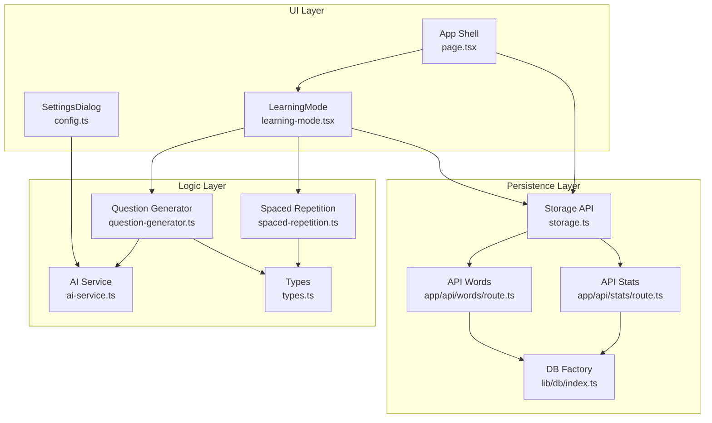
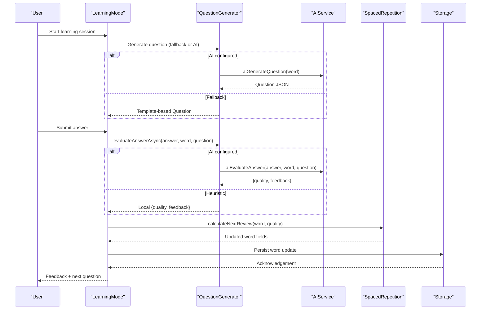
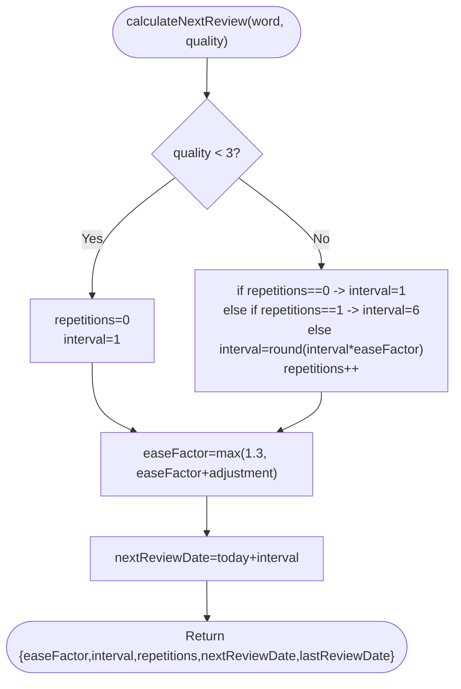
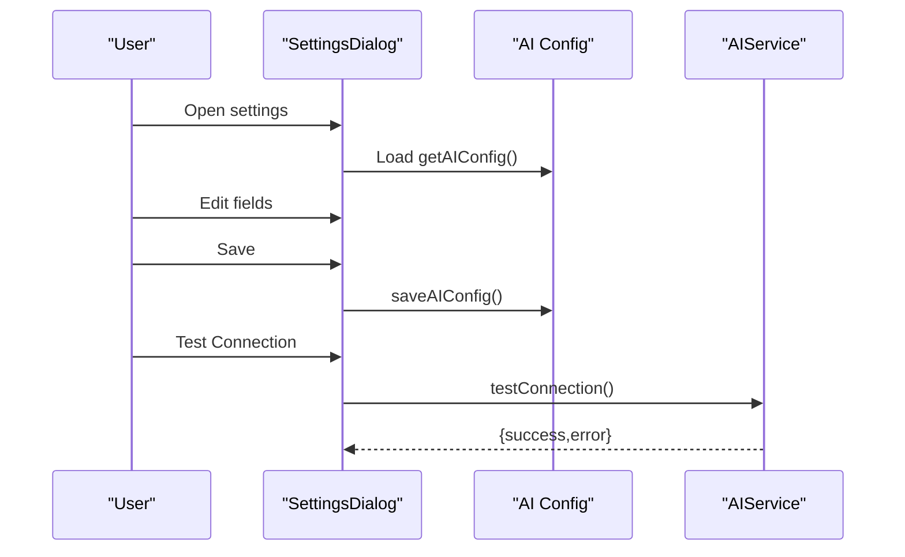
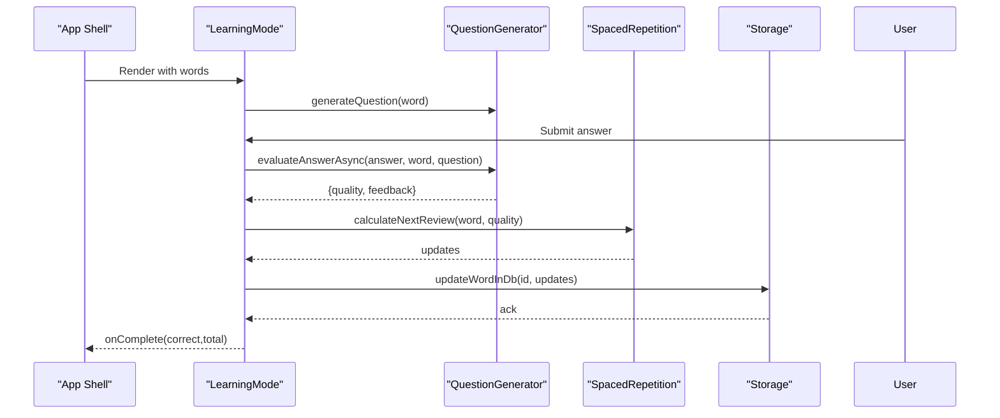
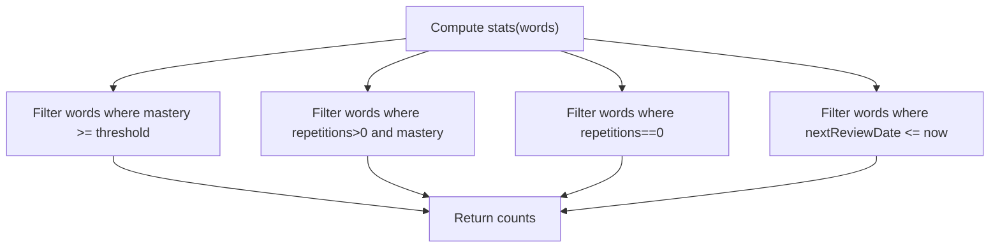
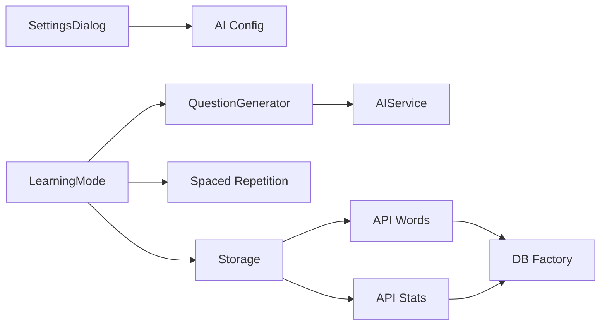

# Feature Customization

<cite>
**Referenced Files in This Document**
- [config.ts](file://lib/config.ts)
- [spaced-repetition.ts](file://lib/spaced-repetition.ts)
- [question-generator.ts](file://lib/question-generator.ts)
- [ai-service.ts](file://lib/ai-service.ts)
- [types.ts](file://lib/types.ts)
- [settings-dialog.tsx](file://components/settings-dialog.tsx)
- [learning-mode.tsx](file://components/learning-mode.tsx)
- [storage.ts](file://lib/storage.ts)
- [page.tsx](file://app/page.tsx)
- [route.ts](file://app/api/words/route.ts)
- [route.ts](file://app/api/stats/route.ts)
- [db/index.ts](file://lib/db/index.ts)
- [settings.local.json](file://.qoder/settings.local.json)
</cite>

## Table of Contents
1. [Introduction](#introduction)
2. [Project Structure](#project-structure)
3. [Core Components](#core-components)
4. [Architecture Overview](#architecture-overview)
5. [Detailed Component Analysis](#detailed-component-analysis)
6. [Dependency Analysis](#dependency-analysis)
7. [Performance Considerations](#performance-considerations)
8. [Troubleshooting Guide](#troubleshooting-guide)
9. [Conclusion](#conclusion)
10. [Appendices](#appendices)

## Introduction
This document explains how to customize VocabMaster’s learning features. It focuses on:
- Learning algorithm parameters (spaced repetition)
- Question generation customization (AI and fallback)
- Difficulty scoring and feedback
- AI configuration parameters
- Learning mode behavior and progress tracking
- Practical customization scenarios and extension guidance

## Project Structure
VocabMaster is a Next.js application with a clear separation of concerns:
- UI components for settings, learning, and dashboards
- Business logic for spaced repetition, question generation, and AI integration
- Storage abstraction and API routes for persistence
- Configuration utilities for AI parameters



**Diagram sources**
- [settings-dialog.tsx](file://components/settings-dialog.tsx#L1-L249)
- [learning-mode.tsx](file://components/learning-mode.tsx#L1-L370)
- [page.tsx](file://app/page.tsx#L1-L147)
- [spaced-repetition.ts](file://lib/spaced-repetition.ts#L1-L123)
- [question-generator.ts](file://lib/question-generator.ts#L1-L255)
- [ai-service.ts](file://lib/ai-service.ts#L1-L239)
- [types.ts](file://lib/types.ts#L1-L105)
- [storage.ts](file://lib/storage.ts#L1-L137)
- [route.ts](file://app/api/words/route.ts#L1-L28)
- [route.ts](file://app/api/stats/route.ts#L1-L26)
- [db/index.ts](file://lib/db/index.ts#L1-L21)

**Section sources**
- [settings-dialog.tsx](file://components/settings-dialog.tsx#L1-L249)
- [learning-mode.tsx](file://components/learning-mode.tsx#L1-L370)
- [page.tsx](file://app/page.tsx#L1-L147)
- [spaced-repetition.ts](file://lib/spaced-repetition.ts#L1-L123)
- [question-generator.ts](file://lib/question-generator.ts#L1-L255)
- [ai-service.ts](file://lib/ai-service.ts#L1-L239)
- [types.ts](file://lib/types.ts#L1-L105)
- [storage.ts](file://lib/storage.ts#L1-L137)
- [route.ts](file://app/api/words/route.ts#L1-L28)
- [route.ts](file://app/api/stats/route.ts#L1-L26)
- [db/index.ts](file://lib/db/index.ts#L1-L21)

## Core Components
- Spaced Repetition (SM-2): Controls review intervals, ease factor, and mastery calculation.
- Question Generator: Produces AI-generated or fallback questions with grammar constraints.
- AI Service: Integrates with OpenAI-compatible endpoints for lookup, question generation, and answer evaluation.
- Configuration: Centralized AI settings persisted in browser storage.
- Storage: Asynchronous API-driven persistence for words and stats.
- Learning Mode: Interactive review flow integrating SR updates and feedback.

**Section sources**
- [spaced-repetition.ts](file://lib/spaced-repetition.ts#L1-L123)
- [question-generator.ts](file://lib/question-generator.ts#L1-L255)
- [ai-service.ts](file://lib/ai-service.ts#L1-L239)
- [config.ts](file://lib/config.ts#L1-L63)
- [storage.ts](file://lib/storage.ts#L1-L137)
- [learning-mode.tsx](file://components/learning-mode.tsx#L1-L370)

## Architecture Overview
The learning flow integrates UI, logic, and persistence:



**Diagram sources**
- [learning-mode.tsx](file://components/learning-mode.tsx#L76-L156)
- [question-generator.ts](file://lib/question-generator.ts#L100-L116)
- [question-generator.ts](file://lib/question-generator.ts#L173-L188)
- [ai-service.ts](file://lib/ai-service.ts#L113-L159)
- [ai-service.ts](file://lib/ai-service.ts#L161-L211)
- [spaced-repetition.ts](file://lib/spaced-repetition.ts#L8-L48)
- [storage.ts](file://lib/storage.ts#L41-L53)

## Detailed Component Analysis

### Spaced Repetition (Review Intervals and Mastery)
- Algorithm: Implements SM-2 logic for intervals, ease factor, and repetitions.
- Behavior:
  - Quality threshold: Answers below a threshold reset retention.
  - Correct answers increase interval using ease factor and round to nearest day.
  - Ease factor is adjusted based on quality.
  - Mastery is computed as a composite of repetitions, ease factor, and interval.
- Key parameters:
  - Initial ease factor
  - Retention thresholds (e.g., minimum quality to advance)
  - Interval progression rules
- Mastery thresholds:
  - Mastered: threshold configurable via application logic (e.g., 80% mastery).
- Complexity:
  - Per-word update: O(1)
  - Due word filtering: O(n) with sorting by due date and ease factor.



**Diagram sources**
- [spaced-repetition.ts](file://lib/spaced-repetition.ts#L8-L48)

**Section sources**
- [spaced-repetition.ts](file://lib/spaced-repetition.ts#L8-L48)
- [spaced-repetition.ts](file://lib/spaced-repetition.ts#L98-L105)
- [spaced-repetition.ts](file://lib/spaced-repetition.ts#L107-L122)
- [types.ts](file://lib/types.ts#L1-L14)

### Question Generation and Evaluation
- Modes:
  - AI-powered: Uses AIService to generate questions and evaluate answers.
  - Fallback: Template-based generator with grammar structures and hints.
- Question types:
  - Fill-in-the-blank
  - Contextual usage
  - Definition-based
  - Synonym-based
- Grammar constraints:
  - Each question includes a required grammar structure and example.
- Evaluation:
  - AI mode: Returns numeric quality (0–5) and feedback.
  - Fallback mode: Heuristic scoring based on containment, length, and repetition of target word.

```mermaid
classDiagram
class Question {
+string type
+string prompt
+string targetWord
+string hint
+string grammarStructure
+string grammarExample
}
class AIService {
+aiGenerateQuestion(word) Question
+aiEvaluateAnswer(answer, word, question) {quality, feedback}
+aiLookupWord(word) DictionaryEntry[]
}
class QuestionGenerator {
+generateQuestion(word) Question
+generateQuestionAsync(word) Question
+evaluateAnswer(answer, word, question) {quality, feedback}
+evaluateAnswerAsync(answer, word, question) {quality, feedback}
+getQualityFeedback(quality) {level,message,emoji}
}
QuestionGenerator --> AIService : "uses when configured"
QuestionGenerator --> Question : "produces"
```

**Diagram sources**
- [question-generator.ts](file://lib/question-generator.ts#L1-L255)
- [ai-service.ts](file://lib/ai-service.ts#L1-L239)
- [types.ts](file://lib/types.ts#L22-L31)

**Section sources**
- [question-generator.ts](file://lib/question-generator.ts#L100-L116)
- [question-generator.ts](file://lib/question-generator.ts#L118-L171)
- [question-generator.ts](file://lib/question-generator.ts#L173-L188)
- [question-generator.ts](file://lib/question-generator.ts#L199-L242)
- [question-generator.ts](file://lib/question-generator.ts#L244-L255)
- [ai-service.ts](file://lib/ai-service.ts#L113-L159)
- [ai-service.ts](file://lib/ai-service.ts#L161-L211)

### AI Configuration and Settings
- Configuration keys:
  - apiKey
  - baseUrl
  - model
  - maxTokens
  - temperature
- Persistence:
  - Stored in browser localStorage with defaults applied.
- UI:
  - SettingsDialog exposes fields, masking, testing, and reset actions.
- Behavior:
  - When configured, AI features are used for question generation and answer evaluation; otherwise, fallback mode is used.
  - Connection test validates endpoint responsiveness.



**Diagram sources**
- [settings-dialog.tsx](file://components/settings-dialog.tsx#L17-L63)
- [settings-dialog.tsx](file://components/settings-dialog.tsx#L33-L51)
- [settings-dialog.tsx](file://components/settings-dialog.tsx#L40-L51)
- [config.ts](file://lib/config.ts#L22-L50)
- [ai-service.ts](file://lib/ai-service.ts#L52-L63)

**Section sources**
- [config.ts](file://lib/config.ts#L4-L20)
- [config.ts](file://lib/config.ts#L22-L50)
- [settings-dialog.tsx](file://components/settings-dialog.tsx#L1-L249)
- [ai-service.ts](file://lib/ai-service.ts#L52-L63)

### Learning Mode and Session Flow
- Session lifecycle:
  - Loads a snapshot of words due for review.
  - Generates a question (prefers AI when configured).
  - On submit, evaluates answer (AI or heuristic), computes SR update, and persists.
  - Tracks progress, correct count, and allows skipping known/unknown words.
- Completion:
  - Calls parent callback with scores to finalize session and update stats.



**Diagram sources**
- [learning-mode.tsx](file://components/learning-mode.tsx#L35-L156)
- [question-generator.ts](file://lib/question-generator.ts#L173-L188)
- [spaced-repetition.ts](file://lib/spaced-repetition.ts#L8-L48)
- [storage.ts](file://lib/storage.ts#L41-L53)

**Section sources**
- [learning-mode.tsx](file://components/learning-mode.tsx#L35-L156)
- [page.tsx](file://app/page.tsx#L119-L120)

### Progress Tracking and Statistics
- Stats computation:
  - Counts due, mastered, learning, and new words.
  - Mastery percentage derived from individual word mastery.
- Streak logic:
  - Client-side calculation updates current/longest streak and last study date.
  - Synced to backend via API.



**Diagram sources**
- [spaced-repetition.ts](file://lib/spaced-repetition.ts#L107-L122)

**Section sources**
- [spaced-repetition.ts](file://lib/spaced-repetition.ts#L107-L122)
- [storage.ts](file://lib/storage.ts#L88-L115)
- [route.ts](file://app/api/stats/route.ts#L1-L26)

## Dependency Analysis
- UI depends on logic modules for behavior and on storage for persistence.
- Question generation conditionally depends on AI service.
- Spaced repetition is a pure function of word state and quality.
- Storage abstracts persistence behind API routes.



**Diagram sources**
- [settings-dialog.tsx](file://components/settings-dialog.tsx#L1-L249)
- [learning-mode.tsx](file://components/learning-mode.tsx#L1-L370)
- [question-generator.ts](file://lib/question-generator.ts#L1-L255)
- [spaced-repetition.ts](file://lib/spaced-repetition.ts#L1-L123)
- [storage.ts](file://lib/storage.ts#L1-L137)
- [route.ts](file://app/api/words/route.ts#L1-L28)
- [route.ts](file://app/api/stats/route.ts#L1-L26)
- [db/index.ts](file://lib/db/index.ts#L1-L21)

**Section sources**
- [settings-dialog.tsx](file://components/settings-dialog.tsx#L1-L249)
- [learning-mode.tsx](file://components/learning-mode.tsx#L1-L370)
- [question-generator.ts](file://lib/question-generator.ts#L1-L255)
- [spaced-repetition.ts](file://lib/spaced-repetition.ts#L1-L123)
- [storage.ts](file://lib/storage.ts#L1-L137)
- [route.ts](file://app/api/words/route.ts#L1-L28)
- [route.ts](file://app/api/stats/route.ts#L1-L26)
- [db/index.ts](file://lib/db/index.ts#L1-L21)

## Performance Considerations
- Question generation:
  - Prefer AI mode for richer, varied questions; fallback is CPU-light and deterministic.
- Evaluation:
  - AI evaluation adds latency; consider caching or batching where feasible.
- Storage:
  - Batch updates and minimize network calls; the UI already queues per-word updates.
- Rendering:
  - Filter and sort due words efficiently; keep word lists bounded for large vocabularies.

## Troubleshooting Guide
- AI not responding:
  - Verify API key and base URL in Settings; use Test Connection to confirm.
  - Check network errors and endpoint availability.
- Questions not loading:
  - Ensure AI is configured; otherwise, fallback questions are generated locally.
- Streak not updating:
  - Confirm client-side streak calculation and subsequent API update to backend.
- Session not persisting:
  - Ensure word updates reach the backend and that API routes are reachable.

**Section sources**
- [settings-dialog.tsx](file://components/settings-dialog.tsx#L40-L51)
- [ai-service.ts](file://lib/ai-service.ts#L52-L63)
- [storage.ts](file://lib/storage.ts#L41-L53)
- [route.ts](file://app/api/stats/route.ts#L15-L25)

## Conclusion
VocabMaster offers flexible customization through:
- AI configuration for richer question generation and evaluation
- Spaced repetition parameters embedded in the algorithm
- Fallback question generation with grammar scaffolding
- Persistent storage and progress tracking

Adjusting these components enables tailored learning experiences while maintaining robust defaults.

## Appendices

### A. Customization Scenarios

- Scenario A: Increase review difficulty early
  - Adjust mastery threshold for “mastered” classification to delay marking words as mastered.
  - Modify the mastery calculation weights if extending the algorithm.
  - Reference: [spaced-repetition.ts](file://lib/spaced-repetition.ts#L98-L105)

- Scenario B: Improve grammar coverage in questions
  - Extend grammar structures list and templates to include more patterns.
  - Reference: [question-generator.ts](file://lib/question-generator.ts#L47-L98)

- Scenario C: Tune AI creativity vs. consistency
  - Lower temperature for more consistent, focused answers; raise for creative variety.
  - Adjust max tokens to balance verbosity and cost.
  - Reference: [config.ts](file://lib/config.ts#L14-L20), [ai-service.ts](file://lib/ai-service.ts#L19-L50)

- Scenario D: Switch to a different AI provider
  - Change base URL and model; ensure endpoint supports chat completions.
  - Reference: [config.ts](file://lib/config.ts#L14-L20), [ai-service.ts](file://lib/ai-service.ts#L29-L41)

- Scenario E: Customize feedback tone
  - Adjust AI prompts for answer evaluation to emphasize specific criteria.
  - Reference: [ai-service.ts](file://lib/ai-service.ts#L174-L211)

- Scenario F: Extend learning mode behavior
  - Add skip reasons, hints, or hints toggles; integrate with existing state machine.
  - Reference: [learning-mode.tsx](file://components/learning-mode.tsx#L97-L116)

### B. Extending Core Features

- Adding a new question type
  - Define a new type in the Question interface and extend generators.
  - Reference: [types.ts](file://lib/types.ts#L22-L31), [question-generator.ts](file://lib/question-generator.ts#L118-L171)

- Implementing a new spaced repetition scheduler
  - Replace or wrap calculateNextReview with a new algorithm module.
  - Reference: [spaced-repetition.ts](file://lib/spaced-repetition.ts#L8-L48)

- Plugging in a new database backend
  - Implement IDatabase and swap in the DB factory.
  - Reference: [db/index.ts](file://lib/db/index.ts#L1-L21)

- Adjusting progress thresholds
  - Modify mastery thresholds and stats computation logic.
  - Reference: [spaced-repetition.ts](file://lib/spaced-repetition.ts#L98-L105), [spaced-repetition.ts](file://lib/spaced-repetition.ts#L107-L122)

### C. Configuration Reference

- AI Configuration Keys
  - apiKey: Authentication token
  - baseUrl: OpenAI-compatible endpoint
  - model: Target model identifier
  - maxTokens: Maximum tokens per request
  - temperature: Sampling randomness

- Persistence and Environment
  - Browser storage for AI config
  - API routes for words and stats
  - DB factory for persistence backend

**Section sources**
- [config.ts](file://lib/config.ts#L4-L20)
- [settings-dialog.tsx](file://components/settings-dialog.tsx#L1-L249)
- [ai-service.ts](file://lib/ai-service.ts#L19-L50)
- [route.ts](file://app/api/words/route.ts#L1-L28)
- [route.ts](file://app/api/stats/route.ts#L1-L26)
- [db/index.ts](file://lib/db/index.ts#L1-L21)
- [settings.local.json](file://.qoder/settings.local.json#L1-L4)