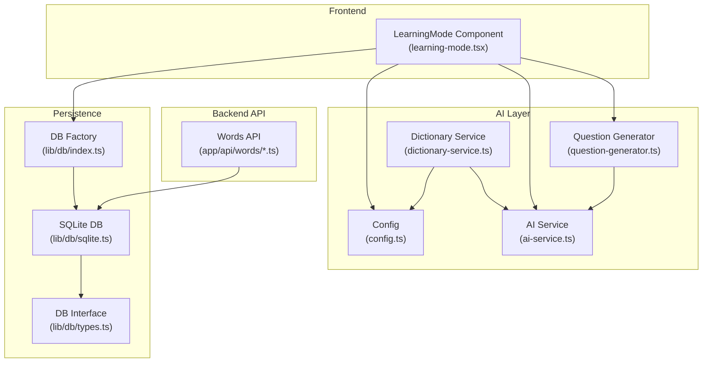
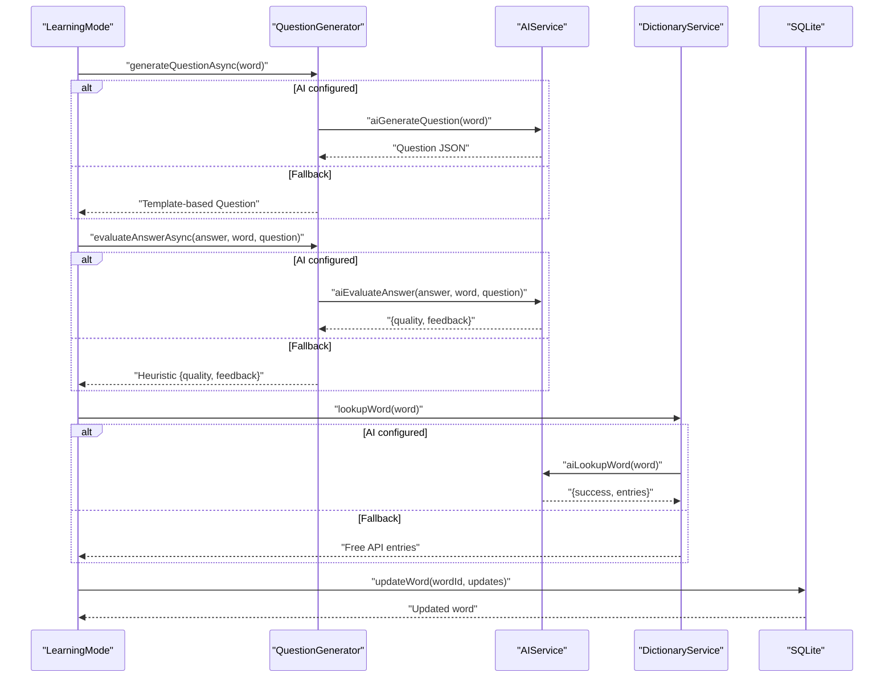
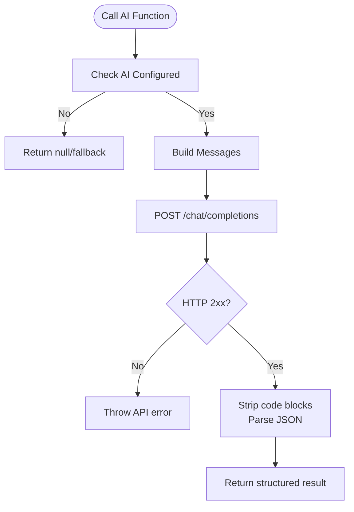
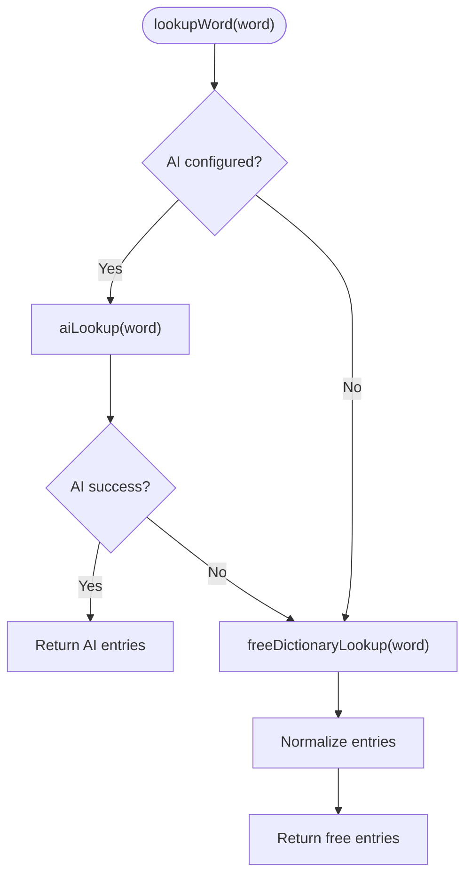
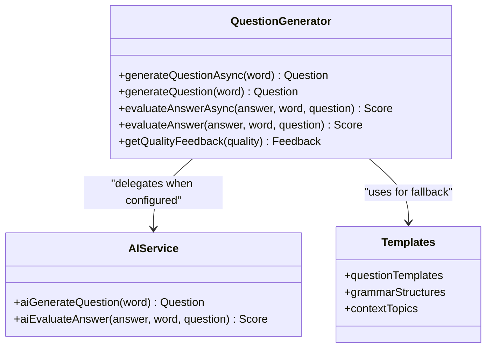
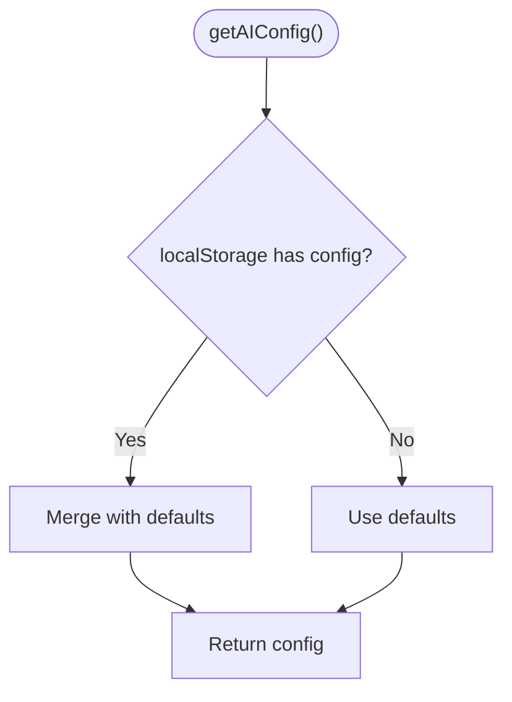
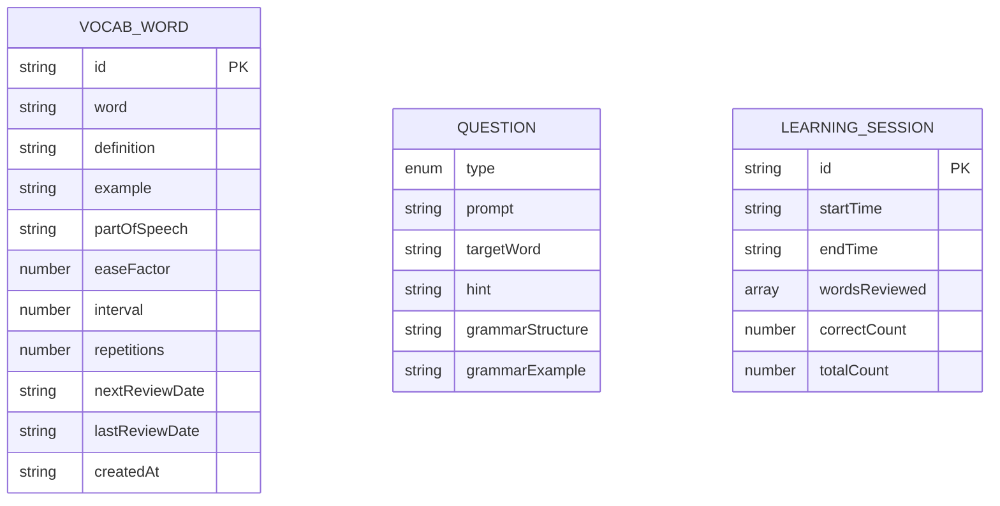
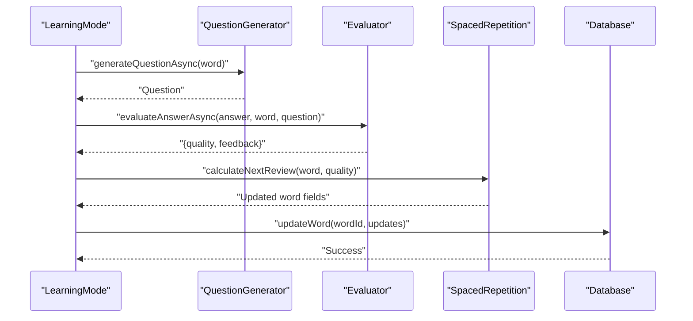
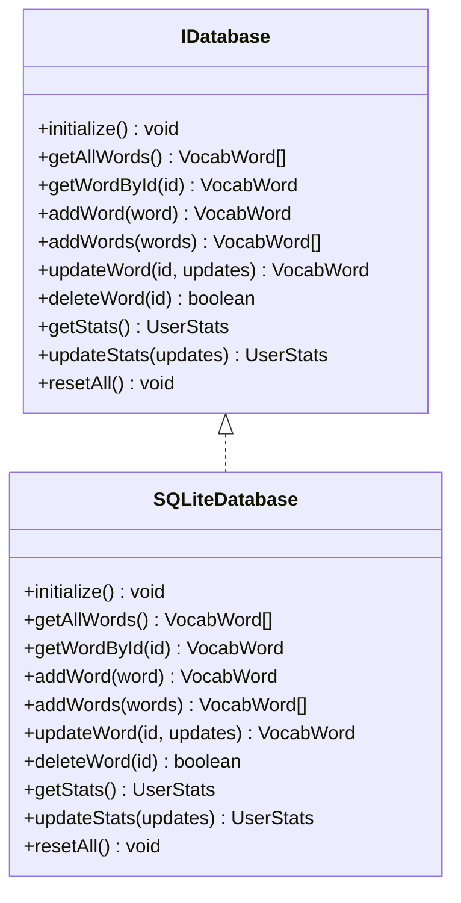
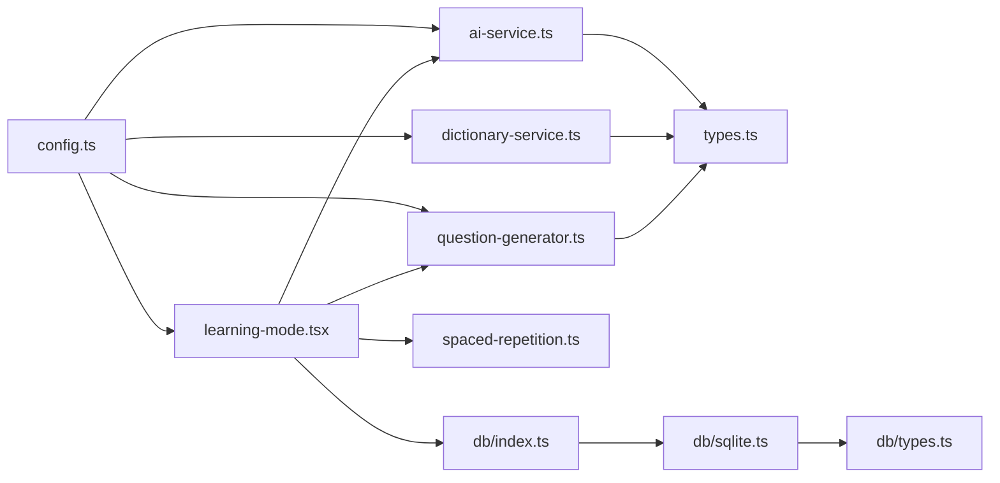

# AI Learning Engine

<cite>
**Referenced Files in This Document**
- [ai-service.ts](file://lib/ai-service.ts)
- [dictionary-service.ts](file://lib/dictionary-service.ts)
- [question-generator.ts](file://lib/question-generator.ts)
- [config.ts](file://lib/config.ts)
- [types.ts](file://lib/types.ts)
- [learning-mode.tsx](file://components/learning-mode.tsx)
- [spaced-repetition.ts](file://lib/spaced-repetition.ts)
- [route.ts](file://app/api/words/route.ts)
- [bulk/route.ts](file://app/api/words/bulk/route.ts)
- [sqlite.ts](file://lib/db/sqlite.ts)
- [index.ts](file://lib/db/index.ts)
- [types.ts](file://lib/db/types.ts)
- [package.json](file://package.json)
</cite>

## Table of Contents
1. [Introduction](#introduction)
2. [Project Structure](#project-structure)
3. [Core Components](#core-components)
4. [Architecture Overview](#architecture-overview)
5. [Detailed Component Analysis](#detailed-component-analysis)
6. [Dependency Analysis](#dependency-analysis)
7. [Performance Considerations](#performance-considerations)
8. [Troubleshooting Guide](#troubleshooting-guide)
9. [Conclusion](#conclusion)
10. [Appendices](#appendices)

## Introduction
This document describes the AI-powered learning engine that generates contextual questions and assessments for vocabulary learning. It covers the AI service configuration, OpenAI-compatible API integration, fallback dictionary service, question generation algorithms, grammar-focused assessment patterns, and contextual learning approaches. It also documents API endpoints, request/response schemas, error handling strategies, performance optimization techniques, and integration patterns with the learning interface.

## Project Structure
The learning engine is organized around a small set of focused modules:
- AI service: OpenAI-compatible chat completions for dictionary lookups, question generation, and answer evaluation.
- Dictionary service: Routes lookups to AI when configured, otherwise falls back to a free dictionary API.
- Question generator: Generates contextual questions and evaluates answers, with AI-driven generation and evaluation when available, and local fallbacks otherwise.
- Configuration: Centralized, user-modifiable AI configuration persisted in localStorage.
- Types: Shared data models for vocabulary words, questions, sessions, and state.
- Learning interface: React component orchestrating the learning session, integrating question generation, evaluation, and spaced repetition scheduling.
- Database: SQLite-backed persistence for vocabulary words and statistics, with an abstracted interface for future database backends.
- API routes: Next.js API endpoints for CRUD operations on vocabulary words.

**Diagram sources**
- [learning-mode.tsx](file://components/learning-mode.tsx#L1-L370)
- [ai-service.ts](file://lib/ai-service.ts#L1-L239)
- [question-generator.ts](file://lib/question-generator.ts#L1-L255)
- [dictionary-service.ts](file://lib/dictionary-service.ts#L1-L255)
- [config.ts](file://lib/config.ts#L1-L63)
- [sqlite.ts](file://lib/db/sqlite.ts#L1-L297)
- [index.ts](file://lib/db/index.ts#L1-L21)
- [types.ts](file://lib/db/types.ts#L1-L35)
- [route.ts](file://app/api/words/route.ts#L1-L28)
- [bulk/route.ts](file://app/api/words/bulk/route.ts#L1-L19)

**Section sources**
- [package.json](file://package.json#L1-L33)
- [learning-mode.tsx](file://components/learning-mode.tsx#L1-L370)
- [ai-service.ts](file://lib/ai-service.ts#L1-L239)
- [question-generator.ts](file://lib/question-generator.ts#L1-L255)
- [dictionary-service.ts](file://lib/dictionary-service.ts#L1-L255)
- [config.ts](file://lib/config.ts#L1-L63)
- [sqlite.ts](file://lib/db/sqlite.ts#L1-L297)
- [index.ts](file://lib/db/index.ts#L1-L21)
- [types.ts](file://lib/db/types.ts#L1-L35)
- [route.ts](file://app/api/words/route.ts#L1-L28)
- [bulk/route.ts](file://app/api/words/bulk/route.ts#L1-L19)

## Core Components
- AI Service: Implements OpenAI-compatible chat completions, including connection testing, dictionary lookups, contextual question generation, and answer evaluation. It parses structured JSON responses and applies strict sanitization to remove code block markers.
- Dictionary Service: Provides a unified lookup interface that prefers AI when configured; otherwise falls back to a free dictionary API. Includes robust error handling and response normalization.
- Question Generator: Produces grammar-focused, contextual questions with AI-driven generation and evaluation when available, and deterministic templates and heuristics as fallbacks.
- Configuration: Manages AI endpoint configuration (API key, base URL, model, token limits, temperature) with localStorage persistence and a simple reset mechanism.
- Types: Defines shared domain models for vocabulary words, questions, sessions, and application state.
- Learning Interface: Orchestrates a learning session, integrates AI or fallback question generation and evaluation, and applies spaced repetition scheduling to update word metadata.
- Database: SQLite-backed persistence with an abstracted interface supporting future backends. Seeds sample words and maintains statistics.

**Section sources**
- [ai-service.ts](file://lib/ai-service.ts#L1-L239)
- [dictionary-service.ts](file://lib/dictionary-service.ts#L1-L255)
- [question-generator.ts](file://lib/question-generator.ts#L1-L255)
- [config.ts](file://lib/config.ts#L1-L63)
- [types.ts](file://lib/types.ts#L1-L105)
- [learning-mode.tsx](file://components/learning-mode.tsx#L1-L370)
- [sqlite.ts](file://lib/db/sqlite.ts#L1-L297)
- [index.ts](file://lib/db/index.ts#L1-L21)
- [types.ts](file://lib/db/types.ts#L1-L35)

## Architecture Overview
The AI learning engine integrates three primary flows:
- Contextual Question Generation: AI-driven when configured; otherwise template-based with grammar structures.
- Answer Evaluation: AI-driven when configured; otherwise heuristic scoring.
- Dictionary Lookup: AI-driven when configured; otherwise free dictionary API.

**Diagram sources**
- [learning-mode.tsx](file://components/learning-mode.tsx#L60-L156)
- [question-generator.ts](file://lib/question-generator.ts#L100-L188)
- [ai-service.ts](file://lib/ai-service.ts#L113-L211)
- [dictionary-service.ts](file://lib/dictionary-service.ts#L20-L90)
- [sqlite.ts](file://lib/db/sqlite.ts#L190-L222)

## Detailed Component Analysis

### AI Service
The AI service encapsulates OpenAI-compatible chat completions and exposes:
- Connection testing
- Single-word dictionary lookup with structured JSON parsing
- Bulk dictionary lookup
- Contextual question generation with grammar requirements
- Answer evaluation with quality scoring and feedback

Key behaviors:
- Validates configuration and throws explicit errors on missing keys.
- Uses configurable base URL, model, token limits, and temperature.
- Sanitizes AI responses by stripping code block markers before parsing JSON.
- Returns null or partial results on failures to enable graceful fallbacks.

**Diagram sources**
- [ai-service.ts](file://lib/ai-service.ts#L19-L50)
- [ai-service.ts](file://lib/ai-service.ts#L82-L111)
- [ai-service.ts](file://lib/ai-service.ts#L118-L159)
- [ai-service.ts](file://lib/ai-service.ts#L174-L211)

**Section sources**
- [ai-service.ts](file://lib/ai-service.ts#L1-L239)

### Dictionary Service
The dictionary service provides a unified lookup interface:
- If AI is configured, delegates to AI-based lookup; on failure or unconfigured, falls back to a free dictionary API.
- Normalizes responses into a consistent shape with phonetics, parts of speech, definitions, examples, and synonyms.
- Handles network errors, 404 cases, and malformed responses gracefully.

**Diagram sources**
- [dictionary-service.ts](file://lib/dictionary-service.ts#L20-L90)

**Section sources**
- [dictionary-service.ts](file://lib/dictionary-service.ts#L1-L255)

### Question Generator
The question generator supports two modes:
- AI-driven: Delegates to AI service for contextual questions with grammar requirements.
- Fallback: Generates template-based questions using grammar structures and example sentences.

Evaluation supports:
- AI-driven evaluation with structured scoring and feedback.
- Heuristic evaluation based on lexical containment, sentence length, and structural constraints.

**Diagram sources**
- [question-generator.ts](file://lib/question-generator.ts#L100-L188)
- [question-generator.ts](file://lib/question-generator.ts#L199-L242)

**Section sources**
- [question-generator.ts](file://lib/question-generator.ts#L1-L255)

### Configuration
The configuration module centralizes AI endpoint settings and persists them in localStorage:
- Keys: API key, base URL, model, max tokens, temperature.
- Defaults are applied when localStorage is empty or invalid.
- Provides helpers to test connectivity and reset configuration.

**Diagram sources**
- [config.ts](file://lib/config.ts#L22-L37)

**Section sources**
- [config.ts](file://lib/config.ts#L1-L63)

### Types
Shared domain models define the vocabulary word, question, session, and application state. These types guide the AI service’s JSON parsing and the learning interface’s rendering and state management.

**Diagram sources**
- [types.ts](file://lib/types.ts#L1-L105)

**Section sources**
- [types.ts](file://lib/types.ts#L1-L105)

### Learning Interface
The learning interface coordinates:
- Loading AI-generated questions on mount and replacing them with subsequent AI questions.
- Submitting answers and displaying feedback with quality indicators.
- Applying spaced repetition updates to words after evaluation.
- Integrating dictionary lookups for hints and definitions.

**Diagram sources**
- [learning-mode.tsx](file://components/learning-mode.tsx#L60-L156)
- [question-generator.ts](file://lib/question-generator.ts#L173-L197)
- [spaced-repetition.ts](file://lib/spaced-repetition.ts#L8-L48)
- [sqlite.ts](file://lib/db/sqlite.ts#L190-L222)

**Section sources**
- [learning-mode.tsx](file://components/learning-mode.tsx#L1-L370)
- [question-generator.ts](file://lib/question-generator.ts#L1-L255)
- [spaced-repetition.ts](file://lib/spaced-repetition.ts#L1-L123)
- [sqlite.ts](file://lib/db/sqlite.ts#L1-L297)

### Database Layer
The database layer abstracts persistence behind a simple interface:
- Initializes tables, seeds sample words, and maintains statistics.
- Supports CRUD operations for vocabulary words and statistics.
- Provides a singleton factory to instantiate the SQLite implementation.

**Diagram sources**
- [types.ts](file://lib/db/types.ts#L16-L34)
- [sqlite.ts](file://lib/db/sqlite.ts#L28-L279)
- [index.ts](file://lib/db/index.ts#L12-L18)

**Section sources**
- [sqlite.ts](file://lib/db/sqlite.ts#L1-L297)
- [index.ts](file://lib/db/index.ts#L1-L21)
- [types.ts](file://lib/db/types.ts#L1-L35)

### API Endpoints
The application exposes Next.js API routes for vocabulary management:
- GET /api/words: Retrieve all words.
- POST /api/words: Add a single word.
- POST /api/words/bulk: Add multiple words.

These endpoints integrate with the database layer and return JSON responses with appropriate HTTP status codes.

**Section sources**
- [route.ts](file://app/api/words/route.ts#L1-L28)
- [bulk/route.ts](file://app/api/words/bulk/route.ts#L1-L19)

## Dependency Analysis
The system exhibits low coupling and high cohesion:
- AI service depends on configuration and types.
- Dictionary service depends on AI service and configuration.
- Question generator depends on AI service and configuration, plus grammar templates.
- Learning interface depends on question generator, AI service, configuration, spaced repetition, and database.
- Database layer abstracts persistence and is reused by API routes and the learning interface.

**Diagram sources**
- [config.ts](file://lib/config.ts#L1-L63)
- [ai-service.ts](file://lib/ai-service.ts#L1-L239)
- [dictionary-service.ts](file://lib/dictionary-service.ts#L1-L255)
- [question-generator.ts](file://lib/question-generator.ts#L1-L255)
- [types.ts](file://lib/types.ts#L1-L105)
- [learning-mode.tsx](file://components/learning-mode.tsx#L1-L370)
- [spaced-repetition.ts](file://lib/spaced-repetition.ts#L1-L123)
- [index.ts](file://lib/db/index.ts#L1-L21)
- [sqlite.ts](file://lib/db/sqlite.ts#L1-L297)
- [types.ts](file://lib/db/types.ts#L1-L35)

**Section sources**
- [config.ts](file://lib/config.ts#L1-L63)
- [ai-service.ts](file://lib/ai-service.ts#L1-L239)
- [dictionary-service.ts](file://lib/dictionary-service.ts#L1-L255)
- [question-generator.ts](file://lib/question-generator.ts#L1-L255)
- [types.ts](file://lib/types.ts#L1-L105)
- [learning-mode.tsx](file://components/learning-mode.tsx#L1-L370)
- [spaced-repetition.ts](file://lib/spaced-repetition.ts#L1-L123)
- [index.ts](file://lib/db/index.ts#L1-L21)
- [sqlite.ts](file://lib/db/sqlite.ts#L1-L297)
- [types.ts](file://lib/db/types.ts#L1-L35)

## Performance Considerations
- AI request tuning: Adjust temperature and max tokens to balance creativity and determinism. Lower temperature reduces hallucinations in evaluations; higher tokens allow richer responses in lookups.
- Request batching: Use bulk lookup for importing large word lists to minimize round trips.
- Caching: Persist generated questions and dictionary entries locally to reduce repeated AI calls during a session.
- Network resilience: Implement retry with exponential backoff and circuit breaker patterns for AI endpoints.
- Frontend responsiveness: Debounce answer submission and avoid blocking UI during evaluation; display loading states for AI-dependent operations.
- Database efficiency: Ensure indexes exist on frequently queried columns (e.g., next review date) and batch writes for bulk imports.

[No sources needed since this section provides general guidance]

## Troubleshooting Guide
Common issues and resolutions:
- Missing or invalid API key: The AI service throws a clear error when the key is absent. Verify configuration via the settings UI and ensure the key is saved to localStorage.
- API endpoint misconfiguration: Use the connection test to validate base URL and model settings.
- JSON parsing failures: The AI service strips code blocks before parsing; ensure the AI returns clean JSON. On failure, the system falls back to template-based generation and evaluation.
- Network errors in dictionary fallback: The free dictionary API handles 404s and network errors gracefully, returning user-friendly messages.
- Evaluation inconsistencies: If AI evaluation fails, the system falls back to heuristic scoring. Consider adjusting thresholds or prompts to improve alignment.

**Section sources**
- [ai-service.ts](file://lib/ai-service.ts#L25-L27)
- [ai-service.ts](file://lib/ai-service.ts#L43-L46)
- [ai-service.ts](file://lib/ai-service.ts#L95-L96)
- [ai-service.ts](file://lib/ai-service.ts#L201-L202)
- [dictionary-service.ts](file://lib/dictionary-service.ts#L58-L62)
- [dictionary-service.ts](file://lib/dictionary-service.ts#L87-L88)

## Conclusion
The AI learning engine combines configurable OpenAI-compatible integrations with robust fallbacks to deliver a reliable, grammar-rich vocabulary learning experience. Its modular design enables incremental AI adoption, graceful degradation, and seamless integration with the learning interface and spaced repetition system. By tuning configuration parameters and leveraging performance best practices, the system can maintain responsiveness while delivering high-quality contextual assessments.

[No sources needed since this section summarizes without analyzing specific files]

## Appendices

### API Endpoint Reference
- GET /api/words
  - Description: Retrieve all vocabulary words.
  - Response: { words: VocabWord[] }
  - Status: 200 on success; 500 on error.
- POST /api/words
  - Description: Add a single vocabulary word.
  - Request Body: VocabWord
  - Response: { word: VocabWord }
  - Status: 201 on success; 500 on error.
- POST /api/words/bulk
  - Description: Add multiple vocabulary words.
  - Request Body: { words: VocabWord[] }
  - Response: { words: VocabWord[], count: number }
  - Status: 201 on success; 400 if missing words array; 500 on error.

**Section sources**
- [route.ts](file://app/api/words/route.ts#L1-L28)
- [bulk/route.ts](file://app/api/words/bulk/route.ts#L1-L19)

### Configuration Options
- apiKey: OpenAI-compatible API key.
- baseUrl: Base URL for chat completions endpoint.
- model: Model identifier to use for requests.
- maxTokens: Maximum tokens for responses.
- temperature: Sampling temperature for creativity vs. determinism.

**Section sources**
- [config.ts](file://lib/config.ts#L4-L10)
- [config.ts](file://lib/config.ts#L14-L20)

### Data Models
- VocabWord: Vocabulary item with SM-2 spaced repetition fields.
- Question: Generated assessment with grammar structure and hint.
- LearningSession: Session summary with counts and timestamps.

**Section sources**
- [types.ts](file://lib/types.ts#L1-L40)