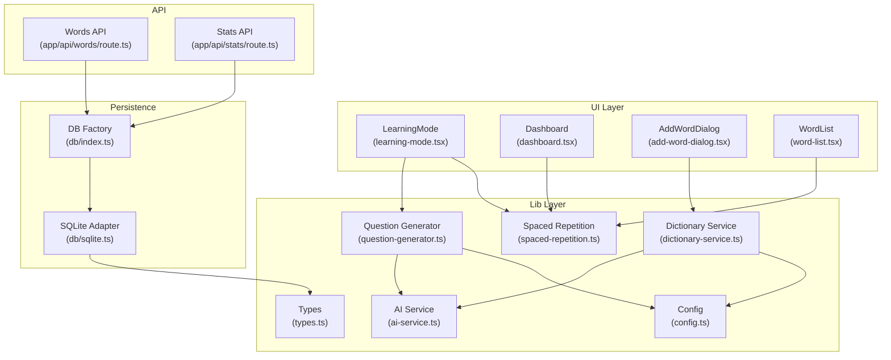
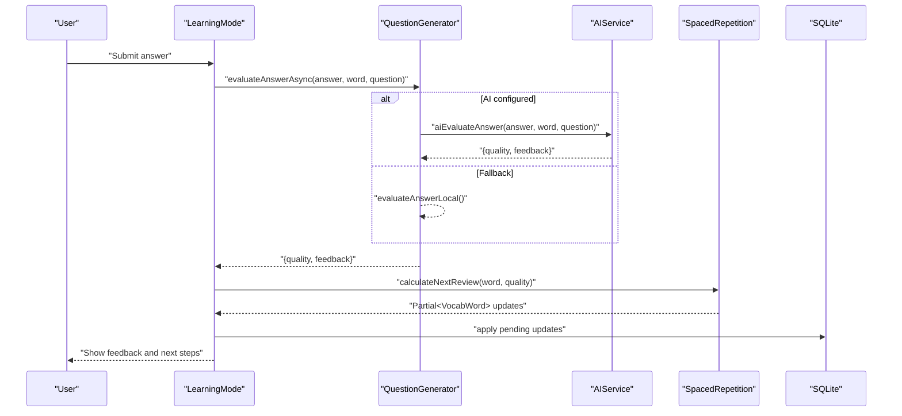
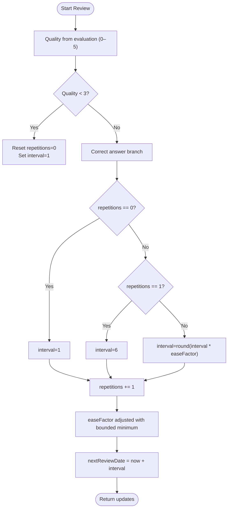
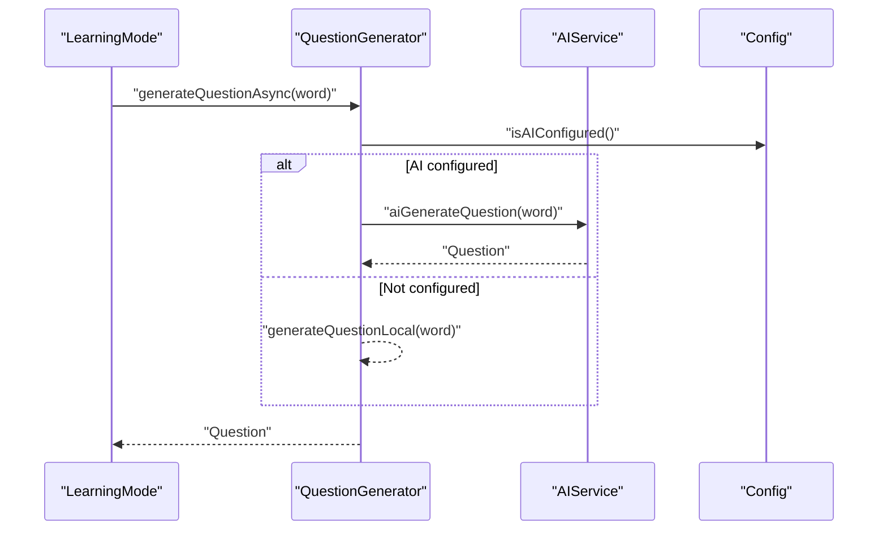
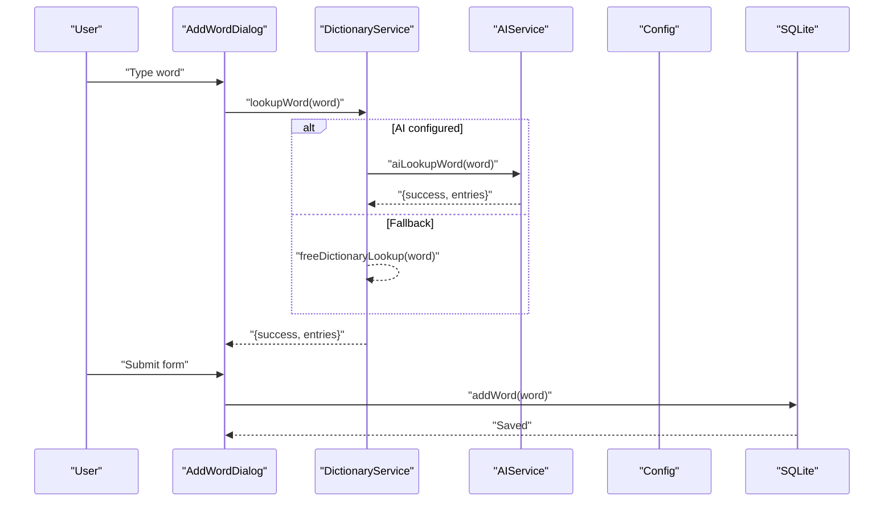
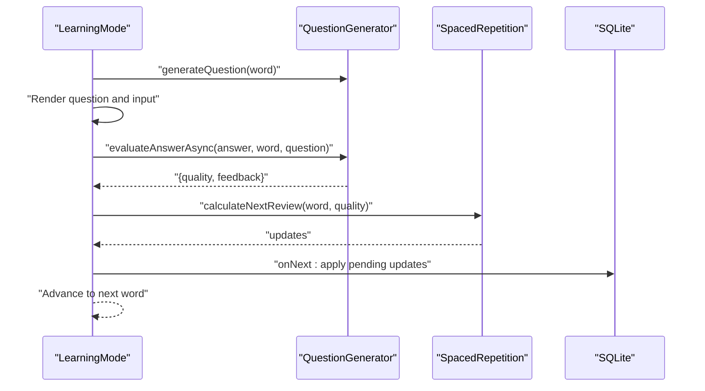
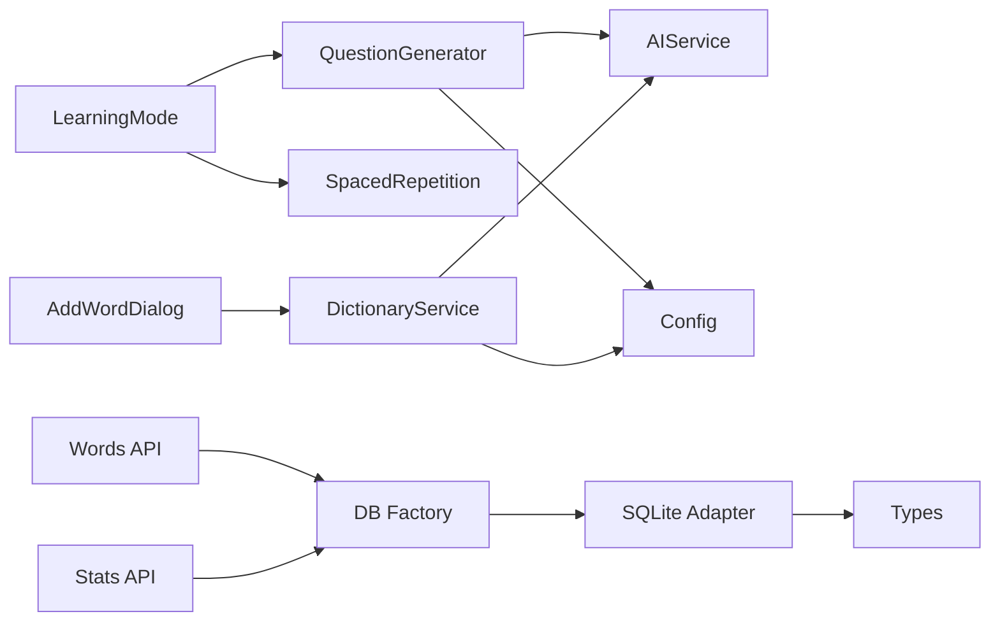

# Core Features

<cite>
**Referenced Files in This Document**
- [spaced-repetition.ts](file://lib/spaced-repetition.ts)
- [question-generator.ts](file://lib/question-generator.ts)
- [ai-service.ts](file://lib/ai-service.ts)
- [types.ts](file://lib/types.ts)
- [sqlite.ts](file://lib/db/sqlite.ts)
- [config.ts](file://lib/config.ts)
- [dictionary-service.ts](file://lib/dictionary-service.ts)
- [learning-mode.tsx](file://components/learning-mode.tsx)
- [dashboard.tsx](file://components/dashboard.tsx)
- [add-word-dialog.tsx](file://components/add-word-dialog.tsx)
- [word-list.tsx](file://components/word-list.tsx)
- [route.ts (stats)](file://app/api/stats/route.ts)
- [route.ts (words)](file://app/api/words/route.ts)
</cite>

## Table of Contents
1. [Introduction](#introduction)
2. [Project Structure](#project-structure)
3. [Core Components](#core-components)
4. [Architecture Overview](#architecture-overview)
5. [Detailed Component Analysis](#detailed-component-analysis)
6. [Dependency Analysis](#dependency-analysis)
7. [Performance Considerations](#performance-considerations)
8. [Troubleshooting Guide](#troubleshooting-guide)
9. [Conclusion](#conclusion)
10. [Appendices](#appendices)

## Introduction
This document explains VocabMaster’s core features with a focus on:
- Spaced repetition learning powered by the SM-2 algorithm
- AI-powered contextual question generation and answer evaluation
- Vocabulary management (add, bulk import, lookup, list, and deletion)
- Interactive learning interface for real-time review sessions

It covers each feature’s purpose, implementation approach, user workflows, and integration patterns. Practical examples and common scenarios are included to guide both developers and learners.

## Project Structure
VocabMaster is a Next.js application with a clear separation of concerns:
- UI components under components/ implement the interactive learning interface and vocabulary management
- Business logic under lib/ handles spaced repetition, AI services, dictionary lookups, configuration, and data persistence
- API routes under app/api/ expose CRUD and stats endpoints backed by a SQLite database



**Diagram sources**
- [learning-mode.tsx](file://components/learning-mode.tsx#L1-L370)
- [dashboard.tsx](file://components/dashboard.tsx#L1-L154)
- [add-word-dialog.tsx](file://components/add-word-dialog.tsx#L1-L297)
- [word-list.tsx](file://components/word-list.tsx#L1-L123)
- [spaced-repetition.ts](file://lib/spaced-repetition.ts#L1-L123)
- [question-generator.ts](file://lib/question-generator.ts#L1-L255)
- [ai-service.ts](file://lib/ai-service.ts#L1-L239)
- [config.ts](file://lib/config.ts#L1-L63)
- [dictionary-service.ts](file://lib/dictionary-service.ts#L1-L255)
- [types.ts](file://lib/types.ts#L1-L105)
- [db/index.ts](file://lib/db/index.ts#L1-L21)
- [sqlite.ts](file://lib/db/sqlite.ts#L1-L297)
- [route.ts (words)](file://app/api/words/route.ts#L1-L28)
- [route.ts (stats)](file://app/api/stats/route.ts#L1-L26)

**Section sources**
- [learning-mode.tsx](file://components/learning-mode.tsx#L1-L370)
- [dashboard.tsx](file://components/dashboard.tsx#L1-L154)
- [add-word-dialog.tsx](file://components/add-word-dialog.tsx#L1-L297)
- [word-list.tsx](file://components/word-list.tsx#L1-L123)
- [spaced-repetition.ts](file://lib/spaced-repetition.ts#L1-L123)
- [question-generator.ts](file://lib/question-generator.ts#L1-L255)
- [ai-service.ts](file://lib/ai-service.ts#L1-L239)
- [config.ts](file://lib/config.ts#L1-L63)
- [dictionary-service.ts](file://lib/dictionary-service.ts#L1-L255)
- [types.ts](file://lib/types.ts#L1-L105)
- [db/index.ts](file://lib/db/index.ts#L1-L21)
- [sqlite.ts](file://lib/db/sqlite.ts#L1-L297)
- [route.ts (words)](file://app/api/words/route.ts#L1-L28)
- [route.ts (stats)](file://app/api/stats/route.ts#L1-L26)

## Core Components
- Spaced Repetition (SM-2): Implements next review calculation, due word filtering, mastery computation, and statistics aggregation.
- AI Question Generation: Generates contextual questions and evaluates answers using an OpenAI-compatible endpoint with graceful fallbacks.
- Vocabulary Management: Adds single words, bulk imports, dictionary lookups, and displays word lists with mastery and due indicators.
- Interactive Learning Mode: Presents questions, collects answers, shows feedback, applies spaced repetition updates, and tracks session metrics.

**Section sources**
- [spaced-repetition.ts](file://lib/spaced-repetition.ts#L1-L123)
- [question-generator.ts](file://lib/question-generator.ts#L1-L255)
- [ai-service.ts](file://lib/ai-service.ts#L1-L239)
- [dictionary-service.ts](file://lib/dictionary-service.ts#L1-L255)
- [learning-mode.tsx](file://components/learning-mode.tsx#L1-L370)

## Architecture Overview
The system integrates UI components with domain logic and persistence:
- UI components orchestrate user actions and render state
- Question generator chooses between AI and template-based generation
- AI service communicates with an OpenAI-compatible backend
- Spaced repetition updates are applied to vocabulary records
- SQLite persists vocabulary and user statistics



**Diagram sources**
- [learning-mode.tsx](file://components/learning-mode.tsx#L76-L156)
- [question-generator.ts](file://lib/question-generator.ts#L174-L197)
- [ai-service.ts](file://lib/ai-service.ts#L162-L211)
- [spaced-repetition.ts](file://lib/spaced-repetition.ts#L9-L48)
- [sqlite.ts](file://lib/db/sqlite.ts#L190-L222)

## Detailed Component Analysis

### Spaced Repetition (SM-2) System
Purpose:
- Schedule optimal review intervals based on learner performance
- Track mastery and compute statistics for progress reporting

Implementation highlights:
- Next review calculation adjusts ease factor, interval, and repetition counts
- Due word filtering sorts overdue words and prioritizes harder words
- Mastery percentage combines repetition count, ease factor, and interval
- Statistics summarize totals, due, mastered, learning, and new words



**Diagram sources**
- [spaced-repetition.ts](file://lib/spaced-repetition.ts#L9-L48)

Practical usage:
- After each answer, call calculateNextReview with the selected quality to get updated fields
- Use getWordsForReview to retrieve the next batch of words due for review
- Use calculateMastery to display individual mastery or getStats for cohort-level insights

Common scenarios:
- Learner answers incorrectly → reset to initial intervals
- Learner answers correctly twice → jump to 6-day interval
- Learner answers correctly multiple times → exponential spacing via ease factor

**Section sources**
- [spaced-repetition.ts](file://lib/spaced-repetition.ts#L1-L123)
- [dashboard.tsx](file://components/dashboard.tsx#L16-L20)

### AI-Powered Contextual Question Generation
Purpose:
- Provide varied, grammar-focused questions that test vocabulary in context
- Offer AI-backed evaluation with structured feedback and quality scores

Implementation approach:
- AI mode: Uses an OpenAI-compatible endpoint to generate questions and evaluate answers
- Fallback mode: Template-based generation with grammar structures and hints
- Evaluation uses heuristic scoring when AI is unavailable



**Diagram sources**
- [question-generator.ts](file://lib/question-generator.ts#L101-L116)
- [ai-service.ts](file://lib/ai-service.ts#L114-L159)
- [config.ts](file://lib/config.ts#L52-L56)

User workflow:
- Learner selects “Know It” or “Don’t Know” to skip and apply a fixed quality
- Learner submits answer; system evaluates and shows feedback
- On next word, system attempts to fetch an AI question; otherwise uses template-based

Common scenarios:
- AI endpoint returns structured JSON → use parsed question
- AI endpoint fails → fall back to template-based question
- Evaluation returns structured JSON → use quality and feedback; otherwise heuristic scoring

**Section sources**
- [question-generator.ts](file://lib/question-generator.ts#L1-L255)
- [ai-service.ts](file://lib/ai-service.ts#L1-L239)
- [config.ts](file://lib/config.ts#L1-L63)

### Vocabulary Management
Purpose:
- Allow users to add words, auto-fill definitions via AI or free dictionary APIs, and manage their vocabulary list

Key capabilities:
- Single word creation with default spaced repetition fields
- Dictionary lookup with AI-first strategy and free API fallback
- Bulk import parsing (CSV, JSON, simple text)
- Word list display with mastery progress and due indicators
- Delete words and reset database state



**Diagram sources**
- [add-word-dialog.tsx](file://components/add-word-dialog.tsx#L57-L104)
- [dictionary-service.ts](file://lib/dictionary-service.ts#L21-L49)
- [ai-service.ts](file://lib/ai-service.ts#L66-L111)
- [config.ts](file://lib/config.ts#L52-L56)
- [sqlite.ts](file://lib/db/sqlite.ts#L140-L159)

User workflow:
- Enter word; optionally auto-fill definition and example
- Choose part of speech
- Submit to create a new vocabulary entry
- View list with mastery and due indicators
- Delete words as needed

Common scenarios:
- AI lookup returns multiple entries → user selects preferred definition/example
- Free API returns multiple meanings → service normalizes to a list of entries
- Bulk import detects format automatically and parses entries accordingly

**Section sources**
- [add-word-dialog.tsx](file://components/add-word-dialog.tsx#L1-L297)
- [dictionary-service.ts](file://lib/dictionary-service.ts#L1-L255)
- [sqlite.ts](file://lib/db/sqlite.ts#L128-L228)

### Interactive Learning Interface
Purpose:
- Provide a guided, responsive review experience with immediate feedback and spaced repetition updates

Key behaviors:
- Loads a question (preferably AI-generated) for the current word
- Shows grammar requirement and example when available
- Supports skipping (mark as known or unknown) with instant scheduling
- Submits answers for evaluation and displays feedback
- Applies pending spaced repetition updates on navigation to next word
- Tracks correctness and completion



**Diagram sources**
- [learning-mode.tsx](file://components/learning-mode.tsx#L76-L156)
- [question-generator.ts](file://lib/question-generator.ts#L174-L197)
- [spaced-repetition.ts](file://lib/spaced-repetition.ts#L9-L48)
- [sqlite.ts](file://lib/db/sqlite.ts#L190-L222)

User workflow:
- Start a session; see progress bar and current word
- Optionally reveal hint or grammar requirement
- Write answer and submit
- Review feedback and example usage
- Proceed to next word; on last word, complete session and report results

Common scenarios:
- AI question generation fails → continue with template-based question
- Skip known → schedule a future review
- Skip unknown → schedule a near-term review
- Session completion triggers callback with accuracy metrics

**Section sources**
- [learning-mode.tsx](file://components/learning-mode.tsx#L1-L370)
- [question-generator.ts](file://lib/question-generator.ts#L1-L255)
- [spaced-repetition.ts](file://lib/spaced-repetition.ts#L1-L123)

## Dependency Analysis
High-level dependencies:
- UI components depend on question-generation and spaced-repetition utilities
- Question generator depends on AI service and configuration
- Dictionary service depends on AI service and configuration
- Database adapter depends on typed vocabulary models
- API routes depend on the database factory and adapter



**Diagram sources**
- [learning-mode.tsx](file://components/learning-mode.tsx#L1-L370)
- [question-generator.ts](file://lib/question-generator.ts#L1-L255)
- [ai-service.ts](file://lib/ai-service.ts#L1-L239)
- [config.ts](file://lib/config.ts#L1-L63)
- [add-word-dialog.tsx](file://components/add-word-dialog.tsx#L1-L297)
- [dictionary-service.ts](file://lib/dictionary-service.ts#L1-L255)
- [db/index.ts](file://lib/db/index.ts#L1-L21)
- [sqlite.ts](file://lib/db/sqlite.ts#L1-L297)
- [types.ts](file://lib/types.ts#L1-L105)
- [route.ts (words)](file://app/api/words/route.ts#L1-L28)
- [route.ts (stats)](file://app/api/stats/route.ts#L1-L26)

**Section sources**
- [types.ts](file://lib/types.ts#L1-L105)
- [sqlite.ts](file://lib/db/sqlite.ts#L1-L297)
- [db/index.ts](file://lib/db/index.ts#L1-L21)
- [route.ts (words)](file://app/api/words/route.ts#L1-L28)
- [route.ts (stats)](file://app/api/stats/route.ts#L1-L26)

## Performance Considerations
- Database initialization and indexing: SQLite initializes tables and indices on first use; WAL mode and foreign keys are enabled for durability and referential integrity.
- Query efficiency: Indexes on next review date and word improve retrieval performance for due words and lookups.
- Network resilience: AI operations are wrapped with try/catch and fall back to template-based generation or free dictionary APIs.
- UI responsiveness: Debounced dictionary lookups reduce network calls during typing; pending updates are batch-applied on navigation to minimize re-renders.
- Tokenization and evaluation: AI evaluation uses conservative token limits and temperature settings to balance creativity and consistency.

[No sources needed since this section provides general guidance]

## Troubleshooting Guide
Common issues and resolutions:
- AI not configured: If API key is missing, AI features fall back to template-based generation and heuristic evaluation. Verify configuration via the settings dialog and ensure the key is saved.
- AI endpoint failures: Network errors or non-JSON responses trigger fallbacks. Check connectivity and endpoint URL.
- Dictionary lookup errors: Free API may return 404 or network errors. Confirm word spelling and retry.
- Database initialization: On first run, tables and indices are created automatically; sample words are seeded if empty. If corrupted, reset database state via the UI or API.
- Session updates: Pending updates are applied when navigating to the next word; ensure the session lifecycle is respected to avoid inconsistent state.

**Section sources**
- [config.ts](file://lib/config.ts#L52-L62)
- [ai-service.ts](file://lib/ai-service.ts#L53-L63)
- [dictionary-service.ts](file://lib/dictionary-service.ts#L52-L90)
- [sqlite.ts](file://lib/db/sqlite.ts#L35-L81)
- [sqlite.ts](file://lib/db/sqlite.ts#L271-L278)
- [learning-mode.tsx](file://components/learning-mode.tsx#L118-L124)

## Conclusion
VocabMaster delivers a robust, extensible vocabulary learning platform:
- Spaced repetition ensures efficient retention through scientifically grounded scheduling
- AI-powered question generation and evaluation enhance contextual learning
- Comprehensive vocabulary management supports quick onboarding and bulk growth
- An intuitive learning interface provides immediate feedback and progress tracking

By combining modular libraries, a clean UI, and resilient fallbacks, the system scales from individual learners to classroom environments.

[No sources needed since this section summarizes without analyzing specific files]

## Appendices

### Data Model Overview
```mermaid
erDiagram
WORDS {
string id PK
string word
string definition
string example
string part_of_speech
float ease_factor
int interval
int repetitions
string next_review_date
string last_review_date
string created_at
}
STATS {
int id CK
int total_words
int words_learned
int current_streak
int longest_streak
string last_study_date
}
```

**Diagram sources**
- [sqlite.ts](file://lib/db/sqlite.ts#L37-L63)
- [types.ts](file://lib/types.ts#L1-L14)
- [types.ts](file://lib/types.ts#L42-L52)

### API Endpoints
- GET /api/words: Returns all vocabulary entries
- POST /api/words: Creates a new vocabulary entry
- GET /api/stats: Returns user statistics
- PUT /api/stats: Updates user statistics

**Section sources**
- [route.ts (words)](file://app/api/words/route.ts#L1-L28)
- [route.ts (stats)](file://app/api/stats/route.ts#L1-L26)