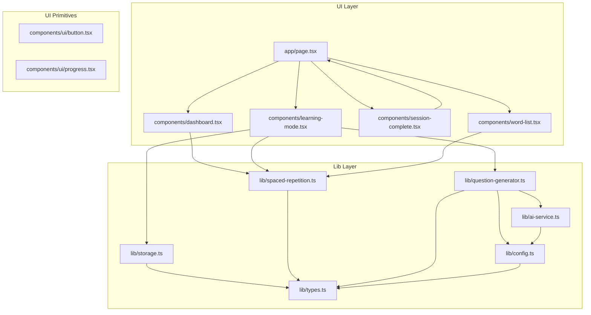
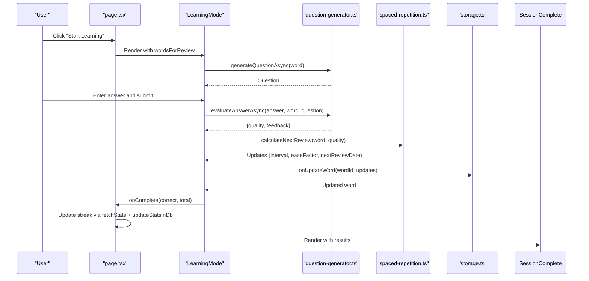
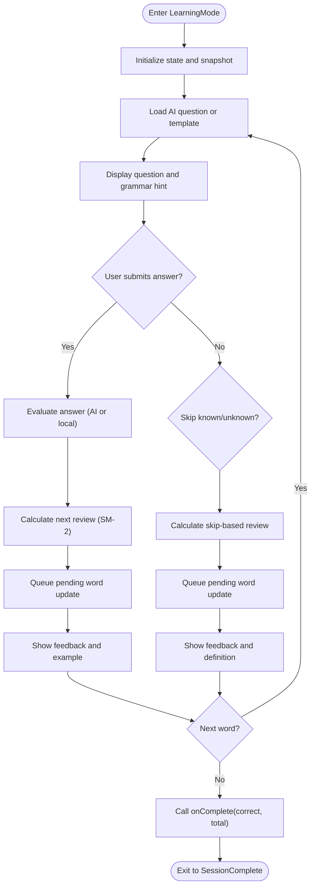
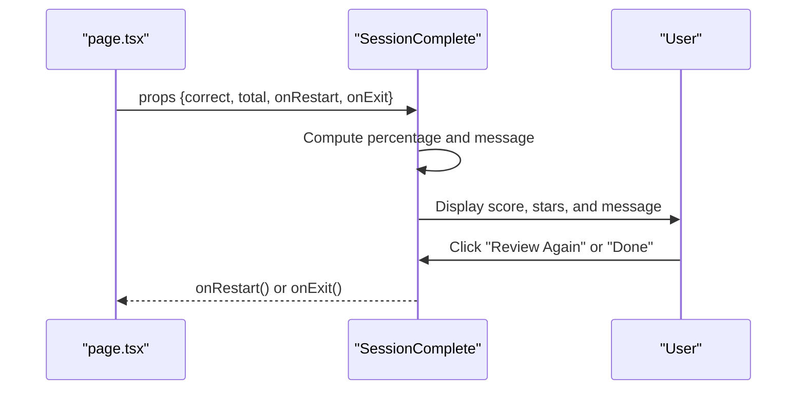
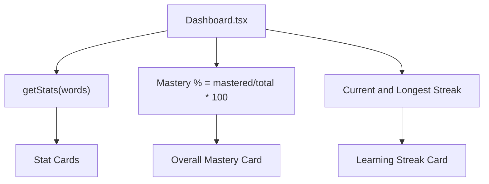
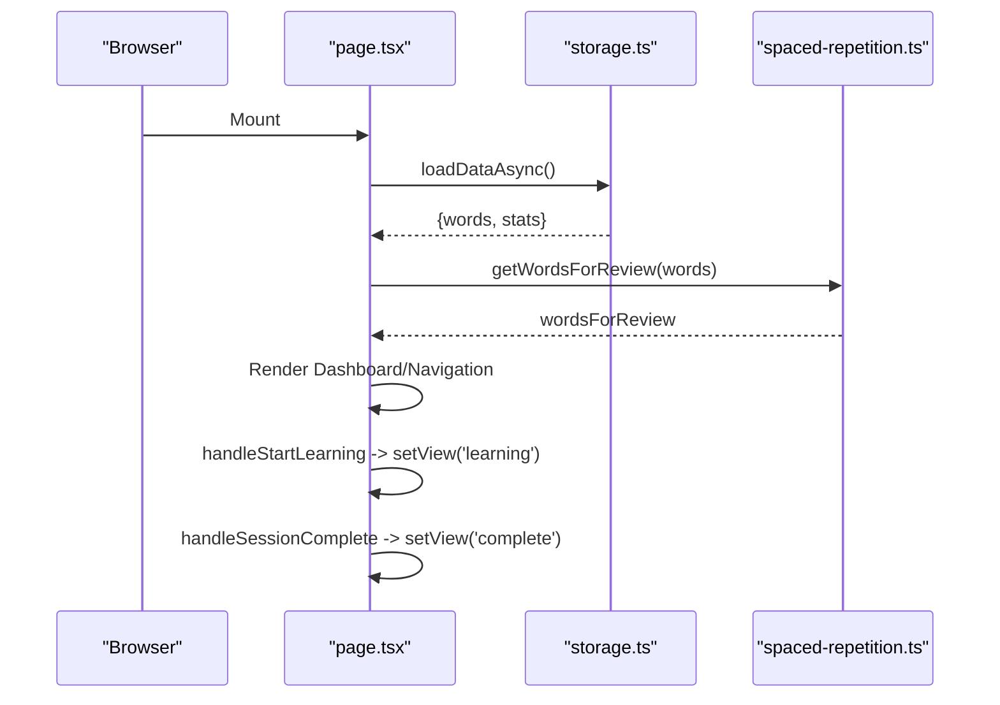
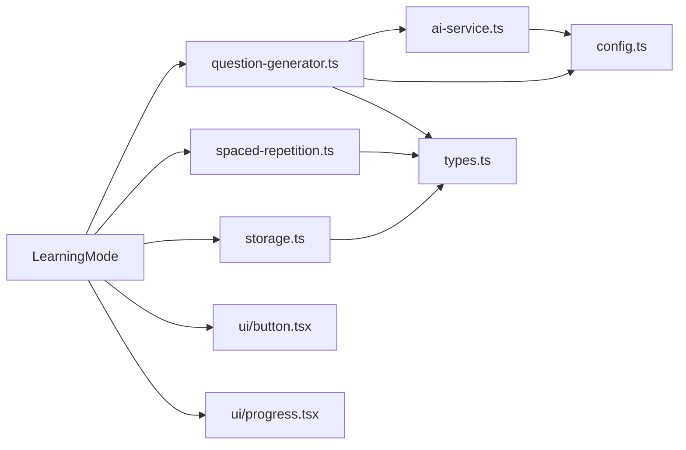
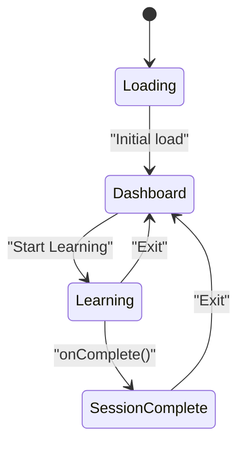
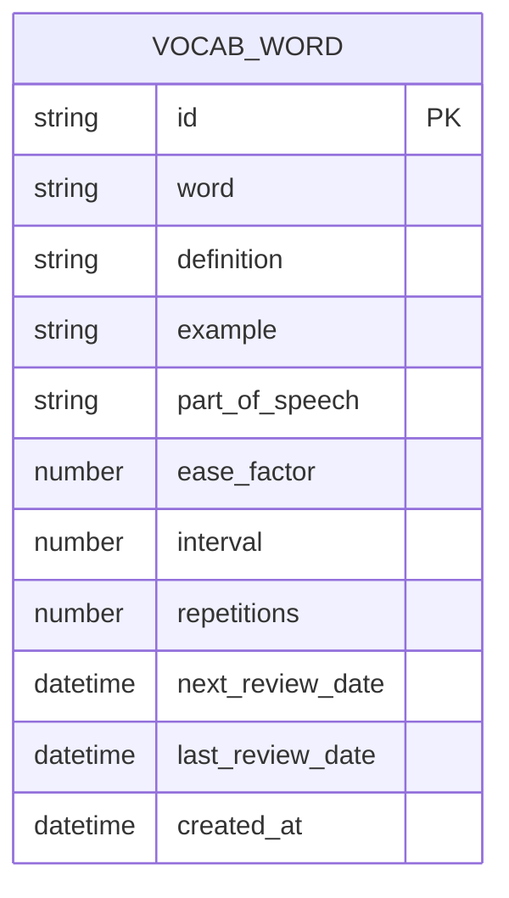

# Learning Interface

<cite>
**Referenced Files in This Document**
- [learning-mode.tsx](file://components/learning-mode.tsx)
- [session-complete.tsx](file://components/session-complete.tsx)
- [dashboard.tsx](file://components/dashboard.tsx)
- [page.tsx](file://app/page.tsx)
- [spaced-repetition.ts](file://lib/spaced-repetition.ts)
- [question-generator.ts](file://lib/question-generator.ts)
- [ai-service.ts](file://lib/ai-service.ts)
- [storage.ts](file://lib/storage.ts)
- [config.ts](file://lib/config.ts)
- [types.ts](file://lib/types.ts)
- [button.tsx](file://components/ui/button.tsx)
- [progress.tsx](file://components/ui/progress.tsx)
- [word-list.tsx](file://components/word-list.tsx)
</cite>

## Table of Contents
1. [Introduction](#introduction)
2. [Project Structure](#project-structure)
3. [Core Components](#core-components)
4. [Architecture Overview](#architecture-overview)
5. [Detailed Component Analysis](#detailed-component-analysis)
6. [Dependency Analysis](#dependency-analysis)
7. [Performance Considerations](#performance-considerations)
8. [Troubleshooting Guide](#troubleshooting-guide)
9. [Conclusion](#conclusion)
10. [Appendices](#appendices)

## Introduction
This document provides comprehensive documentation for the interactive learning interface components of the vocabulary learning application. It focuses on:
- LearningMode: question presentation, answer evaluation, progress tracking, and integration with the spaced repetition system
- SessionComplete: lesson completion and performance feedback
- Dashboard: overview statistics, progress visualization, and user engagement metrics
It also covers user interaction patterns, state management, session lifecycle, integration with the spaced repetition system, responsive design considerations, accessibility features, and user experience optimization techniques.

## Project Structure
The learning interface is built with Next.js and React, using a component-driven architecture. The main application orchestrates three primary views:
- Dashboard: overview and statistics
- Learning Mode: interactive review sessions
- Session Complete: performance summary

**Diagram sources**
- [page.tsx](file://app/page.tsx#L27-L121)
- [dashboard.tsx](file://components/dashboard.tsx#L16-L154)
- [learning-mode.tsx](file://components/learning-mode.tsx#L35-L370)
- [session-complete.tsx](file://components/session-complete.tsx#L15-L73)
- [word-list.tsx](file://components/word-list.tsx#L17-L123)
- [storage.ts](file://lib/storage.ts#L77-L84)
- [spaced-repetition.ts](file://lib/spaced-repetition.ts#L108-L122)
- [question-generator.ts](file://lib/question-generator.ts#L101-L171)
- [ai-service.ts](file://lib/ai-service.ts#L114-L159)
- [config.ts](file://lib/config.ts#L23-L56)
- [button.tsx](file://components/ui/button.tsx#L5-L32)
- [progress.tsx](file://components/ui/progress.tsx#L10-L37)

**Section sources**
- [page.tsx](file://app/page.tsx#L27-L121)

## Core Components
- LearningMode: Presents vocabulary questions, collects answers, evaluates quality, provides feedback, tracks progress, and integrates with spaced repetition to schedule next reviews.
- SessionComplete: Displays performance summary, stars-based rating, and actions to restart or exit.
- Dashboard: Shows totals, due words, mastery, current and longest streaks, and progress visuals.

**Section sources**
- [learning-mode.tsx](file://components/learning-mode.tsx#L35-L370)
- [session-complete.tsx](file://components/session-complete.tsx#L15-L73)
- [dashboard.tsx](file://components/dashboard.tsx#L16-L154)

## Architecture Overview
The learning interface follows a unidirectional data flow:
- The parent component (page.tsx) manages global state and navigation among views.
- LearningMode receives a curated subset of words due for review and updates individual word records via callbacks.
- Question generation and evaluation leverage AI when configured; otherwise, local heuristics are used.
- Spaced repetition calculates next review intervals and updates word metadata.
- Storage persists word updates and statistics asynchronously.

**Diagram sources**
- [page.tsx](file://app/page.tsx#L93-L117)
- [learning-mode.tsx](file://components/learning-mode.tsx#L76-L156)
- [question-generator.ts](file://lib/question-generator.ts#L101-L188)
- [spaced-repetition.ts](file://lib/spaced-repetition.ts#L9-L48)
- [storage.ts](file://lib/storage.ts#L41-L53)

## Detailed Component Analysis

### LearningMode Component
LearningMode is the core interactive review screen. It:
- Maintains a local session snapshot of words to prevent mid-session mutations.
- Manages state for current index, answer text, feedback visibility, quality, and counters for correct/skipped words.
- Generates questions using AI when configured; otherwise falls back to template-based generation.
- Evaluates answers using AI when configured; otherwise applies heuristic scoring.
- Integrates with spaced repetition to compute next review scheduling and updates word records.
- Provides immediate feedback, hints, grammar reminders, and progress tracking.

Key behaviors and interactions:
- Question lifecycle: On mount and on word change, attempts to generate AI questions; falls back to templates if unavailable.
- Answer submission: Validates input, disables while evaluating, computes quality and feedback, and schedules next review.
- Skipping: Allows skipping known or unknown words with immediate feedback and adjusted scheduling.
- Progress: Tracks completed words and displays a progress bar.
- Exit: Exits to dashboard or completes session.

**Diagram sources**
- [learning-mode.tsx](file://components/learning-mode.tsx#L35-L156)
- [question-generator.ts](file://lib/question-generator.ts#L101-L188)
- [spaced-repetition.ts](file://lib/spaced-repetition.ts#L9-L48)

**Section sources**
- [learning-mode.tsx](file://components/learning-mode.tsx#L35-L370)
- [question-generator.ts](file://lib/question-generator.ts#L101-L188)
- [spaced-repetition.ts](file://lib/spaced-repetition.ts#L9-L48)
- [button.tsx](file://components/ui/button.tsx#L5-L32)
- [progress.tsx](file://components/ui/progress.tsx#L10-L37)

### SessionComplete Component
SessionComplete presents a performance summary after a learning session:
- Calculates percentage and selects a celebratory message and emoji based on score.
- Renders a star rating proportional to the score.
- Provides actions to review again or exit to the dashboard.

**Diagram sources**
- [session-complete.tsx](file://components/session-complete.tsx#L15-L73)
- [page.tsx](file://app/page.tsx#L111-L117)

**Section sources**
- [session-complete.tsx](file://components/session-complete.tsx#L15-L73)
- [page.tsx](file://app/page.tsx#L111-L117)

### Dashboard Component
Dashboard provides an overview of learning progress:
- Displays four stat cards: Total Words, Due Today, Mastered, Current Streak.
- Shows overall mastery percentage with a progress bar and breakdown by learning stages.
- Displays current and longest streak with a progress bar and motivational note.

**Diagram sources**
- [dashboard.tsx](file://components/dashboard.tsx#L16-L154)
- [spaced-repetition.ts](file://lib/spaced-repetition.ts#L108-L122)

**Section sources**
- [dashboard.tsx](file://components/dashboard.tsx#L16-L154)
- [spaced-repetition.ts](file://lib/spaced-repetition.ts#L108-L122)

### Parent Orchestrator (page.tsx)
The parent orchestrates navigation, data loading, and session lifecycle:
- Loads words and stats on mount.
- Computes words due for review and stats for display.
- Handles starting learning, completing sessions, updating streaks, and navigating between views.
- Manages dialogs for adding and importing words and configuring AI.

**Diagram sources**
- [page.tsx](file://app/page.tsx#L41-L53)
- [page.tsx](file://app/page.tsx#L93-L117)
- [storage.ts](file://lib/storage.ts#L77-L84)
- [spaced-repetition.ts](file://lib/spaced-repetition.ts#L51-L68)

**Section sources**
- [page.tsx](file://app/page.tsx#L29-L121)
- [storage.ts](file://lib/storage.ts#L77-L84)
- [spaced-repetition.ts](file://lib/spaced-repetition.ts#L51-L68)

## Dependency Analysis
LearningMode depends on:
- Question generation (AI or local templates)
- Spaced repetition calculations
- Storage updates for word metadata
- UI primitives for buttons and progress bars

**Diagram sources**
- [learning-mode.tsx](file://components/learning-mode.tsx#L11-L13)
- [question-generator.ts](file://lib/question-generator.ts#L1-L4)
- [ai-service.ts](file://lib/ai-service.ts#L1-L4)
- [config.ts](file://lib/config.ts#L23-L56)
- [spaced-repetition.ts](file://lib/spaced-repetition.ts#L1-L1)
- [storage.ts](file://lib/storage.ts#L1-L1)
- [button.tsx](file://components/ui/button.tsx#L1-L54)
- [progress.tsx](file://components/ui/progress.tsx#L1-L41)

**Section sources**
- [learning-mode.tsx](file://components/learning-mode.tsx#L11-L13)
- [question-generator.ts](file://lib/question-generator.ts#L1-L4)
- [spaced-repetition.ts](file://lib/spaced-repetition.ts#L1-L1)
- [storage.ts](file://lib/storage.ts#L1-L1)
- [button.tsx](file://components/ui/button.tsx#L1-L54)
- [progress.tsx](file://components/ui/progress.tsx#L1-L41)

## Performance Considerations
- Asynchronous question and evaluation: Uses async APIs to avoid blocking the UI during AI generation and evaluation.
- Local state batching: Pending updates are queued and applied when moving to the next word to minimize re-renders.
- Efficient rendering: Uses memoization-friendly patterns and avoids unnecessary re-computation of derived values.
- Responsive design: Utilizes Tailwind utilities for responsive layouts and adaptive spacing.
- Accessibility: Progress bars expose ARIA attributes; buttons support keyboard navigation and focus styles.

[No sources needed since this section provides general guidance]

## Troubleshooting Guide
Common issues and resolutions:
- AI not configured: If the AI API key is missing, question generation and evaluation fall back to local heuristics. Verify configuration in settings.
- Network errors: API calls to the backend may fail; ensure network connectivity and backend availability.
- Streak not updating: Streak calculation occurs client-side and syncs to the database; verify that the session completion triggers the update flow.
- No words due: LearningMode shows a friendly message when no words are due; add more words or adjust scheduling.

**Section sources**
- [config.ts](file://lib/config.ts#L53-L56)
- [question-generator.ts](file://lib/question-generator.ts#L101-L111)
- [page.tsx](file://app/page.tsx#L97-L109)
- [learning-mode.tsx](file://components/learning-mode.tsx#L158-L173)

## Conclusion
The learning interface combines an intuitive review flow with robust spaced repetition integration. LearningMode provides immediate feedback and adaptive scheduling, SessionComplete delivers performance insights, and Dashboard offers a comprehensive overview. The system balances AI-powered personalization with reliable fallbacks, ensuring a smooth and motivating user experience across devices.

[No sources needed since this section summarizes without analyzing specific files]

## Appendices

### Session Lifecycle and State Management
- Initialization: Parent loads data and computes words due for review.
- Learning: LearningMode maintains a session snapshot and local state for each word.
- Evaluation: Answers are evaluated asynchronously; quality determines next review scheduling.
- Persistence: Word updates are applied via storage callbacks; session completion updates streaks.
- Completion: SessionComplete renders performance metrics and actions.

**Diagram sources**
- [page.tsx](file://app/page.tsx#L41-L53)
- [page.tsx](file://app/page.tsx#L93-L117)
- [learning-mode.tsx](file://components/learning-mode.tsx#L126-L129)
- [session-complete.tsx](file://components/session-complete.tsx#L15-L73)

### Accessibility and UX Features
- Keyboard navigation: Buttons and inputs support tabbing and enter key activation.
- Focus management: Buttons expose focus-visible rings; progress bars include ARIA roles.
- Visual feedback: Animated transitions, gradient accents, and clear status indicators.
- Responsive layout: Grids adapt to mobile and desktop; floating action button for quick actions.

**Section sources**
- [button.tsx](file://components/ui/button.tsx#L5-L32)
- [progress.tsx](file://components/ui/progress.tsx#L10-L37)
- [page.tsx](file://app/page.tsx#L283-L291)

### Data Model Overview
The vocabulary word model includes spaced repetition fields and timestamps used for scheduling and progress tracking.

**Diagram sources**
- [types.ts](file://lib/types.ts#L1-L14)