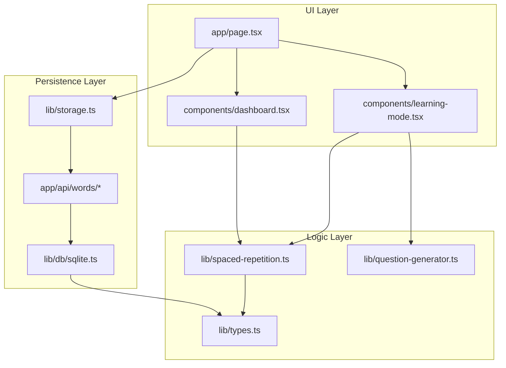
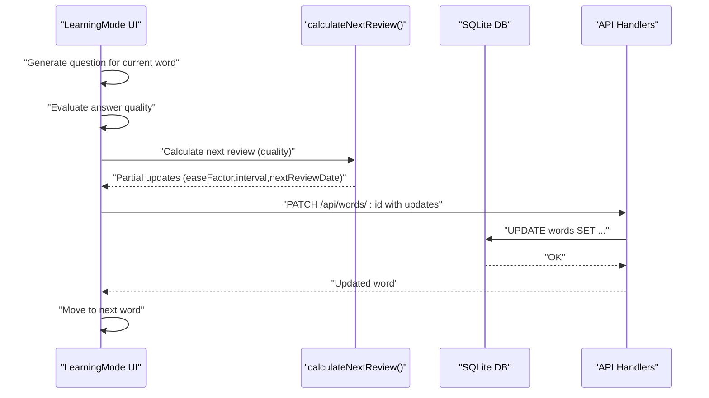
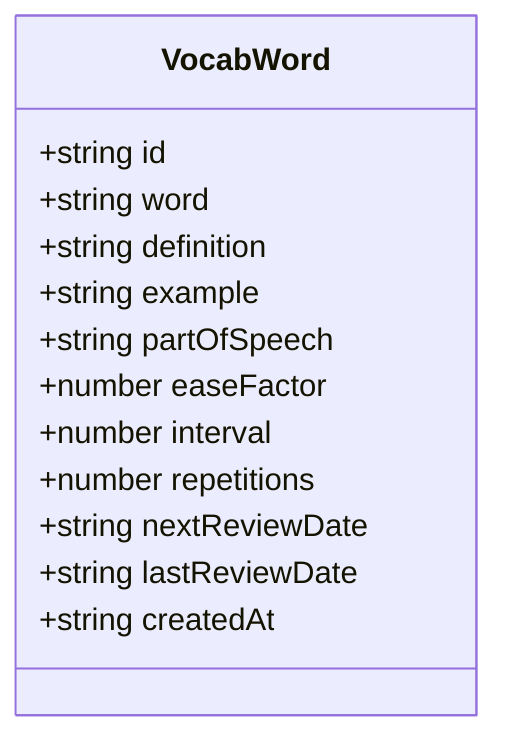
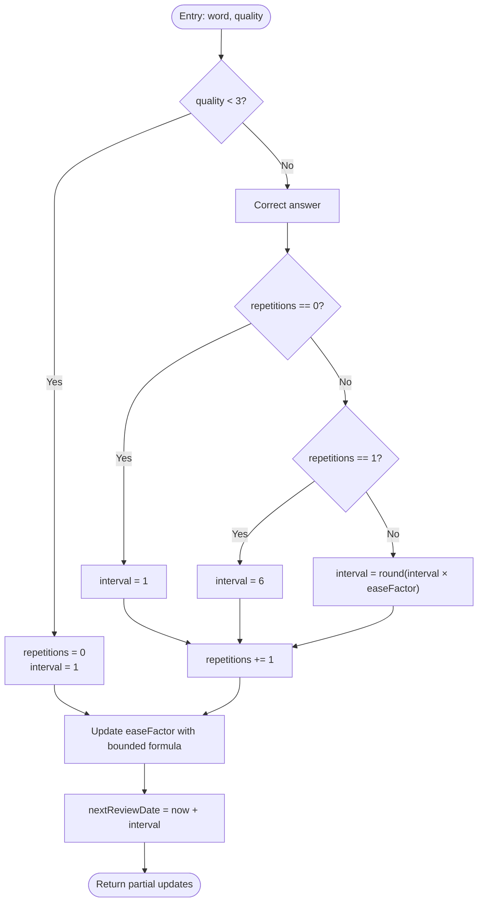
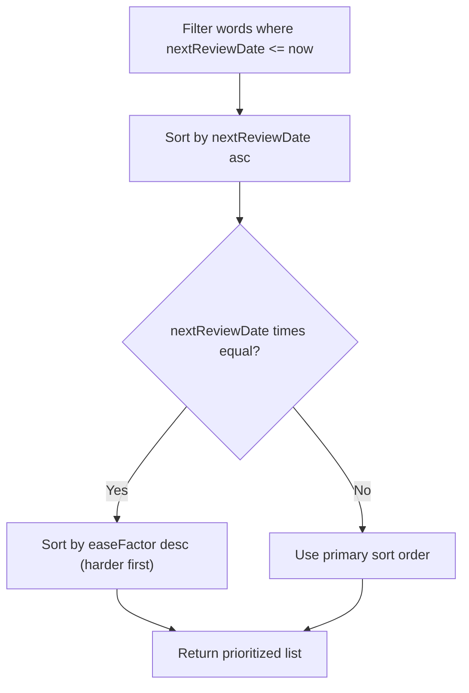
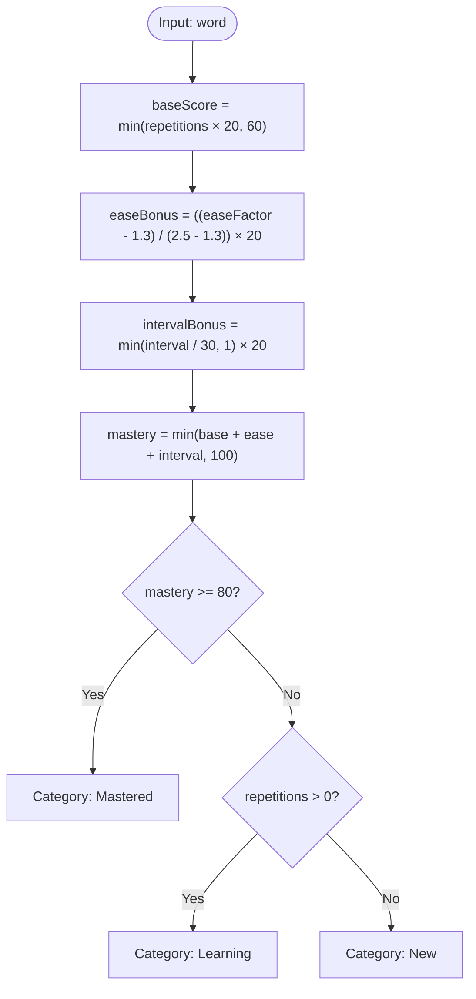
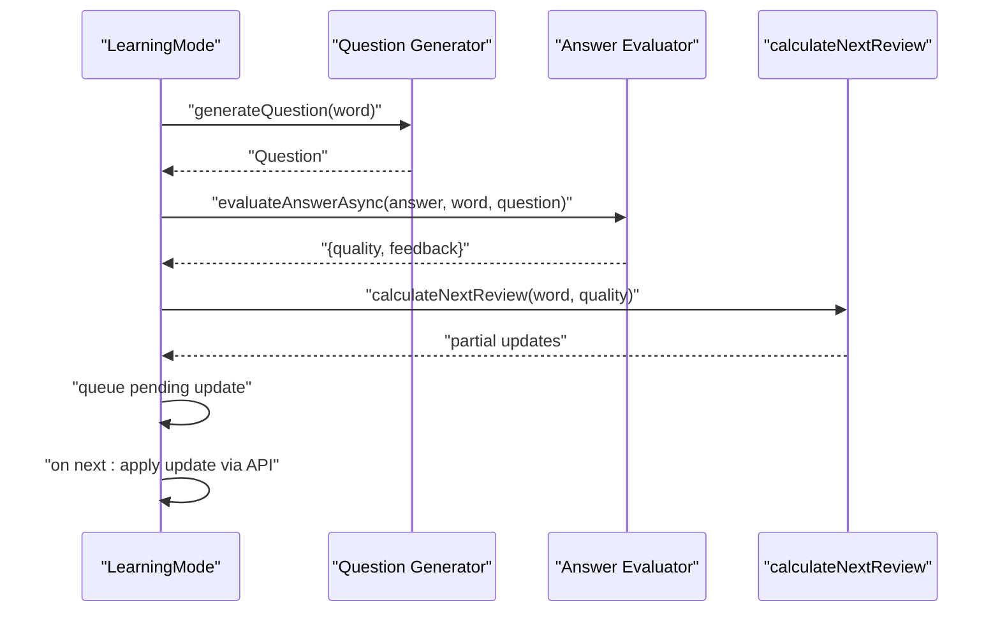
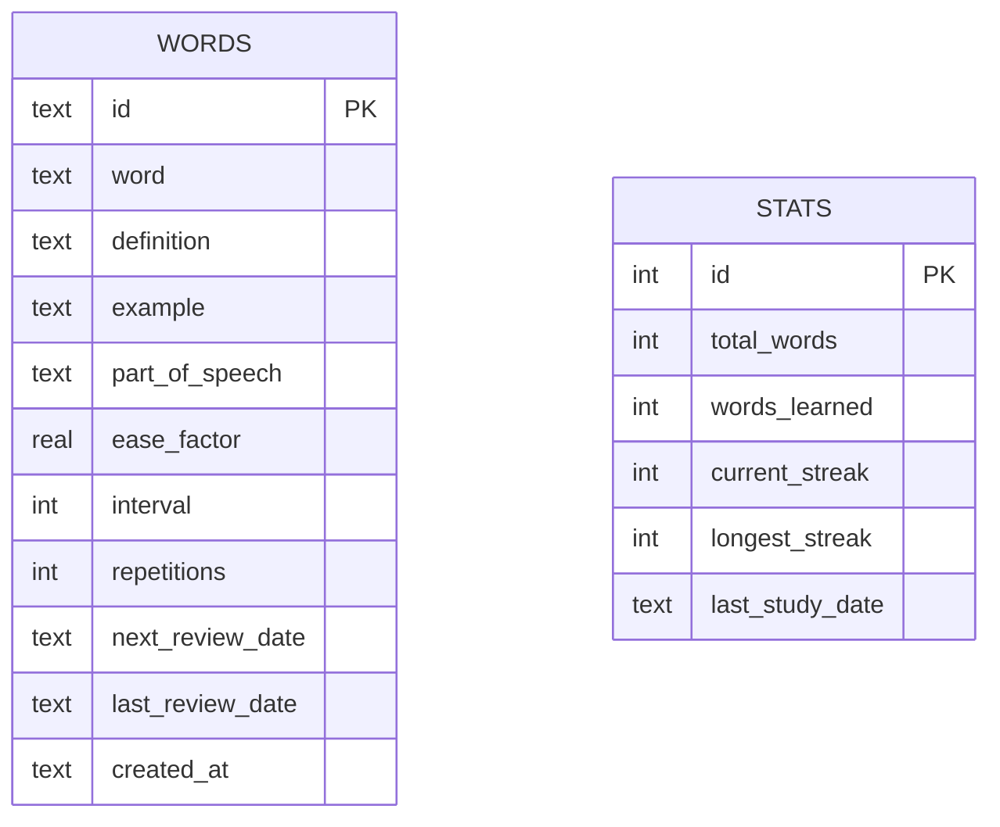
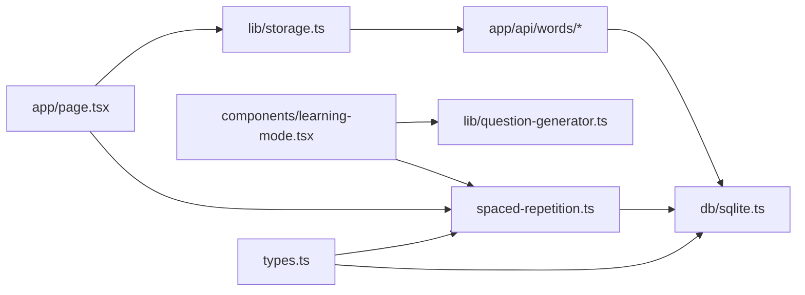

# Spaced Repetition System

<cite>
**Referenced Files in This Document**
- [spaced-repetition.ts](file://lib/spaced-repetition.ts)
- [types.ts](file://lib/types.ts)
- [sqlite.ts](file://lib/db/sqlite.ts)
- [storage.ts](file://lib/storage.ts)
- [page.tsx](file://app/page.tsx)
- [learning-mode.tsx](file://components/learning-mode.tsx)
- [dashboard.tsx](file://components/dashboard.tsx)
- [route.ts](file://app/api/words/route.ts)
- [bulk-route.ts](file://app/api/words/bulk/route.ts)
- [question-generator.ts](file://lib/question-generator.ts)
</cite>

## Table of Contents
1. [Introduction](#introduction)
2. [Project Structure](#project-structure)
3. [Core Components](#core-components)
4. [Architecture Overview](#architecture-overview)
5. [Detailed Component Analysis](#detailed-component-analysis)
6. [Dependency Analysis](#dependency-analysis)
7. [Performance Considerations](#performance-considerations)
8. [Troubleshooting Guide](#troubleshooting-guide)
9. [Conclusion](#conclusion)
10. [Appendices](#appendices)

## Introduction
This document explains the Spaced Repetition System (SR) implementation powering VocabMaster’s vocabulary learning. It focuses on the SM-2 algorithm, the VocabWord data model, scheduling logic, review prioritization, mastery calculation, categorization (new, learning, mastered), and integration with the learning interface. Practical examples illustrate review scheduling, quality rating impact, and performance metrics.

## Project Structure
The SR system spans several layers:
- Data model and types define the VocabWord entity and related interfaces.
- Spaced repetition logic implements the SM-2 algorithm and scheduling utilities.
- Database layer persists words and statistics with SQLite.
- Storage abstraction exposes asynchronous APIs for the UI.
- Learning interface drives user interactions and applies SR updates.

**Diagram sources**
- [page.tsx](file://app/page.tsx#L1-L316)
- [learning-mode.tsx](file://components/learning-mode.tsx#L1-L370)
- [dashboard.tsx](file://components/dashboard.tsx#L1-L154)
- [spaced-repetition.ts](file://lib/spaced-repetition.ts#L1-L123)
- [types.ts](file://lib/types.ts#L1-L105)
- [question-generator.ts](file://lib/question-generator.ts#L1-L255)
- [storage.ts](file://lib/storage.ts#L1-L137)
- [route.ts](file://app/api/words/route.ts#L1-L28)
- [bulk-route.ts](file://app/api/words/bulk/route.ts#L1-L19)
- [sqlite.ts](file://lib/db/sqlite.ts#L1-L297)

**Section sources**
- [page.tsx](file://app/page.tsx#L1-L316)
- [spaced-repetition.ts](file://lib/spaced-repetition.ts#L1-L123)
- [sqlite.ts](file://lib/db/sqlite.ts#L1-L297)

## Core Components
- VocabWord data model: stores SM-2 fields (easeFactor, interval, repetitions) plus metadata and scheduling fields.
- SM-2 algorithm: calculates next review interval and updates easeFactor based on quality ratings.
- Review prioritization: selects words due today and sorts by overdue amount and difficulty (easeFactor).
- Mastery calculation: computes a percentage score combining repetitions, easeFactor, and interval.
- Categorization: classifies words as new, learning, or mastered based on repetitions and mastery thresholds.
- Learning interface: presents questions, evaluates answers, and applies SR updates.

**Section sources**
- [types.ts](file://lib/types.ts#L1-L105)
- [spaced-repetition.ts](file://lib/spaced-repetition.ts#L8-L123)
- [learning-mode.tsx](file://components/learning-mode.tsx#L35-L156)

## Architecture Overview
The system integrates the SM-2 algorithm with a React UI and SQLite backend. The learning flow:
- UI loads words and filters those due for review.
- Learner answers questions generated by the question generator.
- Quality rating triggers SR update calculations.
- Pending updates are applied to the database asynchronously.

**Diagram sources**
- [learning-mode.tsx](file://components/learning-mode.tsx#L76-L156)
- [spaced-repetition.ts](file://lib/spaced-repetition.ts#L9-L48)
- [route.ts](file://app/api/words/route.ts#L1-L28)
- [sqlite.ts](file://lib/db/sqlite.ts#L190-L222)

## Detailed Component Analysis

### VocabWord Data Model
The VocabWord entity encapsulates the SM-2 state and metadata:
- easeFactor: SM-2 ease factor (initially 2.5).
- interval: Days until next review.
- repetitions: Count of successful reviews.
- nextReviewDate: ISO date string for due date.
- lastReviewDate: ISO date string for last review.
- Additional fields: word, definition, example, partOfSpeech, createdAt.

**Diagram sources**
- [types.ts](file://lib/types.ts#L1-L14)

**Section sources**
- [types.ts](file://lib/types.ts#L1-L14)

### SM-2 Algorithm Implementation
The algorithm updates memory stability and scheduling:
- Quality threshold: answers with quality less than 3 are treated as incorrect.
- Interval progression:
  - First correct: interval becomes 1.
  - Second correct: interval becomes 6.
  - Subsequent correct: interval = round(interval × easeFactor).
- Ease factor update: easeFactor is adjusted by a formula based on quality, bounded below by 1.3.
- Next review date: computed by adding interval to current date.

**Diagram sources**
- [spaced-repetition.ts](file://lib/spaced-repetition.ts#L9-L48)

**Section sources**
- [spaced-repetition.ts](file://lib/spaced-repetition.ts#L9-L48)

### Review Prioritization and Scheduling
- Due words: selected when nextReviewDate is today or earlier.
- Sorting criteria:
  - Primary: earliest overdue date.
  - Secondary: harder words first (higher easeFactor).
- New word creation: initializes easeFactor=2.5, interval=0, repetitions=0, nextReviewDate=today.

**Diagram sources**
- [spaced-repetition.ts](file://lib/spaced-repetition.ts#L51-L68)

**Section sources**
- [spaced-repetition.ts](file://lib/spaced-repetition.ts#L51-L68)
- [spaced-repetition.ts](file://lib/spaced-repetition.ts#L71-L91)

### Mastery Calculation and Categorization
- Mastery score combines:
  - Base from repetitions (up to 60%).
  - Bonus from easeFactor (normalized 0–20%).
  - Bonus from interval (normalized 0–20%).
- Categories:
  - New: repetitions == 0.
  - Learning: repetitions > 0 and mastery < 80%.
  - Mastered: mastery >= 80%.

**Diagram sources**
- [spaced-repetition.ts](file://lib/spaced-repetition.ts#L98-L105)
- [spaced-repetition.ts](file://lib/spaced-repetition.ts#L108-L122)

**Section sources**
- [spaced-repetition.ts](file://lib/spaced-repetition.ts#L98-L122)

### Learning Interface Integration
- Generates questions and evaluates answers.
- On submission:
  - Evaluates answer quality asynchronously.
  - Computes SR updates and queues them for application.
  - Applies updates on navigation to the next word.
- Provides skip actions:
  - Skip known: quality 5, schedules next review soon.
  - Skip unknown: quality 1, resets to daily review.

**Diagram sources**
- [learning-mode.tsx](file://components/learning-mode.tsx#L76-L156)
- [question-generator.ts](file://lib/question-generator.ts#L101-L116)
- [question-generator.ts](file://lib/question-generator.ts#L174-L188)
- [spaced-repetition.ts](file://lib/spaced-repetition.ts#L9-L48)

**Section sources**
- [learning-mode.tsx](file://components/learning-mode.tsx#L35-L156)
- [question-generator.ts](file://lib/question-generator.ts#L101-L188)

### Database and Persistence
- SQLite schema includes words and stats tables with indices for efficient queries.
- CRUD operations for words support creation, updates, and bulk inserts.
- Stats synchronization keeps totals consistent with word counts.

**Diagram sources**
- [sqlite.ts](file://lib/db/sqlite.ts#L37-L63)
- [sqlite.ts](file://lib/db/sqlite.ts#L128-L222)

**Section sources**
- [sqlite.ts](file://lib/db/sqlite.ts#L37-L81)
- [sqlite.ts](file://lib/db/sqlite.ts#L128-L222)

## Dependency Analysis
- UI depends on spaced repetition utilities for filtering and stats.
- Learning interface depends on question generation and SR updates.
- Storage layer abstracts API calls to the backend.
- Backend routes persist updates to SQLite.

**Diagram sources**
- [types.ts](file://lib/types.ts#L1-L105)
- [spaced-repetition.ts](file://lib/spaced-repetition.ts#L1-L123)
- [sqlite.ts](file://lib/db/sqlite.ts#L1-L297)
- [page.tsx](file://app/page.tsx#L1-L316)
- [storage.ts](file://lib/storage.ts#L1-L137)
- [learning-mode.tsx](file://components/learning-mode.tsx#L1-L370)
- [question-generator.ts](file://lib/question-generator.ts#L1-L255)
- [route.ts](file://app/api/words/route.ts#L1-L28)
- [bulk-route.ts](file://app/api/words/bulk/route.ts#L1-L19)

**Section sources**
- [page.tsx](file://app/page.tsx#L1-L316)
- [spaced-repetition.ts](file://lib/spaced-repetition.ts#L1-L123)
- [sqlite.ts](file://lib/db/sqlite.ts#L1-L297)

## Performance Considerations
- Filtering and sorting:
  - Filter due words by comparing nextReviewDate to current time.
  - Sort by overdue date and easeFactor; keep lists reasonably sized for UI rendering.
- Database:
  - Indexes on next_review_date and word improve query performance.
  - Batch operations (bulk insert) reduce transaction overhead.
- Client-side updates:
  - Queue SR updates per word and apply them on navigation to minimize API calls.
- Asynchronous evaluation:
  - Use async question generation and evaluation to avoid blocking the UI.

[No sources needed since this section provides general guidance]

## Troubleshooting Guide
- Incorrect scheduling after low-quality answers:
  - Ensure quality < 3 resets repetitions and sets interval to 1.
- Ease factor bounds:
  - Verify easeFactor is clamped to a minimum of 1.3.
- Overdue words not appearing:
  - Confirm nextReviewDate is stored as ISO string and comparison uses Date parsing.
- Stats discrepancies:
  - After bulk operations, ensure stats totals are recalculated and synchronized.
- API errors:
  - Inspect network responses for 4xx/5xx statuses and log messages from handlers.

**Section sources**
- [spaced-repetition.ts](file://lib/spaced-repetition.ts#L15-L35)
- [sqlite.ts](file://lib/db/sqlite.ts#L222-L228)
- [route.ts](file://app/api/words/route.ts#L10-L13)
- [bulk-route.ts](file://app/api/words/bulk/route.ts#L14-L17)

## Conclusion
VocabMaster’s SR system implements a robust SM-2 algorithm integrated with a React UI and SQLite persistence. The design emphasizes correctness of scheduling, intuitive prioritization, and clear mastery metrics. The learning interface cleanly separates question generation, evaluation, and SR updates, while the backend ensures reliable persistence and indexing for performance.

[No sources needed since this section summarizes without analyzing specific files]

## Appendices

### Practical Examples

- Example 1: First correct recall
  - Input: repetitions=0, easeFactor=2.5, quality=5
  - Expected: interval=1, repetitions=1, nextReviewDate=tomorrow
  - Impact: Moves word from new to learning.

- Example 2: Second correct recall
  - Input: repetitions=1, easeFactor=2.5, quality=4
  - Expected: interval=6, repetitions=2, nextReviewDate=6 days from now
  - Impact: Increases spacing to consolidate memory.

- Example 3: Incorrect recall
  - Input: repetitions=2, easeFactor=2.7, quality=1
  - Expected: repetitions=0, interval=1, nextReviewDate=tomorrow
  - Impact: Resets to daily review to rebuild confidence.

- Example 4: Quality rating effect on easeFactor
  - Lower quality reduces easeFactor (bounded), increasing difficulty for future reviews.
  - Higher quality increases easeFactor, extending intervals.

- Example 5: Mastery calculation
  - High repetitions, higher easeFactor, and larger interval contribute to mastery near 100%.
  - Words with moderate repetitions and lower easeFactor remain in learning category.

- Example 6: Review prioritization
  - Overdue words appear first; among equally overdue, harder words (higher easeFactor) are prioritized.

- Example 7: Performance metrics
  - Dashboard shows total words, due today, mastered, learning, and new counts.
  - Overall mastery percentage derived from mastered vs. total words.

**Section sources**
- [spaced-repetition.ts](file://lib/spaced-repetition.ts#L9-L48)
- [spaced-repetition.ts](file://lib/spaced-repetition.ts#L98-L122)
- [dashboard.tsx](file://components/dashboard.tsx#L16-L20)

### Edge Cases and Algorithm Variations
- Edge case: Very high easeFactor
  - Interval grows exponentially; ensure rounding to integer and reasonable caps in UI.
- Edge case: Negative or zero intervals
  - Use Math.max to ensure positive intervals; schedule at least tomorrow.
- Edge case: Quality out of range
  - Clamp quality to 0–5; treat values outside as incorrect (quality < 3).
- Edge case: Initial word creation
  - nextReviewDate set to today so new words appear immediately for review.
- Algorithm variation: Hard/easy thresholds
  - Current implementation treats quality < 3 as incorrect; adjust thresholds if desired.
- Algorithm variation: Minimum interval
  - Enforce a minimum interval (e.g., 1 day) to avoid infinite delays.

**Section sources**
- [spaced-repetition.ts](file://lib/spaced-repetition.ts#L15-L35)
- [spaced-repetition.ts](file://lib/spaced-repetition.ts#L37-L47)
- [spaced-repetition.ts](file://lib/spaced-repetition.ts#L71-L91)

### Integration Notes
- Learning interface:
  - Uses getWordsForReview to present words due today.
  - Applies SR updates via API on word transitions.
- Dashboard:
  - Uses getStats to compute counts and overall mastery percentage.
- Backend:
  - Routes expose CRUD operations for words and stats.
  - SQLite handles persistence with indices for performance.

**Section sources**
- [page.tsx](file://app/page.tsx#L119-L120)
- [dashboard.tsx](file://components/dashboard.tsx#L16-L20)
- [route.ts](file://app/api/words/route.ts#L1-L28)
- [bulk-route.ts](file://app/api/words/bulk/route.ts#L1-L19)
- [sqlite.ts](file://lib/db/sqlite.ts#L61-L62)