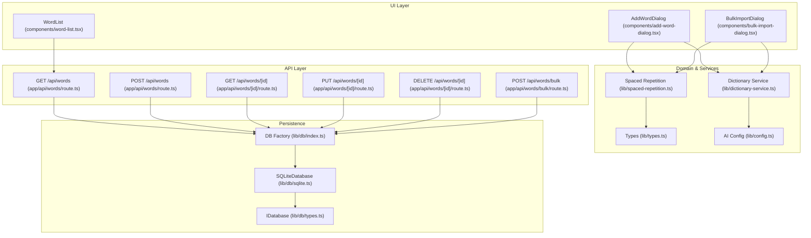
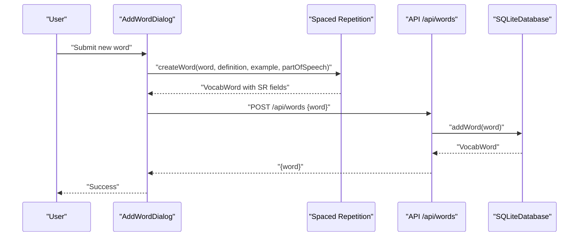
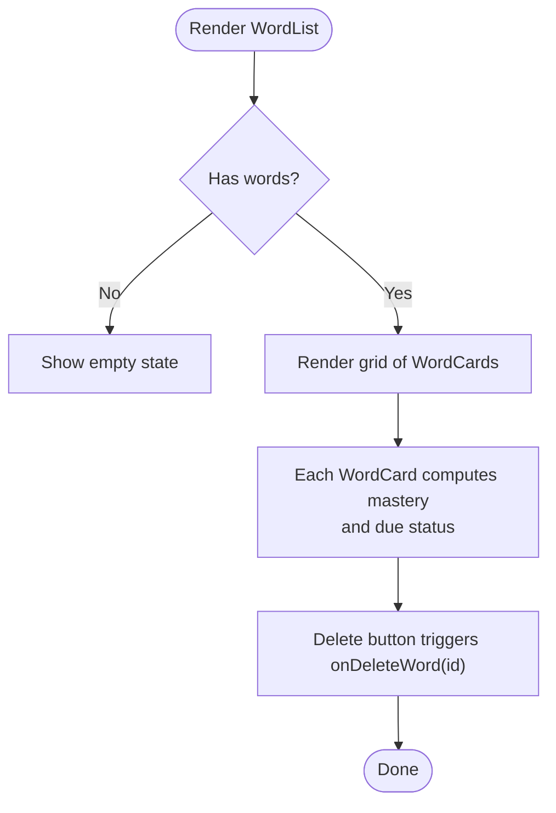
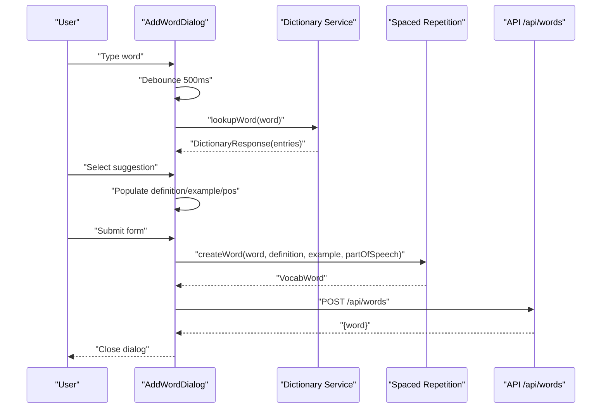
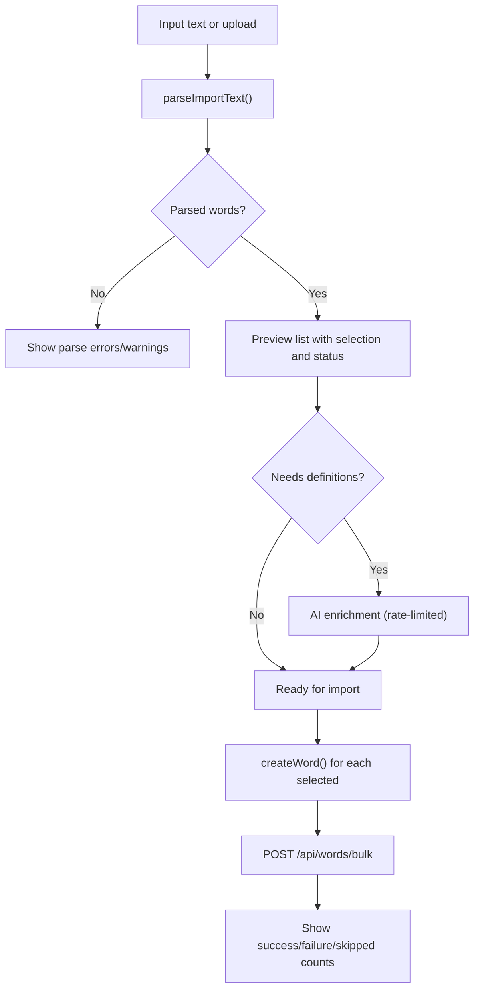
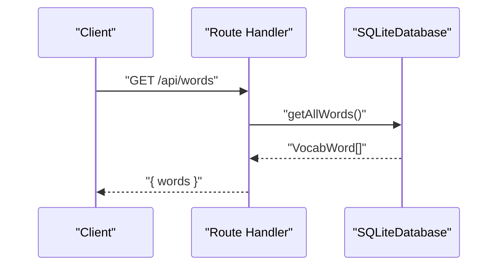
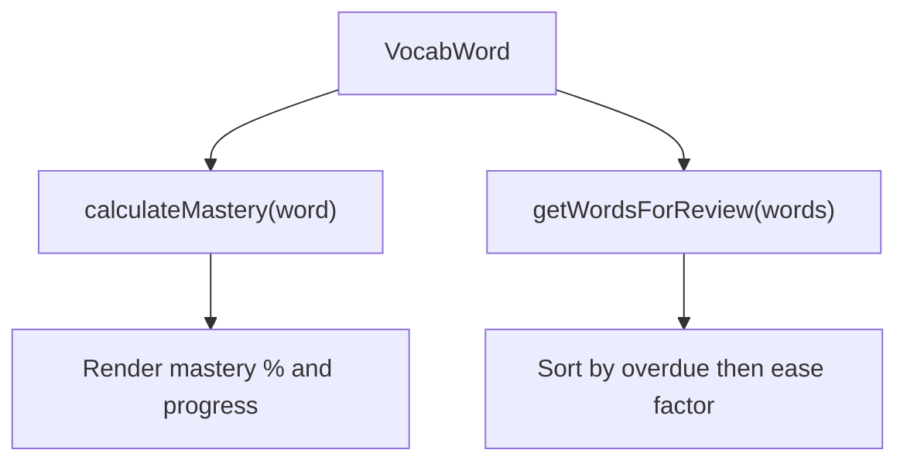
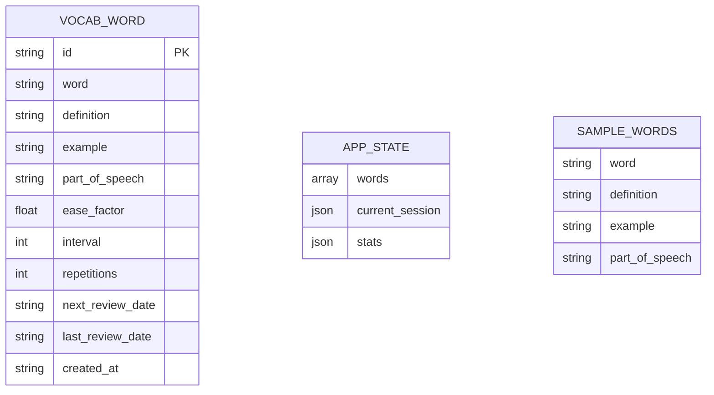
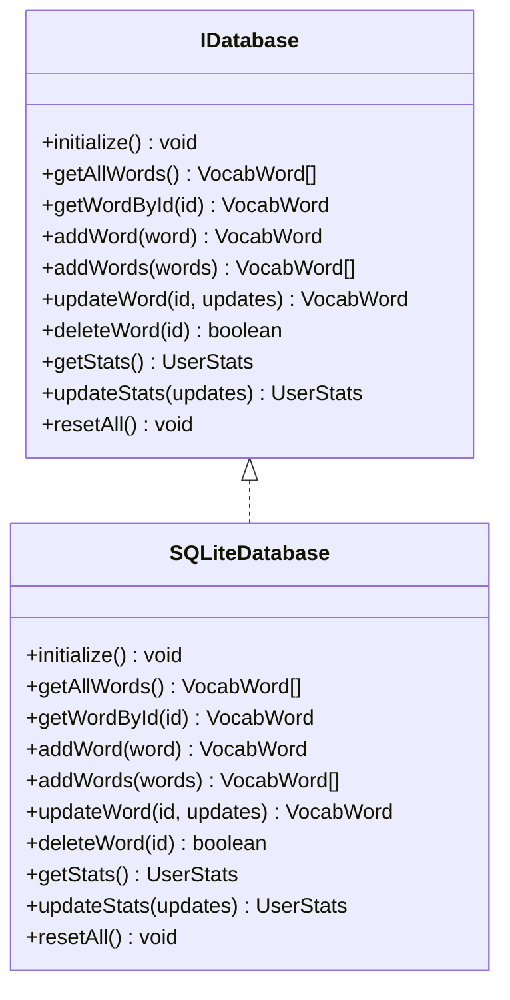

# Vocabulary Management

<cite>
**Referenced Files in This Document**
- [app/api/words/route.ts](file://app/api/words/route.ts)
- [app/api/words/[id]/route.ts](file://app/api/words/[id]/route.ts)
- [app/api/words/bulk/route.ts](file://app/api/words/bulk/route.ts)
- [components/word-list.tsx](file://components/word-list.tsx)
- [components/add-word-dialog.tsx](file://components/add-word-dialog.tsx)
- [components/bulk-import-dialog.tsx](file://components/bulk-import-dialog.tsx)
- [lib/db/index.ts](file://lib/db/index.ts)
- [lib/db/types.ts](file://lib/db/types.ts)
- [lib/db/sqlite.ts](file://lib/db/sqlite.ts)
- [lib/types.ts](file://lib/types.ts)
- [lib/spaced-repetition.ts](file://lib/spaced-repetition.ts)
- [lib/dictionary-service.ts](file://lib/dictionary-service.ts)
- [lib/config.ts](file://lib/config.ts)
</cite>

## Table of Contents
1. [Introduction](#introduction)
2. [Project Structure](#project-structure)
3. [Core Components](#core-components)
4. [Architecture Overview](#architecture-overview)
5. [Detailed Component Analysis](#detailed-component-analysis)
6. [Dependency Analysis](#dependency-analysis)
7. [Performance Considerations](#performance-considerations)
8. [Troubleshooting Guide](#troubleshooting-guide)
9. [Conclusion](#conclusion)
10. [Appendices](#appendices)

## Introduction
This document describes the vocabulary management system, covering word CRUD operations, bulk import/export, UI components for word display and editing, and integration with the spaced repetition engine. It explains the RESTful API endpoints, request validation, response handling, and user workflows for adding, editing, deleting, and bulk importing vocabulary. It also addresses data validation, error handling, and performance considerations for large datasets.

## Project Structure
The vocabulary management system spans UI components, API routes, and a database abstraction with an SQLite implementation. The core data model is defined in shared types, and the spaced repetition logic is encapsulated in a dedicated module. The dictionary service integrates AI or free dictionary APIs for word enrichment.

**Diagram sources**
- [components/word-list.tsx](file://components/word-list.tsx#L1-L123)
- [components/add-word-dialog.tsx](file://components/add-word-dialog.tsx#L1-L297)
- [components/bulk-import-dialog.tsx](file://components/bulk-import-dialog.tsx#L1-L495)
- [app/api/words/route.ts](file://app/api/words/route.ts#L1-L28)
- [app/api/words/[id]/route.ts](file://app/api/words/[id]/route.ts#L1-L55)
- [app/api/words/bulk/route.ts](file://app/api/words/bulk/route.ts#L1-L19)
- [lib/db/index.ts](file://lib/db/index.ts#L1-L21)
- [lib/db/types.ts](file://lib/db/types.ts#L1-L35)
- [lib/db/sqlite.ts](file://lib/db/sqlite.ts#L1-L297)
- [lib/types.ts](file://lib/types.ts#L1-L105)
- [lib/spaced-repetition.ts](file://lib/spaced-repetition.ts#L1-L123)
- [lib/dictionary-service.ts](file://lib/dictionary-service.ts#L1-L255)
- [lib/config.ts](file://lib/config.ts#L1-L63)

**Section sources**
- [components/word-list.tsx](file://components/word-list.tsx#L1-L123)
- [components/add-word-dialog.tsx](file://components/add-word-dialog.tsx#L1-L297)
- [components/bulk-import-dialog.tsx](file://components/bulk-import-dialog.tsx#L1-L495)
- [app/api/words/route.ts](file://app/api/words/route.ts#L1-L28)
- [app/api/words/[id]/route.ts](file://app/api/words/[id]/route.ts#L1-L55)
- [app/api/words/bulk/route.ts](file://app/api/words/bulk/route.ts#L1-L19)
- [lib/db/index.ts](file://lib/db/index.ts#L1-L21)
- [lib/db/types.ts](file://lib/db/types.ts#L1-L35)
- [lib/db/sqlite.ts](file://lib/db/sqlite.ts#L1-L297)
- [lib/types.ts](file://lib/types.ts#L1-L105)
- [lib/spaced-repetition.ts](file://lib/spaced-repetition.ts#L1-L123)
- [lib/dictionary-service.ts](file://lib/dictionary-service.ts#L1-L255)
- [lib/config.ts](file://lib/config.ts#L1-L63)

## Core Components
- WordList: Renders vocabulary cards with mastery progress, next review timing, and delete actions. Integrates spaced repetition calculations for UI indicators.
- AddWordDialog: Provides a form to add a single word with optional AI-assisted lookup and suggestions.
- BulkImportDialog: Parses and previews multiple words from text, CSV, JSON, or clipboard, supports AI enrichment, and imports selected words.
- API Endpoints: RESTful endpoints for listing, creating, retrieving, updating, deleting, and bulk importing words.
- Database Abstraction: IDatabase interface enabling pluggable backends; current implementation is SQLiteDatabase backed by SQLite.
- Spaced Repetition: Implements SM-2 algorithm for scheduling reviews, calculating mastery, and generating due lists.
- Dictionary Service: Integrates AI or free dictionary APIs for word enrichment; includes robust parsing for multiple input formats.

**Section sources**
- [components/word-list.tsx](file://components/word-list.tsx#L1-L123)
- [components/add-word-dialog.tsx](file://components/add-word-dialog.tsx#L1-L297)
- [components/bulk-import-dialog.tsx](file://components/bulk-import-dialog.tsx#L1-L495)
- [app/api/words/route.ts](file://app/api/words/route.ts#L1-L28)
- [app/api/words/[id]/route.ts](file://app/api/words/[id]/route.ts#L1-L55)
- [app/api/words/bulk/route.ts](file://app/api/words/bulk/route.ts#L1-L19)
- [lib/db/types.ts](file://lib/db/types.ts#L1-L35)
- [lib/db/sqlite.ts](file://lib/db/sqlite.ts#L1-L297)
- [lib/spaced-repetition.ts](file://lib/spaced-repetition.ts#L1-L123)
- [lib/dictionary-service.ts](file://lib/dictionary-service.ts#L1-L255)

## Architecture Overview
The system follows a layered architecture:
- UI layer: React components manage user interactions and render vocabulary data.
- API layer: Next.js App Router routes handle HTTP requests and delegate to the database layer.
- Domain layer: Types define the vocabulary model and statistics; spaced repetition logic computes scheduling and mastery.
- Persistence layer: Database abstraction enables swapping implementations; SQLite is currently used.

**Diagram sources**
- [components/add-word-dialog.tsx](file://components/add-word-dialog.tsx#L96-L104)
- [lib/spaced-repetition.ts](file://lib/spaced-repetition.ts#L71-L91)
- [app/api/words/route.ts](file://app/api/words/route.ts#L16-L27)
- [lib/db/sqlite.ts](file://lib/db/sqlite.ts#L140-L159)

## Detailed Component Analysis

### WordList Component
- Responsibilities:
  - Render a grid of vocabulary cards.
  - Display mastery percentage and progress bar.
  - Show next review timing and “due” badges.
  - Trigger deletion callbacks per word.
- Integration:
  - Uses spaced repetition to compute mastery and due status.
  - Exposes a delete handler to parent components.
- Filtering and Sorting:
  - The component itself does not implement filtering/sorting; downstream UI or state management can apply these before passing props.

**Diagram sources**
- [components/word-list.tsx](file://components/word-list.tsx#L17-L122)
- [lib/spaced-repetition.ts](file://lib/spaced-repetition.ts#L99-L105)

**Section sources**
- [components/word-list.tsx](file://components/word-list.tsx#L1-L123)
- [lib/spaced-repetition.ts](file://lib/spaced-repetition.ts#L99-L105)

### AddWordDialog
- Features:
  - Word input with debounced dictionary lookup.
  - AI suggestions dropdown with part-of-speech, phonetic, definition, and example.
  - Form validation and submission to create a new word with SR defaults.
  - Cleanup of timeouts and form resets on close.
- Data Flow:
  - User types word -> debounce -> lookupWord -> show suggestions -> select -> pre-fill form -> submit -> createWord -> API POST -> success.

**Diagram sources**
- [components/add-word-dialog.tsx](file://components/add-word-dialog.tsx#L35-L104)
- [lib/dictionary-service.ts](file://lib/dictionary-service.ts#L21-L49)
- [lib/spaced-repetition.ts](file://lib/spaced-repetition.ts#L71-L91)
- [app/api/words/route.ts](file://app/api/words/route.ts#L16-L27)

**Section sources**
- [components/add-word-dialog.tsx](file://components/add-word-dialog.tsx#L1-L297)
- [lib/dictionary-service.ts](file://lib/dictionary-service.ts#L1-L255)
- [lib/spaced-repetition.ts](file://lib/spaced-repetition.ts#L71-L91)
- [app/api/words/route.ts](file://app/api/words/route.ts#L16-L27)

### BulkImportDialog
- Supported Formats:
  - CSV: word, definition, example, partOfSpeech.
  - JSON: array or single object with flexible field aliases.
  - Plain text: word - definition or word: definition; or just words to enrich later.
- Workflow:
  - Input -> Parse -> Preview -> Optional AI enrichment -> Select -> Import -> Create words with SR defaults -> Bulk API -> Results summary.
- Validation and Error Handling:
  - Detects duplicates against existing words.
  - Highlights invalid lines and shows parse warnings.
  - Rate-limits AI enrichment calls and shows per-item statuses.

**Diagram sources**
- [components/bulk-import-dialog.tsx](file://components/bulk-import-dialog.tsx#L72-L196)
- [lib/dictionary-service.ts](file://lib/dictionary-service.ts#L236-L254)
- [lib/dictionary-service.ts](file://lib/dictionary-service.ts#L106-L137)
- [lib/dictionary-service.ts](file://lib/dictionary-service.ts#L162-L189)
- [lib/dictionary-service.ts](file://lib/dictionary-service.ts#L191-L233)
- [lib/spaced-repetition.ts](file://lib/spaced-repetition.ts#L71-L91)
- [app/api/words/bulk/route.ts](file://app/api/words/bulk/route.ts#L4-L18)

**Section sources**
- [components/bulk-import-dialog.tsx](file://components/bulk-import-dialog.tsx#L1-L495)
- [lib/dictionary-service.ts](file://lib/dictionary-service.ts#L92-L255)
- [lib/spaced-repetition.ts](file://lib/spaced-repetition.ts#L71-L91)
- [app/api/words/bulk/route.ts](file://app/api/words/bulk/route.ts#L1-L19)

### RESTful API Endpoints
- Base Path: /api/words
- Endpoints:
  - GET /api/words
    - Purpose: Retrieve all vocabulary words.
    - Response: { words: VocabWord[] }.
    - Status: 200 on success; 500 on error.
  - POST /api/words
    - Purpose: Add a single word.
    - Request Body: VocabWord (SR fields optional; defaults applied server-side).
    - Response: { word: VocabWord } with 201 on success.
    - Status: 400 if validation fails; 500 on error.
  - GET /api/words/[id]
    - Purpose: Retrieve a specific word by ID.
    - Response: { word: VocabWord }.
    - Status: 404 if not found; 500 on error.
  - PUT /api/words/[id]
    - Purpose: Update an existing word.
    - Request Body: Partial<VocabWord>.
    - Response: { word: VocabWord }.
    - Status: 404 if not found; 500 on error.
  - DELETE /api/words/[id]
    - Purpose: Delete a word.
    - Response: { success: true }.
    - Status: 404 if not found; 500 on error.
  - POST /api/words/bulk
    - Purpose: Import multiple words.
    - Request Body: { words: VocabWord[] }.
    - Response: { words: VocabWord[], count: number } with 201 on success.
    - Status: 400 if missing or empty array; 500 on error.

**Diagram sources**
- [app/api/words/route.ts](file://app/api/words/route.ts#L4-L14)
- [lib/db/sqlite.ts](file://lib/db/sqlite.ts#L130-L133)

**Section sources**
- [app/api/words/route.ts](file://app/api/words/route.ts#L1-L28)
- [app/api/words/[id]/route.ts](file://app/api/words/[id]/route.ts#L1-L55)
- [app/api/words/bulk/route.ts](file://app/api/words/bulk/route.ts#L1-L19)
- [lib/db/sqlite.ts](file://lib/db/sqlite.ts#L130-L133)

### Spaced Repetition Integration
- Word Creation:
  - Words created via UI or bulk import are initialized with SR fields (ease factor, interval, repetitions, next review date).
- Mastery Calculation:
  - Computed from repetitions, ease factor, and interval to drive UI progress and filtering.
- Due Words:
  - Sorted by overdue date and difficulty (ease factor) to prioritize reviews.

**Diagram sources**
- [lib/spaced-repetition.ts](file://lib/spaced-repetition.ts#L99-L105)
- [lib/spaced-repetition.ts](file://lib/spaced-repetition.ts#L51-L68)
- [components/word-list.tsx](file://components/word-list.tsx#L49-L66)

**Section sources**
- [lib/spaced-repetition.ts](file://lib/spaced-repetition.ts#L71-L91)
- [lib/spaced-repetition.ts](file://lib/spaced-repetition.ts#L99-L105)
- [lib/spaced-repetition.ts](file://lib/spaced-repetition.ts#L51-L68)
- [components/word-list.tsx](file://components/word-list.tsx#L49-L66)

### Data Model
- VocabWord: Core vocabulary entity with SR fields and timestamps.
- AppState: Application state including words and statistics.
- Sample Words: Seeded dataset for initial use.

**Diagram sources**
- [lib/types.ts](file://lib/types.ts#L1-L105)
- [lib/db/sqlite.ts](file://lib/db/sqlite.ts#L38-L63)

**Section sources**
- [lib/types.ts](file://lib/types.ts#L1-L105)
- [lib/db/sqlite.ts](file://lib/db/sqlite.ts#L38-L63)

## Dependency Analysis
- UI depends on:
  - Spaced repetition for SR computations.
  - Dictionary service for AI or free dictionary lookups.
  - API routes for persistence.
- API routes depend on:
  - Database factory and implementation for CRUD operations.
- Database abstraction:
  - IDatabase defines the contract; SQLiteDatabase implements it and initializes tables, indices, and seeds sample data.

**Diagram sources**
- [lib/db/types.ts](file://lib/db/types.ts#L16-L34)
- [lib/db/sqlite.ts](file://lib/db/sqlite.ts#L28-L279)

**Section sources**
- [lib/db/types.ts](file://lib/db/types.ts#L1-L35)
- [lib/db/sqlite.ts](file://lib/db/sqlite.ts#L1-L297)
- [lib/db/index.ts](file://lib/db/index.ts#L1-L21)

## Performance Considerations
- Database Indexes:
  - next_review_date and word indexes support efficient retrieval and due-word sorting.
- Transaction Batch Inserts:
  - addWords uses a transaction to minimize round-trips during bulk imports.
- Pagination and Virtualization:
  - For large vocabularies, consider virtualizing the list and paginating queries at the API layer.
- AI Enrichment Rate Limiting:
  - BulkImportDialog throttles AI calls to avoid rate limits and improve reliability.
- Debouncing:
  - AddWordDialog debounces dictionary lookups to reduce network calls while maintaining responsiveness.
- Memory and Rendering:
  - Avoid re-rendering entire lists on small updates; leverage stable keys and selective updates.

**Section sources**
- [lib/db/sqlite.ts](file://lib/db/sqlite.ts#L61-L63)
- [lib/db/sqlite.ts](file://lib/db/sqlite.ts#L161-L188)
- [components/bulk-import-dialog.tsx](file://components/bulk-import-dialog.tsx#L134-L138)
- [components/add-word-dialog.tsx](file://components/add-word-dialog.tsx#L52-L54)

## Troubleshooting Guide
- API Errors:
  - 404 Not Found: Word ID does not exist when retrieving, updating, or deleting.
  - 400 Bad Request: Missing or invalid payload (e.g., bulk endpoint requires a non-empty words array).
  - 500 Internal Server Error: General failures during processing; check server logs.
- Dictionary Lookup Failures:
  - AI fallback to free dictionary API occurs automatically; network errors surface as generic messages.
- Bulk Import Warnings:
  - Parse warnings indicate lines that could not be parsed; review input format and correct entries.
- Duplicate Words:
  - BulkImportDialog marks duplicates; they are deselected by default and skipped during import.
- AI Configuration:
  - Ensure API key and base URL are configured; otherwise, free dictionary API is used.

**Section sources**
- [app/api/words/[id]/route.ts](file://app/api/words/[id]/route.ts#L12-L18)
- [app/api/words/bulk/route.ts](file://app/api/words/bulk/route.ts#L8-L10)
- [lib/dictionary-service.ts](file://lib/dictionary-service.ts#L28-L49)
- [components/bulk-import-dialog.tsx](file://components/bulk-import-dialog.tsx#L308-L323)
- [lib/config.ts](file://lib/config.ts#L52-L56)

## Conclusion
The vocabulary management system provides a cohesive solution for adding, editing, deleting, and bulk importing words, integrating seamlessly with a spaced repetition engine. The UI components are responsive and user-friendly, while the API and database layers ensure reliable persistence and scalability. Robust parsing and AI enrichment streamline data entry, and thoughtful performance optimizations prepare the system for larger datasets.

## Appendices

### User Workflows

#### Add a Single Word
- Open AddWordDialog.
- Type the word; suggestions appear after a short delay.
- Optionally select a suggestion to auto-fill definition and part of speech.
- Submit the form to create the word with SR defaults and persist via API.

**Section sources**
- [components/add-word-dialog.tsx](file://components/add-word-dialog.tsx#L35-L104)
- [app/api/words/route.ts](file://app/api/words/route.ts#L16-L27)

#### Edit an Existing Word
- Navigate to the word’s detail context (via app-level routing).
- Update fields in the edit form.
- Submit to call PUT /api/words/[id]; the database merges updates and returns the modified word.

**Section sources**
- [app/api/words/[id]/route.ts](file://app/api/words/[id]/route.ts#L21-L37)

#### Delete a Word
- Trigger delete action from WordList.
- Call DELETE /api/words/[id]; on success, remove from UI state.

**Section sources**
- [app/api/words/[id]/route.ts](file://app/api/words/[id]/route.ts#L39-L54)

#### Bulk Import Words
- Open BulkImportDialog.
- Paste or upload text/CSV/JSON; parse and preview results.
- Optionally enrich missing definitions via AI.
- Select words and import; bulk-create via POST /api/words/bulk.

**Section sources**
- [components/bulk-import-dialog.tsx](file://components/bulk-import-dialog.tsx#L72-L196)
- [app/api/words/bulk/route.ts](file://app/api/words/bulk/route.ts#L4-L18)

### Data Import/Export Formats
- CSV: word, definition, example, partOfSpeech.
- JSON: array or object with flexible aliases for word, definition, example, partOfSpeech.
- Plain text: word - definition, word: definition, or standalone words to enrich later.

**Section sources**
- [lib/dictionary-service.ts](file://lib/dictionary-service.ts#L106-L137)
- [lib/dictionary-service.ts](file://lib/dictionary-service.ts#L162-L189)
- [lib/dictionary-service.ts](file://lib/dictionary-service.ts#L191-L233)

### Spaced Repetition Integration Notes
- Words are initialized with SR fields; mastery and due lists are computed client-side for UI rendering.
- The database stores SR fields; future sessions can leverage due lists for scheduling.

**Section sources**
- [lib/spaced-repetition.ts](file://lib/spaced-repetition.ts#L71-L91)
- [lib/spaced-repetition.ts](file://lib/spaced-repetition.ts#L99-L105)
- [lib/db/sqlite.ts](file://lib/db/sqlite.ts#L38-L50)