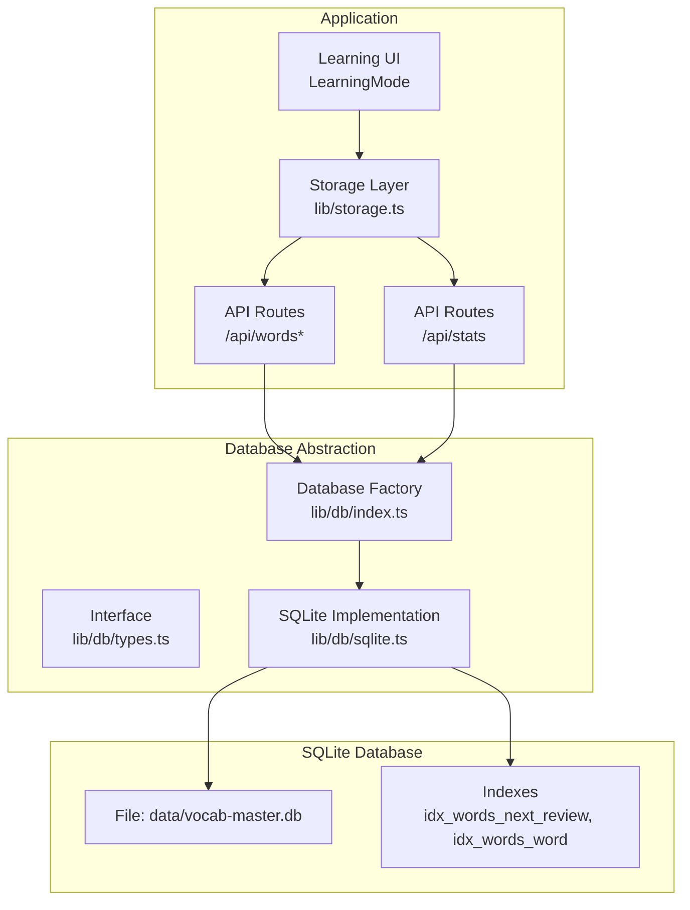
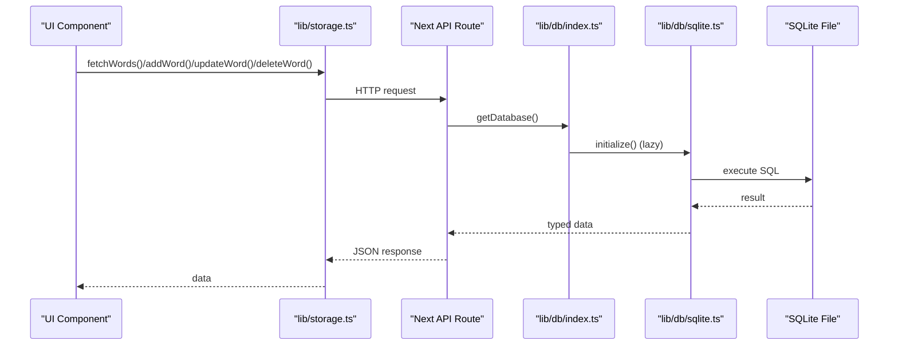
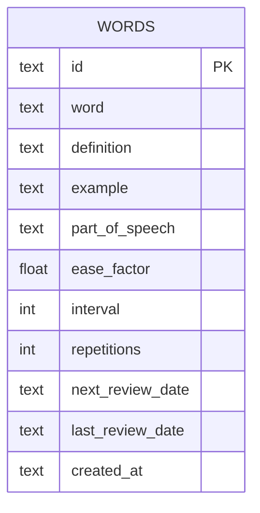
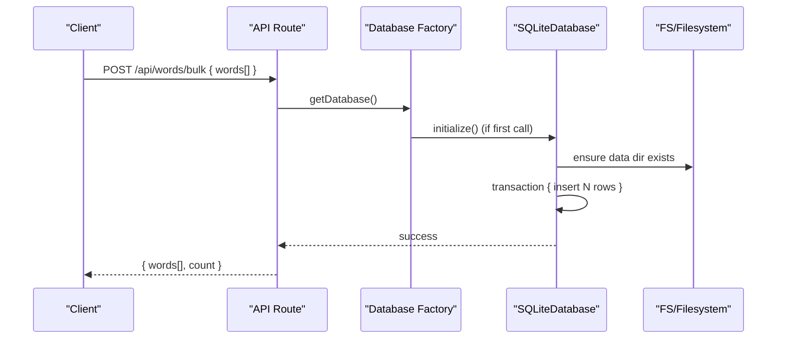
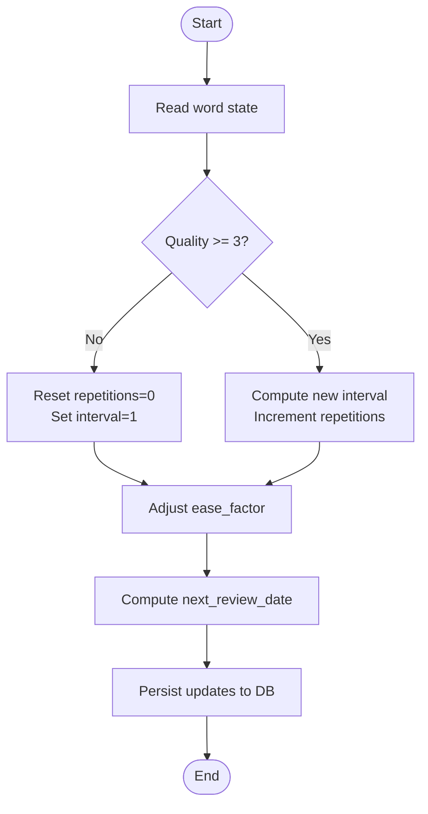
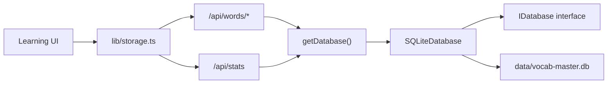

# Database Design

<cite>
**Referenced Files in This Document**
- [lib/db/sqlite.ts](file://lib/db/sqlite.ts)
- [lib/db/types.ts](file://lib/db/types.ts)
- [lib/db/index.ts](file://lib/db/index.ts)
- [lib/types.ts](file://lib/types.ts)
- [app/api/words/route.ts](file://app/api/words/route.ts)
- [app/api/words/[id]/route.ts](file://app/api/words/[id]/route.ts)
- [app/api/words/bulk/route.ts](file://app/api/words/bulk/route.ts)
- [app/api/stats/route.ts](file://app/api/stats/route.ts)
- [lib/storage.ts](file://lib/storage.ts)
- [lib/spaced-repetition.ts](file://lib/spaced-repetition.ts)
- [next.config.mjs](file://next.config.mjs)
</cite>

## Table of Contents
1. [Introduction](#introduction)
2. [Project Structure](#project-structure)
3. [Core Components](#core-components)
4. [Architecture Overview](#architecture-overview)
5. [Detailed Component Analysis](#detailed-component-analysis)
6. [Dependency Analysis](#dependency-analysis)
7. [Performance Considerations](#performance-considerations)
8. [Troubleshooting Guide](#troubleshooting-guide)
9. [Conclusion](#conclusion)
10. [Appendices](#appendices)

## Introduction
This document describes the SQLite database schema and data model for VocabMaster. It covers entity definitions, relationships, constraints, indexes, and data integrity mechanisms. It also documents data access patterns, query strategies, performance characteristics, and operational considerations such as data lifecycle, backups, and schema migrations.

## Project Structure
VocabMaster stores user vocabulary and learning statistics in a local SQLite database located under the data directory. The application uses a thin database abstraction layer to support future backend swaps while currently implementing SQLite.



**Diagram sources**
- [lib/db/index.ts](file://lib/db/index.ts#L1-L21)
- [lib/db/types.ts](file://lib/db/types.ts#L1-L35)
- [lib/db/sqlite.ts](file://lib/db/sqlite.ts#L1-L297)
- [app/api/words/route.ts](file://app/api/words/route.ts#L1-L28)
- [app/api/words/[id]/route.ts](file://app/api/words/[id]/route.ts#L1-L55)
- [app/api/words/bulk/route.ts](file://app/api/words/bulk/route.ts#L1-L19)
- [app/api/stats/route.ts](file://app/api/stats/route.ts#L1-L26)
- [lib/storage.ts](file://lib/storage.ts#L1-L137)

**Section sources**
- [lib/db/index.ts](file://lib/db/index.ts#L1-L21)
- [lib/db/types.ts](file://lib/db/types.ts#L1-L35)
- [lib/db/sqlite.ts](file://lib/db/sqlite.ts#L1-L297)
- [next.config.mjs](file://next.config.mjs#L1-L14)

## Core Components
- Vocabulary words table (words): Stores individual vocabulary entries with Spaced Repetition fields.
- Statistics table (stats): Holds aggregated user statistics with a singleton row (id=1).

Key data types and constraints:
- words.id: TEXT PRIMARY KEY
- words.word: TEXT NOT NULL
- words.definition: TEXT NOT NULL
- words.example: TEXT DEFAULT ''
- words.part_of_speech: TEXT DEFAULT 'noun'
- words.ease_factor: REAL NOT NULL DEFAULT 2.5
- words.interval: INTEGER NOT NULL DEFAULT 0
- words.repetitions: INTEGER NOT NULL DEFAULT 0
- words.next_review_date: TEXT NOT NULL
- words.last_review_date: TEXT (nullable)
- words.created_at: TEXT NOT NULL
- stats.id: INTEGER PRIMARY KEY CHECK (id = 1)
- stats.total_words: INTEGER NOT NULL DEFAULT 0
- stats.words_learned: INTEGER NOT NULL DEFAULT 0
- stats.current_streak: INTEGER NOT NULL DEFAULT 0
- stats.longest_streak: INTEGER NOT NULL DEFAULT 0
- stats.last_study_date: TEXT (nullable)

Indexes:
- idx_words_next_review on words(next_review_date)
- idx_words_word on words(word)

Constraints and integrity:
- Foreign key enforcement is enabled at the database level.
- Singleton constraint enforced for stats via CHECK (id = 1).
- Default values ensure new words are ready for immediate review.

**Section sources**
- [lib/db/sqlite.ts](file://lib/db/sqlite.ts#L35-L81)
- [lib/types.ts](file://lib/types.ts#L1-L105)

## Architecture Overview
The system follows a layered architecture:
- Presentation/UI interacts with the Storage layer.
- Storage layer makes HTTP requests to Next.js API routes.
- API routes resolve to the Database Factory, which instantiates the SQLite implementation.
- SQLite implementation executes SQL statements against the database file and maintains indexes.



**Diagram sources**
- [lib/storage.ts](file://lib/storage.ts#L1-L137)
- [app/api/words/route.ts](file://app/api/words/route.ts#L1-L28)
- [app/api/words/[id]/route.ts](file://app/api/words/[id]/route.ts#L1-L55)
- [app/api/words/bulk/route.ts](file://app/api/words/bulk/route.ts#L1-L19)
- [app/api/stats/route.ts](file://app/api/stats/route.ts#L1-L26)
- [lib/db/index.ts](file://lib/db/index.ts#L1-L21)
- [lib/db/sqlite.ts](file://lib/db/sqlite.ts#L1-L297)

## Detailed Component Analysis

### Vocabulary Words Entity
Fields and types:
- id: TEXT (Primary Key)
- word: TEXT (NOT NULL)
- definition: TEXT (NOT NULL)
- example: TEXT (Default: empty string)
- part_of_speech: TEXT (Default: "noun")
- ease_factor: REAL (NOT NULL, Default: 2.5)
- interval: INTEGER (NOT NULL, Default: 0)
- repetitions: INTEGER (NOT NULL, Default: 0)
- next_review_date: TEXT (NOT NULL)
- last_review_date: TEXT (Nullable)
- created_at: TEXT (NOT NULL)

Constraints and defaults:
- Enforced via CREATE TABLE DDL.
- Defaults ensure new words are due for review immediately.

Indexes:
- idx_words_next_review: Optimizes due-for-review queries.
- idx_words_word: Supports fast lookups by word text.

Data access patterns:
- CRUD endpoints expose add, update, delete, and list operations.
- Bulk import endpoint supports efficient batch inserts.

Validation and business logic:
- Spaced repetition updates are computed client-side and persisted via update endpoints.
- Mastered threshold and derived metrics are computed in memory for display.



**Diagram sources**
- [lib/db/sqlite.ts](file://lib/db/sqlite.ts#L38-L50)

**Section sources**
- [lib/db/sqlite.ts](file://lib/db/sqlite.ts#L38-L50)
- [lib/db/sqlite.ts](file://lib/db/sqlite.ts#L128-L228)
- [app/api/words/route.ts](file://app/api/words/route.ts#L1-L28)
- [app/api/words/[id]/route.ts](file://app/api/words/[id]/route.ts#L1-L55)
- [app/api/words/bulk/route.ts](file://app/api/words/bulk/route.ts#L1-L19)
- [lib/spaced-repetition.ts](file://lib/spaced-repetition.ts#L1-L123)

### User Statistics Entity
Fields and types:
- id: INTEGER (Primary Key, Singleton CHECK)
- total_words: INTEGER (NOT NULL, Default: 0)
- words_learned: INTEGER (NOT NULL, Default: 0)
- current_streak: INTEGER (NOT NULL, Default: 0)
- longest_streak: INTEGER (NOT NULL, Default: 0)
- last_study_date: TEXT (Nullable)

Singleton constraint:
- stats has exactly one row with id=1, ensuring global counters.

Initialization and synchronization:
- On first initialization, a stats row is inserted if missing.
- Total counts are synchronized with the words table.

```mermaid
erDiagram
STATS {
int id PK CK
int total_words
int words_learned
int current_streak
int longest_streak
text last_study_date
}
```

**Diagram sources**
- [lib/db/sqlite.ts](file://lib/db/sqlite.ts#L52-L59)
- [lib/db/sqlite.ts](file://lib/db/sqlite.ts#L65-L81)

**Section sources**
- [lib/db/sqlite.ts](file://lib/db/sqlite.ts#L52-L59)
- [lib/db/sqlite.ts](file://lib/db/sqlite.ts#L65-L81)
- [lib/db/sqlite.ts](file://lib/db/sqlite.ts#L230-L267)
- [app/api/stats/route.ts](file://app/api/stats/route.ts#L1-L26)

### Data Access Patterns and API Endpoints
- List words: GET /api/words
- Get word: GET /api/words/[id]
- Add word: POST /api/words
- Update word: PUT /api/words/[id]
- Delete word: DELETE /api/words/[id]
- Bulk add: POST /api/words/bulk
- Get stats: GET /api/stats
- Update stats: PUT /api/stats

Concurrency and transactions:
- Bulk inserts use a transaction wrapper to improve throughput.
- Updates to words trigger a stats recalculation.



**Diagram sources**
- [app/api/words/bulk/route.ts](file://app/api/words/bulk/route.ts#L1-L19)
- [lib/db/index.ts](file://lib/db/index.ts#L1-L21)
- [lib/db/sqlite.ts](file://lib/db/sqlite.ts#L161-L188)

**Section sources**
- [app/api/words/route.ts](file://app/api/words/route.ts#L1-L28)
- [app/api/words/[id]/route.ts](file://app/api/words/[id]/route.ts#L1-L55)
- [app/api/words/bulk/route.ts](file://app/api/words/bulk/route.ts#L1-L19)
- [app/api/stats/route.ts](file://app/api/stats/route.ts#L1-L26)
- [lib/db/sqlite.ts](file://lib/db/sqlite.ts#L161-L188)

### Spaced Repetition Integration
Spaced repetition logic updates word fields (ease_factor, interval, repetitions, next_review_date, last_review_date). The algorithm:
- Uses a quality score (0–5) to adjust scheduling.
- Resets interval/repetitions on poor recall.
- Increases difficulty gradually for correct responses.
- Computes next review date based on current interval.



**Diagram sources**
- [lib/spaced-repetition.ts](file://lib/spaced-repetition.ts#L9-L48)
- [lib/db/sqlite.ts](file://lib/db/sqlite.ts#L190-L222)

**Section sources**
- [lib/spaced-repetition.ts](file://lib/spaced-repetition.ts#L1-L123)
- [lib/db/sqlite.ts](file://lib/db/sqlite.ts#L190-L222)

## Dependency Analysis
- The API routes depend on the Database Factory to obtain a singleton database instance.
- The SQLite implementation depends on better-sqlite3 and ensures the data directory exists.
- The Storage layer abstracts HTTP calls to the API routes.
- The Spaced Repetition module computes updates that are persisted via the database layer.



**Diagram sources**
- [app/api/words/route.ts](file://app/api/words/route.ts#L1-L28)
- [app/api/words/[id]/route.ts](file://app/api/words/[id]/route.ts#L1-L55)
- [app/api/words/bulk/route.ts](file://app/api/words/bulk/route.ts#L1-L19)
- [app/api/stats/route.ts](file://app/api/stats/route.ts#L1-L26)
- [lib/db/index.ts](file://lib/db/index.ts#L1-L21)
- [lib/db/types.ts](file://lib/db/types.ts#L1-L35)
- [lib/db/sqlite.ts](file://lib/db/sqlite.ts#L1-L297)
- [lib/storage.ts](file://lib/storage.ts#L1-L137)

**Section sources**
- [lib/db/index.ts](file://lib/db/index.ts#L1-L21)
- [lib/db/types.ts](file://lib/db/types.ts#L1-L35)
- [lib/db/sqlite.ts](file://lib/db/sqlite.ts#L1-L297)
- [lib/storage.ts](file://lib/storage.ts#L1-L137)

## Performance Considerations
- Journaling and foreign keys:
  - WAL journaling improves concurrency and write performance.
  - Foreign key enforcement is enabled for integrity.
- Indexes:
  - idx_words_next_review accelerates due-for-review queries.
  - idx_words_word supports quick lookups by word text.
- Transactions:
  - Bulk inserts wrap multiple writes in a single transaction to reduce overhead.
- Query patterns:
  - Listing words sorts by created_at desc; consider adding an index if needed.
  - Stats recalculation occurs after word changes; keep this minimal by batching updates.
- Client-side computation:
  - Spaced repetition updates are computed client-side and applied via single-row updates.

[No sources needed since this section provides general guidance]

## Troubleshooting Guide
Common issues and resolutions:
- Database file not found:
  - Ensure the data directory exists; the implementation creates it automatically on first use.
- Foreign key constraint errors:
  - Verify foreign key enforcement is enabled (already configured).
- WAL mode and locks:
  - WAL mode is enabled; avoid manual VACUUM during heavy use.
- API route failures:
  - Check Next.js server logs for unhandled exceptions.
- Stats out-of-sync:
  - Stats are recalculated after word changes; re-run sync if discrepancies occur.

**Section sources**
- [lib/db/sqlite.ts](file://lib/db/sqlite.ts#L12-L26)
- [lib/db/sqlite.ts](file://lib/db/sqlite.ts#L22-L23)
- [lib/db/sqlite.ts](file://lib/db/sqlite.ts#L122-L126)

## Conclusion
VocabMaster’s SQLite schema is compact and purpose-built for vocabulary management and spaced repetition. The design emphasizes simplicity, integrity, and performance through judicious indexing and transactional writes. The abstraction layer allows straightforward migration to other databases if needed.

[No sources needed since this section summarizes without analyzing specific files]

## Appendices

### Schema Migration Approaches
- Versioned migrations:
  - Introduce a schema_version table and a migration runner that applies deltas on startup.
- Backup before changes:
  - Copy the database file before running migrations.
- Atomic DDL:
  - Wrap schema changes in a transaction to ensure rollback capability.
- Data seeding:
  - Keep seed logic idempotent; check existence before inserting.

[No sources needed since this section provides general guidance]

### Data Lifecycle and Backup Procedures
- Local persistence:
  - Data resides in data/vocab-master.db; ensure regular backups of this file.
- Incremental backups:
  - WAL mode supports robust crash recovery; consider backing up the -wal and -shm files alongside the main database.
- Reset and restore:
  - Use the resetAll operation to wipe and re-seed the database with sample words.

**Section sources**
- [lib/db/sqlite.ts](file://lib/db/sqlite.ts#L271-L278)

### Sample Data Structures
Representative shapes of stored entities:
- VocabWord: fields include identifiers, linguistic info, Spaced Repetition fields, and timestamps.
- UserStats: aggregated counts and streaks with a fixed singleton row.

**Section sources**
- [lib/types.ts](file://lib/types.ts#L1-L105)
- [lib/db/types.ts](file://lib/db/types.ts#L4-L10)