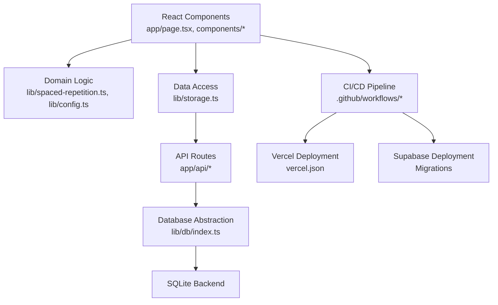
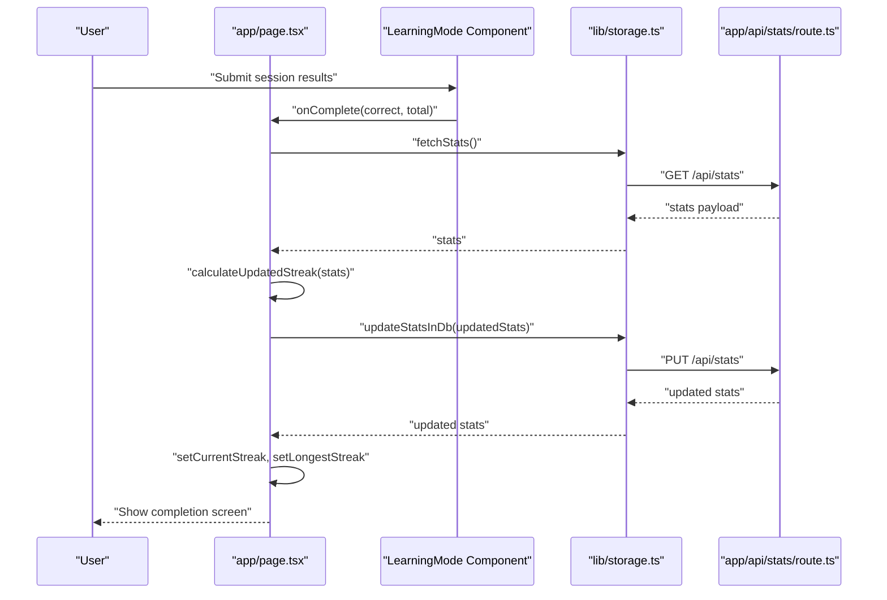
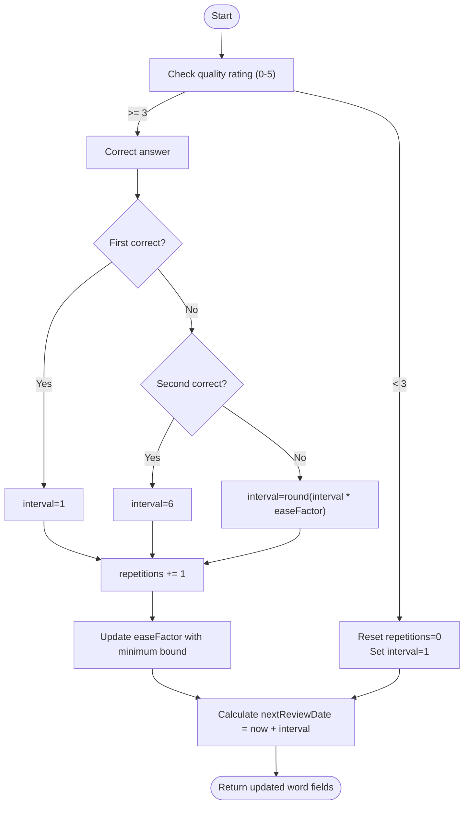
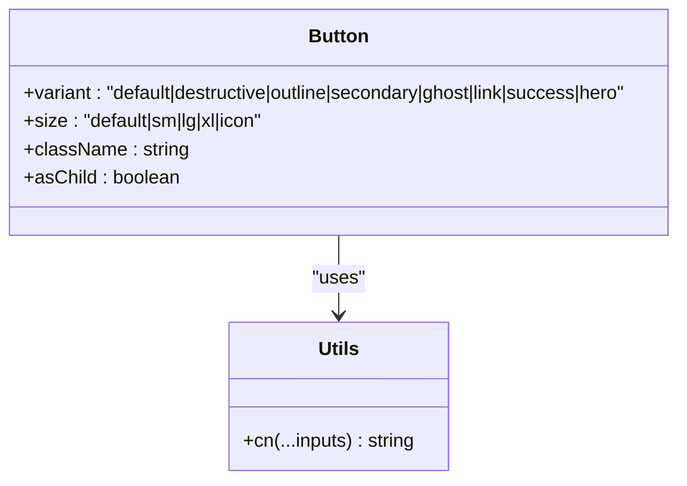
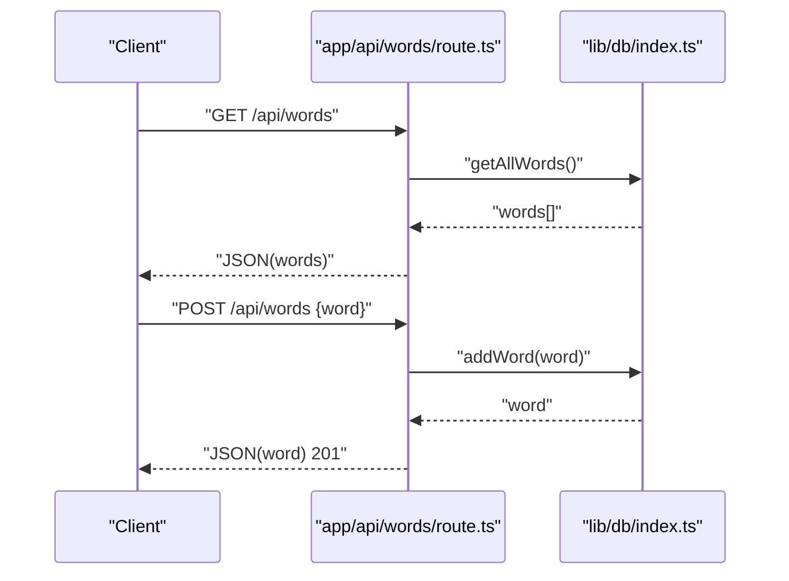
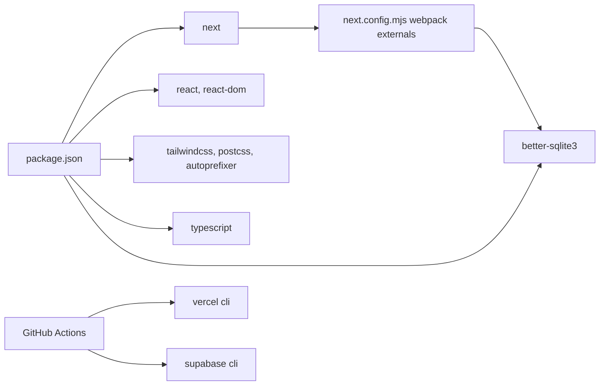

# Development Guide

<cite>
**Referenced Files in This Document**
- [.eslintrc.json](file://.eslintrc.json)
- [package.json](file://package.json)
- [next.config.mjs](file://next.config.mjs)
- [tsconfig.json](file://tsconfig.json)
- [tailwind.config.ts](file://tailwind.config.ts)
- [postcss.config.mjs](file://postcss.config.mjs)
- [app/layout.tsx](file://app/layout.tsx)
- [app/page.tsx](file://app/page.tsx)
- [lib/config.ts](file://lib/config.ts)
- [lib/types.ts](file://lib/types.ts)
- [lib/utils.ts](file://lib/utils.ts)
- [lib/db/index.ts](file://lib/db/index.ts)
- [lib/storage.ts](file://lib/storage.ts)
- [lib/spaced-repetition.ts](file://lib/spaced-repetition.ts)
- [app/api/words/route.ts](file://app/api/words/route.ts)
- [app/api/stats/route.ts](file://app/api/stats/route.ts)
- [components/ui/button.tsx](file://components/ui/button.tsx)
- [components/dashboard.tsx](file://components/dashboard.tsx)
- [components/word-list.tsx](file://components/word-list.tsx)
- [.github/workflows/ci.yml](file://.github/workflows/ci.yml)
- [.github/workflows/cd.yml](file://.github/workflows/cd.yml)
- [.github/workflows/deploy.yml](file://.github/workflows/deploy.yml)
- [.github/DEPLOYMENT.md](file://.github/DEPLOYMENT.md)
- [vercel.json](file://vercel.json)
</cite>

## Update Summary
**Changes Made**
- Added comprehensive CI/CD deployment infrastructure documentation
- Documented GitHub Actions workflows (ci.yml, cd.yml, deploy.yml)
- Added Vercel configuration and deployment guide
- Updated deployment strategies to include automated CI/CD pipelines
- Enhanced production deployment procedures with multi-environment support

## Table of Contents
1. [Introduction](#introduction)
2. [Project Structure](#project-structure)
3. [Core Components](#core-components)
4. [Architecture Overview](#architecture-overview)
5. [Detailed Component Analysis](#detailed-component-analysis)
6. [Dependency Analysis](#dependency-analysis)
7. [Performance Considerations](#performance-considerations)
8. [CI/CD Deployment Infrastructure](#cicd-deployment-infrastructure)
9. [Local Development Setup](#local-development-setup)
10. [Build Pipeline and Asset Optimization](#build-pipeline-and-asset-optimization)
11. [Testing Guidelines](#testing-guidelines)
12. [Contribution Workflows](#contribution-workflows)
13. [Debugging Techniques](#debugging-techniques)
14. [Performance Profiling Tools](#performance-profiling-tools)
15. [TypeScript Configuration](#typescript-configuration)
16. [ESLint and Formatting Standards](#eslint-and-formatting-standards)
17. [Production Deployment Strategies](#production-deployment-strategies)
18. [Extending the Application](#extending-the-application)
19. [Troubleshooting Guide](#troubleshooting-guide)
20. [Conclusion](#conclusion)
21. [Appendices](#appendices)

## Introduction
This guide provides comprehensive development documentation for VocabMaster contributors. It covers local setup, build and deployment procedures, code standards, testing guidelines, contribution workflows, environment configuration, debugging techniques, performance profiling, TypeScript and Tailwind configuration, ESLint usage, formatting standards, build pipeline, asset optimization, production deployment strategies, and CI/CD automation. It also includes troubleshooting advice and best practices for extending the application.

## Project Structure
VocabMaster is a Next.js 14 application using React 18, TypeScript, Tailwind CSS, and a SQLite-backed data layer. The repository follows a conventional Next.js app directory layout with app/, components/, lib/, and public assets. The database abstraction allows swapping implementations while keeping the UI and API routes unchanged.

```mermaid
graph TB
subgraph "Next.js App"
LAYOUT["app/layout.tsx"]
PAGE["app/page.tsx"]
end
subgraph "Components"
DASHBOARD["components/dashboard.tsx"]
WORDLIST["components/word-list.tsx"]
BUTTON["components/ui/button.tsx"]
end
subgraph "Libraries"
TYPES["lib/types.ts"]
UTILS["lib/utils.ts"]
CONFIG["lib/config.ts"]
STORAGE["lib/storage.ts"]
SR["lib/spaced-repetition.ts"]
DBIDX["lib/db/index.ts"]
end
subgraph "API Routes"
WORDS_API["app/api/words/route.ts"]
STATS_API["app/api/stats/route.ts"]
end
subgraph "CI/CD Infrastructure"
CI["GitHub Actions CI"]
CD["GitHub Actions CD"]
DEPLOY["GitHub Actions Deploy"]
VERCEL["Vercel Configuration"]
END
LAYOUT --> PAGE
PAGE --> DASHBOARD
PAGE --> WORDLIST
PAGE --> BUTTON
PAGE --> STORAGE
STORAGE --> WORDS_API
STORAGE --> STATS_API
PAGE --> SR
PAGE --> TYPES
PAGE --> CONFIG
PAGE --> UTILS
DBIDX --> WORDS_API
DBIDX --> STATS_API
CI --> CD
CD --> DEPLOY
DEPLOY --> VERCEL
```

**Diagram sources**
- [app/layout.tsx](file://app/layout.tsx#L1-L24)
- [app/page.tsx](file://app/page.tsx#L1-L316)
- [components/dashboard.tsx](file://components/dashboard.tsx#L1-L154)
- [components/word-list.tsx](file://components/word-list.tsx#L1-L123)
- [components/ui/button.tsx](file://components/ui/button.tsx#L1-L54)
- [lib/types.ts](file://lib/types.ts#L1-L105)
- [lib/utils.ts](file://lib/utils.ts#L1-L7)
- [lib/config.ts](file://lib/config.ts#L1-L63)
- [lib/storage.ts](file://lib/storage.ts#L1-L137)
- [lib/spaced-repetition.ts](file://lib/spaced-repetition.ts#L1-L123)
- [lib/db/index.ts](file://lib/db/index.ts#L1-L21)
- [app/api/words/route.ts](file://app/api/words/route.ts#L1-L28)
- [app/api/stats/route.ts](file://app/api/stats/route.ts#L1-L26)
- [.github/workflows/ci.yml](file://.github/workflows/ci.yml#L1-L94)
- [.github/workflows/cd.yml](file://.github/workflows/cd.yml#L1-L99)
- [.github/workflows/deploy.yml](file://.github/workflows/deploy.yml#L1-L129)
- [vercel.json](file://vercel.json#L1-L39)

**Section sources**
- [package.json](file://package.json#L1-L38)
- [next.config.mjs](file://next.config.mjs#L1-L15)
- [tsconfig.json](file://tsconfig.json#L1-L28)
- [tailwind.config.ts](file://tailwind.config.ts#L1-L103)
- [postcss.config.mjs](file://postcss.config.mjs#L1-L10)
- [app/layout.tsx](file://app/layout.tsx#L1-L24)
- [app/page.tsx](file://app/page.tsx#L1-L316)

## Core Components
- Application shell and metadata: Root layout and metadata are defined in the root layout file.
- Main application page: Orchestrates views (dashboard, word list, learning mode), manages state, and coordinates data loading and updates.
- UI primitives: Reusable components like Button leverage Tailwind classes and variant logic.
- Data layer: Storage functions abstract API interactions; database abstraction enables backend swaps.
- Spaced repetition engine: Implements SM-2 algorithm for scheduling reviews and calculating mastery.
- AI configuration: Centralized configuration for OpenAI-compatible endpoints stored in browser storage.
- CI/CD infrastructure: Automated workflows for linting, building, testing, and deploying the application.

**Section sources**
- [app/layout.tsx](file://app/layout.tsx#L1-L24)
- [app/page.tsx](file://app/page.tsx#L1-L316)
- [components/ui/button.tsx](file://components/ui/button.tsx#L1-L54)
- [lib/storage.ts](file://lib/storage.ts#L1-L137)
- [lib/db/index.ts](file://lib/db/index.ts#L1-L21)
- [lib/spaced-repetition.ts](file://lib/spaced-repetition.ts#L1-L123)
- [lib/config.ts](file://lib/config.ts#L1-L63)
- [.github/workflows/ci.yml](file://.github/workflows/ci.yml#L1-L94)
- [.github/workflows/cd.yml](file://.github/workflows/cd.yml#L1-L99)
- [.github/workflows/deploy.yml](file://.github/workflows/deploy.yml#L1-L129)

## Architecture Overview
The application follows a layered architecture with integrated CI/CD automation:
- Presentation layer: Next.js app directory with pages and components.
- Domain layer: Spaced repetition logic and AI configuration utilities.
- Data access layer: Storage functions that call API routes; database abstraction factory.
- API layer: Next.js app API routes handle CRUD operations for words and stats.
- CI/CD layer: GitHub Actions workflows automate testing, building, and deployment to Vercel and Supabase.



**Diagram sources**
- [app/page.tsx](file://app/page.tsx#L1-L316)
- [components/dashboard.tsx](file://components/dashboard.tsx#L1-L154)
- [components/word-list.tsx](file://components/word-list.tsx#L1-L123)
- [lib/spaced-repetition.ts](file://lib/spaced-repetition.ts#L1-L123)
- [lib/config.ts](file://lib/config.ts#L1-L63)
- [lib/storage.ts](file://lib/storage.ts#L1-L137)
- [app/api/words/route.ts](file://app/api/words/route.ts#L1-L28)
- [app/api/stats/route.ts](file://app/api/stats/route.ts#L1-L26)
- [lib/db/index.ts](file://lib/db/index.ts#L1-L21)
- [.github/workflows/ci.yml](file://.github/workflows/ci.yml#L1-L94)
- [.github/workflows/cd.yml](file://.github/workflows/cd.yml#L1-L99)
- [.github/workflows/deploy.yml](file://.github/workflows/deploy.yml#L1-L129)
- [vercel.json](file://vercel.json#L1-L39)

## Detailed Component Analysis

### Data Flow: Learning Session Completion
This sequence illustrates how a learning session completion triggers statistics updates and persistence.



**Diagram sources**
- [app/page.tsx](file://app/page.tsx#L97-L109)
- [lib/storage.ts](file://lib/storage.ts#L12-L73)
- [app/api/stats/route.ts](file://app/api/stats/route.ts#L1-L26)
- [lib/spaced-repetition.ts](file://lib/spaced-repetition.ts#L88-L115)

### Spaced Repetition Algorithm
The algorithm determines next review intervals based on user ratings and maintains ease factors and repetition counts.



**Diagram sources**
- [lib/spaced-repetition.ts](file://lib/spaced-repetition.ts#L8-L48)

### UI Component: Button Variants and Sizes
The Button component demonstrates Tailwind-based variants and size scaling.



**Diagram sources**
- [components/ui/button.tsx](file://components/ui/button.tsx#L1-L54)
- [lib/utils.ts](file://lib/utils.ts#L1-L7)

### API Route: Words Management
The words API exposes endpoints for listing, adding, updating, and deleting vocabulary entries.



**Diagram sources**
- [app/api/words/route.ts](file://app/api/words/route.ts#L1-L28)
- [lib/db/index.ts](file://lib/db/index.ts#L1-L21)

## Dependency Analysis
- Build-time dependencies: Next.js, React, Tailwind CSS, PostCSS, TypeScript, better-sqlite3.
- Runtime dependencies: UI primitives, class merging utilities, and Lucide icons.
- Webpack configuration excludes the native SQLite module from client bundles to avoid bundling issues.
- CI/CD dependencies: GitHub Actions runners, Vercel CLI, Supabase CLI for deployment automation.



**Diagram sources**
- [package.json](file://package.json#L11-L36)
- [next.config.mjs](file://next.config.mjs#L6-L11)
- [.github/workflows/ci.yml](file://.github/workflows/ci.yml#L1-L94)
- [.github/workflows/cd.yml](file://.github/workflows/cd.yml#L1-L99)
- [.github/workflows/deploy.yml](file://.github/workflows/deploy.yml#L1-L129)

**Section sources**
- [package.json](file://package.json#L1-L38)
- [next.config.mjs](file://next.config.mjs#L1-L15)

## Performance Considerations
- Client-side rendering and state management: The main page coordinates multiple state updates; keep renders minimal by avoiding unnecessary re-renders and batching updates.
- API calls: Use concurrent fetching for words and stats to reduce perceived latency.
- Spaced repetition calculations: Perform client-side computations for due words and mastery; cache results per render cycle.
- Asset optimization: Tailwind CSS purges unused styles; ensure content paths are accurate to minimize bundle size.
- Database operations: Offload heavy operations to server-side API routes; avoid synchronous blocking operations in the UI thread.
- CI/CD performance: Parallel job execution reduces overall pipeline duration; caching optimizations improve build times.

## CI/CD Deployment Infrastructure

### GitHub Actions Workflows Overview
The repository includes three comprehensive GitHub Actions workflows that automate the entire deployment pipeline:

#### CI Workflow (Continuous Integration)
Automatically runs on pull requests and pushes to main/develop branches, performing linting, type checking, and build verification.

**Key Features:**
- Node.js 20 environment setup with npm caching
- ESLint linting and TypeScript type checking
- Next.js build verification with artifact upload
- Conditional job execution based on branch triggers

#### CD Workflow (Continuous Deployment)
Deploys to Vercel for preview environments on pull requests and production deployments on main branch pushes.

**Key Features:**
- Preview deployments for pull requests with automated PR comments
- Production deployments for main branch with environment isolation
- Vercel CLI integration with token authentication
- Environment variable management through GitHub secrets

#### Deploy Workflow (Full Stack Deployment)
Coordinates Supabase database migrations and Vercel deployments for production environments.

**Key Features:**
- Supabase CLI integration for database migrations
- Conditional execution based on file changes
- Manual workflow dispatch with configurable options
- Multi-environment deployment coordination

**Section sources**
- [.github/workflows/ci.yml](file://.github/workflows/ci.yml#L1-L94)
- [.github/workflows/cd.yml](file://.github/workflows/cd.yml#L1-L99)
- [.github/workflows/deploy.yml](file://.github/workflows/deploy.yml#L1-L129)

### Vercel Configuration
The vercel.json configuration defines deployment settings, environment variables, and performance optimizations.

**Key Configuration Areas:**
- Framework detection for Next.js optimization
- Build and install command customization
- Function-level configuration for API routes
- Environment variable management
- Git integration and auto-cancellation
- Header configurations for API endpoints

**Section sources**
- [vercel.json](file://vercel.json#L1-L39)

### Deployment Guide
The comprehensive deployment guide (.github/DEPLOYMENT.md) provides step-by-step instructions for setting up CI/CD infrastructure.

**Setup Requirements:**
- GitHub repository secrets for Vercel and Supabase authentication
- Local CLI setup for project linking
- Environment variable configuration in Vercel dashboard
- Initial database migration execution

**Deployment Flow:**
1. Push to main branch triggers CI pipeline
2. Successful CI completion triggers Supabase migrations
3. Database migrations complete deployment to Vercel
4. Production environment becomes live

**Section sources**
- [.github/DEPLOYMENT.md](file://.github/DEPLOYMENT.md#L1-L146)

## Local Development Setup
- Install dependencies: Use the package manager commands defined in the scripts section.
- Run the development server: Start the Next.js dev server with the provided script.
- Build for production: Generate optimized static assets using the build script.
- Start the production server: Launch the compiled application using the start script.
- Linting: Use the lint script to enforce code quality.

**Section sources**
- [package.json](file://package.json#L5-L9)

## Build Pipeline and Asset Optimization
- TypeScript compilation: Configure compiler options for strictness, module resolution, and incremental builds.
- Tailwind CSS: Define content paths, theme extensions, and plugins; PostCSS applies Tailwind and Autoprefixer.
- Webpack customization: Exclude native modules from client bundles to prevent bundling errors.
- CI/CD build optimization: Parallel job execution and artifact caching improve build performance.

**Section sources**
- [tsconfig.json](file://tsconfig.json#L2-L24)
- [tailwind.config.ts](file://tailwind.config.ts#L1-L103)
- [postcss.config.mjs](file://postcss.config.mjs#L1-L10)
- [next.config.mjs](file://next.config.mjs#L6-L11)

## Testing Guidelines
- Unit tests: Test domain logic (spaced repetition) and utilities (configuration, helpers).
- Integration tests: Validate API routes and database interactions through controlled requests.
- E2E tests: Simulate user flows (add word, start learning, complete session) and verify state synchronization.
- CI/CD testing: Automated testing through GitHub Actions workflows ensures code quality.

## Contribution Workflows
- Branching: Use feature branches for new features and bug fixes.
- Commits: Write clear, concise commit messages describing changes.
- Pull requests: Open PRs with descriptions linking to issues and testing steps.
- Reviews: Address feedback promptly and update tests accordingly.
- CI/CD validation: All PRs automatically trigger CI pipeline validation.

## Debugging Techniques
- Console logging: Use targeted logs around API calls and state transitions.
- Network inspection: Monitor API responses and error payloads in the browser's network tab.
- React DevTools: Inspect component props, state, and performance metrics.
- Profiling: Use React Profiler to identify expensive renders and optimize.
- CI/CD debugging: GitHub Actions workflow logs provide detailed deployment troubleshooting information.

## Performance Profiling Tools
- React DevTools Profiler: Measure component render costs and identify bottlenecks.
- Lighthouse: Audit performance, accessibility, and SEO.
- Bundle analyzer: Visualize bundle composition and identify large dependencies.
- CI/CD performance monitoring: Workflow execution times and resource utilization tracking.

## TypeScript Configuration
- Strict mode: Enforce strict type checking and non-nullable types.
- Module resolution: Use bundler resolution for compatibility with Next.js.
- Path aliases: Configure path mapping for cleaner imports.
- Plugins: Enable Next.js TypeScript plugin support.

**Section sources**
- [tsconfig.json](file://tsconfig.json#L2-L24)

## ESLint and Formatting Standards
Enhanced ESLint configuration now includes Next.js Core Web Vitals integration and comprehensive linting setup for improved code quality and performance monitoring.

- ESLint Configuration: The project uses Next.js Core Web Vitals preset for performance-focused linting rules that monitor Critical Rendering Path metrics.
- TypeScript ESLint Plugins: Integrated TypeScript ESLint plugins for advanced type-aware linting capabilities.
- Linting Commands: Use the lint script to run comprehensive checks across the codebase with performance monitoring.
- Rule Extensions: Custom rules extend the Next.js core configuration for project-specific requirements.
- CI/CD integration: Automated linting through GitHub Actions ensures consistent code quality.

**Section sources**
- [.eslintrc.json](file://.eslintrc.json#L1-L4)
- [package.json](file://package.json#L31-L35)

## Production Deployment Strategies
- Build artifacts: Generate optimized builds using the build script.
- Environment variables: Store sensitive configuration in environment variables or secure storage.
- Static export: Consider exporting static sites if applicable; otherwise, deploy the Next.js server.
- Monitoring: Set up error tracking and performance monitoring in production.
- CI/CD automation: GitHub Actions workflows provide reliable, repeatable deployment processes.
- Multi-environment support: Separate preview and production environments with isolated configurations.

## Extending the Application
- Add new views: Create new pages under the app directory and integrate navigation.
- New UI components: Place reusable components under components/ui or feature-specific folders.
- Domain logic: Extend spaced repetition or AI configuration utilities as needed.
- Database backends: Implement new database adapters behind the existing abstraction interface.
- CI/CD workflows: Extend GitHub Actions for additional testing, security scanning, or deployment targets.

## Troubleshooting Guide
- SQLite native module errors during client-side builds: The configuration explicitly excludes the native module from client bundles. Ensure server-side-only usage in API routes and avoid importing the module on the client.
- API route failures: Inspect API route handlers for thrown errors and returned status codes; verify database initialization and connectivity.
- Missing or stale data: Confirm that data loading occurs on mount and that fetch calls resolve successfully; check for network errors and retry logic.
- Tailwind classes not applied: Verify content paths in Tailwind configuration and rebuild the project after changes.
- Type errors: Ensure TypeScript strictness is maintained and that all props conform to defined interfaces.
- CI/CD failures: Check GitHub Actions workflow logs for specific error messages; verify secret configurations and environment variables.
- Vercel deployment issues: Validate Vercel CLI authentication tokens and project configurations.
- Supabase migration problems: Verify database connection credentials and migration file integrity.

**Section sources**
- [next.config.mjs](file://next.config.mjs#L6-L11)
- [app/api/words/route.ts](file://app/api/words/route.ts#L10-L13)
- [app/api/stats/route.ts](file://app/api/stats/route.ts#L11-L12)
- [tailwind.config.ts](file://tailwind.config.ts#L5-L10)
- [lib/storage.ts](file://lib/storage.ts#L5-L17)
- [.github/DEPLOYMENT.md](file://.github/DEPLOYMENT.md#L130-L146)

## Conclusion
This guide outlined the development setup, architecture, CI/CD automation, and operational practices for VocabMaster. By following the provided standards, leveraging the documented components and APIs, and utilizing the automated CI/CD infrastructure, contributors can efficiently extend functionality, maintain code quality, and deploy reliably with confidence.

## Appendices

### CI/CD Infrastructure Details
- GitHub Actions workflows provide comprehensive automation for testing, building, and deploying the application.
- Vercel integration offers seamless deployment with preview environments and production releases.
- Supabase integration handles database migrations and schema management.
- Multi-environment support enables safe testing and deployment processes.

**Section sources**
- [.github/workflows/ci.yml](file://.github/workflows/ci.yml#L1-L94)
- [.github/workflows/cd.yml](file://.github/workflows/cd.yml#L1-L99)
- [.github/workflows/deploy.yml](file://.github/workflows/deploy.yml#L1-L129)
- [vercel.json](file://vercel.json#L1-L39)
- [.github/DEPLOYMENT.md](file://.github/DEPLOYMENT.md#L1-L146)