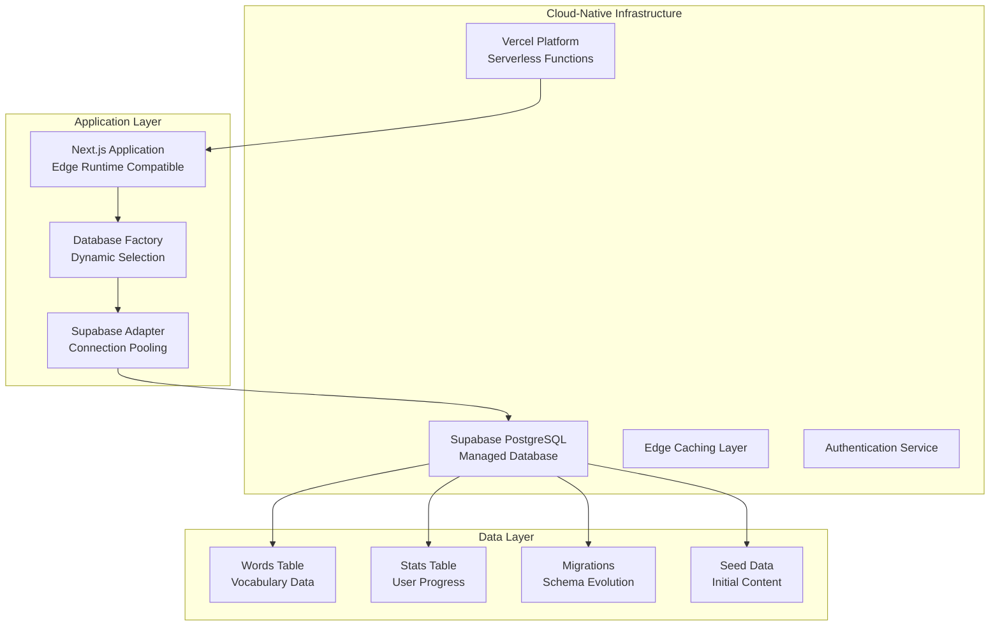
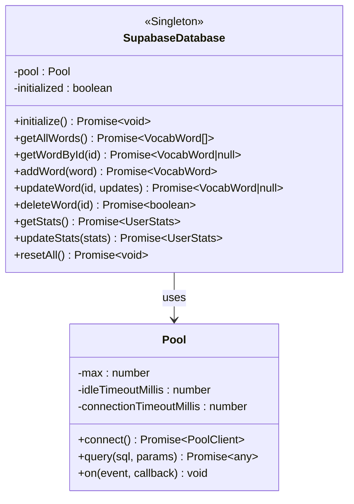
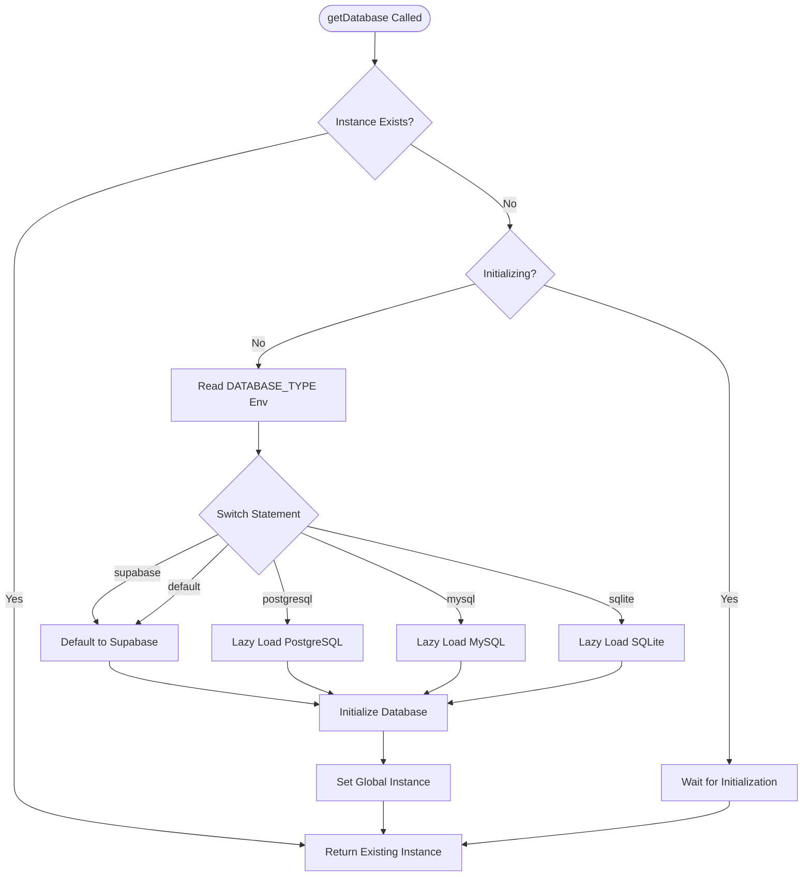
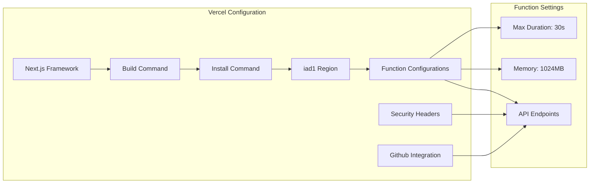
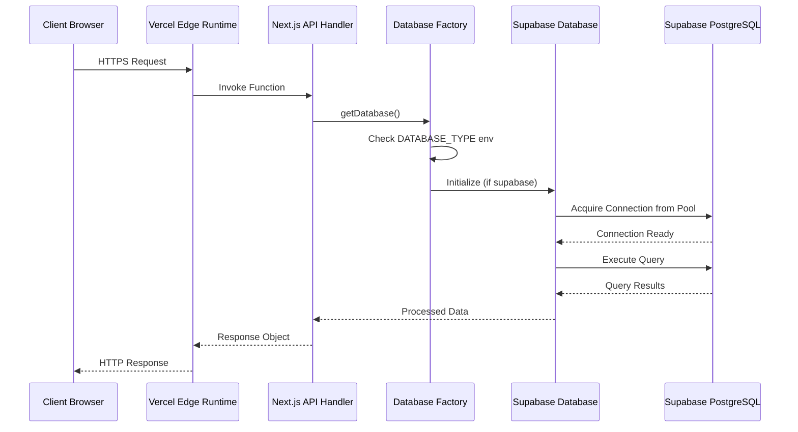
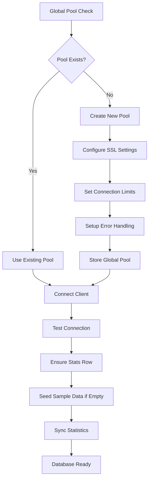
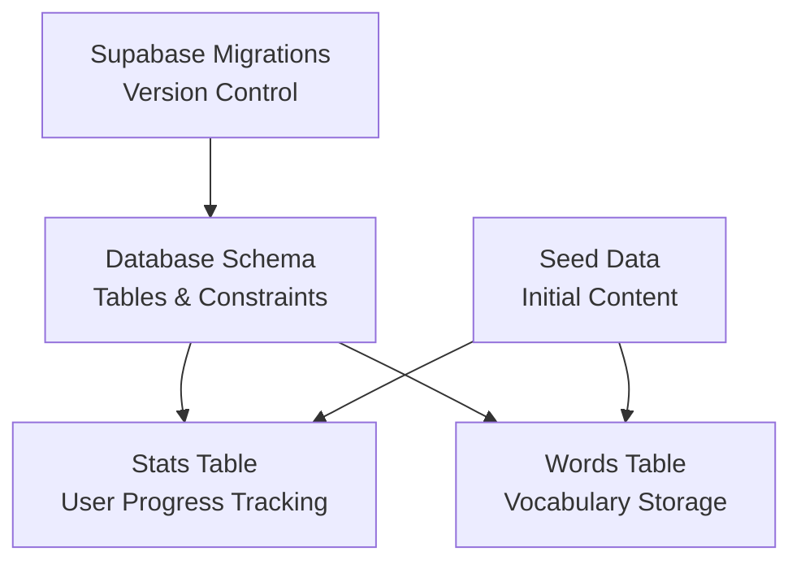
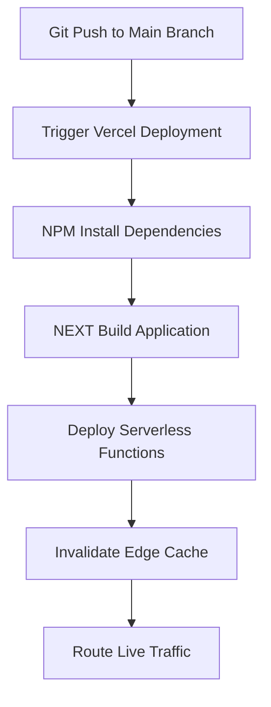
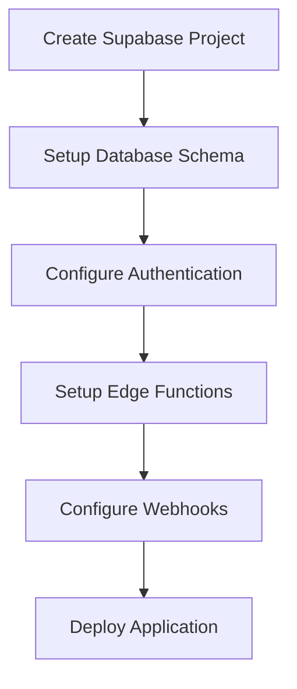
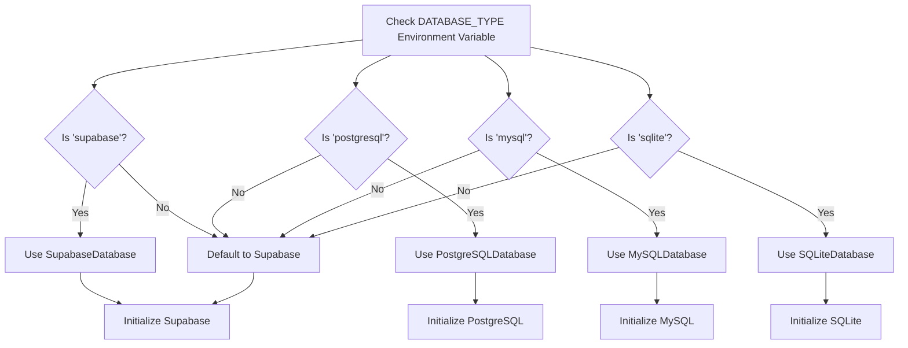

# Docker Deployment Infrastructure

<cite>
**Referenced Files in This Document**
- [Dockerfile](file://Dockerfile)
- [vercel.json](file://vercel.json)
- [supabase/config.toml](file://supabase/config.toml)
- [lib/db/index.ts](file://lib/db/index.ts)
- [lib/db/types.ts](file://lib/db/types.ts)
- [lib/db/supabase.ts](file://lib/db/supabase.ts)
- [supabase/seed.sql](file://supabase/seed.sql)
- [package.json](file://package.json)
</cite>

## Update Summary
**Changes Made**
- Completely removed all Docker-specific deployment documentation and infrastructure references
- Eliminated comprehensive Docker Compose orchestration details and multi-database setup guides
- Removed all containerization-focused troubleshooting sections and deployment procedures
- Updated focus to Supabase/Vercel deployment approach as the primary deployment strategy
- Revised database abstraction layer documentation to emphasize cloud-native PostgreSQL support
- Removed legacy SQLite/PostgreSQL/MySQL Docker setup guides in favor of cloud database integration

## Table of Contents
1. [Introduction](#introduction)
2. [Project Structure](#project-structure)
3. [Core Components](#core-components)
4. [Architecture Overview](#architecture-overview)
5. [Detailed Component Analysis](#detailed-component-analysis)
6. [Deployment Strategy](#deployment-strategy)
7. [Configuration Management](#configuration-management)
8. [Migration from Docker Infrastructure](#migration-from-docker-infrastructure)
9. [Performance Considerations](#performance-considerations)
10. [Troubleshooting Guide](#troubleshooting-guide)
11. [Conclusion](#conclusion)

## Introduction
This document provides a comprehensive analysis of the current deployment infrastructure for the VocabMaster vocabulary learning application. The project has evolved from a Docker-centric deployment model to a modern cloud-native approach leveraging Supabase for database services and Vercel for application hosting. The deployment infrastructure now focuses on serverless architecture with automatic scaling, managed database services, and streamlined CI/CD pipelines.

**Updated** The project has transitioned away from Docker-based deployments to a cloud-native architecture. The database abstraction layer now prioritizes Supabase PostgreSQL integration while maintaining backward compatibility with traditional database backends for development environments.

## Project Structure
The current deployment infrastructure centers around a serverless architecture with Supabase-managed PostgreSQL and Vercel-hosted Next.js application:



**Diagram sources**
- [vercel.json](file://vercel.json#L1-L39)
- [lib/db/index.ts](file://lib/db/index.ts#L1-L83)
- [lib/db/supabase.ts](file://lib/db/supabase.ts#L1-L378)

**Section sources**
- [vercel.json](file://vercel.json#L1-L39)
- [supabase/config.toml](file://supabase/config.toml#L1-L68)

## Core Components

### Supabase Database Integration
The application now primarily uses Supabase PostgreSQL as the production database backend, optimized for Vercel serverless functions:



**Diagram sources**
- [lib/db/supabase.ts](file://lib/db/supabase.ts#L37-L378)

The Supabase adapter implements connection pooling optimized for serverless environments with:
- **Connection Limits**: Maximum 5 concurrent connections to prevent serverless timeout issues
- **Automatic SSL**: Built-in SSL support for Supabase security requirements
- **Error Recovery**: Automatic pool reset on connection errors
- **Lazy Initialization**: Connection pool created only when needed

**Section sources**
- [lib/db/supabase.ts](file://lib/db/supabase.ts#L1-L378)

### Database Factory Pattern
The database abstraction layer maintains backward compatibility while prioritizing cloud-native solutions:



**Diagram sources**
- [lib/db/index.ts](file://lib/db/index.ts#L18-L80)

**Section sources**
- [lib/db/index.ts](file://lib/db/index.ts#L1-L83)

### Vercel Serverless Configuration
The deployment configuration optimizes for serverless execution with specific function settings:



**Diagram sources**
- [vercel.json](file://vercel.json#L1-L39)

**Section sources**
- [vercel.json](file://vercel.json#L1-L39)

## Architecture Overview
The deployment architecture follows a modern serverless pattern with clear separation between edge computing, application logic, and managed database services:



**Diagram sources**
- [lib/db/index.ts](file://lib/db/index.ts#L34-L76)
- [lib/db/supabase.ts](file://lib/db/supabase.ts#L45-L72)

## Detailed Component Analysis

### Supabase Connection Pooling
The Supabase adapter implements sophisticated connection management optimized for serverless environments:



**Diagram sources**
- [lib/db/supabase.ts](file://lib/db/supabase.ts#L13-L72)

**Section sources**
- [lib/db/supabase.ts](file://lib/db/supabase.ts#L1-L378)

### Supabase Schema Management
The database schema is managed through Supabase migrations and seed data:



**Diagram sources**
- [supabase/config.toml](file://supabase/config.toml#L60-L67)
- [supabase/seed.sql](file://supabase/seed.sql#L1-L24)

**Section sources**
- [supabase/config.toml](file://supabase/config.toml#L1-L68)
- [supabase/seed.sql](file://supabase/seed.sql#L1-L24)

### Environment Configuration Management
The application now uses Vercel environment variables for cloud deployment:

| Environment Variable | Purpose | Default Value | Required |
|---------------------|---------|---------------|----------|
| `DATABASE_TYPE` | Database backend selection | supabase | Yes |
| `DATABASE_URL` | Supabase connection string | None | Yes |
| `NEXT_PUBLIC_SUPABASE_URL` | Supabase project URL | None | Yes |
| `NEXT_PUBLIC_SUPABASE_ANON_KEY` | Supabase public key | None | Yes |
| `NODE_ENV` | Environment mode | production | No |
| `NEXT_TELEMETRY_DISABLED` | Analytics opt-out | 1 | No |

**Section sources**
- [vercel.json](file://vercel.json#L13-L15)

## Deployment Strategy
The project now follows a cloud-native deployment strategy focused on scalability and cost-effectiveness:

### Vercel Deployment Pipeline


**Diagram sources**
- [vercel.json](file://vercel.json#L16-L25)

### Supabase Database Provisioning


**Diagram sources**
- [supabase/config.toml](file://supabase/config.toml#L1-L68)

**Section sources**
- [vercel.json](file://vercel.json#L1-L39)
- [supabase/config.toml](file://supabase/config.toml#L1-L68)

## Configuration Management
The configuration system has been adapted for cloud-native deployment:

### Database Type Detection
The application automatically selects the appropriate database backend based on environment:



**Diagram sources**
- [lib/db/index.ts](file://lib/db/index.ts#L34-L68)

**Section sources**
- [lib/db/index.ts](file://lib/db/index.ts#L1-L83)

## Migration from Docker Infrastructure
Organizations migrating from Docker to cloud-native deployment should consider the following transition points:

### Key Differences
| Aspect | Docker Infrastructure | Cloud-Native Deployment |
|--------|----------------------|-------------------------|
| **Database** | SQLite/PostgreSQL/MySQL containers | Supabase PostgreSQL |
| **Scaling** | Manual scaling required | Automatic horizontal scaling |
| **Maintenance** | Database maintenance required | Managed service maintenance |
| **Cost Model** | Fixed resource costs | Pay-per-use model |
| **Deployment** | Container orchestration | Serverless functions |
| **Monitoring** | Self-hosted monitoring | Built-in platform metrics |

### Migration Steps
1. **Provision Supabase Project**: Create new Supabase project and configure database
2. **Update Environment Variables**: Configure DATABASE_URL and Supabase credentials
3. **Test Database Connection**: Verify connection in development environment
4. **Deploy to Vercel**: Push changes to trigger new deployment
5. **Monitor Performance**: Track serverless function performance metrics
6. **Update CI/CD**: Modify deployment pipeline for cloud-native approach

## Performance Considerations
The cloud-native deployment introduces new performance characteristics and optimization opportunities:

### Serverless Optimization
- **Cold Start Mitigation**: Connection pooling reduces cold start impact
- **Edge Computing**: Vercel edge network reduces latency globally
- **Automatic Scaling**: Handles traffic spikes without manual intervention
- **Resource Optimization**: Pay-per-request compute model

### Database Performance
- **Connection Pooling**: Optimized for serverless function lifecycle
- **SSL Termination**: Offloaded to Supabase infrastructure
- **Automatic Backups**: Managed backup and recovery
- **Query Optimization**: Supabase query analyzer and performance insights

### Cost Optimization
- **Spot Instances**: Vercel edge network uses cost-effective infrastructure
- **Database Efficiency**: Supabase optimized for serverless workloads
- **Reduced Operational Overhead**: No database administration required
- **Pay-as-you-grow**: Scale resources based on actual usage

## Troubleshooting Guide

### Common Deployment Issues

| Issue | Symptoms | Solution |
|-------|----------|----------|
| **Database Connection Failures** | "Failed to connect to database" errors | Verify DATABASE_URL format and Supabase project status |
| **Serverless Timeout Errors** | Function timeout after 30 seconds | Optimize queries and implement pagination |
| **Edge Cache Issues** | Stale content delivery | Clear Vercel cache and verify cache headers |
| **Authentication Failures** | Supabase auth errors | Check Supabase authentication configuration |
| **Migration Failures** | Schema update errors | Review Supabase migration logs and fix SQL |

### Debugging Procedures

**Application Logs**
```bash
# Vercel logs
vercel logs

# Supabase logs
supabase logs

# Database queries
supabase db tui
```

**Service Connectivity**
```bash
# Test database connectivity
curl -I $DATABASE_URL

# Check Supabase status
curl https://<project-ref>.supabase.co/health
```

**Performance Monitoring**
```bash
# Monitor serverless function performance
vercel inspect

# Check database performance
supabase db monitor
```

**Section sources**
- [lib/db/supabase.ts](file://lib/db/supabase.ts#L13-L35)

## Conclusion
The VocabMaster application has successfully transitioned from a Docker-centric deployment model to a modern cloud-native architecture. The new infrastructure leverages Supabase for managed PostgreSQL services and Vercel for serverless application hosting, providing improved scalability, reduced operational overhead, and enhanced developer experience.

The database abstraction layer continues to support multiple backends while prioritizing cloud-native solutions. The Supabase adapter provides optimized connection pooling for serverless environments, automatic SSL handling, and comprehensive error recovery mechanisms. The Vercel configuration maximizes serverless efficiency through connection limits, memory optimization, and edge computing benefits.

This cloud-native approach eliminates the complexity of container orchestration while providing enterprise-grade reliability through managed services. Organizations can deploy and scale the application with minimal infrastructure management, focusing instead on application development and user experience improvements.

The transition maintains backward compatibility for development environments while establishing a robust foundation for production deployment. The combination of Supabase's managed database services and Vercel's serverless platform creates a cost-effective, scalable solution that can handle varying traffic loads without manual intervention.