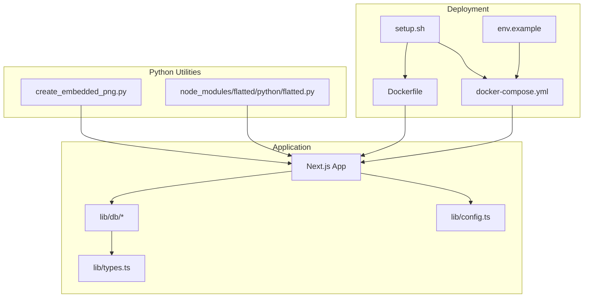
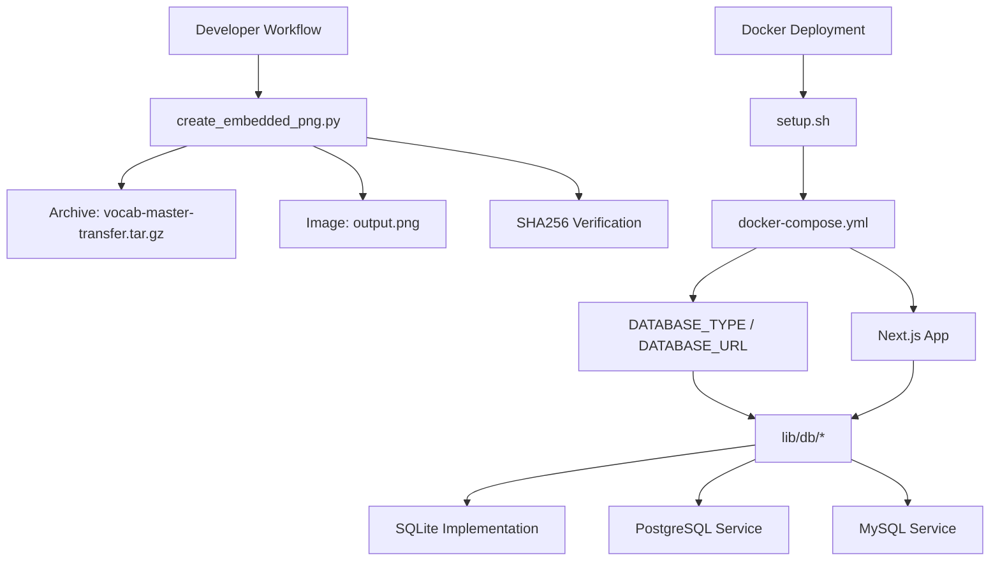
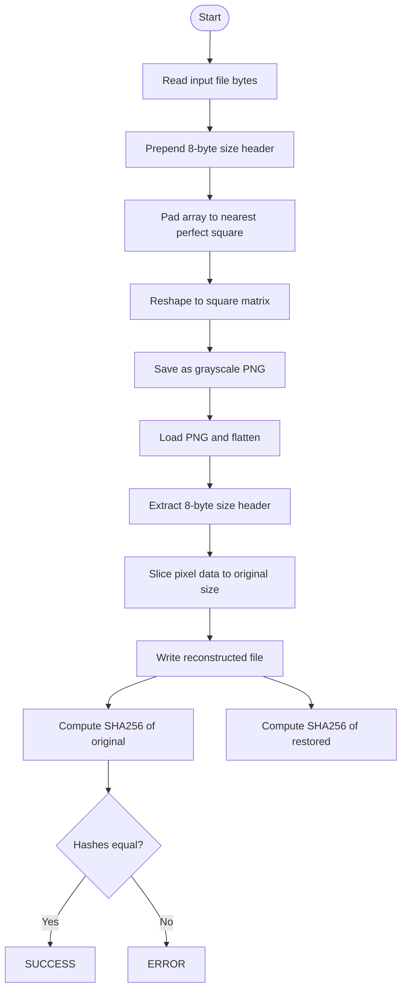
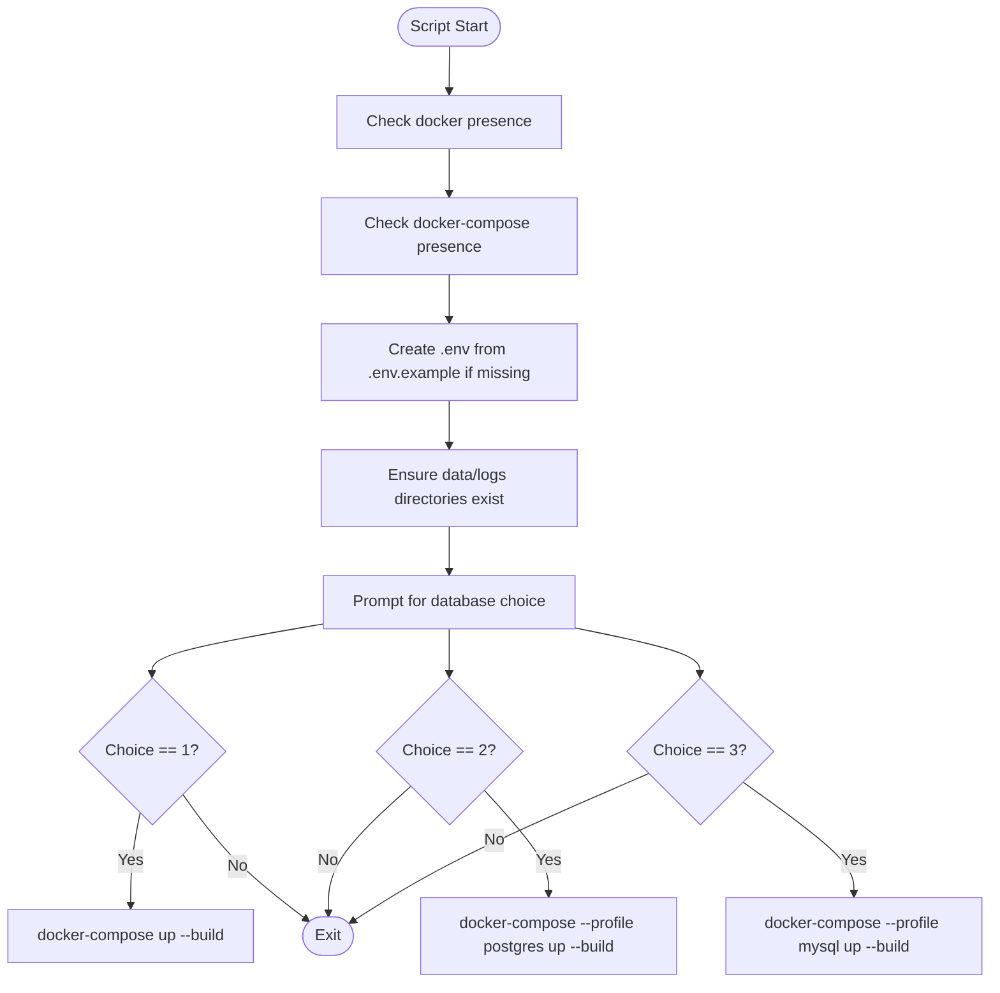
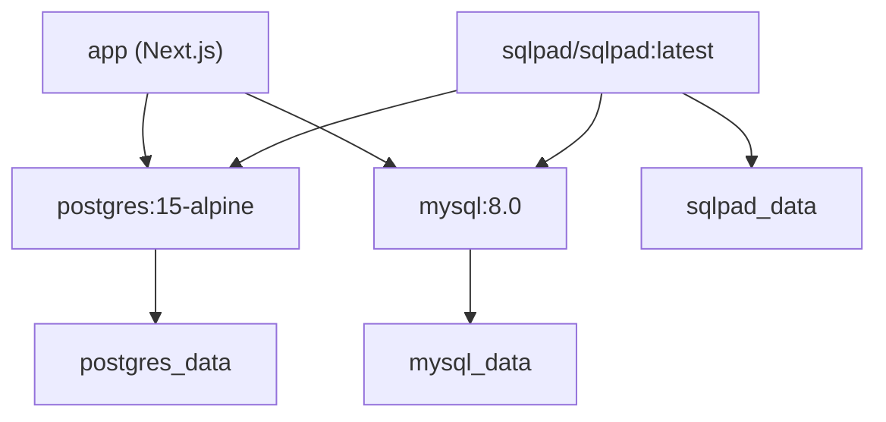
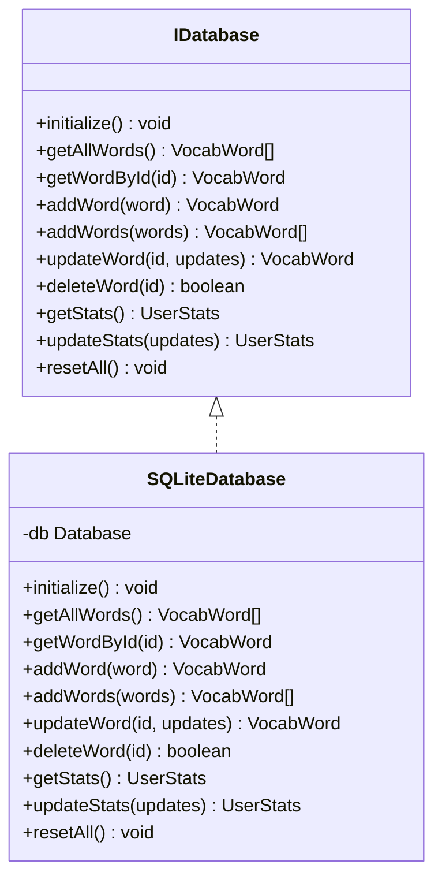
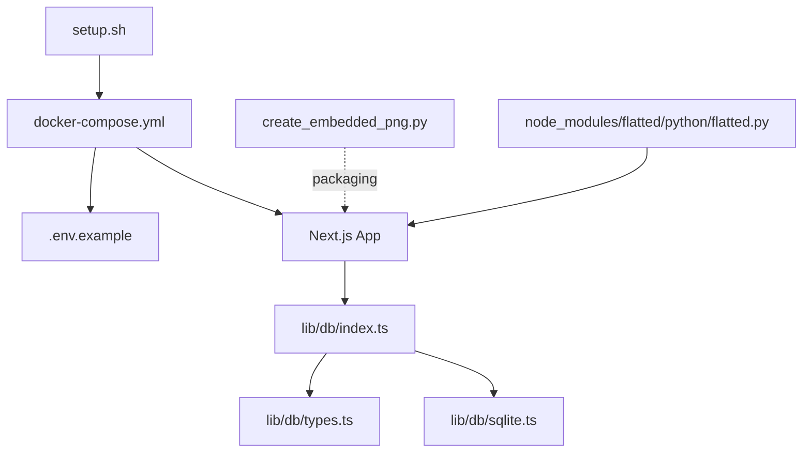

# Python Utilities

<cite>
**Referenced Files in This Document**
- [create_embedded_png.py](file://create_embedded_png.py)
- [setup.sh](file://setup.sh)
- [Dockerfile](file://Dockerfile)
- [docker-compose.yml](file://docker-compose.yml)
- [.env.example](file://.env.example)
- [lib/db/index.ts](file://lib/db/index.ts)
- [lib/db/sqlite.ts](file://lib/db/sqlite.ts)
- [lib/db/types.ts](file://lib/db/types.ts)
- [lib/config.ts](file://lib/config.ts)
- [lib/types.ts](file://lib/types.ts)
- [node_modules/flatted/python/flatted.py](file://node_modules/flatted/python/flatted.py)
</cite>

## Table of Contents
1. [Introduction](#introduction)
2. [Project Structure](#project-structure)
3. [Core Components](#core-components)
4. [Architecture Overview](#architecture-overview)
5. [Detailed Component Analysis](#detailed-component-analysis)
6. [Dependency Analysis](#dependency-analysis)
7. [Performance Considerations](#performance-considerations)
8. [Troubleshooting Guide](#troubleshooting-guide)
9. [Conclusion](#conclusion)

## Introduction
This document describes the Python utilities and related infrastructure within a Next.js application focused on vocabulary learning. It covers:
- A Python utility for encoding arbitrary files into PNG images and decoding them back to verify integrity
- A shell script for Docker-based deployment and environment setup
- Container orchestration via Docker Compose supporting SQLite, PostgreSQL, and MySQL
- Environment configuration for database selection and connection
- TypeScript database abstractions and implementations
- A lightweight Python JSON serialization library included as part of the project dependencies

The goal is to help developers understand how Python utilities integrate with the broader application stack, particularly for packaging, transport, and development operations.

## Project Structure
The repository combines a Next.js frontend with Python utilities and Docker tooling. Key areas:
- Python utilities: file-to-PNG encoding/decoding and integrity verification
- Deployment automation: shell script and Docker configuration
- Database abstraction layer: TypeScript interfaces and SQLite implementation
- Environment configuration: .env.example for database profiles
- Third-party Python library: a compact JSON serializer/deserializer

**Diagram sources**
- [create_embedded_png.py](file://create_embedded_png.py#L1-L72)
- [setup.sh](file://setup.sh#L1-L67)
- [Dockerfile](file://Dockerfile#L1-L55)
- [docker-compose.yml](file://docker-compose.yml#L1-L135)
- [.env.example](file://.env.example#L1-L40)
- [lib/db/index.ts](file://lib/db/index.ts#L1-L54)
- [lib/db/sqlite.ts](file://lib/db/sqlite.ts#L1-L297)
- [lib/db/types.ts](file://lib/db/types.ts#L1-L35)
- [lib/types.ts](file://lib/types.ts#L1-L105)
- [lib/config.ts](file://lib/config.ts#L1-L63)
- [node_modules/flatted/python/flatted.py](file://node_modules/flatted/python/flatted.py#L1-L150)

**Section sources**
- [create_embedded_png.py](file://create_embedded_png.py#L1-L72)
- [setup.sh](file://setup.sh#L1-L67)
- [Dockerfile](file://Dockerfile#L1-L55)
- [docker-compose.yml](file://docker-compose.yml#L1-L135)
- [.env.example](file://.env.example#L1-L40)
- [lib/db/index.ts](file://lib/db/index.ts#L1-L54)
- [lib/db/sqlite.ts](file://lib/db/sqlite.ts#L1-L297)
- [lib/db/types.ts](file://lib/db/types.ts#L1-L35)
- [lib/types.ts](file://lib/types.ts#L1-L105)
- [lib/config.ts](file://lib/config.ts#L1-L63)
- [node_modules/flatted/python/flatted.py](file://node_modules/flatted/python/flatted.py#L1-L150)

## Core Components
- File-to-PNG encoder/decoder: Converts any file into a grayscale PNG, embeds original size, and verifies integrity via SHA256 hashing
- Docker setup script: Validates prerequisites, prepares environment, and starts services based on selected database profile
- Docker Compose: Orchestrates the Next.js app, optional database services, and SQLPad for database management
- Database abstraction: TypeScript interfaces enabling pluggable database backends with a SQLite implementation
- Environment configuration: Centralized settings for database type and connection URLs
- Python JSON library: Compact implementation of a cycle-preserving JSON serializer/deserializer

**Section sources**
- [create_embedded_png.py](file://create_embedded_png.py#L7-L45)
- [setup.sh](file://setup.sh#L9-L62)
- [docker-compose.yml](file://docker-compose.yml#L1-L135)
- [lib/db/types.ts](file://lib/db/types.ts#L16-L34)
- [lib/db/sqlite.ts](file://lib/db/sqlite.ts#L28-L81)
- [.env.example](file://.env.example#L6-L28)
- [node_modules/flatted/python/flatted.py](file://node_modules/flatted/python/flatted.py#L141-L150)

## Architecture Overview
The Python utilities primarily support packaging and integrity checks during development and deployment. The application uses a database abstraction layer to support multiple backends, with Docker Compose orchestrating services and environment variables controlling database selection.

**Diagram sources**
- [create_embedded_png.py](file://create_embedded_png.py#L48-L72)
- [setup.sh](file://setup.sh#L20-L62)
- [docker-compose.yml](file://docker-compose.yml#L1-L135)
- [.env.example](file://.env.example#L6-L28)
- [lib/db/index.ts](file://lib/db/index.ts#L15-L51)
- [lib/db/sqlite.ts](file://lib/db/sqlite.ts#L28-L81)

## Detailed Component Analysis

### File-to-PNG Encoder/Decoder
Purpose:
- Convert any file into a square grayscale PNG by padding with zeros
- Embed the original file size at the beginning of pixel data
- Decode the PNG back to reconstruct the original file
- Verify integrity using SHA256 hashes

Key steps:
- Read input file bytes and prepend 8-byte little-endian size
- Flatten PNG pixels into a square grid and pad with zeros
- Save as grayscale PNG and load for reconstruction
- Extract embedded size and slice pixel data to restore original bytes
- Compute and compare SHA256 digests

**Diagram sources**
- [create_embedded_png.py](file://create_embedded_png.py#L7-L45)
- [create_embedded_png.py](file://create_embedded_png.py#L25-L37)
- [create_embedded_png.py](file://create_embedded_png.py#L39-L45)

**Section sources**
- [create_embedded_png.py](file://create_embedded_png.py#L7-L45)
- [create_embedded_png.py](file://create_embedded_png.py#L25-L37)
- [create_embedded_png.py](file://create_embedded_png.py#L39-L45)

### Docker Setup Script
Purpose:
- Validate Docker and Docker Compose availability
- Create or reuse .env from .env.example
- Prepare data and logs directories
- Prompt for database choice (SQLite, PostgreSQL, MySQL)
- Start services using docker-compose with appropriate profiles

Behavior highlights:
- Checks for docker and docker-compose commands
- Creates data and logs directories if missing
- Supports interactive choice with defaults
- Uses docker-compose profiles to selectively start database services

**Diagram sources**
- [setup.sh](file://setup.sh#L9-L62)

**Section sources**
- [setup.sh](file://setup.sh#L9-L62)

### Docker Compose Orchestration
Purpose:
- Define services for Next.js app, optional databases, and SQLPad
- Support multiple profiles for different database backends
- Persist SQLite data and logs
- Health-check database services

Key elements:
- App service builds from Dockerfile, exposes port, mounts data/logs, depends on database health
- PostgreSQL and MySQL services with health checks and init scripts
- SQLPad service configured to connect to both databases
- Profiles enable selective startup of database services

**Diagram sources**
- [docker-compose.yml](file://docker-compose.yml#L3-L31)
- [docker-compose.yml](file://docker-compose.yml#L33-L54)
- [docker-compose.yml](file://docker-compose.yml#L56-L79)
- [docker-compose.yml](file://docker-compose.yml#L80-L117)

**Section sources**
- [docker-compose.yml](file://docker-compose.yml#L1-L135)

### Database Abstraction Layer
Purpose:
- Provide a unified interface for database operations
- Enable runtime selection of backend via environment variable
- Implement SQLite as the default, with placeholders for PostgreSQL and MySQL

Key components:
- IDatabase interface defines methods for words and stats CRUD plus reset
- SQLiteDatabase implements initialization, seeding, and statistics synchronization
- Factory function getDatabase resolves the backend based on DATABASE_TYPE

**Diagram sources**
- [lib/db/types.ts](file://lib/db/types.ts#L16-L34)
- [lib/db/sqlite.ts](file://lib/db/sqlite.ts#L28-L297)

**Section sources**
- [lib/db/types.ts](file://lib/db/types.ts#L1-L35)
- [lib/db/sqlite.ts](file://lib/db/sqlite.ts#L28-L81)
- [lib/db/index.ts](file://lib/db/index.ts#L15-L51)

### Environment Configuration
Purpose:
- Centralize database selection and connection parameters
- Support SQLite by default and optional PostgreSQL/MySQL connections
- Provide sensible defaults for service ports and credentials

Highlights:
- DATABASE_TYPE controls backend selection
- DATABASE_URL specifies connection string per backend
- Example values for PostgreSQL and MySQL included as comments

**Section sources**
- [.env.example](file://.env.example#L6-L28)

### Python JSON Library (Flatted)
Purpose:
- Provide cycle-preserving JSON serialization/deserialization
- Useful for environments where standard JSON cannot represent cyclic structures

Key functions:
- stringify: Serializes an object graph with references
- parse: Deserializes and reconstructs the object graph

**Section sources**
- [node_modules/flatted/python/flatted.py](file://node_modules/flatted/python/flatted.py#L141-L150)

## Dependency Analysis
Relationships among components:
- The Docker setup script depends on Docker and Docker Compose being installed
- Docker Compose depends on environment variables for database configuration
- The Next.js application depends on the database abstraction layer
- The encoder/decoder utility is independent but can be used alongside the application for packaging tasks

**Diagram sources**
- [setup.sh](file://setup.sh#L9-L62)
- [docker-compose.yml](file://docker-compose.yml#L1-L135)
- [.env.example](file://.env.example#L6-L28)
- [lib/db/index.ts](file://lib/db/index.ts#L1-L54)
- [lib/db/types.ts](file://lib/db/types.ts#L1-L35)
- [lib/db/sqlite.ts](file://lib/db/sqlite.ts#L1-L297)
- [create_embedded_png.py](file://create_embedded_png.py#L1-L72)
- [node_modules/flatted/python/flatted.py](file://node_modules/flatted/python/flatted.py#L1-L150)

**Section sources**
- [setup.sh](file://setup.sh#L9-L62)
- [docker-compose.yml](file://docker-compose.yml#L1-L135)
- [.env.example](file://.env.example#L6-L28)
- [lib/db/index.ts](file://lib/db/index.ts#L1-L54)
- [lib/db/types.ts](file://lib/db/types.ts#L1-L35)
- [lib/db/sqlite.ts](file://lib/db/sqlite.ts#L1-L297)
- [create_embedded_png.py](file://create_embedded_png.py#L1-L72)
- [node_modules/flatted/python/flatted.py](file://node_modules/flatted/python/flatted.py#L1-L150)

## Performance Considerations
- PNG encoding: The square-padding approach ensures minimal memory overhead but increases image size proportionally to the square of the side length. For large files, consider compression or streaming alternatives.
- Database operations: SQLite WAL mode and foreign keys are enabled for durability and referential integrity. Indexes on review dates and words improve query performance.
- Docker runtime: Installing Python build tools in production images is necessary for native dependencies like better-sqlite3; ensure minimal image size by pruning caches appropriately.

[No sources needed since this section provides general guidance]

## Troubleshooting Guide
Common issues and resolutions:
- Docker prerequisites missing: The setup script exits early if Docker or Docker Compose is not installed. Install both tools and rerun the script.
- Database connectivity: Ensure DATABASE_TYPE matches the intended backend and DATABASE_URL is correctly formatted. For PostgreSQL/MySQL, confirm service health and credentials.
- Data persistence: For SQLite, verify that the data directory is mounted and writable inside the container.
- Integrity verification failures: If SHA256 hashes differ after encode/decode, re-run the process and confirm file paths and permissions.

**Section sources**
- [setup.sh](file://setup.sh#L9-L18)
- [docker-compose.yml](file://docker-compose.yml#L45-L49)
- [docker-compose.yml](file://docker-compose.yml#L69-L73)
- [create_embedded_png.py](file://create_embedded_png.py#L67-L72)

## Conclusion
The Python utilities complement the Next.js application by providing robust packaging and integrity verification capabilities. Combined with Docker-based deployment and a flexible database abstraction layer, the system supports efficient development, testing, and production operations across multiple database backends. The included Python JSON library further enhances interoperability in environments requiring advanced serialization features.

[No sources needed since this section summarizes without analyzing specific files]