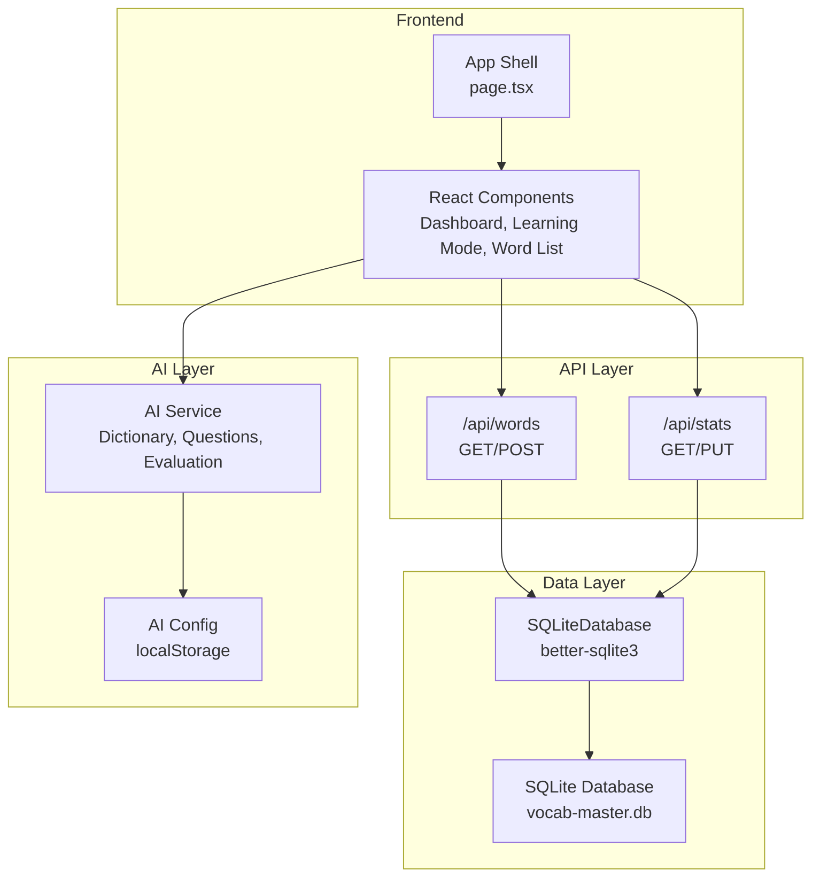
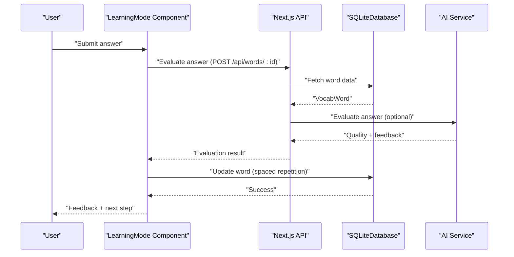
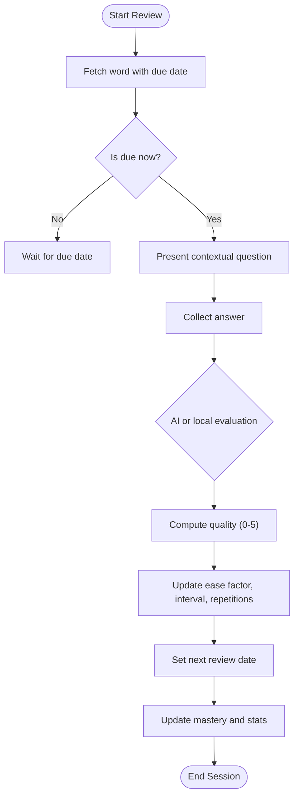
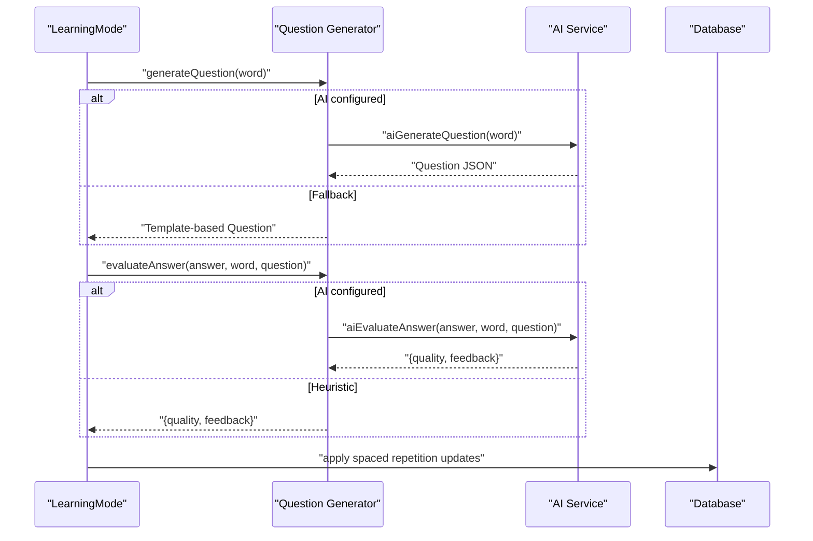
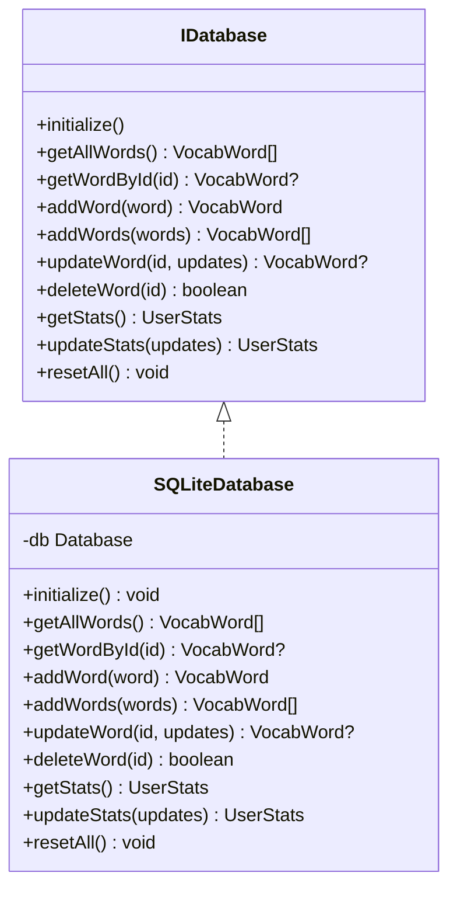
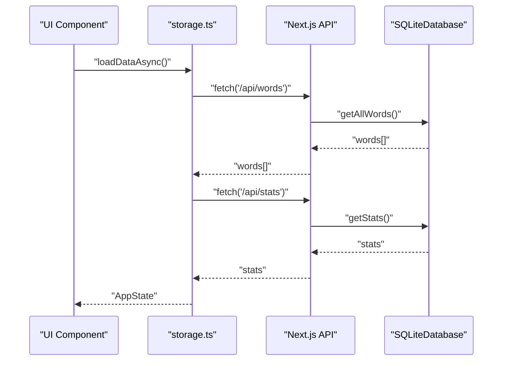
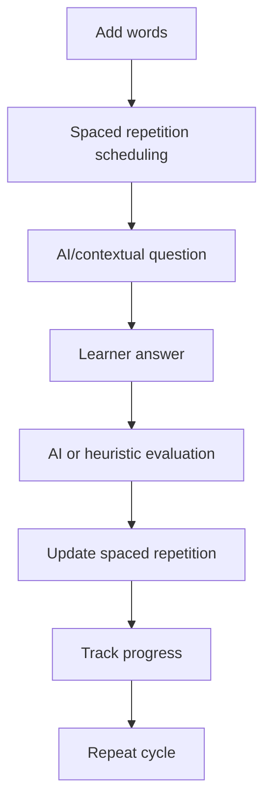
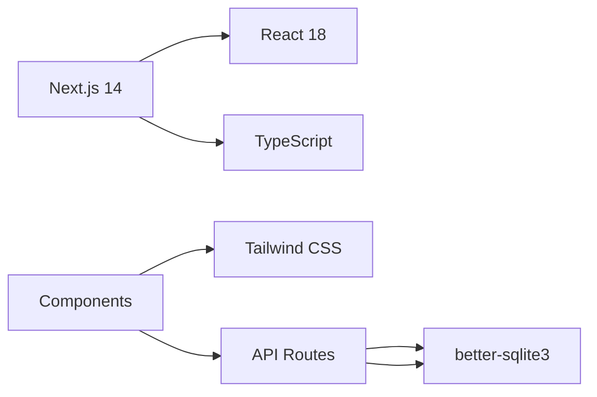

# Project Overview

<cite>
**Referenced Files in This Document**
- [package.json](file://package.json)
- [app/page.tsx](file://app/page.tsx)
- [lib/types.ts](file://lib/types.ts)
- [lib/spaced-repetition.ts](file://lib/spaced-repetition.ts)
- [lib/ai-service.ts](file://lib/ai-service.ts)
- [lib/question-generator.ts](file://lib/question-generator.ts)
- [lib/config.ts](file://lib/config.ts)
- [lib/db/index.ts](file://lib/db/index.ts)
- [lib/db/sqlite.ts](file://lib/db/sqlite.ts)
- [lib/storage.ts](file://lib/storage.ts)
- [components/learning-mode.tsx](file://components/learning-mode.tsx)
- [components/dashboard.tsx](file://components/dashboard.tsx)
- [app/api/words/route.ts](file://app/api/words/route.ts)
- [app/api/stats/route.ts](file://app/api/stats/route.ts)
- [next.config.mjs](file://next.config.mjs)
</cite>

## Table of Contents
1. [Introduction](#introduction)
2. [Project Structure](#project-structure)
3. [Core Components](#core-components)
4. [Architecture Overview](#architecture-overview)
5. [Detailed Component Analysis](#detailed-component-analysis)
6. [Dependency Analysis](#dependency-analysis)
7. [Performance Considerations](#performance-considerations)
8. [Troubleshooting Guide](#troubleshooting-guide)
9. [Conclusion](#conclusion)

## Introduction
VocabMaster is an AI-powered vocabulary learning application designed to help users efficiently acquire and retain advanced English words through evidence-based learning techniques. Its core educational value proposition centers on combining spaced repetition scheduling with AI-generated contextual questions that simultaneously test vocabulary knowledge and specific grammar structures. This approach moves beyond rote memorization by embedding words into meaningful, structured language use, reinforcing both recognition and productive usage.

Target audience includes learners seeking a focused, mobile-first vocabulary trainer that adapts to their pace and learning needs. The platform supports both self-directed study and guided practice, with optional AI assistance for question generation and answer evaluation.

Key features:
- Spaced repetition system (SM-2) that schedules reviews based on recall quality to maximize long-term retention
- AI-powered contextual questions that require students to use the target word within a specific grammar structure, enhancing both vocabulary and grammar fluency
- Mobile-first responsive design optimized for on-the-go learning sessions
- Lightweight, offline-capable SQLite-backed architecture suitable for personal devices and minimal hosting overhead

Educational methodology:
VocabMaster leverages the SuperMemo 2 (SM-2) algorithm to determine optimal review timing, ensuring that words are revisited just before forgetting occurs. AI-driven questions integrate vocabulary and grammar instruction, requiring learners to produce coherent, structured sentences that demonstrate understanding. This dual focus aligns with research-backed practices that emphasize retrieval practice and interleaving of related skills.

Practical learning workflows:
- Add words manually or in bulk, then immediately begin reviewing based on due dates
- Engage in adaptive learning sessions where AI generates contextual questions tailored to each word’s grammar requirement
- Receive instant, AI-evaluated feedback that rates answer quality and provides encouraging guidance
- Track progress through a dashboard that displays mastery levels, daily streaks, and learning statistics

## Project Structure
The application follows a clear separation of concerns:
- Frontend: Next.js 14 app with React 18, TypeScript for type safety, and Tailwind CSS for styling
- Data Layer: SQLite database managed via better-sqlite3, accessed through a database abstraction layer
- API Layer: Next.js App Router API routes that expose CRUD operations for words and stats
- AI Integration: Configurable OpenAI-compatible service for dictionary lookups, contextual question generation, and answer evaluation
- UI Components: Reusable components for dashboard, word lists, learning mode, and dialogs

**Diagram sources**
- [app/page.tsx](file://app/page.tsx#L1-L316)
- [lib/db/sqlite.ts](file://lib/db/sqlite.ts#L1-L297)
- [lib/ai-service.ts](file://lib/ai-service.ts#L1-L239)
- [lib/config.ts](file://lib/config.ts#L1-L63)
- [app/api/words/route.ts](file://app/api/words/route.ts#L1-L28)
- [app/api/stats/route.ts](file://app/api/stats/route.ts#L1-L26)

**Section sources**
- [package.json](file://package.json#L1-L33)
- [next.config.mjs](file://next.config.mjs#L1-L15)
- [app/page.tsx](file://app/page.tsx#L1-L316)

## Core Components
- Application shell and routing: Orchestrates navigation between dashboard, word list, learning mode, and session completion screens
- Learning mode: Presents contextual AI questions, captures answers, evaluates quality, and applies spaced repetition updates
- Dashboard: Visualizes learning progress, mastery statistics, and streak metrics
- Spaced repetition engine: Implements SM-2 scheduling, calculates next review intervals, and computes mastery levels
- AI service: Provides dictionary lookups, contextual question generation, and answer evaluation using configurable OpenAI-compatible endpoints
- Database abstraction: Defines a pluggable interface for persistence, currently backed by SQLite with better-sqlite3
- Storage facade: Exposes async APIs for fetching and updating words and stats, coordinating with Next.js API routes

**Section sources**
- [app/page.tsx](file://app/page.tsx#L27-L120)
- [components/learning-mode.tsx](file://components/learning-mode.tsx#L1-L370)
- [components/dashboard.tsx](file://components/dashboard.tsx#L1-L154)
- [lib/spaced-repetition.ts](file://lib/spaced-repetition.ts#L1-L123)
- [lib/ai-service.ts](file://lib/ai-service.ts#L1-L239)
- [lib/db/index.ts](file://lib/db/index.ts#L1-L21)
- [lib/storage.ts](file://lib/storage.ts#L1-L137)

## Architecture Overview
VocabMaster employs a frontend-first architecture with a thin server layer:
- The React UI runs in the browser, communicating with Next.js API routes
- API routes execute on the server and delegate persistence to the database abstraction
- The database abstraction encapsulates SQLite operations and exposes a unified interface
- AI capabilities are optional and configurable, enabling fallback modes when AI is unavailable

**Diagram sources**
- [components/learning-mode.tsx](file://components/learning-mode.tsx#L76-L156)
- [app/api/words/route.ts](file://app/api/words/route.ts#L1-L28)
- [lib/db/sqlite.ts](file://lib/db/sqlite.ts#L190-L222)
- [lib/ai-service.ts](file://lib/ai-service.ts#L162-L211)

## Detailed Component Analysis

### Spaced Repetition Engine
The engine implements the SM-2 algorithm to schedule reviews based on recall quality. It adjusts ease factors, intervals, and repetition counts, and computes mastery percentages to inform progress tracking.

**Diagram sources**
- [lib/spaced-repetition.ts](file://lib/spaced-repetition.ts#L8-L48)
- [lib/spaced-repetition.ts](file://lib/spaced-repetition.ts#L50-L68)
- [lib/spaced-repetition.ts](file://lib/spaced-repetition.ts#L98-L122)

**Section sources**
- [lib/spaced-repetition.ts](file://lib/spaced-repetition.ts#L1-L123)
- [lib/types.ts](file://lib/types.ts#L1-L105)

### AI-Powered Question Generation and Evaluation
The AI service generates contextual questions that embed the target word within a specific grammar structure and evaluates answers using configurable prompts. When AI is unavailable, the system falls back to template-based generation and heuristic scoring.

**Diagram sources**
- [lib/question-generator.ts](file://lib/question-generator.ts#L100-L111)
- [lib/question-generator.ts](file://lib/question-generator.ts#L173-L188)
- [lib/ai-service.ts](file://lib/ai-service.ts#L113-L159)
- [lib/ai-service.ts](file://lib/ai-service.ts#L161-L211)

**Section sources**
- [lib/ai-service.ts](file://lib/ai-service.ts#L1-L239)
- [lib/question-generator.ts](file://lib/question-generator.ts#L1-L255)
- [lib/config.ts](file://lib/config.ts#L1-L63)

### Database Abstraction and Persistence
The database abstraction enables swapping implementations while keeping the rest of the system unchanged. The current implementation uses SQLite with better-sqlite3, including indices for efficient queries and automatic seeding of sample words.

**Diagram sources**
- [lib/db/index.ts](file://lib/db/index.ts#L1-L21)
- [lib/db/sqlite.ts](file://lib/db/sqlite.ts#L28-L279)

**Section sources**
- [lib/db/index.ts](file://lib/db/index.ts#L1-L21)
- [lib/db/sqlite.ts](file://lib/db/sqlite.ts#L1-L297)

### API Routes and Storage Facade
The API routes expose endpoints for words and stats, delegating to the database abstraction. The storage facade coordinates asynchronous operations from the UI, ensuring consistent state updates.

**Diagram sources**
- [lib/storage.ts](file://lib/storage.ts#L77-L84)
- [app/api/words/route.ts](file://app/api/words/route.ts#L4-L14)
- [app/api/stats/route.ts](file://app/api/stats/route.ts#L4-L13)
- [lib/db/sqlite.ts](file://lib/db/sqlite.ts#L130-L133)

**Section sources**
- [lib/storage.ts](file://lib/storage.ts#L1-L137)
- [app/api/words/route.ts](file://app/api/words/route.ts#L1-L28)
- [app/api/stats/route.ts](file://app/api/stats/route.ts#L1-L26)

### Conceptual Overview
The application’s educational philosophy emphasizes retrieval practice and interleaved skill reinforcement. By integrating grammar requirements into vocabulary questions, learners strengthen both receptive and productive language skills, aligning with evidence-based practices that improve long-term retention and transfer.

[No sources needed since this diagram shows conceptual workflow, not actual code structure]

## Dependency Analysis
The project relies on a focused set of dependencies:
- Next.js 14 for the fullstack React framework
- better-sqlite3 for embedded database operations
- TypeScript for type safety
- Tailwind CSS ecosystem for styling and responsive design

**Diagram sources**
- [package.json](file://package.json#L11-L31)

**Section sources**
- [package.json](file://package.json#L1-L33)
- [next.config.mjs](file://next.config.mjs#L1-L15)

## Performance Considerations
- Database optimization: SQLite indices on frequently queried columns (review dates and word text) improve query performance for due word retrieval and word lookups
- Efficient updates: Batched operations for bulk imports and transactional inserts reduce I/O overhead
- Client-side caching: UI components rely on local state during sessions, minimizing unnecessary network requests
- AI evaluation fallback: Local evaluation ensures responsiveness when AI services are unavailable

[No sources needed since this section provides general guidance]

## Troubleshooting Guide
Common issues and resolutions:
- AI configuration errors: Verify API key and endpoint configuration; the system falls back to template-based questions and heuristic scoring when AI is not configured
- Database initialization failures: Ensure the data directory exists and the database file is writable; the implementation creates directories and seeds sample words automatically
- API route errors: Confirm that API routes are reachable and that the server is running; check console logs for detailed error messages
- Webpack bundling: better-sqlite3 is excluded from client-side bundling and runs server-side, preventing runtime errors in the browser

**Section sources**
- [lib/config.ts](file://lib/config.ts#L52-L62)
- [lib/db/sqlite.ts](file://lib/db/sqlite.ts#L12-L26)
- [app/api/words/route.ts](file://app/api/words/route.ts#L10-L13)
- [next.config.mjs](file://next.config.mjs#L6-L11)

## Conclusion
VocabMaster delivers a focused, evidence-based vocabulary learning experience that combines spaced repetition with AI-powered contextual questions. Its mobile-first design, lightweight architecture, and optional AI integration make it adaptable to diverse learning environments. By emphasizing retrieval practice and integrated grammar instruction, the application supports deeper, more durable vocabulary acquisition compared to traditional flashcard systems that isolate vocabulary from structural language use.