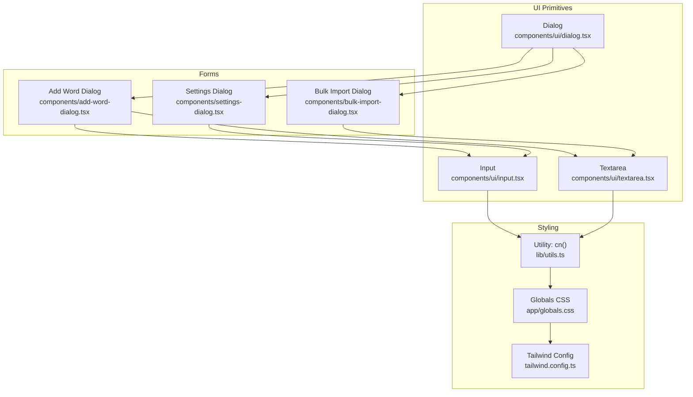
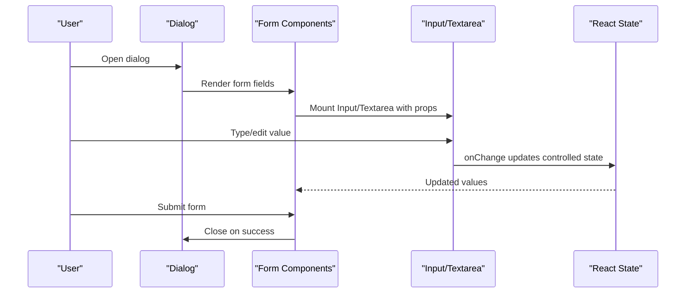
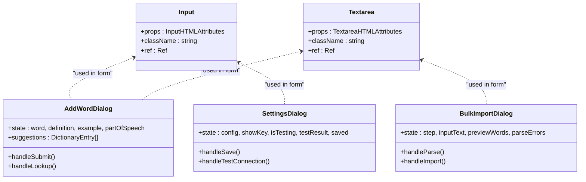
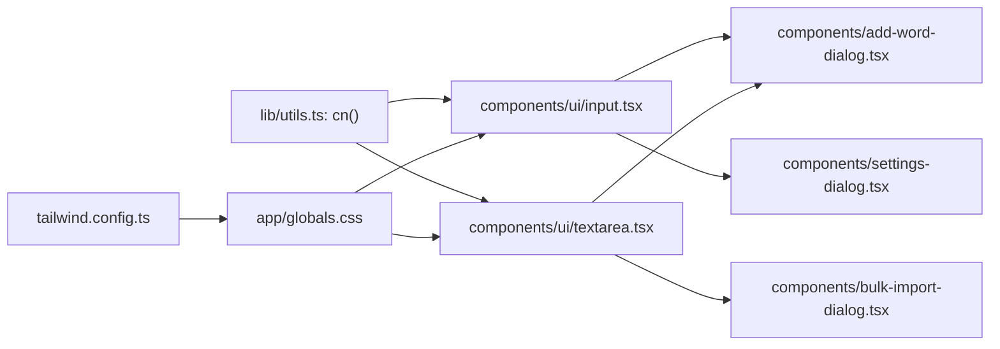

# Form Controls

<cite>
**Referenced Files in This Document**
- [input.tsx](file://components/ui/input.tsx)
- [textarea.tsx](file://components/ui/textarea.tsx)
- [add-word-dialog.tsx](file://components/add-word-dialog.tsx)
- [bulk-import-dialog.tsx](file://components/bulk-import-dialog.tsx)
- [settings-dialog.tsx](file://components/settings-dialog.tsx)
- [dialog.tsx](file://components/ui/dialog.tsx)
- [utils.ts](file://lib/utils.ts)
- [globals.css](file://app/globals.css)
- [tailwind.config.ts](file://tailwind.config.ts)
</cite>

## Table of Contents
1. [Introduction](#introduction)
2. [Project Structure](#project-structure)
3. [Core Components](#core-components)
4. [Architecture Overview](#architecture-overview)
5. [Detailed Component Analysis](#detailed-component-analysis)
6. [Dependency Analysis](#dependency-analysis)
7. [Performance Considerations](#performance-considerations)
8. [Troubleshooting Guide](#troubleshooting-guide)
9. [Conclusion](#conclusion)

## Introduction
This document provides comprehensive documentation for VocabMaster’s form control components, focusing on Input and Textarea. It covers component APIs, styling variants, validation patterns, accessibility features, integration with form libraries, controlled/uncontrolled patterns, and state management. It also includes usage examples for different input types, validation scenarios, and custom styling approaches, along with keyboard navigation, screen reader compatibility, and mobile touch interactions.

## Project Structure
VocabMaster organizes UI primitives under components/ui, while higher-level forms live in dedicated dialogs. The styling system leverages Tailwind CSS with a custom color palette and animations.

**Diagram sources**
- [input.tsx](file://components/ui/input.tsx#L1-L25)
- [textarea.tsx](file://components/ui/textarea.tsx#L1-L24)
- [dialog.tsx](file://components/ui/dialog.tsx#L1-L31)
- [add-word-dialog.tsx](file://components/add-word-dialog.tsx#L1-L297)
- [bulk-import-dialog.tsx](file://components/bulk-import-dialog.tsx#L1-L495)
- [settings-dialog.tsx](file://components/settings-dialog.tsx#L1-L248)
- [utils.ts](file://lib/utils.ts#L1-L7)
- [globals.css](file://app/globals.css#L1-L156)
- [tailwind.config.ts](file://tailwind.config.ts#L1-L103)

**Section sources**
- [input.tsx](file://components/ui/input.tsx#L1-L25)
- [textarea.tsx](file://components/ui/textarea.tsx#L1-L24)
- [dialog.tsx](file://components/ui/dialog.tsx#L1-L31)
- [add-word-dialog.tsx](file://components/add-word-dialog.tsx#L1-L297)
- [bulk-import-dialog.tsx](file://components/bulk-import-dialog.tsx#L1-L495)
- [settings-dialog.tsx](file://components/settings-dialog.tsx#L1-L248)
- [utils.ts](file://lib/utils.ts#L1-L7)
- [globals.css](file://app/globals.css#L1-L156)
- [tailwind.config.ts](file://tailwind.config.ts#L1-L103)

## Core Components
This section documents the Input and Textarea primitives, their props, styling, and accessibility characteristics.

- Input
  - Purpose: Lightweight wrapper around HTML input with consistent styling and focus states.
  - Props: Inherits all HTML input attributes; accepts className for customization.
  - Focus and disabled states: Uses focus-visible outline and ring styles; disabled applies cursor and opacity overrides.
  - Accessibility: Inherits native semantics; supports aria-* attributes via props.
  - Controlled pattern: Intended to be controlled by parent components via value and onChange.

- Textarea
  - Purpose: Lightweight wrapper around HTML textarea with consistent styling and focus states.
  - Props: Inherits all HTML textarea attributes; accepts className for customization.
  - Behavior: Disables manual resizing via resize-none; maintains min height.
  - Accessibility: Inherits native semantics; supports aria-* attributes via props.
  - Controlled pattern: Intended to be controlled by parent components via value and onChange.

Both components forward refs and expose displayName for React DevTools.

**Section sources**
- [input.tsx](file://components/ui/input.tsx#L4-L25)
- [textarea.tsx](file://components/ui/textarea.tsx#L4-L24)

## Architecture Overview
The form controls integrate with dialog-based forms to capture user input, manage state, and trigger actions. The dialogs orchestrate controlled inputs, validation, and submission.

**Diagram sources**
- [dialog.tsx](file://components/ui/dialog.tsx#L13-L27)
- [add-word-dialog.tsx](file://components/add-word-dialog.tsx#L141-L104)
- [bulk-import-dialog.tsx](file://components/bulk-import-dialog.tsx#L266-L156)
- [input.tsx](file://components/ui/input.tsx#L7-L20)
- [textarea.tsx](file://components/ui/textarea.tsx#L7-L20)

## Detailed Component Analysis

### Input Component
- API
  - Props: Extends HTML input attributes; className optional for overrides.
  - Ref forwarding: Forwards ref to underlying input element.
  - Display name: "Input" for DevTools.

- Styling and Variants
  - Base: Rounded corners, border, background, padding, placeholder color, transitions.
  - Focus: Focus-visible outline and ring with offset ring.
  - Disabled: Cursor-not-allowed and reduced opacity.
  - Overrides: Accepts className to extend or override defaults.

- Accessibility
  - Inherits native input semantics.
  - Supports aria-invalid, aria-describedby, aria-label, aria-labelledby via props.

- Controlled Pattern
  - Controlled via value and onChange; parent manages state and passes down.

- Usage Examples
  - Basic text input with label and required attribute.
  - Password input using type="password".
  - Search input with trailing icon and disabled state.

- Keyboard Navigation
  - Standard input behaviors: tab order, focus ring, Enter submission in forms.

- Screen Reader Compatibility
  - Use label htmlFor matching input id; provide aria-describedby for hints.

- Mobile Touch Interactions
  - Standard touch input behavior; focus-visible ring visible on keyboard focus.

**Section sources**
- [input.tsx](file://components/ui/input.tsx#L4-L25)

### Textarea Component
- API
  - Props: Extends HTML textarea attributes; className optional for overrides.
  - Ref forwarding: Forwards ref to underlying textarea element.
  - Display name: "Textarea" for DevTools.

- Styling and Variants
  - Base: Rounded corners, border, background, padding, placeholder color, transitions.
  - Resize: resize-none prevents manual resizing; min-height maintained.
  - Focus: Focus-visible outline and ring with offset ring.
  - Disabled: Cursor-not-allowed and reduced opacity.
  - Overrides: Accepts className to extend or override defaults.

- Accessibility
  - Inherits native textarea semantics.
  - Supports aria-invalid, aria-describedby, aria-label, aria-labelledby via props.

- Controlled Pattern
  - Controlled via value and onChange; parent manages state and passes down.

- Usage Examples
  - Definition field with required attribute.
  - Example sentence field (optional).
  - Multi-line import text area with monospace font and placeholder guidance.

- Keyboard Navigation
  - Standard textarea behaviors: tab order, focus ring, Enter/newline handling.

- Screen Reader Compatibility
  - Use label htmlFor matching textarea id; provide aria-describedby for guidance.

- Mobile Touch Interactions
  - Standard touch input behavior; focus-visible ring visible on keyboard focus.

**Section sources**
- [textarea.tsx](file://components/ui/textarea.tsx#L4-L24)

### Integration with Dialog Forms

#### Add Word Dialog
- Controlled Inputs
  - Word: Debounced lookup with AI suggestions; shows loading and error states.
  - Definition: Required; validated before submit.
  - Example: Optional; supports AI enrichment.
  - Part of Speech: Select dropdown with predefined options.

- Validation Patterns
  - Form-level: Prevents submission when required fields are empty.
  - UI-level: Visual indicators (check icons) for filled fields; error messages for lookup failures.

- Accessibility
  - Labels for all inputs; proper aria-describedby for hints and errors.
  - Focus management: autoFocus and focus-visible rings.

- State Management
  - Local state for form fields, suggestions, and UI states.
  - Cleanup timeouts on unmount and dialog close.

- Keyboard and Screen Reader
  - Suggestion dropdown navigable via keyboard; selection via Enter/Space.
  - Screen reader announcements for suggestion counts and statuses.

- Mobile Touch Interactions
  - Touch-friendly buttons and inputs; dropdown appears on demand.

**Section sources**
- [add-word-dialog.tsx](file://components/add-word-dialog.tsx#L20-L131)
- [add-word-dialog.tsx](file://components/add-word-dialog.tsx#L141-L104)
- [add-word-dialog.tsx](file://components/add-word-dialog.tsx#L225-L245)

#### Bulk Import Dialog
- Controlled Inputs
  - Textarea for multi-format input (plain text, CSV, JSON).
  - Preview list with checkboxes; select/deselect all actions.
  - AI enrichment for missing definitions.

- Validation Patterns
  - Parsing errors surfaced to users with scrollable list.
  - Ready-to-import count drives enablement of import action.

- Accessibility
  - Checkbox list with labels; status badges for visual cues.
  - Progress bar and status messages for screen readers.

- State Management
  - Multi-step wizard state machine (input → preview → importing → complete).
  - Per-item selection and status tracking.

- Keyboard and Screen Reader
  - Keyboard navigation within preview list; status indicators for assistive tech.

- Mobile Touch Interactions
  - Touch-friendly steps and actions; scrollable preview list.

**Section sources**
- [bulk-import-dialog.tsx](file://components/bulk-import-dialog.tsx#L30-L206)
- [bulk-import-dialog.tsx](file://components/bulk-import-dialog.tsx#L266-L156)

#### Settings Dialog
- Controlled Inputs
  - API key input with masked visibility toggle.
  - Test connection action with loading and result feedback.

- Validation Patterns
  - Save button disabled until changes are made.
  - Test connection disabled when API key is empty.

- Accessibility
  - Toggle button with title attribute; loader and result icons for feedback.

- State Management
  - Local state synchronized with persisted configuration.

- Keyboard and Screen Reader
  - Clear affordances for masked/unmasked input; status icons announce outcomes.

- Mobile Touch Interactions
  - Touch-friendly toggle and buttons.

**Section sources**
- [settings-dialog.tsx](file://components/settings-dialog.tsx#L17-L38)
- [settings-dialog.tsx](file://components/settings-dialog.tsx#L200-L232)

### Controlled vs Uncontrolled Patterns
- Controlled
  - Both Input and Textarea are designed for controlled usage.
  - Parent components manage value and onChange to keep UI state synchronized.
  - Recommended for validation, real-time feedback, and integration with form libraries.

- Uncontrolled
  - Not demonstrated in the codebase; however, the components support uncontrolled usage by passing defaultValue and relying on refs for imperative access.
  - Not recommended for validation scenarios due to lack of centralized state.

### Styling System and Customization
- Utility Function
  - cn(...) merges Tailwind classes with clsx and tailwind-merge for predictable overrides.

- Global Styles and Theme Tokens
  - CSS variables define semantic colors (primary, input, ring, background, foreground).
  - Dark mode support via .dark class.
  - Animations and gradients for interactive feedback.

- Tailwind Configuration
  - Extends spacing, colors, border radius, shadows, and keyframes.
  - Content paths include components, pages, and app directories.

- Custom Styling Approaches
  - Extend base classes via className prop.
  - Override focus-visible ring and border colors using semantic color tokens.
  - Combine with utility classes for spacing, alignment, and responsive layouts.

**Section sources**
- [utils.ts](file://lib/utils.ts#L4-L6)
- [globals.css](file://app/globals.css#L5-L72)
- [globals.css](file://app/globals.css#L84-L103)
- [tailwind.config.ts](file://tailwind.config.ts#L20-L97)

## Architecture Overview

**Diagram sources**
- [input.tsx](file://components/ui/input.tsx#L4-L25)
- [textarea.tsx](file://components/ui/textarea.tsx#L4-L24)
- [add-word-dialog.tsx](file://components/add-word-dialog.tsx#L20-L131)
- [bulk-import-dialog.tsx](file://components/bulk-import-dialog.tsx#L30-L206)
- [settings-dialog.tsx](file://components/settings-dialog.tsx#L17-L38)

## Detailed Component Analysis

### Input Component API and Usage
- Props
  - Inherits all HTML input attributes (type, placeholder, required, disabled, aria-*).
  - className: Optional overrides for base styles.

- Styling
  - Consistent rounded borders, background, padding, and placeholder color.
  - Focus-visible outline and ring with offset ring.
  - Disabled state applies cursor-not-allowed and reduced opacity.

- Accessibility
  - Native input semantics; supports aria-invalid, aria-describedby, aria-label, aria-labelledby.

- Controlled Usage
  - Pass value and onChange; parent manages state.
  - Example paths:
    - [Basic usage in Add Word Dialog](file://components/add-word-dialog.tsx#L149-L156)
    - [API key input in Settings Dialog](file://components/settings-dialog.tsx#L6-L21)

- Validation Scenarios
  - Required fields enforced via HTML required attribute and form submission checks.
  - Example paths:
    - [Required word and definition](file://components/add-word-dialog.tsx#L96-L104)

- Custom Styling
  - Extend base styles via className; combine with Tailwind utilities for layout and responsiveness.
  - Example paths:
    - [Custom width and padding](file://components/add-word-dialog.tsx#L149-L156)

**Section sources**
- [input.tsx](file://components/ui/input.tsx#L4-L25)
- [add-word-dialog.tsx](file://components/add-word-dialog.tsx#L149-L156)
- [settings-dialog.tsx](file://components/settings-dialog.tsx#L6-L21)
- [add-word-dialog.tsx](file://components/add-word-dialog.tsx#L96-L104)

### Textarea Component API and Usage
- Props
  - Inherits all HTML textarea attributes (placeholder, required, disabled, rows, cols, aria-*).
  - className: Optional overrides for base styles.

- Styling
  - Consistent rounded borders, background, padding, placeholder color, and min-height.
  - Focus-visible outline and ring with offset ring.
  - Disabled state applies cursor-not-allowed and reduced opacity.
  - resize-none prevents manual resizing.

- Accessibility
  - Native textarea semantics; supports aria-invalid, aria-describedby, aria-label, aria-labelledby.

- Controlled Usage
  - Pass value and onChange; parent manages state.
  - Example paths:
    - [Definition field](file://components/add-word-dialog.tsx#L257-L264)
    - [Example sentence field](file://components/add-word-dialog.tsx#L273-L279)
    - [Import text area](file://components/bulk-import-dialog.tsx#L266-L276)

- Validation Scenarios
  - Required definition enforced via HTML required attribute and form submission checks.
  - Example paths:
    - [Required definition](file://components/add-word-dialog.tsx#L96-L104)

- Custom Styling
  - Extend base styles via className; use font-mono for code-like inputs.
  - Example paths:
    - [Monospace font and min height](file://components/bulk-import-dialog.tsx#L266-L276)

**Section sources**
- [textarea.tsx](file://components/ui/textarea.tsx#L4-L24)
- [add-word-dialog.tsx](file://components/add-word-dialog.tsx#L257-L279)
- [bulk-import-dialog.tsx](file://components/bulk-import-dialog.tsx#L266-L276)
- [add-word-dialog.tsx](file://components/add-word-dialog.tsx#L96-L104)

### Validation Patterns Across Forms
- Form Submission Guards
  - Add Word Dialog disables submit when word or definition are empty.
  - Bulk Import Dialog disables import when no ready words are selected.
  - Settings Dialog disables test when API key is empty.

- UI-Level Feedback
  - Check icons indicate filled required fields.
  - Error messages display lookup or parse failures.
  - Status badges communicate AI enrichment progress.

- Accessibility Considerations
  - Use aria-describedby to associate error messages with inputs.
  - Announce dynamic states (loading, success, error) to screen readers.

**Section sources**
- [add-word-dialog.tsx](file://components/add-word-dialog.tsx#L96-L104)
- [add-word-dialog.tsx](file://components/add-word-dialog.tsx#L175-L178)
- [bulk-import-dialog.tsx](file://components/bulk-import-dialog.tsx#L156-L196)
- [bulk-import-dialog.tsx](file://components/bulk-import-dialog.tsx#L308-L323)
- [settings-dialog.tsx](file://components/settings-dialog.tsx#L210-L221)

### Accessibility Features
- Labels and Associations
  - All inputs have associated labels via htmlFor.
  - Example paths:
    - [Word label](file://components/add-word-dialog.tsx#L144-L146)
    - [Definition label](file://components/add-word-dialog.tsx#L249-L252)

- ARIA Attributes
  - aria-invalid, aria-describedby, aria-label, aria-labelledby supported via props.
  - Example paths:
    - [Input props](file://components/ui/input.tsx#L4-L5)
    - [Textarea props](file://components/ui/textarea.tsx#L4-L5)

- Focus Management
  - Focus-visible rings highlight keyboard navigation.
  - Dialogs manage focus on open/close.

- Screen Reader Announcements
  - Status messages and icons provide context for assistive technologies.

**Section sources**
- [add-word-dialog.tsx](file://components/add-word-dialog.tsx#L144-L146)
- [add-word-dialog.tsx](file://components/add-word-dialog.tsx#L249-L252)
- [input.tsx](file://components/ui/input.tsx#L4-L5)
- [textarea.tsx](file://components/ui/textarea.tsx#L4-L5)

### Keyboard Navigation and Mobile Interactions
- Keyboard
  - Tab order follows DOM; Enter submits forms.
  - Dropdowns and lists navigable via arrow keys and Enter/Space.

- Mobile
  - Touch-friendly buttons and inputs; focus-visible rings remain visible on keyboard focus.
  - Dialogs adapt to viewport with scrollable content areas.

**Section sources**
- [dialog.tsx](file://components/ui/dialog.tsx#L13-L27)
- [add-word-dialog.tsx](file://components/add-word-dialog.tsx#L180-L222)
- [bulk-import-dialog.tsx](file://components/bulk-import-dialog.tsx#L374-L426)

## Dependency Analysis
- Component Coupling
  - Input and Textarea depend on cn(...) for class merging.
  - Dialogs depend on Input and Textarea for form fields.
  - Dialogs depend on Tailwind utilities and global CSS for styling.

- External Dependencies
  - Tailwind CSS for utility classes and theme tokens.
  - CSS variables for semantic colors and gradients.
  - React forwardRef for ref forwarding.

**Diagram sources**
- [utils.ts](file://lib/utils.ts#L4-L6)
- [input.tsx](file://components/ui/input.tsx#L1-L2)
- [textarea.tsx](file://components/ui/textarea.tsx#L1-L2)
- [add-word-dialog.tsx](file://components/add-word-dialog.tsx#L5-L12)
- [bulk-import-dialog.tsx](file://components/bulk-import-dialog.tsx#L5-L12)
- [settings-dialog.tsx](file://components/settings-dialog.tsx#L5-L10)
- [globals.css](file://app/globals.css#L5-L72)
- [tailwind.config.ts](file://tailwind.config.ts#L20-L97)

**Section sources**
- [utils.ts](file://lib/utils.ts#L4-L6)
- [input.tsx](file://components/ui/input.tsx#L1-L2)
- [textarea.tsx](file://components/ui/textarea.tsx#L1-L2)
- [add-word-dialog.tsx](file://components/add-word-dialog.tsx#L5-L12)
- [bulk-import-dialog.tsx](file://components/bulk-import-dialog.tsx#L5-L12)
- [settings-dialog.tsx](file://components/settings-dialog.tsx#L5-L10)
- [globals.css](file://app/globals.css#L5-L72)
- [tailwind.config.ts](file://tailwind.config.ts#L20-L97)

## Performance Considerations
- Controlled Inputs
  - Prefer controlled components for validation to avoid unnecessary re-renders.
  - Debounce expensive operations (e.g., AI lookups) to reduce network calls.

- Rendering
  - Use memoization for derived sets (e.g., existing words) to minimize recalculations.
  - Example path:
    - [Memoized existing word set](file://components/bulk-import-dialog.tsx#L41-L44)

- Styling
  - Keep className overrides minimal; leverage Tailwind utilities for efficient rendering.

**Section sources**
- [bulk-import-dialog.tsx](file://components/bulk-import-dialog.tsx#L41-L44)

## Troubleshooting Guide
- Input/Textarea Not Responding
  - Ensure value and onChange are provided for controlled usage.
  - Verify className overrides do not unintentionally remove focus-visible styles.

- Validation Not Triggering
  - Confirm required attributes are present on inputs.
  - Check form submission handlers guard against empty values.

- Accessibility Issues
  - Verify labels are associated with inputs via htmlFor.
  - Provide aria-describedby for error messages and hints.

- Styling Problems
  - Confirm cn(...) is applied correctly and Tailwind is scanning the right paths.
  - Check CSS variable definitions for theme tokens.

**Section sources**
- [input.tsx](file://components/ui/input.tsx#L12-L18)
- [textarea.tsx](file://components/ui/textarea.tsx#L11-L17)
- [add-word-dialog.tsx](file://components/add-word-dialog.tsx#L96-L104)
- [bulk-import-dialog.tsx](file://components/bulk-import-dialog.tsx#L308-L323)
- [globals.css](file://app/globals.css#L5-L72)
- [tailwind.config.ts](file://tailwind.config.ts#L5-L10)

## Conclusion
VocabMaster’s Input and Textarea components provide consistent, accessible, and customizable form controls. They integrate seamlessly with dialog-based forms to manage state, enforce validation, and deliver a responsive user experience across devices. By following controlled patterns, leveraging the styling system, and adhering to accessibility guidelines, developers can build robust and inclusive forms.