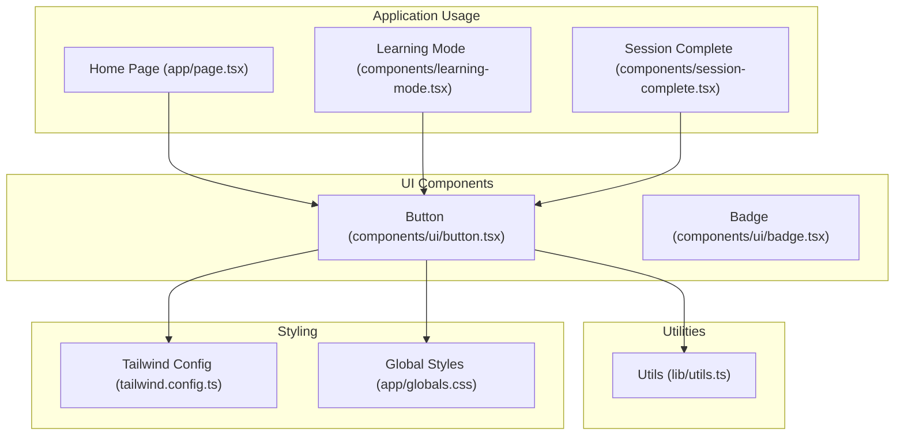
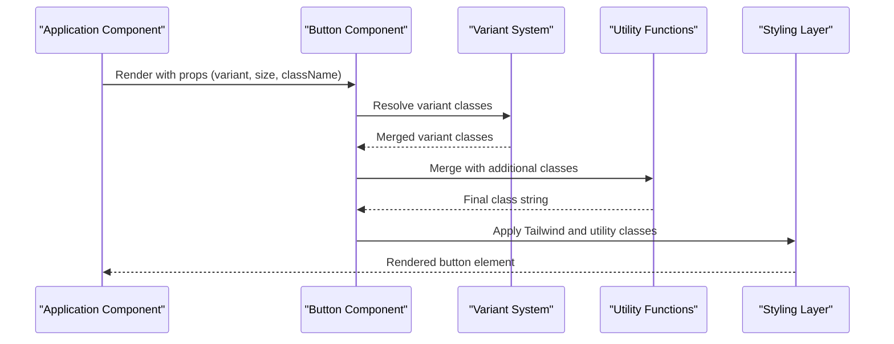
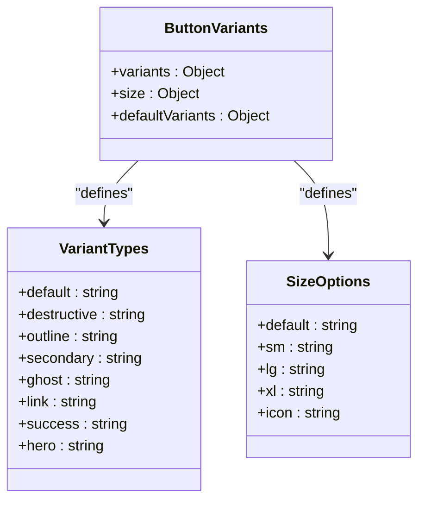
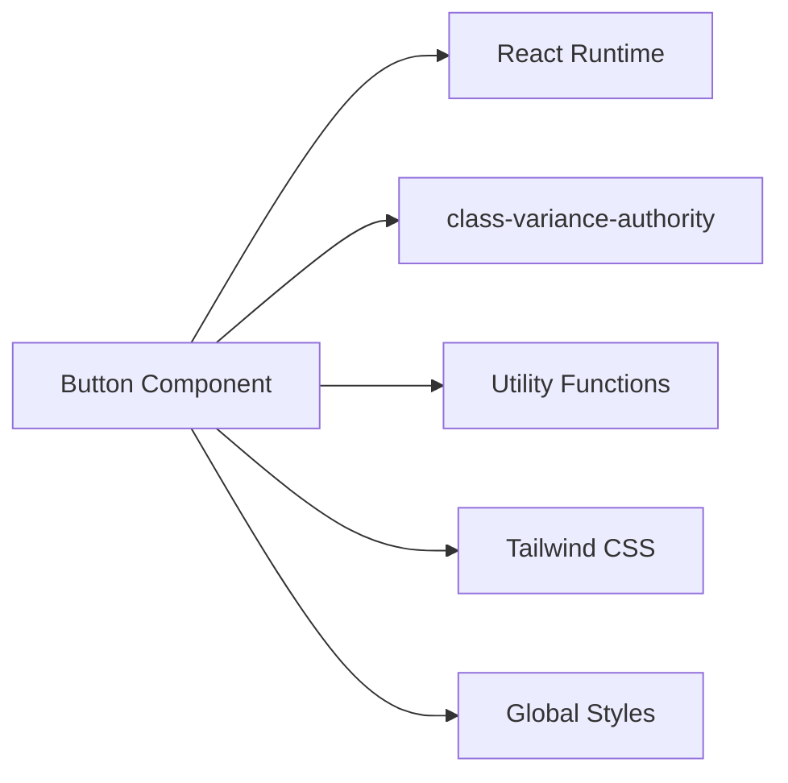
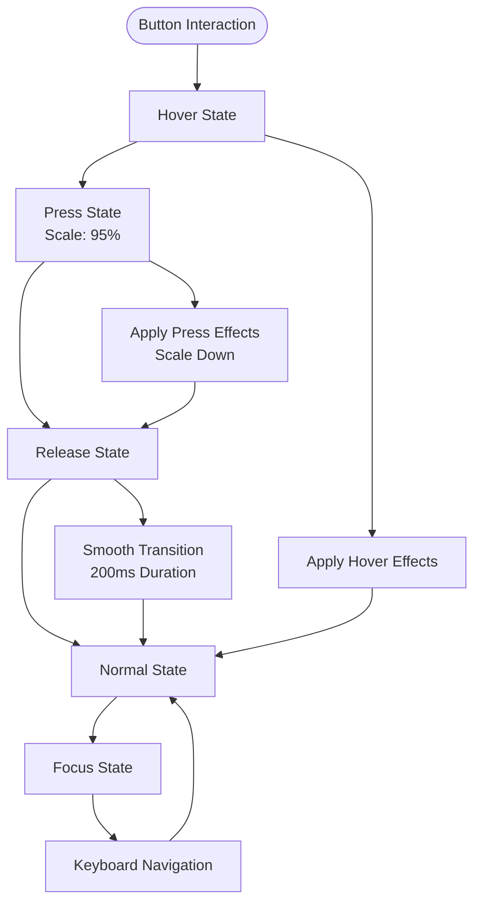

# Interactive Buttons

<cite>
**Referenced Files in This Document**
- [button.tsx](file://components/ui/button.tsx)
- [utils.ts](file://lib/utils.ts)
- [tailwind.config.ts](file://tailwind.config.ts)
- [globals.css](file://app/globals.css)
- [page.tsx](file://app/page.tsx)
- [learning-mode.tsx](file://components/learning-mode.tsx)
- [session-complete.tsx](file://components/session-complete.tsx)
</cite>

## Update Summary
**Changes Made**
- Enhanced active state feedback with improved press-down animation
- Added responsive touch target sizing for better mobile interaction
- Updated size variants with minimum height and width constraints
- Improved mobile accessibility with tap highlight and safe area utilities

## Table of Contents
1. [Introduction](#introduction)
2. [Project Structure](#project-structure)
3. [Core Components](#core-components)
4. [Architecture Overview](#architecture-overview)
5. [Detailed Component Analysis](#detailed-component-analysis)
6. [Dependency Analysis](#dependency-analysis)
7. [Performance Considerations](#performance-considerations)
8. [Accessibility and Keyboard Navigation](#accessibility-and-keyboard-navigation)
9. [Responsive Behavior](#responsive-behavior)
10. [Practical Examples and Usage Patterns](#practical-examples-and-usage-patterns)
11. [Troubleshooting Guide](#troubleshooting-guide)
12. [Conclusion](#conclusion)

## Introduction
This document provides comprehensive documentation for the Button component system used throughout the application. It covers all variant types, size options, styling classes, the variant system powered by class-variance-authority, the forwardRef pattern implementation, prop interfaces, and practical examples for different button states, hover effects, animations, and gradient backgrounds. The component now features enhanced active state feedback and responsive touch target sizing for improved mobile interaction experience. Accessibility considerations, keyboard navigation, and responsive behavior across different screen sizes are also addressed.

## Project Structure
The Button component is implemented as a reusable UI primitive located in the components/ui directory. It integrates with Tailwind CSS for styling, class-variance-authority for variant composition, and a shared utility function for merging class names. The component now includes enhanced mobile interaction features and improved tactile feedback.

**Diagram sources**
- [button.tsx](file://components/ui/button.tsx#L1-L54)
- [utils.ts](file://lib/utils.ts#L1-L7)
- [tailwind.config.ts](file://tailwind.config.ts#L1-L121)
- [globals.css](file://app/globals.css#L1-L183)
- [page.tsx](file://app/page.tsx#L250-L327)
- [learning-mode.tsx](file://components/learning-mode.tsx#L350-L376)
- [session-complete.tsx](file://components/session-complete.tsx#L50-L73)

**Section sources**
- [button.tsx](file://components/ui/button.tsx#L1-L54)
- [utils.ts](file://lib/utils.ts#L1-L7)
- [tailwind.config.ts](file://tailwind.config.ts#L1-L121)
- [globals.css](file://app/globals.css#L1-L183)

## Core Components
The Button component is built using React.forwardRef and class-variance-authority to provide a flexible, composable variant system. It accepts standard button attributes plus variant and size props, and merges them with utility classes. The component now features enhanced active state feedback and responsive touch target sizing for better mobile interaction.

Key characteristics:
- Uses forwardRef for DOM access and accessibility
- Implements class-variance-authority for variant composition
- Supports multiple variants and sizes with Tailwind CSS classes
- Integrates with global CSS utilities for gradients and animations
- **Enhanced**: Improved active state feedback with press-down animation
- **Enhanced**: Responsive touch target sizing for mobile devices

**Section sources**
- [button.tsx](file://components/ui/button.tsx#L34-L53)

## Architecture Overview
The Button component follows a layered architecture:
- Variant definition layer: class-variance-authority configuration
- Composition layer: cn utility for class merging
- Presentation layer: Tailwind CSS classes and global utilities
- Application layer: component usage across pages and dialogs

**Diagram sources**
- [button.tsx](file://components/ui/button.tsx#L40-L50)
- [utils.ts](file://lib/utils.ts#L4-L6)
- [tailwind.config.ts](file://tailwind.config.ts#L20-L96)
- [globals.css](file://app/globals.css#L84-L103)

## Detailed Component Analysis

### Variant System Implementation
The Button component uses class-variance-authority to define a comprehensive variant system with eight distinct variants and five size options.

#### Variant Types
- **Default**: Primary brand styling with elevation and hover lift effect
- **Destructive**: Error/cancel styling with hover state
- **Outline**: Border-based styling with background and hover effects
- **Secondary**: Alternative primary styling with reduced opacity hover
- **Ghost**: Minimal styling with hover effects
- **Link**: Text-only styling with underline enhancement
- **Success**: Positive action styling with elevation and hover glow
- **Hero**: Premium gradient styling with advanced animations and shadow effects

#### Size Options
- **Default**: Standard sizing (height 10, medium padding, minimum 40px touch target)
- **Small**: Compact sizing for dense layouts (minimum 36px touch target)
- **Large**: Expanded sizing for prominent actions (minimum 48px touch target)
- **Extra Large**: Extra-large sizing for hero buttons (minimum 56px touch target)
- **Icon**: Square icon-only sizing with equal height and width (40px × 40px minimum)

**Updated** Enhanced with responsive touch target sizing ensuring minimum 36px × 36px touch targets for mobile devices across all variants.

**Diagram sources**
- [button.tsx](file://components/ui/button.tsx#L5-L32)

**Section sources**
- [button.tsx](file://components/ui/button.tsx#L5-L32)

### Enhanced Active State Feedback
The Button component now features improved active state feedback through enhanced press-down animation:

- **Active State**: `active:scale-95` provides subtle press-down effect when button is pressed
- **Duration**: 200ms transition timing for smooth, responsive feedback
- **Consistency**: Applied uniformly across all variants for predictable user experience
- **Hardware Acceleration**: Optimized animations for smooth performance on mobile devices

**Updated** Enhanced active state feedback provides better tactile response for improved user interaction.

**Section sources**
- [button.tsx](file://components/ui/button.tsx#L6)

### ForwardRef Pattern Implementation
The Button component implements React.forwardRef to pass refs to the underlying button element, enabling:
- DOM access for focus management
- Accessibility compliance with aria attributes
- Integration with external libraries requiring refs

The component signature combines standard button attributes with variant props and an optional asChild flag for composition patterns.

**Section sources**
- [button.tsx](file://components/ui/button.tsx#L34-L53)

### Prop Interfaces and Type Safety
The ButtonProps interface extends React.ButtonHTMLAttributes with VariantProps from class-variance-authority, providing:
- Full button attribute compatibility
- Type-safe variant selection
- Size option typing
- Optional composition support via asChild

**Section sources**
- [button.tsx](file://components/ui/button.tsx#L34-L38)

### Styling Classes and Global Utilities
The Button component leverages a combination of Tailwind CSS utilities and global CSS classes:

#### Base Classes
- Flexbox alignment and centering
- Rounded corners with consistent radius
- Typography sizing and weight
- Focus-visible ring for accessibility
- Disabled state handling
- Transition effects for smooth interactions
- **Enhanced**: Active state scaling for press feedback

#### Variant-Specific Classes
Each variant defines its own color scheme, hover states, and special effects:
- Elevation and shadow transitions
- Gradient backgrounds for premium variants
- Underline effects for link variant
- Hover animations and transforms

#### Global Utility Classes
The application defines custom utility classes for:
- Gradient backgrounds (gradient-primary, gradient-hero)
- Advanced shadows (shadow-glow)
- Animation utilities (pulse-glow, float)
- **Enhanced**: Mobile-specific utilities (tap-highlight-transparent, safe-area insets)

**Section sources**
- [button.tsx](file://components/ui/button.tsx#L6-L17)
- [globals.css](file://app/globals.css#L84-L103)

## Dependency Analysis
The Button component has minimal but essential dependencies that enable its functionality:

**Diagram sources**
- [button.tsx](file://components/ui/button.tsx#L1-L3)
- [utils.ts](file://lib/utils.ts#L1-L2)
- [tailwind.config.ts](file://tailwind.config.ts#L1-L3)

**Section sources**
- [button.tsx](file://components/ui/button.tsx#L1-L3)
- [utils.ts](file://lib/utils.ts#L1-L2)

## Performance Considerations
The Button component is optimized for performance through several mechanisms:

- **Minimal re-renders**: Uses forwardRef to avoid unnecessary wrapper components
- **Efficient class merging**: Utility function optimizes class concatenation
- **CSS transitions**: Hardware-accelerated animations for smooth interactions
- **Lazy evaluation**: Variant classes computed only when props change
- **Optimized active states**: Efficient transform scaling for press feedback
- **Responsive sizing**: CSS min-height and min-width prevent layout thrashing

Best practices for optimal performance:
- Prefer variant props over inline styles
- Use className sparingly to avoid excessive class merging
- Leverage CSS transitions instead of JavaScript animations
- Consider memoization for frequently rendered buttons
- **Enhanced**: Utilize hardware-accelerated transforms for smooth animations

## Accessibility and Keyboard Navigation
The Button component includes comprehensive accessibility features:

### Focus Management
- Focus-visible rings for keyboard navigation
- Proper focus order in tab sequences
- Clear visual indicators for focused state

### Screen Reader Support
- Semantic button semantics
- Proper labeling for interactive elements
- ARIA attributes when needed for enhanced contexts

### Keyboard Navigation
- Enter and Space key activation
- Tab navigation through interactive elements
- Escape key handling for modal contexts

### Color Contrast
- High contrast ratios for text and backgrounds
- Sufficient color differentiation across variants
- Dark mode accessibility compliance

### Mobile Accessibility
- **Enhanced**: Tap highlight color transparency for consistent appearance
- **Enhanced**: Safe area insets for devices with notches or home indicators
- **Enhanced**: Minimum touch targets for improved accessibility

**Section sources**
- [button.tsx](file://components/ui/button.tsx#L6)
- [globals.css](file://app/globals.css#L112-L130)

## Responsive Behavior
The Button component exhibits responsive behavior through:

### Mobile-First Design
- Flexible sizing that adapts to screen width
- Touch-friendly target sizes for mobile interaction
- Adaptive padding and spacing for different form factors
- **Enhanced**: Minimum 36px × 36px touch targets across all variants

### Breakpoint Integration
- Responsive variants for different screen sizes
- Adaptive typography scaling
- Flexible layout integration

### Cross-Device Compatibility
- Consistent interaction patterns across devices
- Platform-specific optimizations where beneficial
- Touch and pointer event handling
- **Enhanced**: Safe area support for modern mobile devices

### Touch Target Optimization
- **Enhanced**: Each size variant includes minimum height and width constraints
- **Enhanced**: Icon variant ensures square touch targets (40px × 40px)
- **Enhanced**: Consistent spacing around interactive elements

**Section sources**
- [button.tsx](file://components/ui/button.tsx#L19-L25)
- [page.tsx](file://app/page.tsx#L254-L257)
- [globals.css](file://app/globals.css#L117-L130)

## Practical Examples and Usage Patterns

### Basic Button States
The Button component demonstrates various interactive states through its variant system:

#### Hover Effects
- Smooth transitions with duration controls
- Transform effects for visual feedback
- Shadow enhancements for depth perception
- Color blending for subtle state changes

#### Animation Patterns
- Pulse animations for emphasis
- Float animations for attention
- Bounce effects for celebratory actions
- Slide transitions for modal interactions

#### Gradient Backgrounds
- Linear gradients for premium appearance
- Multi-color transitions for dynamic effects
- Text gradient effects for typography emphasis
- Animated gradient backgrounds

### Enhanced Active State Feedback
- **New**: Press-down animation with scale transformation
- **New**: Consistent feedback across all button variants
- **New**: Smooth 200ms transition timing
- **New**: Hardware-accelerated animations for performance

### Real-World Usage Examples
The application demonstrates Button usage across multiple contexts:

#### Dashboard Navigation
Buttons used for navigation between different views and modes, showcasing responsive behavior and adaptive sizing with enhanced touch targets.

#### Interactive Learning
Buttons integrated into the learning workflow, including:
- Next/previous navigation with hero variant
- Action confirmations with outline and success variants
- Session completion states with gradient backgrounds
- Progress tracking controls with proper touch targets

#### Modal Interactions
Buttons within dialogs and modals, demonstrating proper focus management and accessibility compliance with enhanced active feedback.

**Diagram sources**
- [button.tsx](file://components/ui/button.tsx#L6)
- [button.tsx](file://components/ui/button.tsx#L10-L17)
- [globals.css](file://app/globals.css#L105-L130)

**Section sources**
- [page.tsx](file://app/page.tsx#L254-L257)
- [learning-mode.tsx](file://components/learning-mode.tsx#L358-L362)
- [session-complete.tsx](file://components/session-complete.tsx#L59-L68)

## Troubleshooting Guide

### Common Issues and Solutions

#### Variant Not Applying
- Verify variant prop matches defined variants
- Check for conflicting className overrides
- Ensure Tailwind CSS is properly configured

#### Styling Conflicts
- Use className prop to override specific styles
- Check for specificity conflicts with global styles
- Verify CSS order in build process

#### Accessibility Issues
- Ensure proper focus management
- Verify color contrast ratios
- Test keyboard navigation thoroughly
- **Enhanced**: Check active state feedback on mobile devices

#### Performance Problems
- Minimize excessive re-renders
- Use memoization for complex button states
- Optimize animation performance
- **Enhanced**: Monitor active state animation performance on low-end devices

#### Mobile Interaction Issues
- **New**: Verify minimum touch target sizes are respected
- **New**: Test active state feedback across different devices
- **New**: Ensure tap highlight color consistency

### Debugging Tips
- Inspect computed classes in browser dev tools
- Verify variant resolution with console logging
- Test responsive behavior across different viewport sizes
- Validate accessibility compliance with automated tools
- **Enhanced**: Test active state feedback on actual mobile devices
- **Enhanced**: Verify touch target sizing with device emulation tools

**Section sources**
- [button.tsx](file://components/ui/button.tsx#L40-L50)
- [utils.ts](file://lib/utils.ts#L4-L6)

## Conclusion
The Button component system provides a robust, accessible, and performant foundation for interactive elements throughout the application. Its variant-driven architecture, combined with modern React patterns and comprehensive styling utilities, enables consistent user experiences across different contexts and devices. The recent enhancements to active state feedback and responsive touch target sizing significantly improve the mobile interaction experience while maintaining accessibility standards.

The implementation demonstrates best practices in component design, accessibility, and performance optimization while maintaining flexibility for future enhancements. Through careful attention to responsive behavior, accessibility standards, and performance considerations, the Button component serves as a reliable building block for creating engaging and user-friendly interfaces.

The enhanced active state feedback provides better tactile response for improved user satisfaction, while the responsive touch target sizing ensures accessibility compliance across all device types. These improvements demonstrate the system's commitment to user-centered design and inclusive accessibility practices.