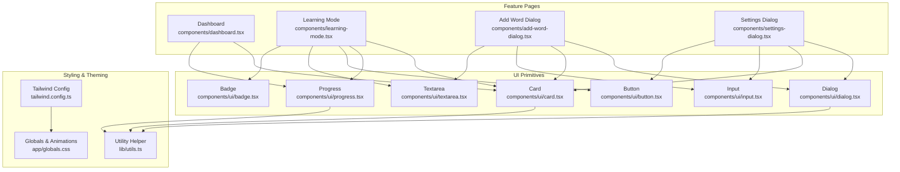
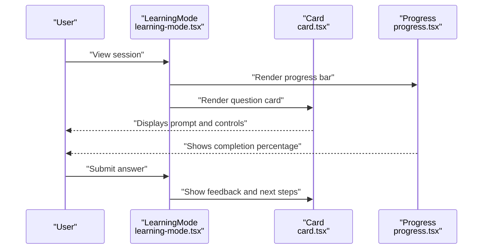
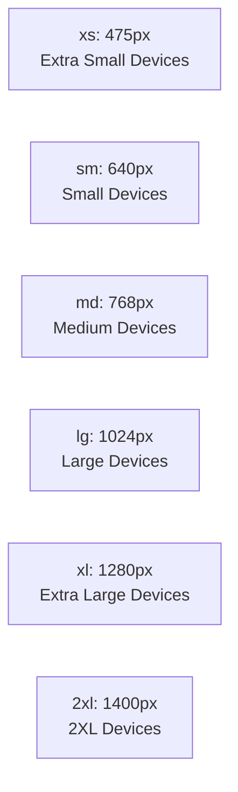
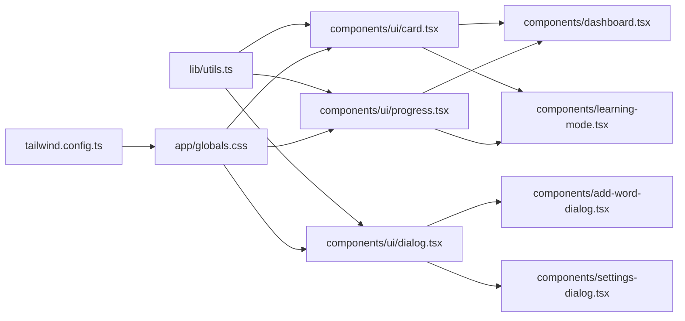

# Layout Components

<cite>
**Referenced Files in This Document**
- [card.tsx](file://components/ui/card.tsx)
- [dialog.tsx](file://components/ui/dialog.tsx)
- [progress.tsx](file://components/ui/progress.tsx)
- [dashboard.tsx](file://components/dashboard.tsx)
- [learning-mode.tsx](file://components/learning-mode.tsx)
- [add-word-dialog.tsx](file://components/add-word-dialog.tsx)
- [settings-dialog.tsx](file://components/settings-dialog.tsx)
- [globals.css](file://app/globals.css)
- [tailwind.config.ts](file://tailwind.config.ts)
- [types.ts](file://lib/types.ts)
- [button.tsx](file://components/ui/button.tsx)
- [input.tsx](file://components/ui/input.tsx)
- [textarea.tsx](file://components/ui/textarea.tsx)
- [badge.tsx](file://components/ui/badge.tsx)
- [utils.ts](file://lib/utils.ts)
</cite>

## Update Summary
**Changes Made**
- Added documentation for new mobile-specific utility classes and responsive design patterns
- Updated responsive layout section to include safe area insets and scrollbar control
- Enhanced mobile optimization guidance with tap highlight management
- Updated component usage examples to demonstrate mobile-first design patterns

## Table of Contents
1. [Introduction](#introduction)
2. [Project Structure](#project-structure)
3. [Core Components](#core-components)
4. [Architecture Overview](#architecture-overview)
5. [Detailed Component Analysis](#detailed-component-analysis)
6. [Mobile-First Responsive Design](#mobile-first-responsive-design)
7. [Dependency Analysis](#dependency-analysis)
8. [Performance Considerations](#performance-considerations)
9. [Troubleshooting Guide](#troubleshooting-guide)
10. [Conclusion](#conclusion)
11. [Appendices](#appendices)

## Introduction
This document focuses on VocabMaster's layout and container components: Card, Dialog, and Progress. It explains their structure, styling patterns, composition capabilities, and how they integrate into learning workflows. You will learn how the Card component organizes vocabulary information, how the Dialog component manages modal overlays and user interactions, and how the Progress component animates and communicates completion states. Examples of nesting, responsive layouts, and integration with learning sessions are included to guide practical usage.

**Updated** Enhanced with comprehensive mobile-first responsive design patterns including safe area insets, scrollbar control, and tap highlight management for improved mobile layout consistency.

## Project Structure
VocabMaster organizes UI primitives under components/ui and composes them into feature-specific pages and dialogs. The layout system leverages Tailwind CSS with custom design tokens and animations for consistent visuals and smooth interactions across all device sizes.



**Diagram sources**
- [card.tsx](file://components/ui/card.tsx#L1-L79)
- [dialog.tsx](file://components/ui/dialog.tsx#L1-L94)
- [progress.tsx](file://components/ui/progress.tsx#L1-L41)
- [dashboard.tsx](file://components/dashboard.tsx#L1-L154)
- [learning-mode.tsx](file://components/learning-mode.tsx#L1-L370)
- [add-word-dialog.tsx](file://components/add-word-dialog.tsx#L1-L297)
- [settings-dialog.tsx](file://components/settings-dialog.tsx#L1-L249)
- [tailwind.config.ts](file://tailwind.config.ts#L1-L121)
- [globals.css](file://app/globals.css#L1-L183)
- [utils.ts](file://lib/utils.ts#L1-L7)

**Section sources**
- [card.tsx](file://components/ui/card.tsx#L1-L79)
- [dialog.tsx](file://components/ui/dialog.tsx#L1-L94)
- [progress.tsx](file://components/ui/progress.tsx#L1-L41)
- [dashboard.tsx](file://components/dashboard.tsx#L1-L154)
- [learning-mode.tsx](file://components/learning-mode.tsx#L1-L370)
- [add-word-dialog.tsx](file://components/add-word-dialog.tsx#L1-L297)
- [settings-dialog.tsx](file://components/settings-dialog.tsx#L1-L249)
- [tailwind.config.ts](file://tailwind.config.ts#L1-L121)
- [globals.css](file://app/globals.css#L1-L183)
- [utils.ts](file://lib/utils.ts#L1-L7)

## Core Components
This section documents the three core layout components and their roles in VocabMaster.

- Card
  - Purpose: Encapsulate content blocks with consistent spacing, typography, and shadows. Used extensively for statistics, learning cards, and dialog content.
  - Composition: Includes Card, CardHeader, CardTitle, CardDescription, CardContent, and CardFooter.
  - Styling: Uses design tokens for background, foreground, borders, and shadows; hover effects and transitions enhance interactivity.

- Dialog
  - Purpose: Render modal overlays with backdrop and animated content area. Manages open/close state and optional close button.
  - Behavior: Fixed-position overlay with click-to-dismiss; content constrained to a centered panel with max-width.

- Progress
  - Purpose: Visualize completion or mastery percentages with smooth transitions and gradient styling.
  - State handling: Computes percentage from value and max, clamps to 0–100, and applies aria attributes for accessibility.

**Section sources**
- [card.tsx](file://components/ui/card.tsx#L1-L79)
- [dialog.tsx](file://components/ui/dialog.tsx#L1-L94)
- [progress.tsx](file://components/ui/progress.tsx#L1-L41)

## Architecture Overview
The layout components are composed across feature pages and dialogs to deliver a cohesive learning experience. The Dashboard displays vocabulary statistics and streaks using Cards and Progress. Learning Mode embeds a Question Card with dynamic feedback and integrates Progress to reflect session completion. Dialogs wrap forms and settings panels, ensuring consistent modal behavior.



**Diagram sources**
- [learning-mode.tsx](file://components/learning-mode.tsx#L1-L370)
- [card.tsx](file://components/ui/card.tsx#L1-L79)
- [progress.tsx](file://components/ui/progress.tsx#L1-L41)

## Detailed Component Analysis

### Card Component
- Structure and composition
  - Container with rounded corners, border, and shadow tokens.
  - Semantic subcomponents for headers, titles, descriptions, content areas, and footers.
  - Consistent padding and spacing for readable content hierarchy.

- Styling patterns
  - Uses design tokens for background and foreground colors.
  - Hover and transition effects improve interactivity.
  - Typography utilities for title sizing and muted descriptions.

- Practical usage
  - Dashboard grids use Card for stat tiles and progress summaries.
  - Learning Mode wraps questions and feedback in a visually distinct Card.
  - Dialogs often nest Card to organize form sections.

- Accessibility and responsiveness
  - Responsive grid layouts adapt column counts across breakpoints.
  - Proper semantic headings and contrast ensure readability.

**Section sources**
- [card.tsx](file://components/ui/card.tsx#L1-L79)
- [dashboard.tsx](file://components/dashboard.tsx#L53-L151)
- [learning-mode.tsx](file://components/learning-mode.tsx#L190-L366)

### Dialog Component
- Modal behavior and overlay management
  - Controlled by open/onOpenChange props; renders overlay and animated content area.
  - Overlay click triggers close; optional close button inside content.
  - Fixed positioning ensures content remains centered regardless of scroll.

- Composition capabilities
  - DialogContent supports custom className and ref forwarding.
  - DialogHeader, DialogTitle, and DialogDescription provide structured headers.

- Practical usage
  - Add Word Dialog wraps a multi-step form with AI suggestions and validation.
  - Settings Dialog manages AI configuration with live testing and status badges.

- Accessibility and UX
  - Focus management and keyboard-friendly close affordances.
  - Scrollable content area for long forms; max-height constraints maintain usability.

**Section sources**
- [dialog.tsx](file://components/ui/dialog.tsx#L1-L94)
- [add-word-dialog.tsx](file://components/add-word-dialog.tsx#L132-L294)
- [settings-dialog.tsx](file://components/settings-dialog.tsx#L69-L246)

### Progress Component
- Animation and state handling
  - Calculates percentage from value/max and clamps to valid range.
  - Smooth width transition with easing; gradient indicator styling.
  - ARIA attributes expose progress state to assistive technologies.

- Styling and customization
  - Secondary background for track; customizable indicator class.
  - Responsive sizing via height utilities.

- Practical usage
  - Dashboard shows overall mastery and streak progress.
  - Learning Mode reflects session completion percentage.

**Section sources**
- [progress.tsx](file://components/ui/progress.tsx#L1-L41)
- [dashboard.tsx](file://components/dashboard.tsx#L95-L136)
- [learning-mode.tsx](file://components/learning-mode.tsx#L181-L188)

### Component Nesting Examples
- Dashboard nesting
  - Grid of Cards containing stat icons and values.
  - Progress bars embedded within CardContent for mastery and streak metrics.

- Learning Mode nesting
  - Outer Card wraps the entire question interface.
  - Inner sections (prompt, grammar hints, answer input, feedback) organized with CardContent.

- Dialog nesting
  - DialogContent wraps form sections with DialogHeader and descriptive text.
  - Inputs, buttons, and badges nested inside for coherent UX.

**Section sources**
- [dashboard.tsx](file://components/dashboard.tsx#L56-L150)
- [learning-mode.tsx](file://components/learning-mode.tsx#L190-L366)
- [add-word-dialog.tsx](file://components/add-word-dialog.tsx#L133-L293)
- [settings-dialog.tsx](file://components/settings-dialog.tsx#L69-L246)

### Responsive Layouts
- Grid systems
  - Dashboard uses responsive grid classes to adjust stat tile layout across screen sizes.
  - Two-column layout for progress sections adapts to medium and larger screens.

- Content constraints
  - Max-width and padding utilities keep content readable on small screens.
  - Animated entrance effects staggered per item to improve perceived performance.

**Section sources**
- [dashboard.tsx](file://components/dashboard.tsx#L56-L76)
- [dashboard.tsx](file://components/dashboard.tsx#L79-L150)
- [globals.css](file://app/globals.css#L115-L156)

### Integration with Learning Workflows
- Vocabulary display and feedback
  - Cards present word metadata and contextual information.
  - Progress tracks session completion and cumulative mastery.

- Modal-driven actions
  - Dialogs enable adding words and configuring AI without leaving context.
  - Settings dialog validates configuration and surfaces connection status.

- State synchronization
  - Pending updates are batch-applied when advancing through words.
  - Completion callbacks propagate results to higher-level orchestration.

**Section sources**
- [learning-mode.tsx](file://components/learning-mode.tsx#L76-L156)
- [add-word-dialog.tsx](file://components/add-word-dialog.tsx#L96-L104)
- [settings-dialog.tsx](file://components/settings-dialog.tsx#L33-L51)
- [types.ts](file://lib/types.ts#L1-L105)

## Mobile-First Responsive Design

**Updated** VocabMaster now implements comprehensive mobile-first design patterns to ensure optimal user experience across all device sizes and orientations.

### Mobile-Specific Utility Classes

The application includes specialized utility classes designed specifically for mobile devices:

#### Scrollbar Control
- **`.scrollbar-hide`**: Completely removes scrollbars on mobile devices for cleaner interface
- Implementation: Uses `-ms-overflow-style: none` and `scrollbar-width: none` with WebKit-specific overrides
- Usage: Applied to horizontally scrolling navigation menus and content areas

#### Tap Highlight Management
- **`.tap-highlight-transparent`**: Eliminates iOS tap highlight effects for better visual consistency
- Implementation: Sets `-webkit-tap-highlight-color: transparent` for touch targets
- Usage: Applied to interactive elements like buttons and navigation items

#### Safe Area Insets
- **`.safe-top`**, **`.safe-bottom`**, **`.safe-left`**, **`.safe-right`**: Handles device-specific safe areas for modern phones
- Implementation: Uses `env(safe-area-inset-*)` CSS environment variables
- Usage: Ensures content doesn't overlap with notches, home indicators, or gesture areas

### Responsive Breakpoints and Patterns

The Tailwind configuration extends beyond standard breakpoints with an `xs` breakpoint at 475px for extra-small screens:



### Mobile Layout Optimization Examples

#### Horizontal Navigation Scrolling
The navigation component demonstrates mobile-first scrolling patterns:

```html
<div className="flex gap-0.5 sm:gap-1 overflow-x-auto scrollbar-hide">
  <!-- Navigation items -->
</div>
```

#### Touch-Friendly Interactive Elements
Buttons and interactive components use tap highlight management for consistent visual feedback across devices.

#### Safe Area Compliance
Components utilize safe area utilities to ensure proper spacing on devices with notches or gesture areas.

**Section sources**
- [globals.css](file://app/globals.css#L104-L130)
- [tailwind.config.ts](file://tailwind.config.ts#L26-L28)
- [page.tsx](file://app/page.tsx#L204-L204)

## Dependency Analysis
The layout components depend on shared utilities and styling infrastructure. They are consumed by feature pages and dialogs, forming a cohesive UI layer.



**Diagram sources**
- [utils.ts](file://lib/utils.ts#L1-L7)
- [card.tsx](file://components/ui/card.tsx#L1-L79)
- [dialog.tsx](file://components/ui/dialog.tsx#L1-L94)
- [progress.tsx](file://components/ui/progress.tsx#L1-L41)
- [tailwind.config.ts](file://tailwind.config.ts#L1-L121)
- [globals.css](file://app/globals.css#L1-L183)
- [dashboard.tsx](file://components/dashboard.tsx#L1-L154)
- [learning-mode.tsx](file://components/learning-mode.tsx#L1-L370)
- [add-word-dialog.tsx](file://components/add-word-dialog.tsx#L1-L297)
- [settings-dialog.tsx](file://components/settings-dialog.tsx#L1-L249)

**Section sources**
- [utils.ts](file://lib/utils.ts#L1-L7)
- [card.tsx](file://components/ui/card.tsx#L1-L79)
- [dialog.tsx](file://components/ui/dialog.tsx#L1-L94)
- [progress.tsx](file://components/ui/progress.tsx#L1-L41)
- [tailwind.config.ts](file://tailwind.config.ts#L1-L121)
- [globals.css](file://app/globals.css#L1-L183)
- [dashboard.tsx](file://components/dashboard.tsx#L1-L154)
- [learning-mode.tsx](file://components/learning-mode.tsx#L1-L370)
- [add-word-dialog.tsx](file://components/add-word-dialog.tsx#L1-L297)
- [settings-dialog.tsx](file://components/settings-dialog.tsx#L1-L249)

## Performance Considerations
- Minimize re-renders by passing stable references to components and avoiding unnecessary prop churn.
- Prefer CSS transitions over JavaScript animations for smoother UI updates.
- Use lazy initialization for heavy computations (e.g., debounced lookups) to reduce jank during user input.
- Keep dialog content scrollable and constrained to avoid layout thrashing on mobile devices.
- **Updated** Leverage mobile-specific utilities like `scrollbar-hide` to prevent unnecessary scrollbars on mobile devices, reducing layout calculations.

## Troubleshooting Guide
- Dialog not closing
  - Ensure onOpenChange is wired correctly and overlay click invokes the change handler.
  - Verify that the Dialog is rendered only when open is true.

- Progress bar not updating
  - Confirm value and max props are numeric and within expected ranges.
  - Check that percentage calculation does not exceed bounds.

- Card layout issues
  - Validate responsive grid classes and ensure parent containers provide adequate width.
  - Confirm proper padding and spacing utilities are applied consistently.

- **Updated** Mobile layout issues
  - Verify safe area utilities are applied to content that needs to respect device insets.
  - Ensure scrollbar-hide utility is used appropriately to prevent unwanted scrollbars on mobile.
  - Check tap highlight transparency for consistent visual feedback across devices.

**Section sources**
- [dialog.tsx](file://components/ui/dialog.tsx#L13-L27)
- [progress.tsx](file://components/ui/progress.tsx#L10-L12)
- [card.tsx](file://components/ui/card.tsx#L19-L76)
- [globals.css](file://app/globals.css#L104-L130)

## Conclusion
VocabMaster's layout components—Card, Dialog, and Progress—are foundational building blocks that enable a consistent, accessible, and responsive learning interface. Their modular design allows flexible composition across dashboards, learning sessions, and modal workflows. By leveraging shared styling tokens, animations, and utility helpers, the UI remains cohesive and performant while supporting complex interactions such as spaced repetition and AI-powered features.

**Updated** The implementation of mobile-first responsive design patterns, including safe area insets, scrollbar control, and tap highlight management, ensures optimal user experience across all device types and orientations. These enhancements demonstrate VocabMaster's commitment to delivering a polished, professional learning application that works seamlessly on mobile devices while maintaining desktop functionality.

## Appendices
- Design tokens and animations are defined in Tailwind and global styles, enabling consistent gradients, shadows, and motion effects.
- Utility functions consolidate class merging and provide a single source of truth for component styling.
- **Updated** Mobile-specific utility classes provide comprehensive support for modern mobile devices with various screen configurations and interaction patterns.

**Section sources**
- [tailwind.config.ts](file://tailwind.config.ts#L20-L96)
- [globals.css](file://app/globals.css#L28-L183)
- [utils.ts](file://lib/utils.ts#L4-L6)