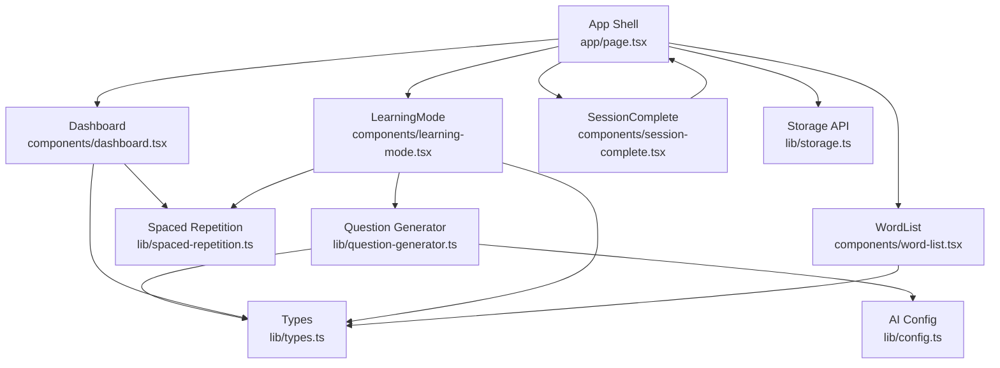
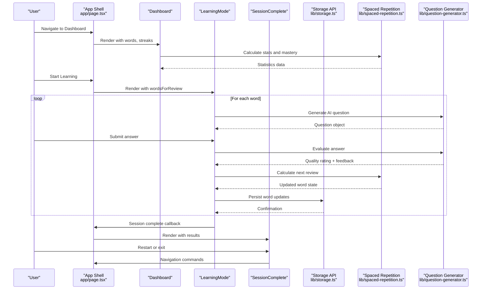
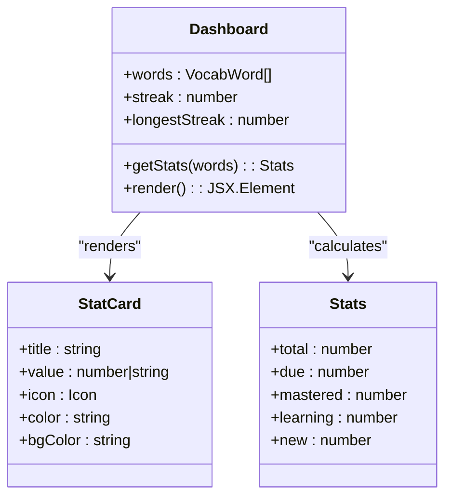
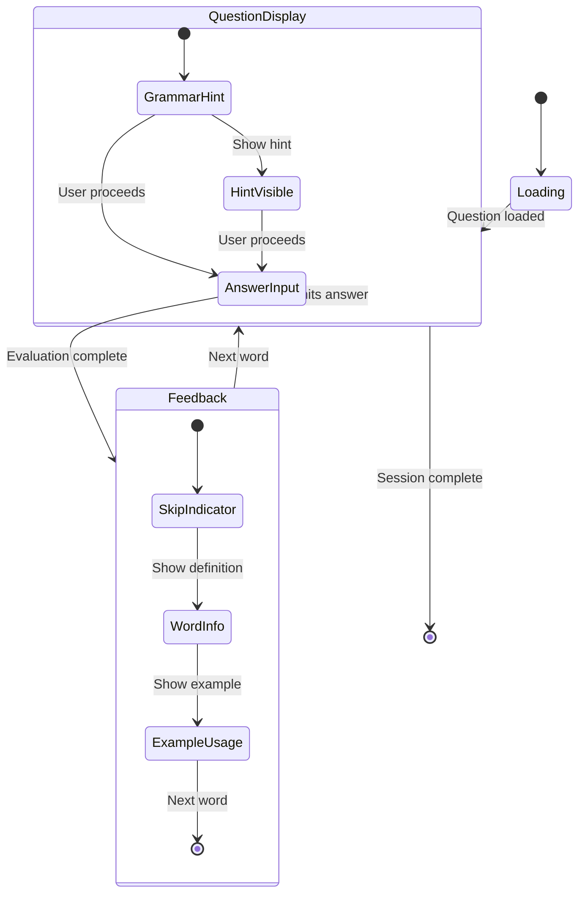
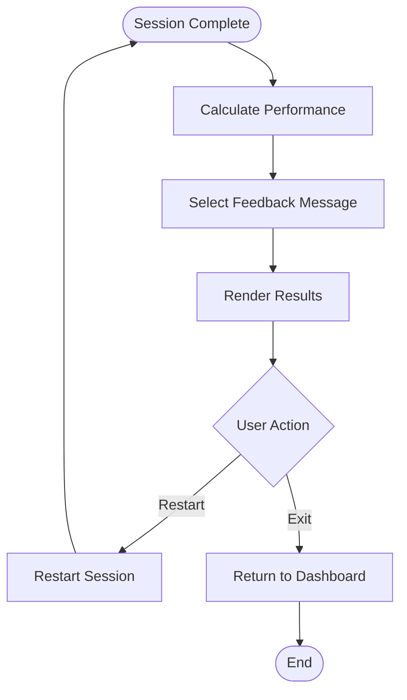
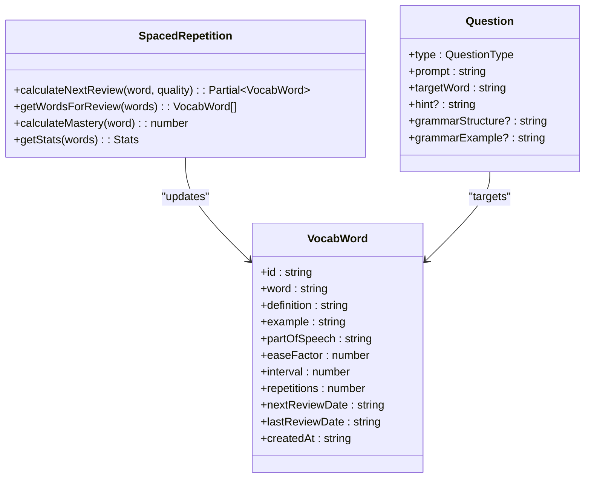
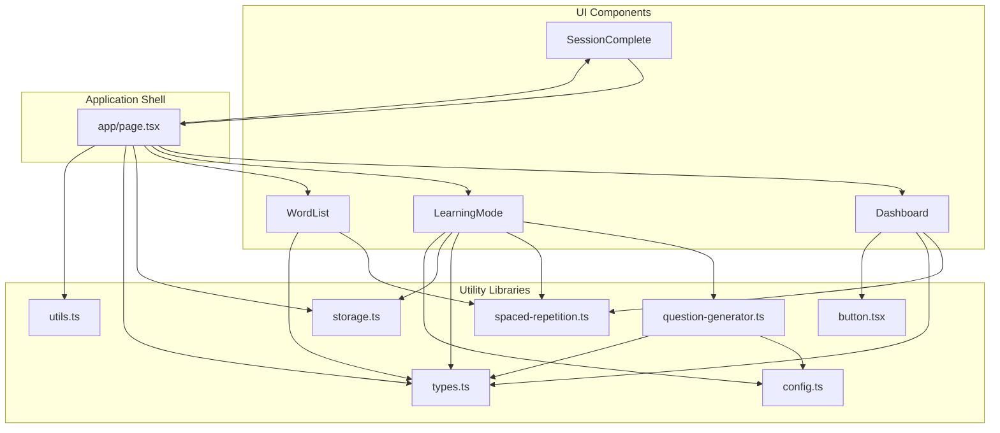

# Learning Interface Components

<cite>
**Referenced Files in This Document**
- [app/page.tsx](file://app/page.tsx)
- [components/dashboard.tsx](file://components/dashboard.tsx)
- [components/learning-mode.tsx](file://components/learning-mode.tsx)
- [components/session-complete.tsx](file://components/session-complete.tsx)
- [components/word-list.tsx](file://components/word-list.tsx)
- [lib/spaced-repetition.ts](file://lib/spaced-repetition.ts)
- [lib/question-generator.ts](file://lib/question-generator.ts)
- [lib/types.ts](file://lib/types.ts)
- [lib/storage.ts](file://lib/storage.ts)
- [lib/config.ts](file://lib/config.ts)
- [lib/utils.ts](file://lib/utils.ts)
- [components/ui/button.tsx](file://components/ui/button.tsx)
- [app/globals.css](file://app/globals.css)
- [tailwind.config.ts](file://tailwind.config.ts)
</cite>

## Update Summary
**Changes Made**
- Enhanced mobile responsiveness documentation with new CSS utilities and responsive breakpoints
- Updated responsive design considerations for mobile learning scenarios
- Added documentation for new mobile-specific utility classes and safe area handling
- Expanded touch interaction improvements across learning interface components

## Table of Contents
1. [Introduction](#introduction)
2. [Project Structure](#project-structure)
3. [Core Components](#core-components)
4. [Architecture Overview](#architecture-overview)
5. [Detailed Component Analysis](#detailed-component-analysis)
6. [Enhanced Mobile Responsiveness](#enhanced-mobile-responsiveness)
7. [Dependency Analysis](#dependency-analysis)
8. [Performance Considerations](#performance-considerations)
9. [Troubleshooting Guide](#troubleshooting-guide)
10. [Conclusion](#conclusion)

## Introduction
This document provides comprehensive documentation for VocabMaster's learning interface components. It focuses on three primary learning interface components: Dashboard, LearningMode, and SessionComplete. The documentation covers analytics display and navigation patterns, interactive study interface and question handling, progress summary and feedback systems, state management, user interaction patterns, and integration with the spaced repetition system. It also includes examples of component composition, data flow between learning components, and responsive design considerations for mobile learning scenarios.

**Updated** Enhanced with comprehensive mobile responsiveness improvements including new CSS utilities, responsive breakpoints, and improved touch interactions across all learning interface components.

## Project Structure
The learning interface is organized around a central application shell that manages view transitions and state synchronization with the backend. The key learning components are:

- Dashboard: Analytics and overview display with enhanced mobile responsiveness
- LearningMode: Interactive study interface with improved touch interactions
- SessionComplete: Progress summary and feedback with mobile-optimized layouts
- Supporting utilities: Spaced repetition algorithms, question generation, storage, and configuration

**Diagram sources**
- [app/page.tsx](file://app/page.tsx#L29-L315)
- [components/dashboard.tsx](file://components/dashboard.tsx#L1-L154)
- [components/learning-mode.tsx](file://components/learning-mode.tsx#L1-L376)
- [components/session-complete.tsx](file://components/session-complete.tsx#L1-L73)
- [components/word-list.tsx](file://components/word-list.tsx#L1-L123)
- [lib/spaced-repetition.ts](file://lib/spaced-repetition.ts#L1-L123)
- [lib/question-generator.ts](file://lib/question-generator.ts#L1-L255)
- [lib/storage.ts](file://lib/storage.ts#L1-L138)
- [lib/config.ts](file://lib/config.ts#L1-L63)
- [lib/types.ts](file://lib/types.ts#L1-L105)

**Section sources**
- [app/page.tsx](file://app/page.tsx#L29-L315)

## Core Components
This section examines the three primary learning interface components and their roles in the learning workflow.

### Dashboard Component
The Dashboard component provides analytics and overview displays for vocabulary learning progress. It presents key metrics including total words, due words, mastered words, and learning streaks with enhanced mobile responsiveness.

Key features:
- Four metric cards displaying totals, due words, mastered words, and current streak with responsive grid adaptation
- Overall mastery percentage with breakdown by word categories using responsive typography
- Learning streak visualization with progress toward longest streak using mobile-optimized layouts
- Responsive grid layout adapting from 1 column on mobile to 4 columns on desktop
- Enhanced touch targets and spacing for mobile devices

Analytics calculations:
- Uses spaced repetition statistics to compute mastery percentages
- Calculates streak progression relative to longest streak
- Provides category breakdowns (mastered, learning, new)

**Section sources**
- [components/dashboard.tsx](file://components/dashboard.tsx#L1-L154)
- [lib/spaced-repetition.ts](file://lib/spaced-repetition.ts#L108-L122)

### LearningMode Component
The LearningMode component implements the interactive study interface where users engage with vocabulary words through AI-generated questions. It manages the complete learning session lifecycle with enhanced mobile touch interactions.

Core functionality:
- Session state management with progress tracking optimized for mobile devices
- AI-powered question generation and answer evaluation with responsive layouts
- Spaced repetition integration for scheduling next reviews with touch-friendly controls
- Comprehensive feedback system with quality ratings using mobile-optimized animations
- Skip functionality for known and unknown words with improved touch targets

Interactive elements:
- Question display with grammar structure guidance using responsive typography
- Answer input with hint system optimized for mobile touch interactions
- Real-time feedback with visual indicators using mobile-friendly animations
- Progress tracking throughout the session with responsive progress bars
- Skip buttons for known/unknown words with enhanced touch targets

**Section sources**
- [components/learning-mode.tsx](file://components/learning-mode.tsx#L1-L376)
- [lib/question-generator.ts](file://lib/question-generator.ts#L100-L171)
- [lib/spaced-repetition.ts](file://lib/spaced-repetition.ts#L9-L48)

### SessionComplete Component
The SessionComplete component provides a progress summary and feedback system after completing a learning session. It displays performance metrics and offers options to continue studying with mobile-optimized layouts.

Features:
- Performance-based feedback with emoji and star ratings using responsive star display
- Percentage score calculation and performance messaging optimized for mobile screens
- Restart and exit options for continued learning with touch-friendly button layouts
- Animated presentation with gradient styling using mobile-optimized animations
- Responsive card layouts that adapt to different screen sizes

**Section sources**
- [components/session-complete.tsx](file://components/session-complete.tsx#L1-L73)

## Architecture Overview
The learning interface follows a unidirectional data flow pattern with centralized state management in the app shell. Components communicate through props and callback handlers, while the spaced repetition system handles algorithmic logic independently.

**Diagram sources**
- [app/page.tsx](file://app/page.tsx#L93-L117)
- [components/learning-mode.tsx](file://components/learning-mode.tsx#L76-L156)
- [lib/question-generator.ts](file://lib/question-generator.ts#L174-L197)
- [lib/spaced-repetition.ts](file://lib/spaced-repetition.ts#L9-L48)
- [lib/storage.ts](file://lib/storage.ts#L41-L53)

## Detailed Component Analysis

### Dashboard Component Analysis
The Dashboard component serves as the primary analytics hub, presenting learning progress through multiple visual indicators and metrics with enhanced mobile responsiveness.

**Diagram sources**
- [components/dashboard.tsx](file://components/dashboard.tsx#L10-L51)
- [lib/spaced-repetition.ts](file://lib/spaced-repetition.ts#L108-L122)

Key analytics features:
- Metric cards with icons and color-coded indicators using responsive grid system
- Progress bars showing mastery distribution with mobile-optimized heights
- Streak visualization with comparative analysis using responsive typography
- Animation effects for enhanced user experience with mobile-friendly timing
- Responsive grid that adapts from 2 columns on small screens to 4 columns on larger screens

Responsive design considerations:
- Grid layout adapts from 1 column on mobile to 4 columns on desktop
- Progress bars scale appropriately across screen sizes with increased height on mobile
- Typography adjusts for readability on different devices with responsive font sizes
- Touch targets are appropriately sized for mobile interaction

**Section sources**
- [components/dashboard.tsx](file://components/dashboard.tsx#L16-L154)

### LearningMode Component Analysis
The LearningMode component implements a sophisticated interactive study interface with comprehensive state management and AI integration, featuring enhanced mobile touch interactions.

**Diagram sources**
- [components/learning-mode.tsx](file://components/learning-mode.tsx#L35-L156)

Interactive study workflow:
- Question generation with AI fallback support using responsive layouts
- Grammar structure guidance for context usage with mobile-optimized typography
- Hint system for difficult words with touch-friendly reveal mechanism
- Comprehensive feedback with quality ratings using responsive animations
- Skip functionality for known/unknown words with enhanced touch targets

State management patterns:
- Session snapshot to prevent mid-session changes
- Pending updates queue for efficient database operations
- Progress tracking with completion metrics using responsive progress indicators
- Real-time quality feedback integration with mobile-friendly animations

**Section sources**
- [components/learning-mode.tsx](file://components/learning-mode.tsx#L35-L376)
- [lib/question-generator.ts](file://lib/question-generator.ts#L100-L171)
- [lib/spaced-repetition.ts](file://lib/spaced-repetition.ts#L9-L48)

### SessionComplete Component Analysis
The SessionComplete component provides a celebratory conclusion to learning sessions with personalized feedback and performance metrics, optimized for mobile viewing.

**Diagram sources**
- [components/session-complete.tsx](file://components/session-complete.tsx#L15-L26)

Performance feedback system:
- Percentage-based scoring with emoji and star ratings using responsive star display
- Contextual messages based on performance thresholds with mobile-optimized layouts
- Visual star rating system with dynamic coloring using responsive sizing
- Clear action buttons for continuation or completion with enhanced touch targets
- Responsive card layout that adapts to different screen sizes

**Section sources**
- [components/session-complete.tsx](file://components/session-complete.tsx#L15-L73)

### Spaced Repetition Integration
The spaced repetition system integrates deeply with the learning interface through algorithmic scheduling and progress tracking.

**Diagram sources**
- [lib/spaced-repetition.ts](file://lib/spaced-repetition.ts#L1-L123)
- [lib/types.ts](file://lib/types.ts#L1-L40)

Algorithm implementation:
- SM-2 algorithm with ease factor adjustment
- Interval calculation based on repetition history
- Mastery calculation combining repetition, ease factor, and interval
- Due word filtering with priority sorting

**Section sources**
- [lib/spaced-repetition.ts](file://lib/spaced-repetition.ts#L9-L123)
- [lib/types.ts](file://lib/types.ts#L1-L40)

## Enhanced Mobile Responsiveness

### New CSS Utilities and Responsive Breakpoints
The learning interface has been enhanced with comprehensive mobile responsiveness through new CSS utilities and responsive breakpoints.

#### Mobile-Specific Utility Classes
The global CSS includes several new utility classes specifically designed for mobile optimization:

- **scrollbar-hide**: Removes scrollbars on mobile devices for cleaner interface
- **tap-highlight-transparent**: Eliminates tap highlight effects for better visual consistency
- **Safe area insets**: Handles device-specific safe areas for modern mobile devices with notch support

#### Enhanced Responsive Breakpoints
The Tailwind configuration now includes an additional breakpoint specifically for mobile optimization:

- **xs breakpoint (475px)**: New extra-small breakpoint for fine-tuning mobile layouts
- **Responsive grid systems**: All components now use responsive grid classes (sm:grid-cols-2, lg:grid-cols-4)
- **Flexible typography**: Font sizes automatically adjust based on screen size (text-sm to text-base)

#### Improved Touch Interactions
Components have been optimized for touch interactions:

- **Enhanced button sizing**: Buttons use min-h-[36px] and min-w-[36px] for optimal touch targets
- **Improved spacing**: Increased padding and margins for better touch accuracy
- **Touch-friendly animations**: Animations are optimized for mobile performance

### Mobile-First Design Improvements
All components now implement mobile-first design patterns:

#### Dashboard Responsiveness
- Grid layout adapts from 2 columns on small screens to 4 columns on larger screens
- Progress bars have increased height (h-2.5 to h-3) for better touch interaction
- Typography scales appropriately with responsive font sizes

#### LearningMode Mobile Optimization
- Input areas use min-h-[120px] for comfortable typing on mobile devices
- Button layouts use responsive flex properties for optimal touch targets
- Progress indicators use responsive heights (h-1.5 to h-2)

#### SessionComplete Mobile Adaptation
- Card layouts use responsive padding and spacing
- Star rating system adapts to different screen sizes
- Button layouts use responsive grid (grid-cols-2) for mobile devices

**Section sources**
- [app/globals.css](file://app/globals.css#L104-L130)
- [tailwind.config.ts](file://tailwind.config.ts#L26-L28)
- [components/ui/button.tsx](file://components/ui/button.tsx#L20-L25)

## Dependency Analysis
The learning interface components exhibit clear separation of concerns with well-defined dependencies and communication patterns.

**Diagram sources**
- [app/page.tsx](file://app/page.tsx#L1-L327)
- [components/dashboard.tsx](file://components/dashboard.tsx#L1-L154)
- [components/learning-mode.tsx](file://components/learning-mode.tsx#L1-L376)
- [components/session-complete.tsx](file://components/session-complete.tsx#L1-L73)
- [components/word-list.tsx](file://components/word-list.tsx#L1-L123)
- [lib/spaced-repetition.ts](file://lib/spaced-repetition.ts#L1-L123)
- [lib/question-generator.ts](file://lib/question-generator.ts#L1-L255)
- [lib/storage.ts](file://lib/storage.ts#L1-L138)
- [lib/config.ts](file://lib/config.ts#L1-L63)
- [lib/types.ts](file://lib/types.ts#L1-L105)
- [lib/utils.ts](file://lib/utils.ts#L1-L7)
- [components/ui/button.tsx](file://components/ui/button.tsx#L1-L54)

Key dependency patterns:
- UI components depend on utility libraries for business logic
- Application shell coordinates state and navigation
- Storage abstraction handles persistence operations
- Configuration management enables AI feature toggling
- Responsive utilities integrate seamlessly with Tailwind CSS

**Section sources**
- [app/page.tsx](file://app/page.tsx#L15-L327)
- [lib/storage.ts](file://lib/storage.ts#L77-L84)

## Performance Considerations
The learning interface incorporates several performance optimizations for smooth user experience across devices:

### State Management Optimizations
- Session snapshots prevent unnecessary re-renders during study sessions
- Pending updates queue reduces database write operations
- Efficient progress tracking minimizes computational overhead

### Network Performance
- Concurrent API requests for initial data loading
- Lazy loading of AI-generated content
- Graceful fallbacks when AI services are unavailable

### Mobile Responsiveness
- Adaptive grid layouts that scale across device sizes with optimized breakpoints
- Touch-friendly button sizing and spacing using min-h/min-w utilities
- Optimized animations for mobile devices with reduced complexity
- Responsive typography that adapts to screen size changes

### Memory Management
- Proper cleanup of event listeners and timers
- Efficient rendering of large word lists with responsive grid optimization
- Minimal DOM manipulation during interactions with mobile-optimized layouts

## Troubleshooting Guide
Common issues and solutions for the learning interface components:

### Dashboard Issues
- **Missing analytics data**: Verify that words are properly loaded from storage
- **Incorrect mastery percentages**: Check spaced repetition calculations and word states
- **Streak display problems**: Ensure proper date handling and timezone considerations
- **Grid layout issues**: Verify responsive grid classes are properly applied

### LearningMode Issues
- **Question generation failures**: Verify AI configuration and network connectivity
- **Answer evaluation problems**: Check quality rating logic and feedback generation
- **Session state inconsistencies**: Review pending updates queue and word snapshot management
- **Touch interaction problems**: Ensure button sizes meet minimum touch target requirements

### SessionComplete Issues
- **Performance score calculation errors**: Validate percentage calculations and threshold logic
- **Navigation problems**: Ensure proper callback handling and state transitions
- **Star rating display issues**: Verify responsive star sizing and coloring

### Spaced Repetition Issues
- **Incorrect scheduling**: Verify algorithm implementation and date calculations
- **Mastery calculation problems**: Check combination of repetition, ease factor, and interval
- **Due word filtering failures**: Review date comparison logic and sorting criteria

### Mobile Responsiveness Issues
- **Layout breaks on small screens**: Verify xs breakpoint usage and responsive classes
- **Touch target problems**: Ensure buttons meet minimum size requirements
- **Typography issues**: Check responsive font size adjustments
- **Animation performance**: Verify mobile-optimized animation timing

**Section sources**
- [components/dashboard.tsx](file://components/dashboard.tsx#L17-L20)
- [components/learning-mode.tsx](file://components/learning-mode.tsx#L76-L95)
- [components/session-complete.tsx](file://components/session-complete.tsx#L16-L26)
- [lib/spaced-repetition.ts](file://lib/spaced-repetition.ts#L9-L48)

## Conclusion
The VocabMaster learning interface components demonstrate a well-architected system that effectively combines spaced repetition algorithms with modern UI patterns. The Dashboard provides comprehensive analytics, the LearningMode delivers an engaging interactive experience, and the SessionComplete offers meaningful feedback and continuation options. The architecture supports seamless integration with AI services while maintaining robust fallback capabilities, ensuring reliable performance across different environments and device configurations.

**Updated** The recent enhancements significantly improve the mobile learning experience through comprehensive responsive design, new CSS utilities, and optimized touch interactions. The addition of mobile-specific breakpoints, utility classes, and responsive animations ensures that the learning interface works seamlessly across all device types while maintaining excellent performance and usability standards.

The component design emphasizes clear separation of concerns, efficient state management, and responsive user interfaces that adapt to various learning scenarios. The integration with the spaced repetition system creates an intelligent learning experience that adapts to individual progress and retention patterns, now enhanced with superior mobile responsiveness and touch interaction capabilities.