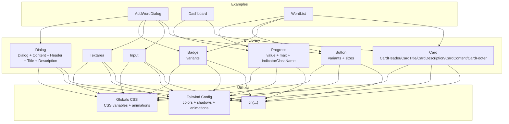
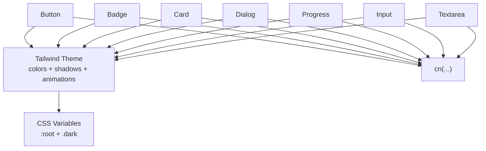
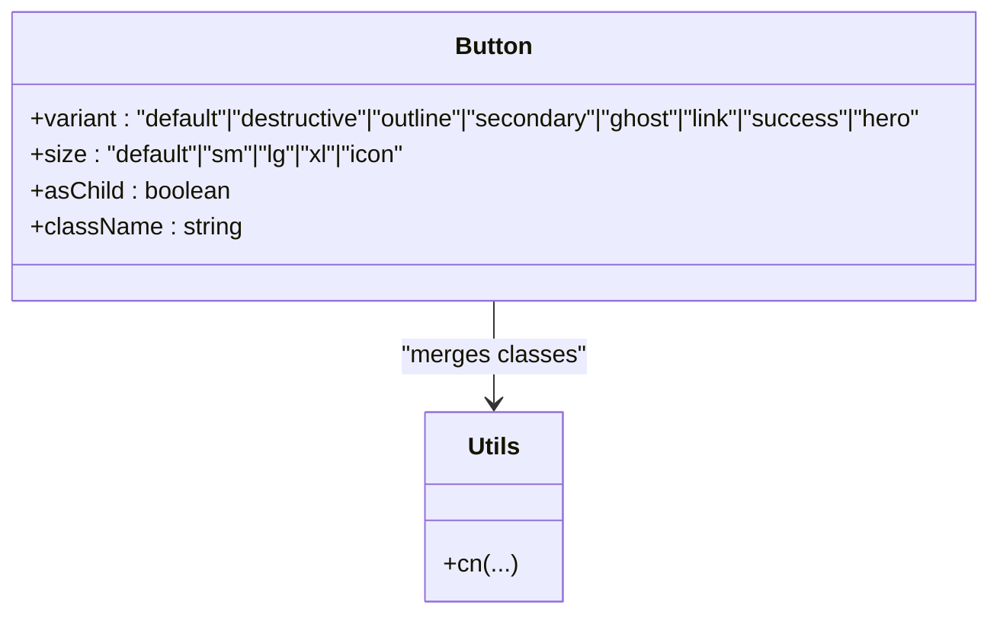
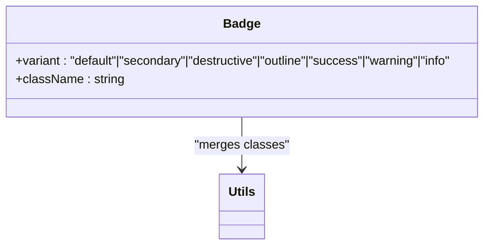
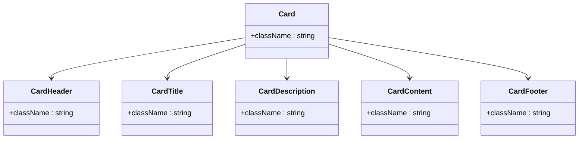
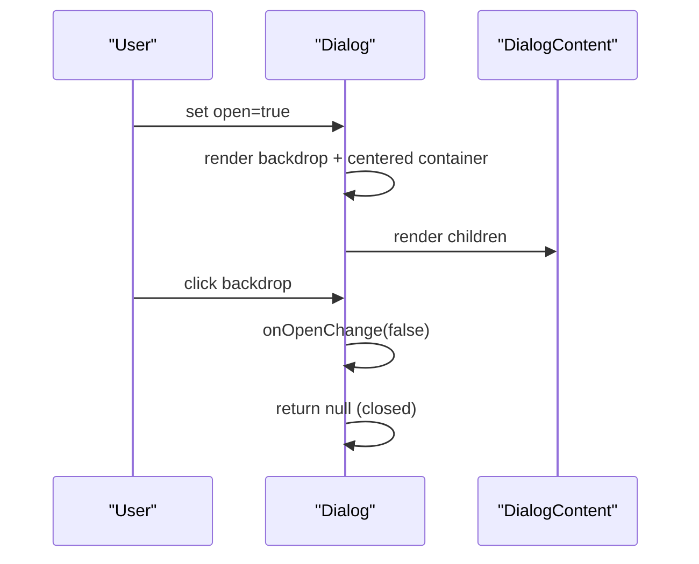
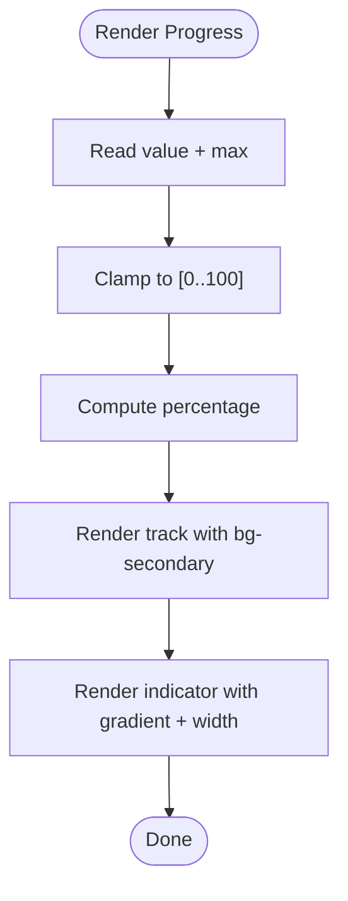
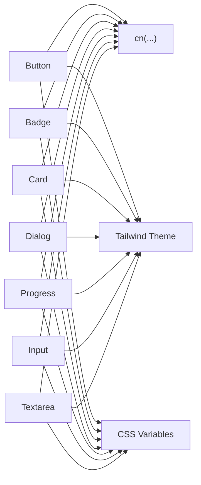

# UI Components

<cite>
**Referenced Files in This Document**
- [button.tsx](file://components/ui/button.tsx)
- [input.tsx](file://components/ui/input.tsx)
- [textarea.tsx](file://components/ui/textarea.tsx)
- [card.tsx](file://components/ui/card.tsx)
- [dialog.tsx](file://components/ui/dialog.tsx)
- [badge.tsx](file://components/ui/badge.tsx)
- [progress.tsx](file://components/ui/progress.tsx)
- [utils.ts](file://lib/utils.ts)
- [tailwind.config.ts](file://tailwind.config.ts)
- [globals.css](file://app/globals.css)
- [add-word-dialog.tsx](file://components/add-word-dialog.tsx)
- [dashboard.tsx](file://components/dashboard.tsx)
- [word-list.tsx](file://components/word-list.tsx)
</cite>

## Table of Contents
1. [Introduction](#introduction)
2. [Project Structure](#project-structure)
3. [Core Components](#core-components)
4. [Architecture Overview](#architecture-overview)
5. [Detailed Component Analysis](#detailed-component-analysis)
6. [Dependency Analysis](#dependency-analysis)
7. [Performance Considerations](#performance-considerations)
8. [Troubleshooting Guide](#troubleshooting-guide)
9. [Conclusion](#conclusion)
10. [Appendices](#appendices)

## Introduction
This document describes VocabMaster’s reusable UI component library, focusing on the component library architecture, design system principles, and composition patterns. It documents each component’s props, events, styling options, customization capabilities, accessibility features, responsive design considerations, theming support, animations, and cross-browser compatibility. It also covers component hierarchy, state management patterns, and integration with the broader application.

## Project Structure
The UI components live under components/ui and are built with Tailwind CSS and class-variance-authority (CVA) for variant-driven styling. Shared utilities and design tokens are centralized in Tailwind configuration and global CSS. Example higher-order components demonstrate composition patterns and state management.

**Diagram sources**
- [button.tsx](file://components/ui/button.tsx#L1-L54)
- [badge.tsx](file://components/ui/badge.tsx#L1-L42)
- [card.tsx](file://components/ui/card.tsx#L1-L79)
- [dialog.tsx](file://components/ui/dialog.tsx#L1-L94)
- [progress.tsx](file://components/ui/progress.tsx#L1-L41)
- [input.tsx](file://components/ui/input.tsx#L1-L25)
- [textarea.tsx](file://components/ui/textarea.tsx#L1-L24)
- [utils.ts](file://lib/utils.ts#L1-L7)
- [tailwind.config.ts](file://tailwind.config.ts#L1-L103)
- [globals.css](file://app/globals.css#L1-L156)
- [add-word-dialog.tsx](file://components/add-word-dialog.tsx#L1-L297)
- [dashboard.tsx](file://components/dashboard.tsx#L1-L154)
- [word-list.tsx](file://components/word-list.tsx#L1-L123)

**Section sources**
- [button.tsx](file://components/ui/button.tsx#L1-L54)
- [badge.tsx](file://components/ui/badge.tsx#L1-L42)
- [card.tsx](file://components/ui/card.tsx#L1-L79)
- [dialog.tsx](file://components/ui/dialog.tsx#L1-L94)
- [progress.tsx](file://components/ui/progress.tsx#L1-L41)
- [input.tsx](file://components/ui/input.tsx#L1-L25)
- [textarea.tsx](file://components/ui/textarea.tsx#L1-L24)
- [utils.ts](file://lib/utils.ts#L1-L7)
- [tailwind.config.ts](file://tailwind.config.ts#L1-L103)
- [globals.css](file://app/globals.css#L1-L156)
- [add-word-dialog.tsx](file://components/add-word-dialog.tsx#L1-L297)
- [dashboard.tsx](file://components/dashboard.tsx#L1-L154)
- [word-list.tsx](file://components/word-list.tsx#L1-L123)

## Core Components
This section documents each reusable UI component with its props, events, styling options, customization capabilities, accessibility, and responsive behavior.

- Button
  - Purpose: Primary action element with variant and size variants.
  - Props:
    - Inherits standard button attributes.
    - variant: default, destructive, outline, secondary, ghost, link, success, hero.
    - size: default, sm, lg, xl, icon.
    - asChild: render as a different element via composition.
  - Events: Standard onClick and others per button attributes.
  - Styling: Uses CVA variants and Tailwind utilities; supports hover, focus-visible, disabled states.
  - Accessibility: Focus-visible ring and outline; disabled pointer-events.
  - Responsive: Size variants adapt to breakpoints via Tailwind spacing and typography.
  - Customization: Pass className to override styles; variant and size control base styles.
  - Reference: [button.tsx](file://components/ui/button.tsx#L34-L51)

- Input
  - Purpose: Text input field with consistent styling and focus states.
  - Props: Inherits standard input attributes; type, placeholder, etc.
  - Events: onChange, onBlur, onFocus, etc.
  - Styling: Rounded borders, focus ring, disabled opacity, transitions.
  - Accessibility: Focus-visible ring; disabled cursor behavior.
  - Responsive: Full-width by default; adjust widths via className.
  - Customization: className overrides defaults; type controls native behavior.
  - Reference: [input.tsx](file://components/ui/input.tsx#L4-L21)

- Textarea
  - Purpose: Multi-line text input with consistent focus and disabled states.
  - Props: Inherits standard textarea attributes.
  - Events: onChange, onBlur, onFocus, etc.
  - Styling: Rounded borders, focus ring, disabled opacity, resize-none.
  - Accessibility: Focus-visible ring; disabled cursor behavior.
  - Responsive: Full-width by default; adjust via className.
  - Customization: className overrides defaults.
  - Reference: [textarea.tsx](file://components/ui/textarea.tsx#L4-L20)

- Badge
  - Purpose: Label or status indicator with variant styling.
  - Props:
    - Inherits standard div attributes.
    - variant: default, secondary, destructive, outline, success, warning, info.
  - Events: None (static label).
  - Styling: Border, rounded-full, color variants, transitions.
  - Accessibility: No interactive state; ensure semantic usage.
  - Responsive: Inline display; wrap or stack as needed.
  - Customization: className overrides variants; variant selects palette.
  - Reference: [badge.tsx](file://components/ui/badge.tsx#L31-L39)

- Card
  - Purpose: Container with header, title, description, content, and footer slots.
  - Props: Inherits standard div attributes for each slot; ref forwarding.
  - Slots:
    - CardHeader: vertical stack with tight spacing.
    - CardTitle: heading styling.
    - CardDescription: muted small text.
    - CardContent: inner content area.
    - CardFooter: flexible footer layout.
  - Styling: Rounded borders, card background, shadows, hover effects.
  - Accessibility: Semantic headings for CardTitle; ensure proper heading order.
  - Responsive: Padding and spacing adapt via Tailwind; use grid layouts externally.
  - Customization: className overrides; composed via children.
  - Reference: [card.tsx](file://components/ui/card.tsx#L4-L78)

- Dialog
  - Purpose: Modal overlay with backdrop and animated content.
  - Props:
    - Dialog: open (boolean), onOpenChange, children.
    - DialogContent: optional onClose handler; inherits div attributes.
    - DialogHeader/Title/Description: structural slots.
  - Events: onOpenChange toggles visibility; optional onClose for content.
  - Styling: Backdrop blur and opacity; animated entrance; close button with focus ring.
  - Accessibility: Focus trap via click-outside; screen reader friendly with sr-only close label.
  - Responsive: Centered content with max-width; scrollable content area.
  - Customization: className on content; pass custom children; control open state upstream.
  - Reference: [dialog.tsx](file://components/ui/dialog.tsx#L7-L93)

- Progress
  - Purpose: Visual progress bar with accessible ARIA attributes.
  - Props:
    - value: current value (default 0).
    - max: upper bound (default 100).
    - indicatorClassName: optional class for the indicator.
  - Events: None (visual only).
  - Styling: Gradient indicator, rounded fill, transition on width.
  - Accessibility: ARIA role and values for assistive technologies.
  - Responsive: Full-width by default; adjust via className.
  - Customization: indicatorClassName for theming; className for container.
  - Reference: [progress.tsx](file://components/ui/progress.tsx#L4-L37)

**Section sources**
- [button.tsx](file://components/ui/button.tsx#L34-L51)
- [input.tsx](file://components/ui/input.tsx#L4-L21)
- [textarea.tsx](file://components/ui/textarea.tsx#L4-L20)
- [badge.tsx](file://components/ui/badge.tsx#L31-L39)
- [card.tsx](file://components/ui/card.tsx#L4-L78)
- [dialog.tsx](file://components/ui/dialog.tsx#L7-L93)
- [progress.tsx](file://components/ui/progress.tsx#L4-L37)

## Architecture Overview
The UI library follows a variant-driven design with shared utilities and a cohesive design system:
- Design tokens: CSS variables define colors, gradients, and shadows; Tailwind theme extends these tokens.
- Utilities: cn merges Tailwind classes safely.
- Variants: CVA defines component variants and defaults.
- Composition: Higher-order components compose UI primitives to implement features like dialogs, dashboards, and lists.

**Diagram sources**
- [tailwind.config.ts](file://tailwind.config.ts#L20-L96)
- [globals.css](file://app/globals.css#L5-L72)
- [utils.ts](file://lib/utils.ts#L4-L6)
- [button.tsx](file://components/ui/button.tsx#L5-L32)
- [badge.tsx](file://components/ui/badge.tsx#L5-L29)
- [card.tsx](file://components/ui/card.tsx#L1-L13)
- [dialog.tsx](file://components/ui/dialog.tsx#L17-L26)
- [progress.tsx](file://components/ui/progress.tsx#L11-L34)
- [input.tsx](file://components/ui/input.tsx#L10-L18)
- [textarea.tsx](file://components/ui/textarea.tsx#L7-L17)

## Detailed Component Analysis

### Button
- Variants and sizes: Controlled via CVA; supports elevation, hover lift, and gradient hero variant.
- Composition: forwardRef with className merging; supports asChild pattern.
- Accessibility: focus-visible ring; disabled state handled.
- Animation: transitions and hover transforms; hero variant adds glow and lift.

**Diagram sources**
- [button.tsx](file://components/ui/button.tsx#L5-L32)
- [utils.ts](file://lib/utils.ts#L4-L6)

**Section sources**
- [button.tsx](file://components/ui/button.tsx#L34-L51)

### Badge
- Variants: default, secondary, destructive, outline, success, warning, info.
- Composition: Stateless div with variant-derived colors.

**Diagram sources**
- [badge.tsx](file://components/ui/badge.tsx#L5-L29)
- [utils.ts](file://lib/utils.ts#L4-L6)

**Section sources**
- [badge.tsx](file://components/ui/badge.tsx#L31-L39)

### Card
- Slots: Header, Title, Description, Content, Footer.
- Composition: Each slot is a forwardRef’d div with tailored spacing and typography.

**Diagram sources**
- [card.tsx](file://components/ui/card.tsx#L4-L78)

**Section sources**
- [card.tsx](file://components/ui/card.tsx#L4-L78)

### Dialog
- State: Controlled via open/onOpenChange; renders nothing when closed.
- Overlay: Backdrop click-to-close; animated entrance.
- Accessibility: Focus-visible ring on close; screen-reader-friendly close label.

**Diagram sources**
- [dialog.tsx](file://components/ui/dialog.tsx#L13-L27)

**Section sources**
- [dialog.tsx](file://components/ui/dialog.tsx#L7-L93)

### Progress
- Accessibility: ARIA role and values; visually indicates progress.
- Theming: Gradient indicator; configurable indicator class.

**Diagram sources**
- [progress.tsx](file://components/ui/progress.tsx#L10-L37)

**Section sources**
- [progress.tsx](file://components/ui/progress.tsx#L4-L37)

### Example Compositions
- AddWordDialog
  - Composes Button, Input, Textarea, Badge, Dialog, and DialogContent.
  - Manages local state for word entry, suggestions, and submission.
  - Demonstrates debounced lookup, error messaging, and conditional rendering.
  - Accessibility: Proper labels, focus rings, and close button semantics.
  - Reference: [add-word-dialog.tsx](file://components/add-word-dialog.tsx#L20-L296)

- Dashboard
  - Composes Card and Progress to show stats and mastery.
  - Uses gradient utilities and animation classes for visual polish.
  - Reference: [dashboard.tsx](file://components/dashboard.tsx#L16-L153)

- WordList
  - Renders a grid of WordCard using Card, Badge, Button, and Progress.
  - Computes mastery and due states; applies conditional styling and badges.
  - Reference: [word-list.tsx](file://components/word-list.tsx#L17-L122)

**Section sources**
- [add-word-dialog.tsx](file://components/add-word-dialog.tsx#L20-L296)
- [dashboard.tsx](file://components/dashboard.tsx#L16-L153)
- [word-list.tsx](file://components/word-list.tsx#L17-L122)

## Dependency Analysis
- Internal dependencies:
  - All UI components depend on cn for safe class merging.
  - Variants rely on Tailwind theme tokens and CSS variables.
- External dependencies:
  - class-variance-authority for variant composition.
  - lucide-react icons used in examples.
- Coupling:
  - Low coupling via forwardRef and slot-based composition.
  - Cohesion within each component around a single responsibility.

**Diagram sources**
- [utils.ts](file://lib/utils.ts#L4-L6)
- [tailwind.config.ts](file://tailwind.config.ts#L20-L96)
- [globals.css](file://app/globals.css#L5-L72)
- [button.tsx](file://components/ui/button.tsx#L5-L32)
- [badge.tsx](file://components/ui/badge.tsx#L5-L29)
- [card.tsx](file://components/ui/card.tsx#L1-L13)
- [dialog.tsx](file://components/ui/dialog.tsx#L17-L26)
- [progress.tsx](file://components/ui/progress.tsx#L11-L34)
- [input.tsx](file://components/ui/input.tsx#L10-L18)
- [textarea.tsx](file://components/ui/textarea.tsx#L7-L17)

**Section sources**
- [utils.ts](file://lib/utils.ts#L4-L6)
- [tailwind.config.ts](file://tailwind.config.ts#L20-L96)
- [globals.css](file://app/globals.css#L5-L72)
- [button.tsx](file://components/ui/button.tsx#L5-L32)
- [badge.tsx](file://components/ui/badge.tsx#L5-L29)
- [card.tsx](file://components/ui/card.tsx#L1-L13)
- [dialog.tsx](file://components/ui/dialog.tsx#L17-L26)
- [progress.tsx](file://components/ui/progress.tsx#L11-L34)
- [input.tsx](file://components/ui/input.tsx#L10-L18)
- [textarea.tsx](file://components/ui/textarea.tsx#L7-L17)

## Performance Considerations
- Class merging: cn minimizes Tailwind class conflicts and reduces runtime overhead.
- Animations: Prefer hardware-accelerated properties (transform/opacity) and keep durations reasonable.
- Rendering: Use forwardRef to avoid unnecessary re-renders; memoize derived values (e.g., mastery percentages).
- Accessibility: Ensure focus-visible rings and ARIA attributes are present to avoid costly reflows during interactions.

## Troubleshooting Guide
- Button disabled state not working:
  - Verify disabled prop is passed and className does not override disabled styles.
  - Reference: [button.tsx](file://components/ui/button.tsx#L40-L50)
- Dialog not closing:
  - Ensure onOpenChange is wired and backdrop click triggers the change.
  - Reference: [dialog.tsx](file://components/ui/dialog.tsx#L18-L21)
- Progress not visible:
  - Confirm value/max are numeric and indicatorClassName is applied correctly.
  - Reference: [progress.tsx](file://components/ui/progress.tsx#L11-L34)
- Input/Textarea focus ring missing:
  - Ensure focus-visible utilities are included and className does not override them.
  - Reference: [input.tsx](file://components/ui/input.tsx#L10-L18), [textarea.tsx](file://components/ui/textarea.tsx#L7-L17)
- Badge variant mismatch:
  - Confirm variant matches one of the supported values.
  - Reference: [badge.tsx](file://components/ui/badge.tsx#L31-L39)

**Section sources**
- [button.tsx](file://components/ui/button.tsx#L40-L50)
- [dialog.tsx](file://components/ui/dialog.tsx#L18-L21)
- [progress.tsx](file://components/ui/progress.tsx#L11-L34)
- [input.tsx](file://components/ui/input.tsx#L10-L18)
- [textarea.tsx](file://components/ui/textarea.tsx#L7-L17)
- [badge.tsx](file://components/ui/badge.tsx#L31-L39)

## Conclusion
VocabMaster’s UI library emphasizes composability, variant-driven styling, and accessibility. The design system leverages Tailwind CSS variables, CVA, and a shared cn utility to ensure consistent, themeable components. Example compositions demonstrate state management, debounced lookups, and responsive layouts, while maintaining cross-browser compatibility through widely supported CSS features.

## Appendices

### Theming Support
- CSS variables define light/dark palettes, gradients, and shadows.
- Tailwind theme maps HSL tokens to component variants and shadows.
- Utilities expose gradient and shadow helpers for consistent visuals.

**Section sources**
- [globals.css](file://app/globals.css#L5-L72)
- [tailwind.config.ts](file://tailwind.config.ts#L20-L96)

### Animation Behaviors
- Built-in animations include slide-up, slide-in-right, bounce-in, float, and pulse-glow.
- Components can opt-in via utility classes for entrance and interaction effects.

**Section sources**
- [globals.css](file://app/globals.css#L105-L155)

### Cross-Browser Compatibility
- Uses widely supported CSS features: CSS variables, Tailwind utilities, and basic animations.
- Avoids experimental APIs; relies on focus-visible and ARIA attributes for accessibility.