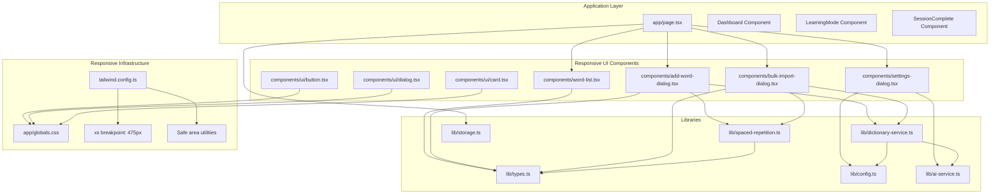
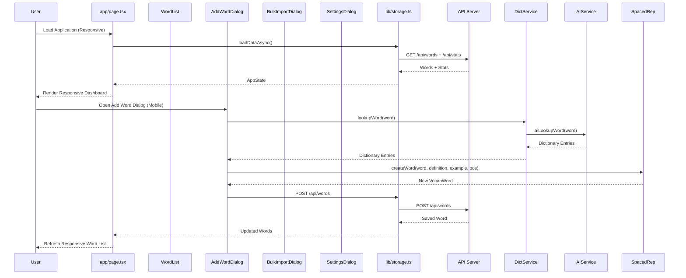
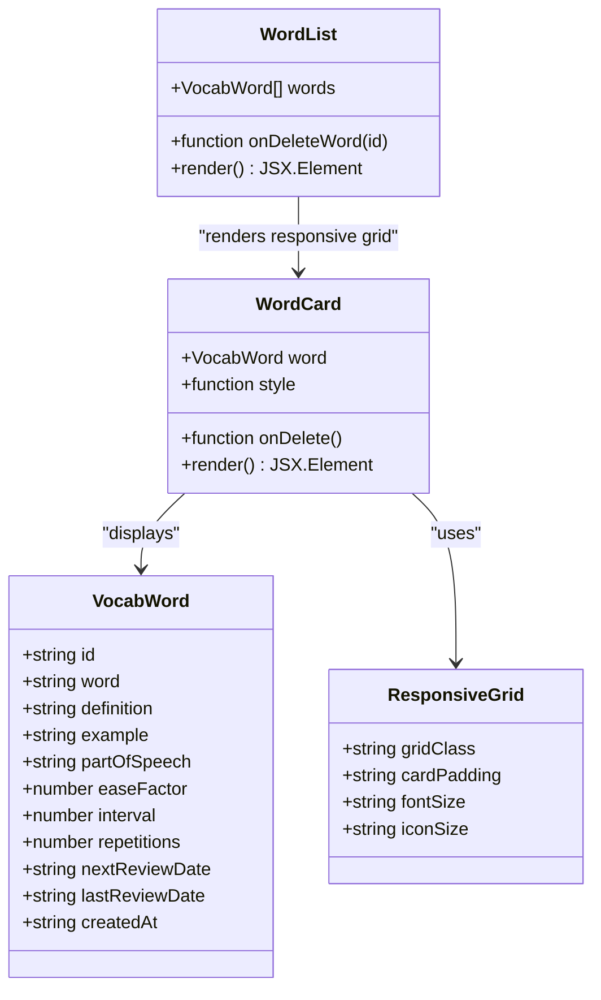
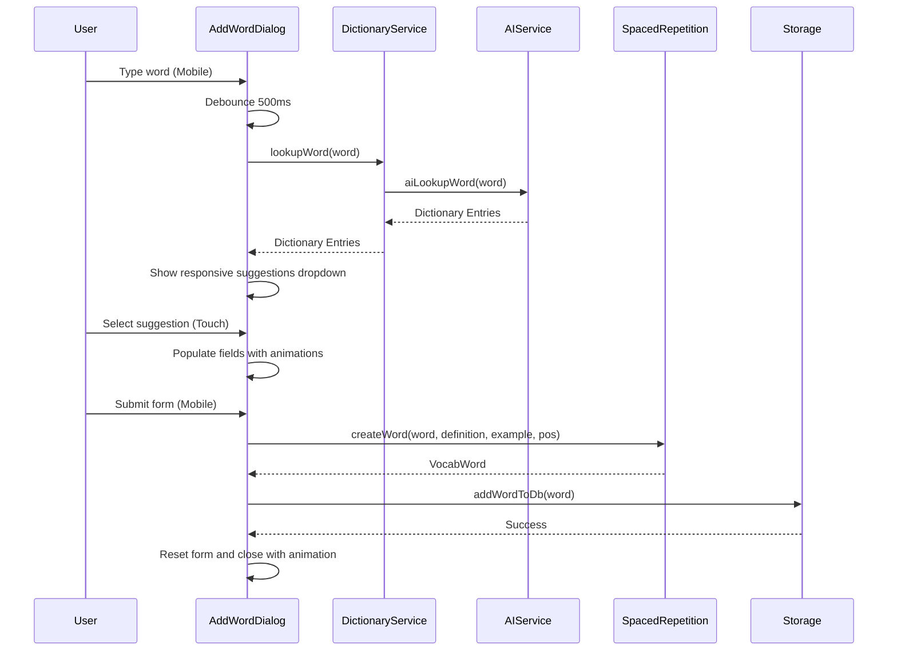
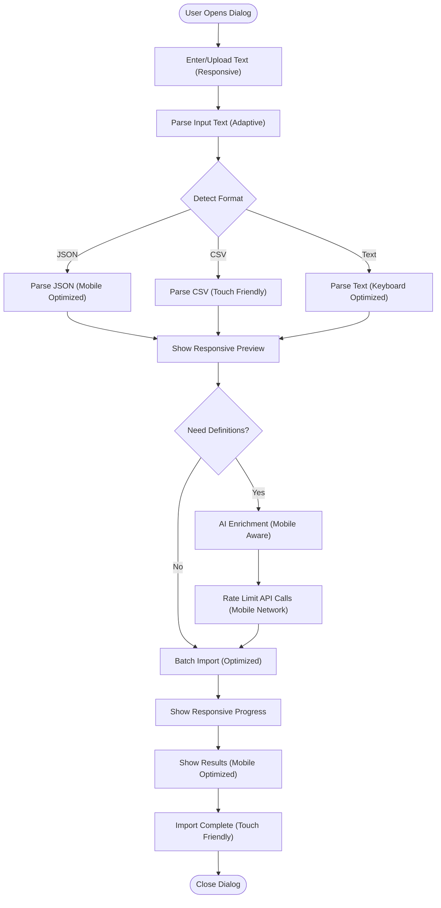
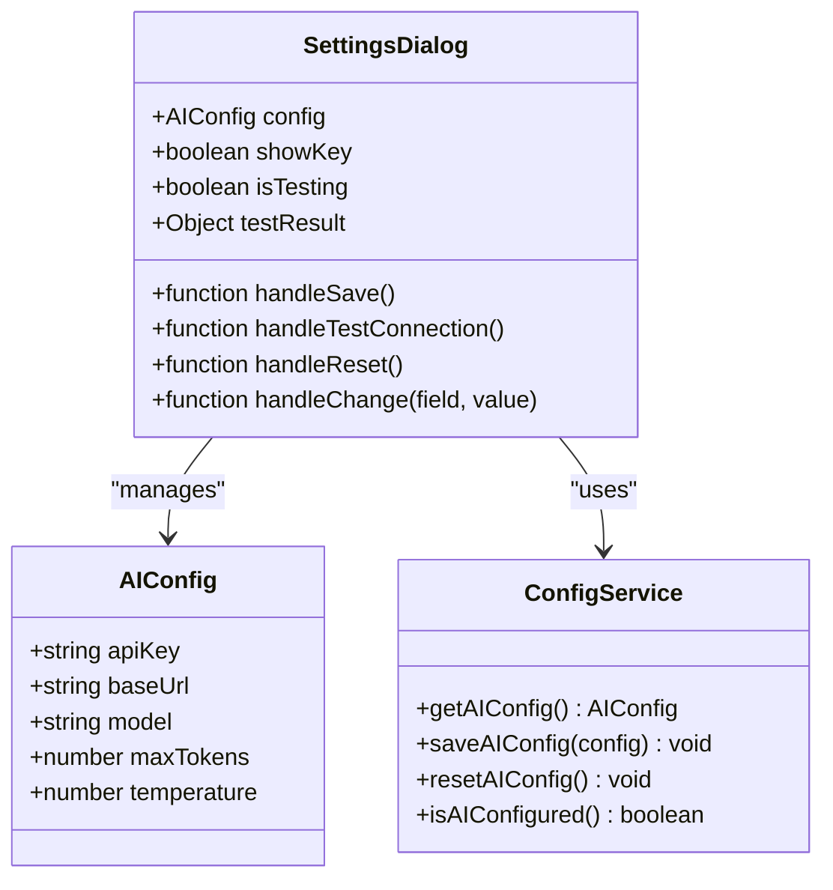
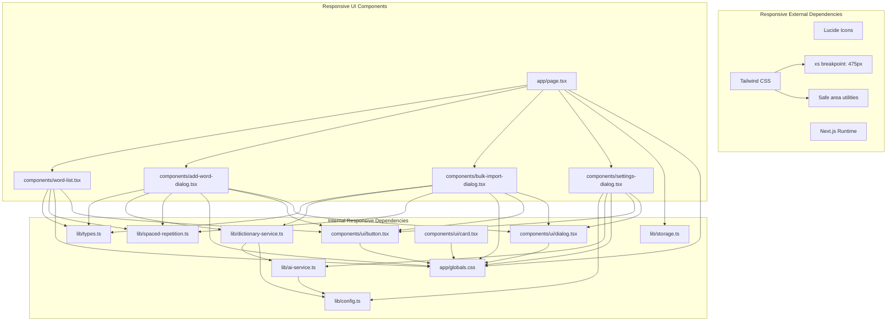

# Vocabulary Management UI

<cite>
**Referenced Files in This Document**
- [page.tsx](file://app/page.tsx)
- [word-list.tsx](file://components/word-list.tsx)
- [add-word-dialog.tsx](file://components/add-word-dialog.tsx)
- [bulk-import-dialog.tsx](file://components/bulk-import-dialog.tsx)
- [settings-dialog.tsx](file://components/settings-dialog.tsx)
- [button.tsx](file://components/ui/button.tsx)
- [dialog.tsx](file://components/ui/dialog.tsx)
- [card.tsx](file://components/ui/card.tsx)
- [types.ts](file://lib/types.ts)
- [spaced-repetition.ts](file://lib/spaced-repetition.ts)
- [dictionary-service.ts](file://lib/dictionary-service.ts)
- [config.ts](file://lib/config.ts)
- [storage.ts](file://lib/storage.ts)
- [ai-service.ts](file://lib/ai-service.ts)
- [globals.css](file://app/globals.css)
- [tailwind.config.ts](file://tailwind.config.ts)
</cite>

## Update Summary
**Changes Made**
- Enhanced responsive grid layouts with mobile-first design patterns
- Implemented adaptive spacing and typography scales for different screen sizes
- Added touch-friendly button sizing and interactive element optimization
- Integrated custom xs breakpoint for improved mobile experience
- Optimized dialog components for mobile viewport constraints
- Enhanced navigation and floating action buttons for mobile devices

## Table of Contents
1. [Introduction](#introduction)
2. [Project Structure](#project-structure)
3. [Core Components](#core-components)
4. [Architecture Overview](#architecture-overview)
5. [Responsive Design System](#responsive-design-system)
6. [Detailed Component Analysis](#detailed-component-analysis)
7. [Dependency Analysis](#dependency-analysis)
8. [Performance Considerations](#performance-considerations)
9. [Troubleshooting Guide](#troubleshooting-guide)
10. [Conclusion](#conclusion)

## Introduction
This document provides comprehensive documentation for the vocabulary management user interface components with a focus on mobile responsiveness and adaptive design patterns. The system features responsive grid layouts, touch-friendly interactions, and adaptive spacing that work seamlessly across desktop, tablet, and mobile devices. The vocabulary management application follows modern React patterns with comprehensive responsive design implementation.

## Project Structure
The vocabulary management application follows a Next.js architecture with a clear separation of concerns and comprehensive responsive design implementation:
- UI components in the components/ directory with responsive design patterns
- Business logic in the lib/ directory
- Application state management in app/page.tsx
- API integration through lib/storage.ts
- Custom responsive utilities in app/globals.css
- Tailwind CSS configuration with custom breakpoints



**Diagram sources**
- [page.tsx](file://app/page.tsx#L1-L327)
- [word-list.tsx](file://components/word-list.tsx#L1-L123)
- [add-word-dialog.tsx](file://components/add-word-dialog.tsx#L1-L297)
- [bulk-import-dialog.tsx](file://components/bulk-import-dialog.tsx#L1-L495)
- [settings-dialog.tsx](file://components/settings-dialog.tsx#L1-L249)
- [globals.css](file://app/globals.css#L1-L183)
- [tailwind.config.ts](file://tailwind.config.ts#L1-L121)

**Section sources**
- [page.tsx](file://app/page.tsx#L1-L327)

## Core Components
The vocabulary management UI consists of four primary components that work together to provide a comprehensive learning experience with responsive design:

### WordList Component
The WordList component serves as the central display for vocabulary items, providing an adaptive responsive grid layout with interactive cards that show mastery progress, due dates, and quick actions. The component implements a mobile-first responsive design with progressive enhancement for larger screens.

### AddWordDialog Component
The AddWordDialog provides an intelligent form for adding individual vocabulary words with AI-powered suggestions and real-time validation. The dialog features responsive layout adjustments, touch-friendly input sizing, and adaptive spacing for different screen sizes.

### BulkImportDialog Component
The BulkImportDialog enables users to import multiple words at once through various formats (text, CSV, JSON) with AI enrichment capabilities. The dialog implements responsive modal sizing, adaptive scrolling containers, and mobile-optimized action buttons.

### SettingsDialog Component
The SettingsDialog manages AI configuration settings, allowing users to configure API keys, endpoints, and model preferences. The dialog features responsive form layouts, adaptive input sizing, and mobile-friendly configuration controls.

**Section sources**
- [word-list.tsx](file://components/word-list.tsx#L1-L123)
- [add-word-dialog.tsx](file://components/add-word-dialog.tsx#L1-L297)
- [bulk-import-dialog.tsx](file://components/bulk-import-dialog.tsx#L1-L495)
- [settings-dialog.tsx](file://components/settings-dialog.tsx#L1-L249)

## Architecture Overview
The application follows a client-side React architecture with server-side API integration and comprehensive responsive design patterns. The main application component orchestrates state management and coordinates between UI components and backend services with responsive considerations.



**Diagram sources**
- [page.tsx](file://app/page.tsx#L40-L53)
- [add-word-dialog.tsx](file://components/add-word-dialog.tsx#L57-L80)
- [dictionary-service.ts](file://lib/dictionary-service.ts#L21-L26)
- [ai-service.ts](file://lib/ai-service.ts#L66-L111)
- [spaced-repetition.ts](file://lib/spaced-repetition.ts#L71-L91)
- [storage.ts](file://lib/storage.ts#L19-L28)

## Responsive Design System

### Breakpoint Strategy
The application implements a comprehensive responsive design system with custom breakpoints optimized for vocabulary management:

- **xs (475px)**: Extra small breakpoint for mobile devices with limited screen width
- **sm (640px)**: Small breakpoint for basic mobile devices and tablets in portrait
- **md (768px)**: Medium breakpoint for tablets and smaller laptops
- **lg (1024px)**: Large breakpoint for standard laptops and desktops
- **xl (1280px)**: Extra large breakpoint for wide desktop displays
- **2xl (1400px)**: Double extra large breakpoint for ultra-wide displays

### Typography Scale
The responsive typography system provides appropriate font sizing across different screen sizes:

- **Base font size**: 16px on desktop, scaled down for mobile devices
- **Heading scale**: Progressive scaling from h1 to h6 with appropriate margins
- **Body text**: Optimized line heights and letter spacing for readability
- **Small text**: Reduced size for secondary information and metadata

### Grid Layout System
The responsive grid system adapts vocabulary card layouts based on screen size:

- **Mobile (xs-sm)**: Single column layout with full-width cards
- **Tablet (md)**: Two-column layout with appropriate gutters
- **Desktop (lg-xl)**: Three-column layout maximizing screen utilization
- **Ultra-wide (2xl)**: Four-column layout for optimal space usage

### Touch Interaction Optimization
The design system includes specialized touch interaction patterns:

- **Touch targets**: Minimum 44px touch targets for buttons and interactive elements
- **Spacing**: Appropriate padding and margins for comfortable thumb interaction
- **Navigation**: Simplified navigation patterns optimized for single-hand operation
- **Feedback**: Visual feedback and haptic responses for touch interactions

**Section sources**
- [tailwind.config.ts](file://tailwind.config.ts#L26-L28)
- [globals.css](file://app/globals.css#L104-L130)
- [word-list.tsx](file://components/word-list.tsx#L29-L38)

## Detailed Component Analysis

### WordList Component Analysis
The WordList component provides a responsive grid layout for displaying vocabulary items with comprehensive progress tracking and interactive elements optimized for different screen sizes.

#### Responsive Grid Layout
The component implements a sophisticated responsive grid system that adapts from single-column on mobile to multi-column layouts on larger screens:

```css
.grid-cols-1 sm:grid-cols-2 lg:grid-cols-2 xl:grid-cols-3
```

The grid system progressively enhances based on screen size:
- **Mobile (xs-sm)**: 1 column with full-width cards
- **Tablet (md)**: 2 columns with appropriate spacing
- **Desktop (lg-xl)**: 2-3 columns maximizing screen utilization
- **Ultra-wide (2xl)**: Up to 4 columns for optimal density

#### Adaptive Card Design
Each vocabulary card includes responsive design patterns:

- **Typography scaling**: Font sizes increase from base to large on larger screens
- **Padding adjustments**: Inner padding increases from 12px to 16px for better touch targets
- **Icon sizing**: Icons scale appropriately from small to medium sizes
- **Progress bar sizing**: Progress bars increase in thickness for better visibility

#### Touch-Friendly Interactions
The component implements mobile-optimized interactions:

- **Hover states**: Hover effects are replaced with tap states for mobile devices
- **Opacity transitions**: Delete buttons fade in on hover, optimized for touch interaction
- **Animation delays**: Staggered animations prevent layout thrashing on mobile devices
- **Group interactions**: Container-level interactions trigger child element animations



**Diagram sources**
- [word-list.tsx](file://components/word-list.tsx#L12-L46)
- [types.ts](file://lib/types.ts#L1-L14)
- [globals.css](file://app/globals.css#L104-L130)

**Section sources**
- [word-list.tsx](file://components/word-list.tsx#L17-L122)
- [spaced-repetition.ts](file://lib/spaced-repetition.ts#L50-L68)

### AddWordDialog Component Analysis
The AddWordDialog provides an intelligent form for adding individual vocabulary words with AI-powered assistance and comprehensive validation, featuring responsive design patterns optimized for mobile devices.

#### Responsive Form Layout
The dialog implements adaptive form layouts that optimize for different screen sizes:

- **Mobile-first design**: Forms stack vertically for optimal mobile interaction
- **Touch-friendly inputs**: Input fields sized for comfortable thumb interaction
- **Adaptive button sizing**: Action buttons scale appropriately across devices
- **Scrollable content**: Content containers adapt to viewport height constraints

#### Mobile-Optimized Interactions
The component includes specialized mobile interaction patterns:

- **Floating action button**: Primary actions use prominent, accessible touch targets
- **Keyboard optimization**: Input fields optimized for virtual keyboards
- **Error messaging**: Error messages adapted for mobile screen real estate
- **Loading states**: Loading indicators optimized for mobile performance

#### Responsive Dialog Sizing
The dialog component adapts its presentation based on screen size:

- **Mobile dialogs**: Full-width, full-height dialogs optimized for portrait orientation
- **Tablet dialogs**: Balanced width-height ratios for landscape orientation
- **Desktop dialogs**: Standard modal sizing with appropriate margins
- **Scroll behavior**: Content containers optimized for mobile scrolling



**Diagram sources**
- [add-word-dialog.tsx](file://components/add-word-dialog.tsx#L35-L80)
- [dictionary-service.ts](file://lib/dictionary-service.ts#L21-L26)
- [ai-service.ts](file://lib/ai-service.ts#L66-L111)
- [spaced-repetition.ts](file://lib/spaced-repetition.ts#L71-L91)
- [storage.ts](file://lib/storage.ts#L19-L28)

**Section sources**
- [add-word-dialog.tsx](file://components/add-word-dialog.tsx#L20-L130)
- [dictionary-service.ts](file://lib/dictionary-service.ts#L21-L49)
- [spaced-repetition.ts](file://lib/spaced-repetition.ts#L71-L91)

### BulkImportDialog Component Analysis
The BulkImportDialog enables efficient import of multiple vocabulary words through various supported formats with AI enrichment capabilities, featuring comprehensive responsive design patterns.

#### Multi-Format Responsive Parsing
The component supports multiple input formats with responsive parsing that adapts to screen size:

- **Mobile input optimization**: Text areas sized for virtual keyboard comfort
- **Responsive preview**: Word preview lists adapt to available screen space
- **Touch-friendly controls**: Checkbox and button interactions optimized for touch
- **Adaptive error display**: Error messages formatted for mobile readability

#### AI Enrichment Workflow
The dialog provides AI-powered definition enrichment with responsive considerations:

- **Progress indicators**: Loading states optimized for mobile performance
- **Rate limiting**: API calls optimized to prevent throttling on mobile networks
- **Responsive feedback**: User feedback adapted for different screen sizes
- **Cancellation support**: Easy cancellation of long-running operations on mobile

#### Import Processing Pipeline
The component implements a multi-step workflow optimized for mobile devices:

- **Step progression**: Steps adapted for mobile navigation patterns
- **Progress visualization**: Progress bars and indicators optimized for small screens
- **Result display**: Success/failure feedback adapted for mobile attention
- **Action accessibility**: Primary actions positioned for easy thumb reach



**Diagram sources**
- [bulk-import-dialog.tsx](file://components/bulk-import-dialog.tsx#L72-L88)
- [dictionary-service.ts](file://lib/dictionary-service.ts#L236-L254)
- [bulk-import-dialog.tsx](file://components/bulk-import-dialog.tsx#L90-L141)

**Section sources**
- [bulk-import-dialog.tsx](file://components/bulk-import-dialog.tsx#L30-L211)
- [dictionary-service.ts](file://lib/dictionary-service.ts#L92-L254)

### SettingsDialog Component Analysis
The SettingsDialog manages AI configuration settings and provides connection testing capabilities for seamless integration with external APIs, featuring comprehensive responsive design patterns.

#### Configuration Management
The component maintains AI configuration state with responsive handling:

- **Mobile form optimization**: Configuration forms adapted for portrait orientation
- **Touch-friendly controls**: Input fields and buttons sized for mobile interaction
- **Responsive validation**: Error messages and validation states optimized for small screens
- **Accessibility considerations**: Form controls adapted for assistive technologies

#### User Preference Handling
The dialog implements responsive real-time configuration updates:

- **Adaptive layout**: Settings arranged for optimal mobile navigation
- **Touch-friendly toggles**: Toggle switches sized for comfortable interaction
- **Responsive feedback**: Status indicators and feedback adapted for mobile devices
- **Quick actions**: Primary actions positioned for easy thumb reach

#### Integration Patterns
The component integrates with the AI service layer with responsive considerations:

- **Connection testing**: Test functionality adapted for mobile network conditions
- **Visual feedback**: Connection status displayed with appropriate mobile indicators
- **Error handling**: Error messages formatted for mobile readability
- **Graceful degradation**: Features adapted when AI configuration is unavailable



**Diagram sources**
- [settings-dialog.tsx](file://components/settings-dialog.tsx#L17-L63)
- [config.ts](file://lib/config.ts#L4-L10)
- [config.ts](file://lib/config.ts#L23-L37)

**Section sources**
- [settings-dialog.tsx](file://components/settings-dialog.tsx#L17-L248)
- [config.ts](file://lib/config.ts#L23-L62)
- [ai-service.ts](file://lib/ai-service.ts#L53-L63)

## Dependency Analysis
The vocabulary management system exhibits well-structured dependencies with clear separation of concerns, responsive design patterns, and minimal coupling between components.



**Diagram sources**
- [page.tsx](file://app/page.tsx#L1-L327)
- [types.ts](file://lib/types.ts#L1-L105)
- [dictionary-service.ts](file://lib/dictionary-service.ts#L1-L255)
- [spaced-repetition.ts](file://lib/spaced-repetition.ts#L1-L123)
- [config.ts](file://lib/config.ts#L1-L63)
- [ai-service.ts](file://lib/ai-service.ts#L1-L239)
- [globals.css](file://app/globals.css#L1-L183)
- [button.tsx](file://components/ui/button.tsx#L1-L54)
- [dialog.tsx](file://components/ui/dialog.tsx#L1-L94)
- [card.tsx](file://components/ui/card.tsx#L1-L79)
- [tailwind.config.ts](file://tailwind.config.ts#L1-L121)

**Section sources**
- [page.tsx](file://app/page.tsx#L1-L327)
- [dictionary-service.ts](file://lib/dictionary-service.ts#L1-L255)
- [spaced-repetition.ts](file://lib/spaced-repetition.ts#L1-L123)

## Performance Considerations
The vocabulary management system implements several performance optimization strategies with responsive design considerations:

### Client-Side Caching and Memoization
- The BulkImportDialog uses useMemo for efficient duplicate detection using Set-based lookups
- Debounced API calls prevent excessive network requests during user input with mobile network awareness
- Rate limiting prevents API throttling during bulk operations while considering mobile data constraints

### Responsive Design and Rendering
- CSS animations are carefully managed to avoid layout thrashing on mobile devices
- Grid layouts adapt to screen sizes for optimal mobile performance with progressive enhancement
- Conditional rendering reduces unnecessary DOM elements across different screen sizes
- Touch-friendly elements sized appropriately to prevent accidental taps

### Data Flow Optimization
- Parallel API calls for initial data loading improve startup performance on mobile networks
- Efficient state updates minimize re-renders across the application with responsive considerations
- Local storage caching reduces server round trips for configuration data with mobile persistence
- Responsive breakpoints trigger appropriate component optimizations based on device capabilities

### Mobile-Specific Optimizations
- Touch targets sized for comfortable interaction (minimum 44px)
- Scroll performance optimized for mobile devices with momentum scrolling
- Battery usage considerations with reduced animation complexity on mobile
- Network efficiency with adaptive loading based on connection speed

## Troubleshooting Guide

### Common Issues and Solutions

#### AI Configuration Problems
- **Issue**: API key validation failures on mobile devices
- **Solution**: Verify API key format and test connection through SettingsDialog with mobile network awareness
- **Prevention**: Use the built-in connection testing feature before relying on AI features, especially on cellular networks

#### Import Processing Failures
- **Issue**: Bulk import errors or partial success on mobile devices
- **Solution**: Check format compliance and review parse errors in the preview stage with mobile-optimized error messages
- **Prevention**: Validate input format before attempting bulk operations, considering mobile input limitations

#### Network Connectivity Issues
- **Issue**: Dictionary lookups failing on mobile networks
- **Solution**: The system automatically falls back to free dictionary API when AI is unavailable with mobile network detection
- **Prevention**: Monitor API status and configure backup endpoints, especially important for mobile users

#### Performance Issues
- **Issue**: Slow rendering with large word lists on mobile devices
- **Solution**: Optimize device performance and consider reducing word count, with responsive lazy loading
- **Prevention**: Regular cleanup of unused words and maintenance of the vocabulary database with mobile storage considerations

#### Responsive Design Issues
- **Issue**: Touch interaction problems on mobile devices
- **Solution**: Adjust touch target sizes and spacing, verify responsive breakpoints are working correctly
- **Prevention**: Test on actual mobile devices with various screen sizes and orientations

**Section sources**
- [settings-dialog.tsx](file://components/settings-dialog.tsx#L40-L51)
- [bulk-import-dialog.tsx](file://components/bulk-import-dialog.tsx#L156-L196)
- [dictionary-service.ts](file://lib/dictionary-service.ts#L21-L49)

## Conclusion
The vocabulary management UI components provide a comprehensive, user-friendly solution for vocabulary learning with exceptional mobile responsiveness and adaptive design patterns. The system demonstrates excellent architectural patterns with clear separation of concerns, robust error handling, performance optimizations, and comprehensive responsive design implementation.

The responsive design system includes custom breakpoints, adaptive typography, flexible grid layouts, and mobile-optimized interactions that work seamlessly across desktop, tablet, and mobile devices. The components leverage modern React patterns including controlled components, proper state management, efficient data flow patterns, and responsive design best practices.

The AI integration provides valuable automation capabilities while maintaining graceful degradation when external services are unavailable, with special consideration for mobile network constraints and battery usage. The modular design allows for easy extension and maintenance of the vocabulary management system while preserving responsive design integrity.

The implementation showcases advanced responsive design techniques including progressive enhancement, mobile-first development, touch interaction optimization, and adaptive content presentation that ensures optimal user experience across all device categories and screen sizes.